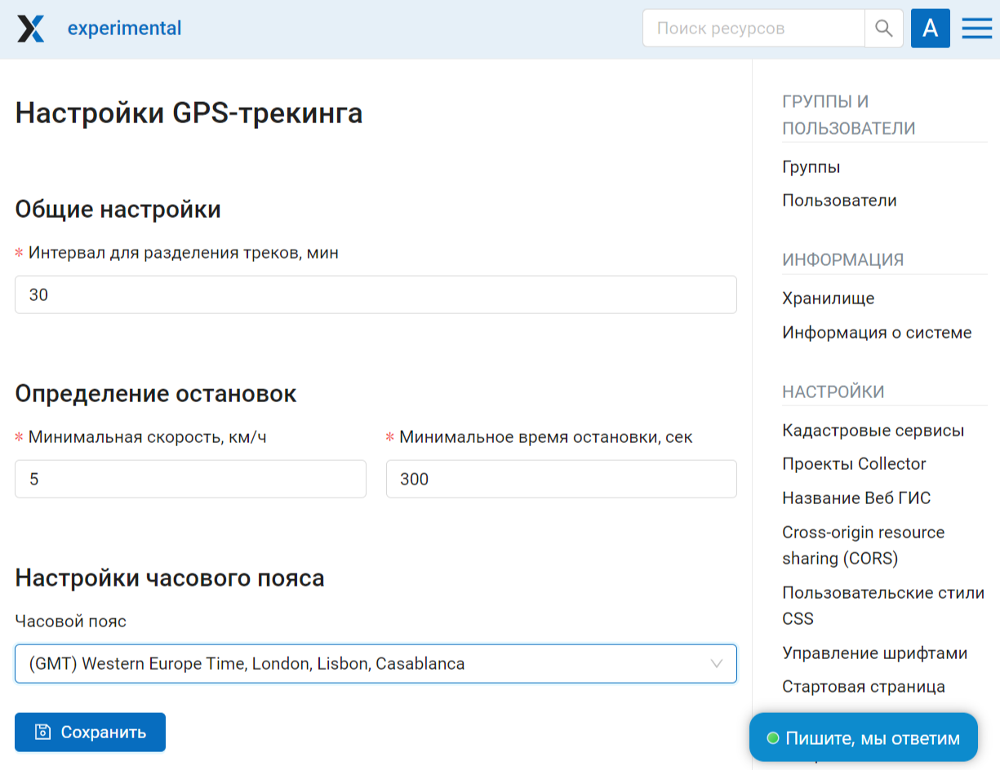
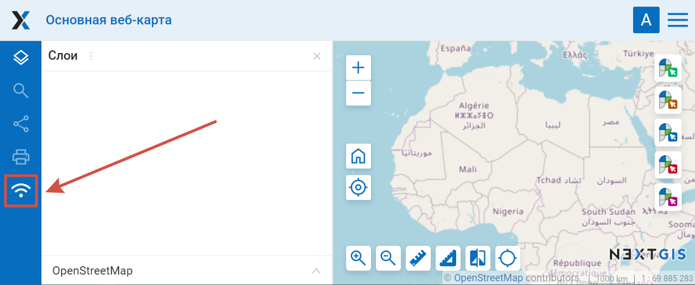
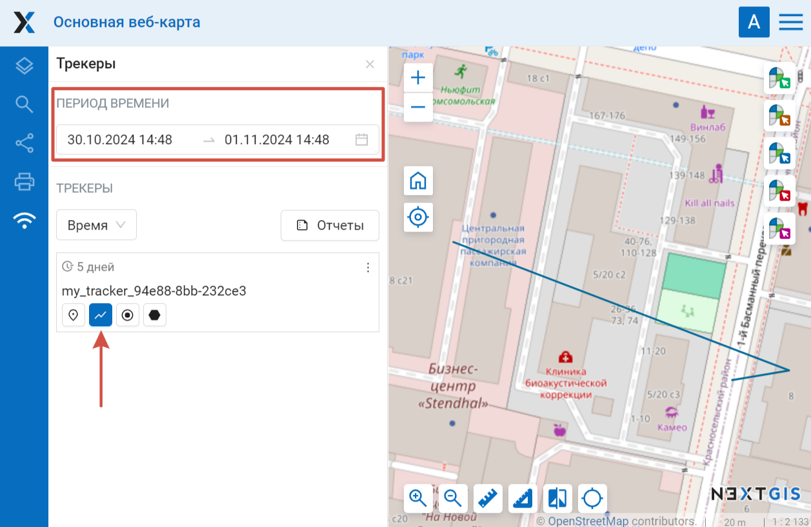
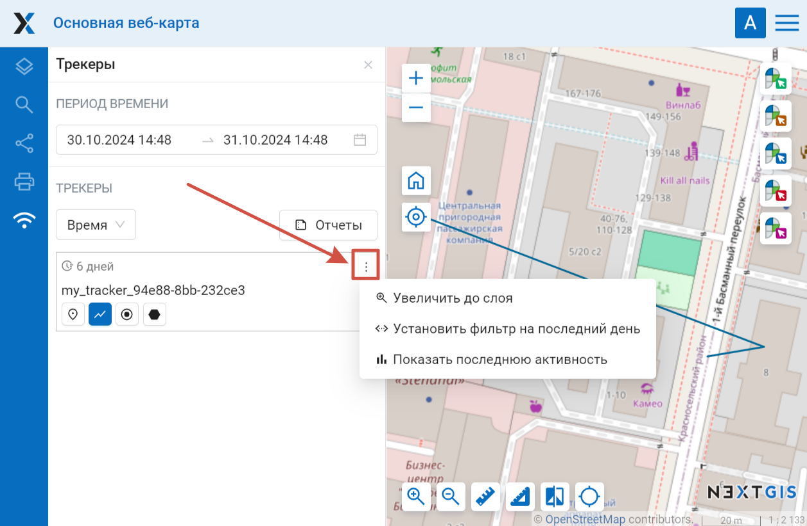
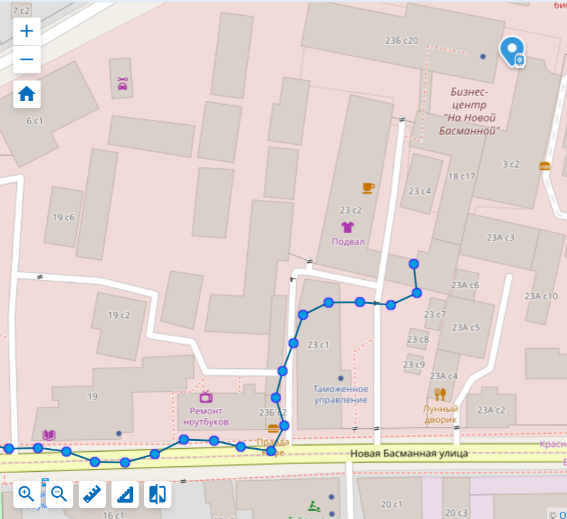
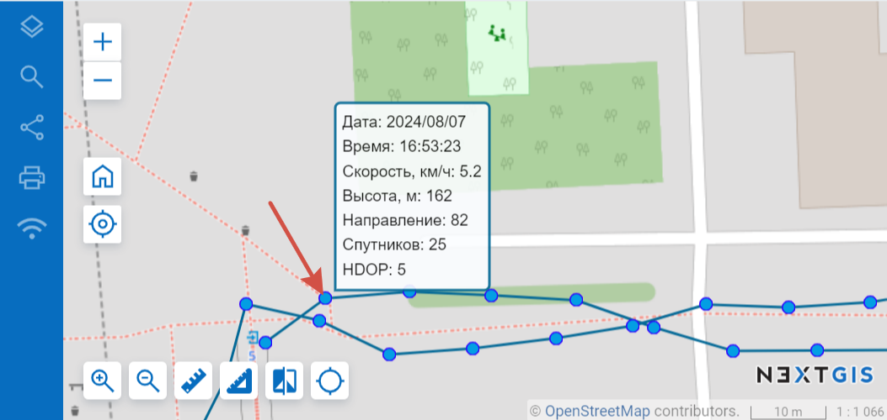
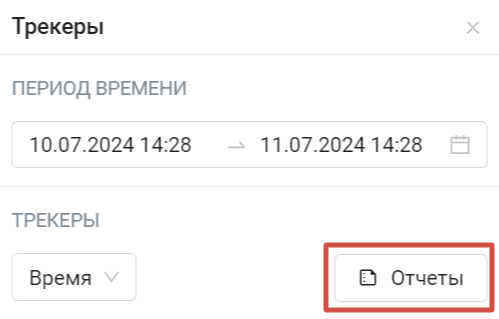
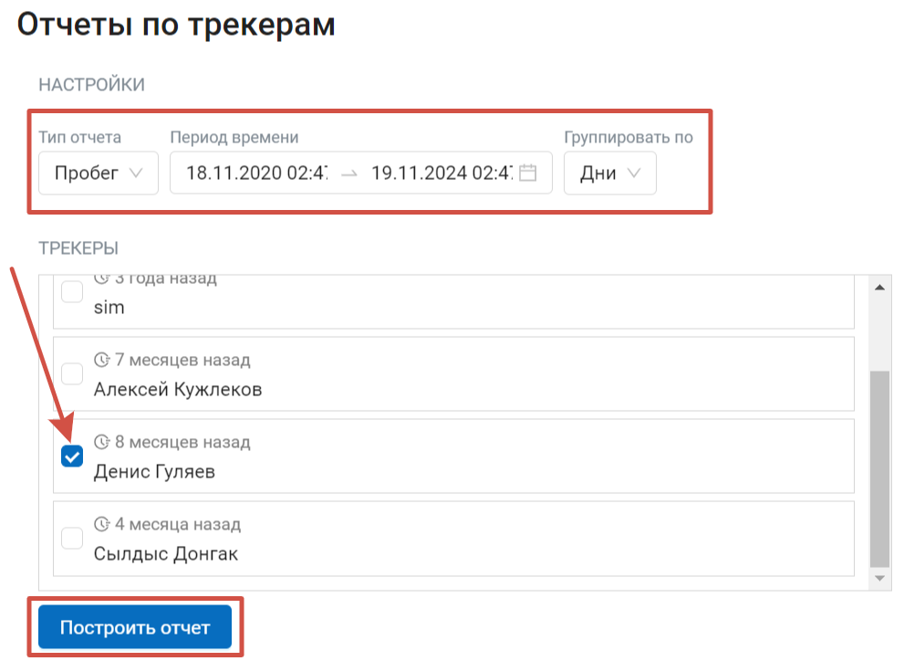
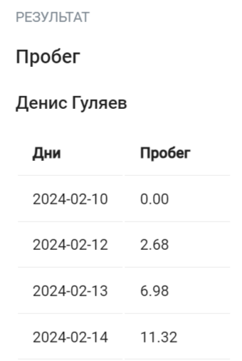

Настройки GPS-трекинга
=======================

В разделе "Трекеры" Панели управления можно настроить параметры отображения треков на веб-карте и экспорта в GPX в NGW.

Доступны следующие параметры GPS-трекинга:

   Настройки GPS-трекинга

* Интервал для разделения треков, мин (по умолчанию 30)
* Определение остановок - если скорость падает ниже заданного значения на указанное время, то в трек записывается остановка. Минимальная скорость указывается в км/ч (по умолчанию 5), минимальное время остановки указывается в сек (по умолчанию 300 сек., т.е. 5 минут).
* Настройки часового пояса - часовой пояс выбирается из выпадающего списка в формате GMT+-N

.. note::
    Количество доступных трекеров завист от `плана подписки <https://nextgis.ru/pricing-base/>`_. На планах Free и Mini доступен только один трекер, на плане Premium - 5 (при необходимости можно увеличить количество).

.. _tracking_web_map:

Результаты трекинга на Веб карте
--------------------------------

Данные мониторинга движущихся объектов, собранные при помощи NextGIS Tracker, NextGIS Collector или NextGIS Mobile можно отобразить на любой веб карте в вашей Веб ГИС, если трекер к ней подключен. 

Чтобы увидеть записанные треки, откройте любую веб-карту или создайте новую. В левой панели отобразится иконка мониторинга движущихся объектов (трекеры).

   Активация панели трекеров

Интерфейс панели трекеров состоит из двух частей - календаря и списка трекеров. 

Календарь позволяет отфильтровать записанные треки по дате и времени.

Внизу вы увидите список доступных трекеров. Их можно отсортировать по названию трекера и времени записи.

По умолчанию треки скрыты. Чтобы трек отобразился на веб-карте, в трекере (трекерах) отметьте, какие элементы треков отображать на карте. Далее задайте дату в календаре или в контекстном меню трека выберите **Установить фильтр на последнюю дату**.

   Отображение трека на карте

Для отображения доступны следующие элементы: 

* |button_tracker_lastpoint| последняя точка
* |button_tracker_line| GPS-треки - сами линии маршрутов данного трекера
* |button_tracker_points| точки треков
* |button_tracker_stops| остановки (их может не быть в конкретном треке)

.. |button_tracker_lastpoint| image:: _static/button_tracker_lastpoint.png
   :width: 6mm

.. |button_tracker_line| image:: _static/button_tracker_line.png
   :width: 6mm

.. |button_tracker_points| image:: _static/button_tracker_points.png
   :width: 6mm

.. |button_tracker_stops| image:: _static/button_tracker_stops_h.png
   :width: 6mm

Операции, доступные по правому клику на трек:

- Увеличить до слоя (отображение охвата слоя)
- Установить фильтр на последний день (отображение трека за последние сутки активности трекера)
- Показать последнюю активность (посмотреть почасовую активность на выбранную дату)

   Меню трекера

   
   Отображение точек трека, линий и текущей геопозиции на Веб карте

Нажатие на точку вызывает всплывающую панель, где содержится информация по этой точке: дата, время, скорость (км/ч), высота (в метрах), направление (азимут от направления на север по часовой стрелке, в градусах от 0 до 360), количество спутников (общее количество спутников GPS и ГЛОНАСС) и HDOP. 

   Всплывающая панель с информацией о точке трека

HDOP (показатель снижения точности в горизонтальной плоскости) - это показатель ошибки в определении координат. Чем меньше значение HDOP, тем выше точность определения горизонтальных координат. Идеальное значение HDOP равно 1, приемлемым считается HDOP менее 3-4, значения выше 6-8 указывают на неудачное в данный момент расположение спутников и низкую точность. HDOP зависит от количества видимых спутников, их расположения на небосводе и распределения относительно приёмника.

.. _tracking_report:

Отчеты
------

Есть возможность сформировать различные вариации отчетов в зависимости от выбранного трекера и выбранных параметров. Нажмите иконку "Отчеты":

   
   Кнопка вызова инструмента для составления отчетов

Открывается отдельная страница получения отчетов по трекингу. 

   
   Параметры отчета по трекеру

В первом блоке настраиваются параметры:

- тип отчета (пробег, максимальная скорость, средняя скорость, израсходованное топливо, остановки, GPX-файл)
- период времени
- группировка по дням/часам

Далее выберите трекеры, по которым нужно получить информационную сводку и нажмите **Построить отчет**. На этой же странице внизу отобразится отчет по заданным параметрам.

   Отчет по трекеру

.. note::
    Чтобы получить отчет по израсходованному топливу, необходимо в Веб ГИС в настройках трекера `установить <https://docs.nextgis.ru/docs_ngcom/source/tracking.html#id9>`_ значение расхода топлива (л/100 км).
    
Также существует возможность экспорта отчета в формате GPX-файла.
