Управление пользователями
==========================

Чтобы пользователь мог получить доступ к вашей Веб ГИС, `добавьте его в Команду <https://docs.nextgis.ru/docs_ngcom/source/teams.html#ngcom-team-management>`_.

Обратите внимание, что пользователю будут видны только те ресурсы, для которых настроены соответствующие `права доступа <https://docs.nextgis.ru/docs_ngcom/source/permissions.html>`_. На новых пользователей, добавленных в команду, автоматически распространяются права:

* выставленные для субъекта "Прошедший проверку" или "Любой пользователь";
* выставленные для группы, у которой стоит флаг `"новые пользователи" <https://docs.nextgis.ru/docs_ngweb/source/users.html#ngweb-admin-controlpanel-usergroup-create-pic>`_.

После добавления в команду вы можете включить пользователя в `группу <https://docs.nextgis.ru/docs_ngweb/source/users.html#ngw-create-group>`_ или `установить для него права <https://docs.nextgis.ru/docs_ngcom/source/permissions.html>`_ в индивидуальном порядке.

.. _ngw_create_group:

Создание групп пользователей
----------------------------

Диалог создания новой группы пользователей представлен на :numref:`ngweb_admin_controlpanel_usergroup_create_pic`
Для открытия этого окна необходимо в основном меню (см. :numref:`ngweb_main_page_administrative_interface_pic`, п.1) выбрать пункт "Панель управления". На Панели управления (см. :numref:`ngweb_control_panel`) следует выбрать команду "Создать" в подпункте "Группы".

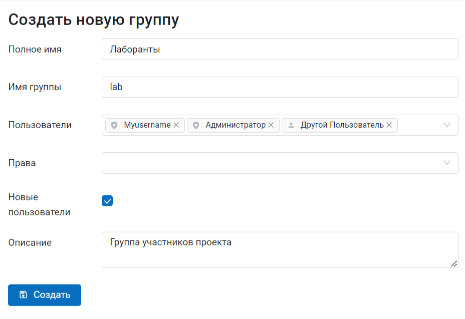

   Окно создания новой группы

В диалоге необходимо указать полное и краткое наименование группы, при необходимости ввести описание группы, выбрать членов данной группы в выпадающем списке, при необходимости задать глобальные права группы (см. `ниже <https://docs.nextgis.ru/docs_ngweb/source/users.html#ngw-group-rights>`_) и нажать кнопку "Создать". 
Установите флаг "Новые пользователи" в настройках группы для её автоматического назначения вновь создаваемым пользователям. 

.. note:: 
   Название группы должно содержать только цифры и буквы. 

.. _ngw_group_rights:

Глобальные права групп и пользователей
--------------------------------------

Для отдельных пользователей или группы пользователей можно задать права в отношении Веб ГИС в целом:

* создавать пользователей и группы пользователей, задавать им права;
* управлять системами координат в вашей Веб ГИС;
* управлять настройками CORS.

Это отличается от настроек `прав доступа в конкретных ресурсах <https://docs.nextgis.ru/docs_ngcom/source/permissions.html>`_ (векторных и растровых слоях, группах, сервисах, веб-картах). Такие настройки касаются работы исключительно с ресурсами, а глобальные настройки – управления функциями Веб ГИС.

Задать глобальные права можно при создании или редактировании пользователя/группы.

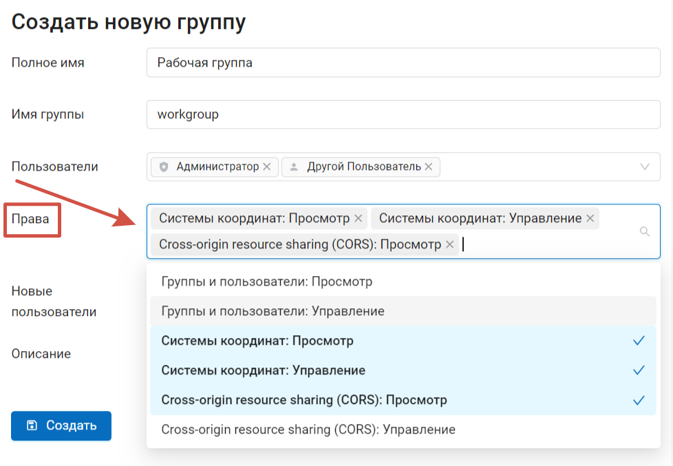

   Окно создания новой группы

.. warning:: 
   Если в группу, для которой включены глобальные права, добавить пользователя "Гость", Панель управления Веб ГИС будет доступна любым незалогиненным пользователям.

.. _ngcw_find_id:

Как узнать идентификационный номер пользователя
------------------------------------------------------------------

Чтобы узнать ID пользователя, в Веб ГИС в `Панели управления <https://docs.nextgis.ru/docs_ngweb/source/admin_interface.html#ngw-control-panel>`_ зайдите в раздел `Пользователи <https://docs.nextgis.ru/docs_ngweb/source/users.html>`_, найдите нужного пользователя в списке и отройте режим редактирования (или наведите курсор на значок редактирования, чтобы увидеть ссылку, не котрывая окно, если это позволяет ваш браузер).

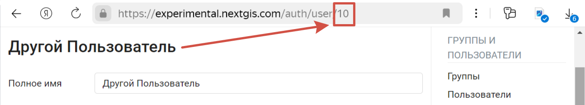

   Идентификационный номер пользователя "Другой пользователь": 10

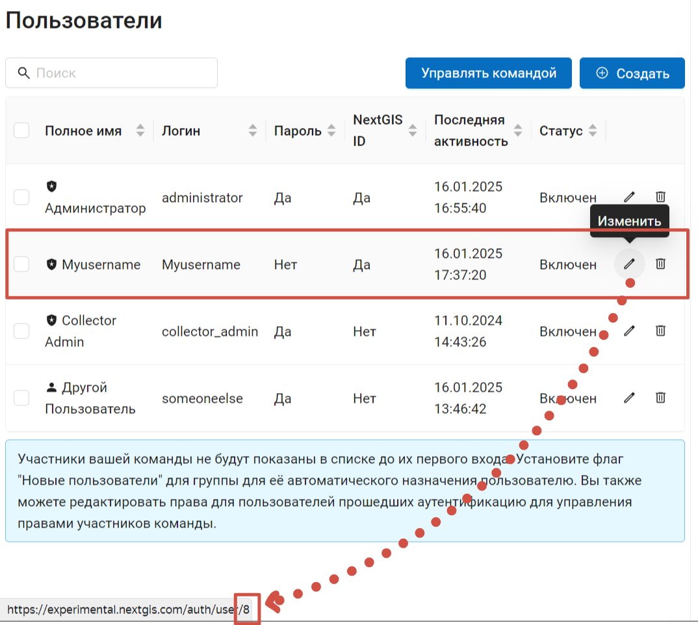

   При наведении курсора видна ссылка на редактирование профиля. Идентификационный номер пользователя "Myusername": 8

.. _ngw_disable_delete_user:

Отключение и удаление пользователей
------------------------------------

Сначала `удалите пользователя из команды <https://docs.nextgis.ru/docs_ngcom/source/teams.html#ngcom-team-management>`_. 

В Веб ГИС вы можете **отключить** пользователя временно (это сохранит его статус владельца ресурсов, членство в группах и настройку прав, которые снова будут работать при повторном добавлении в команду) или **удалить** полностью.

В основном меню откройте панель управления и перейдите в раздел "Пользователи". В строке каждого пользователя есть иконки "Изменить" и "Удалить".

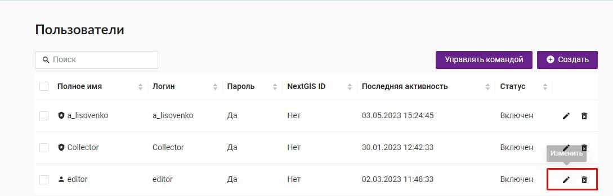
   
   Список пользователей

В окне изменения можно редактировать параметры пользователя, а также **отключить** его. Для этого нужно поставить флажок в поле "Отключен" и нажать кнопку **Сохранить**.

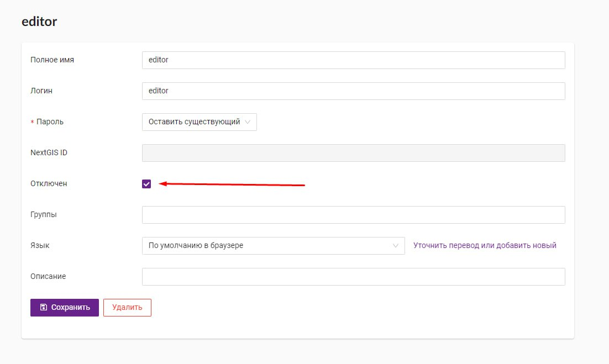
   
   Отключение пользователя

Как правило, отключения пользователя достаточно. Это позволяет сохранить информацию о его активности в версионируемых слоях и не требует дополнительных действий по передаче ресурсов. 

Однако при необходимости вы можете **удалить пользователя полностью**. Для этого в списке пользователей нажмите на значок удаления и подтвердите действие во всплывающем окне. Также можно открыть окно редактирования пользователя и там нажать кнопку **Удалить**.

Если пользователь является владельцем ресурсов Веб ГИС или участвовал в редактировании версионируемых слоёв, то при попытке его удалить возникает ошибка: *"Ошибка валидации. Пользователь связан с ресурсами"*. В предупреждении вы увидите id этих ресурсов. Чтобы удалить пользователя, нужно `cменить владельца <https://docs.nextgis.ru/docs_ngweb/source/edit_resource.html>`_ принадлежащих ему ресурсов и отключить версионирование слоёв, в работе над которыми он участвовал. Обратите внимание, что отключение версионирования уничтожит всю историю изменений ресурса, поэтому мы рекомендуем вместо полного удаления отключать пользователей, как описано выше. 

.. _bind:

Как привязать NextGIS ID к существующему пользователю Веб ГИС
-------------------------------------------------------------

Если у вас был создан внутри Веб ГИС локальный аккаунт (имя пользователя + пароль, например ivanov, 12345ivanov), то чтобы привязать его к своему NextGIS нужно сделать следующее:

1. `Зарегистрироваться на платформе NextGIS <https://docs.nextgis.ru/docs_ngcom/source/create.html>`_ и создать NextGIS ID.
2. Сообщить администратору Веб ГИС имя пользователя, заданное `в профиле в личном кабинете <https://docs.nextgis.ru/docs_ngcom/source/create.html#ngcom-ngid-profile>`_. Администратор добавит вас `в команду <https://docs.nextgis.ru/docs_ngcom/source/teams.html#ngcom-team-management>`_. Зайдите в личный кабинет, авторизуйтесь и проверьте, что нужная Веб ГИС появилась `на странице команд, в которых вы участвуете <https://my.nextgis.com/teammanage/member>`_
3. Перейдите в Веб ГИС, авторизуйтесь через свой старый аккаунт (в нашем примере это пользователь ivanov).
4. Нажмите на инициалы или аватарку в правом верхнем углу и откройте настройки пользователя.

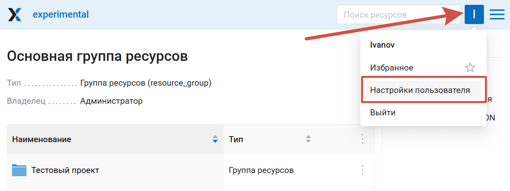

   Переход к настройкам пользователя

5. В настройках в пункте NextGIS ID нажмите кнопку **Привязать аккаунт**.

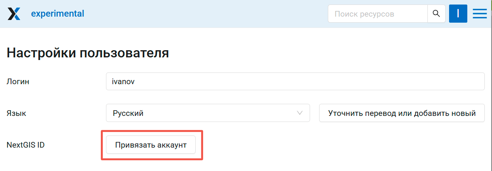

   Привязка NextGIS ID

При успешной привязке на месте кнопки появится надпись "Аккаунт привязан" и ваш идентификатор.

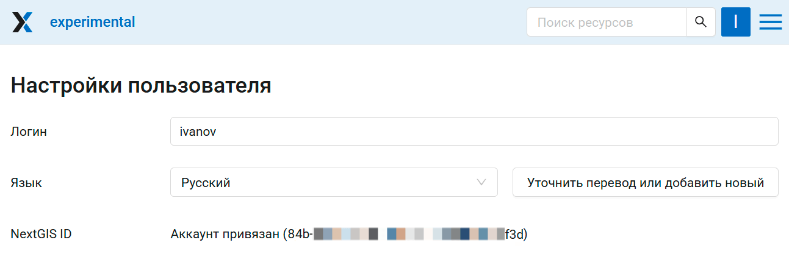

   NextGIS ID привязан успешно

.. _ngw_create_user:

Создание локального пользователя
---------------------------------

Если в вашей Веб ГИС подключён лимит локальных пользователей, то вы можете задать логин и пароль для нового пользователя самостоятельно. Локальные пользователи имеют доступ только к Веб ГИС, другой функционал платформы, включённый в тариф Premium, для них недоступен.

Чтобы создать локального пользователя, откройте панель управления, перейдите в раздел "Пользователи" и нажмите **Создать**.

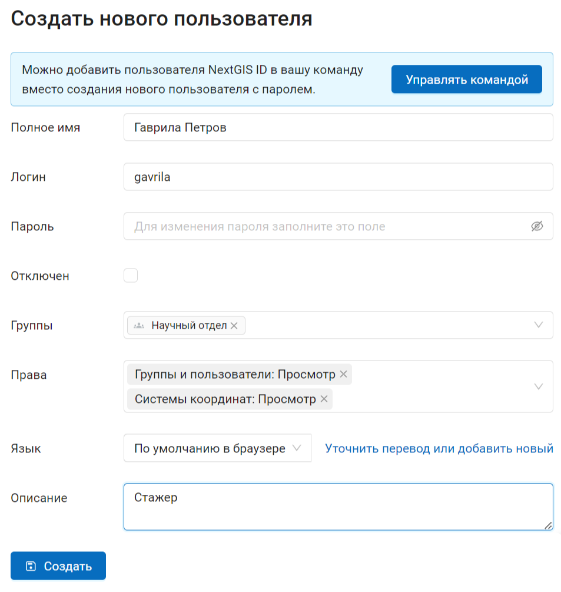

   Окно создания пользователя
   
В диалоге необходимо указать:

* Полное имя пользователя (например, Иванов Иван Иванович)
* Логин (например, ivanov)
* Пароль для входа
* Группа(-ы), к которым относится пользователь (в списке будут отображены имеющиеся группы. Если необходимой группы в списке нет, то ее необходимо предварительно создать (см. :ref:`ngw_create_group`)).
* Права - `глобальные права пользователя <https://docs.nextgis.ru/docs_ngweb/source/users.html#ngw-group-rights>`_
* Язык интерфейса для этого пользователя

Дополнительные сведения о пользователе можно добавить в пункт "Описание".

Далее необходимо нажать кнопку **"Создать"**.

.. note:: 
   Пароль ограничен по длине в диапазоне 5-25 символов. Логин может иметь символы латинского алфавита, цифры и символ подчеркивания, но должен начинаться обязательно с буквы.

Для локальных пользователей и групп пользователей также можно `настроить права доступа <https://docs.nextgis.ru/docs_ngcom/source/permissions.html>`_ ко всей Веб ГИС и отдельным ресурсам.

.. _ngw_change_password:

Изменение пароля локального пользователя
----------------------------------------

Для смены пароля пользователя можно воспользоваться административным интерфейсом. В Панели управления (см. :numref:`ngweb_control_panel`) следует выбрать команду "Список" в подпункте "Пользователи" и нажать на иконку в виде карандаша напротив пользователя, для которого необходимо сменить пароль (см. :numref:`ngweb_change_password_pic`). В открывшемся окне в поле "Пароль" выбрать в выпадающем меню "Назначить новый" и ввести новый пароль. После ввода нового пароля следует нажать на кнопку **Сохранить**.

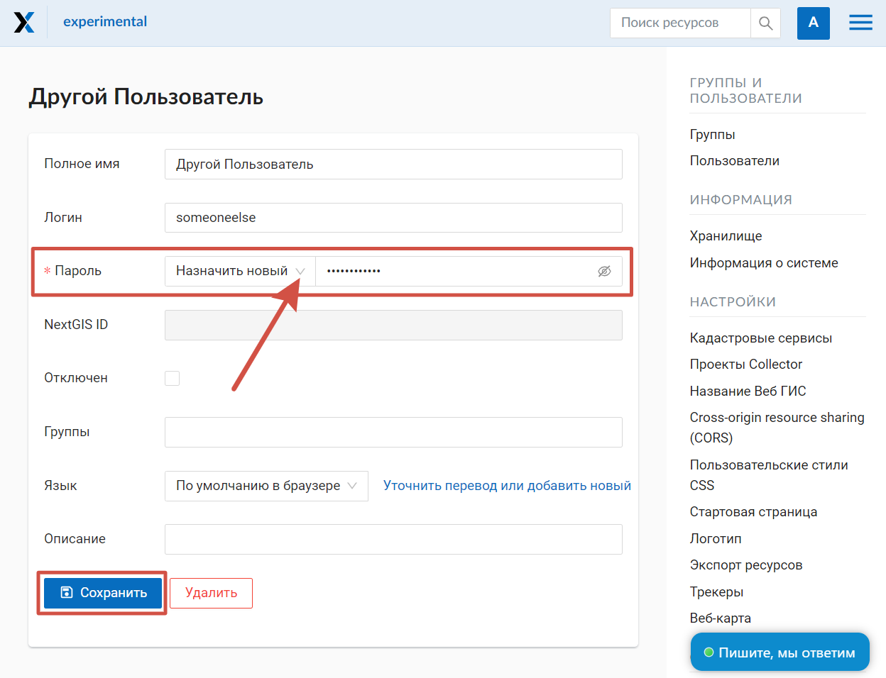

   Окно редактирования пользователя

Также существует возможность изменить пароль пользователя из командной строки:

.. warning:: Указание нового пароля пользователя в командной строке потенциально небезопасно.

.. code-block:: shell

  env/bin/nextgisweb --config config.ini change_password user password

.. note:: 
   Пароль ограничен по длине в диапазоне 5-25 символов

.. important::
   Если вы забыли пароль от NextGIS ID, воспользуйтесь `этой инструкцией <https://docs.nextgis.ru/docs_ngcom/source/faq_webgis.html#nextgis-id>`_.
