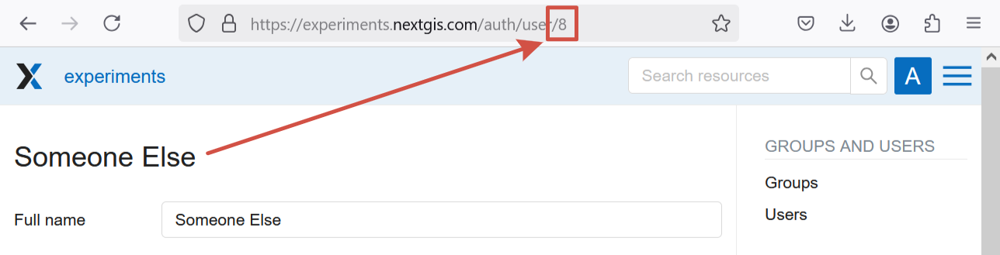
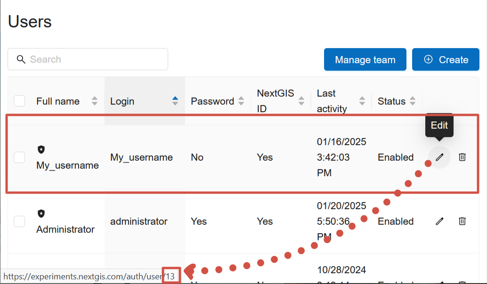
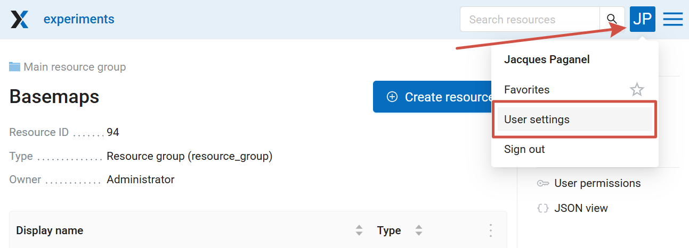
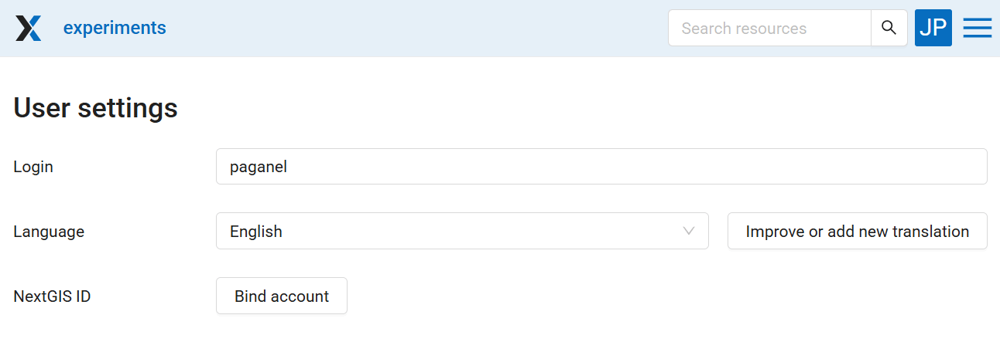
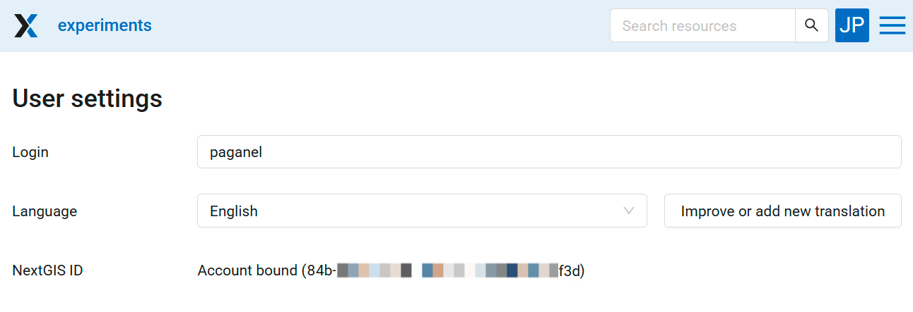

Managing users
================

To allow another user to access your Web GIS, `add them to your team <https://docs.nextgis.com/docs_ngcom/source/teams.html#team-management>`_.

Keep in mind, that the user would only see the resources if corresponding `permissions are set <https://docs.nextgis.com/docs_ngcom/source/permissions.html>`_. A newly added user has the permissions set for:

* "Authenticated" or "Everyone";
* a user group that has `"new users" flag ticked <https://docs.nextgis.com/docs_ngweb/source/users.html#ngweb-admin-controlpanel-usergroup-create-pic>`_.

After adding a user to your team, you can include them in a `group <https://docs.nextgis.com/docs_ngweb/source/users.html#ngw-create-group>`_ or `set up permissions <https://docs.nextgis.ru/docs_ngcom/source/permissions.html>`_ for that particular user.

.. _ngw_create_group:

Create new user group
---------------------

Open "Control panel" from the main menu (see item 1 in :numref:`admin_index_pic`). Then go to the "Groups" page and click **Create**.

.. figure:: _static/usergroup_create_en.png
   :name: ngweb_admin_controlpanel_usergroup_create_pic
   :align: center
   :width: 16cm

   "Create new group" dialog

In "Create new group" dialog enter full name and group name (short name), if necessary enter a group description, set group members and global permissions (see `below <https://docs.nextgis.com/docs_ngweb/source/users.html#global-permissions>`_) and click **"Create"**. 
Set "New users" flag for a group to automatically assign new user to it.

.. note:: 
   A name for a group should contain only letters and numbers. 

Global permissions
-------------------

While creating or editing a user or user group, you can set global permissions concerning Web GIS a whole:

* creating users and groups of users, managing access permissions;

* manage spacial reference systems of the Web GIS;

* manage CORS settings.

These global permissions are separate from `access permissions <https://docs.nextgis.com/docs_ngcom/source/permissions.html>`_ applied to particular resources (vector and raster layers, resource groups, services, Web Maps etc). The latter regulate working with resources, while global permissions allow users to manage Web GIS functions.

.. figure:: _static/ngw_group_rights_en.png
   :name: ngw_group_rights_pic
   :align: center
   :width: 16cm

   Setting up global permissions for a group

.. warning:: 
   If you include Guest to a group that has global permissions, anyone will be able to access Control panel even without logging in.

See how it works in our video:

.. raw:: html

   <iframe width="560" height="315" src="https://www.youtube.com/embed/pp137N12-B4?si=pQym6oOO-3ezdrSf" title="YouTube video player" frameborder="0" allow="accelerometer; autoplay; clipboard-write; encrypted-media; gyroscope; picture-in-picture; web-share" referrerpolicy="strict-origin-when-cross-origin" allowfullscreen></iframe>

Watch on `youtube <https://youtu.be/pp137N12-B4?si=r-Kb92HSVI2tbfHl>`_.

.. _ngcw_find_id:

How to find user identification number
--------------------------------------------

To learn user ID, in the Web GIS go to the `Control panel <https://docs.nextgis.com/docs_ngweb/source/admin_interface.html#ngw-control-panel>`_, open `Users <https://docs.nextgis.com/docs_ngweb/source/users.html>`_ section, find the user you need and enter the Edit mode (or just hover the cursor over the pencil icon to see the link without opening the page, if your browser allows it).

   User ID for "Someone Else" is 8

   Hovering over the Edit button you can see the link to the profile editing. The ID of the user "My_username" is 13

.. _ngw_disable_delete_user:

Disable or delete users
----------------------------------

First, `remove the user from your team <https://docs.nextgis.com/docs_ngcom/source/teams.html#ngcom-team-management>`_

In the main menu open the Control panel and select "Users". Each user has "Edit" and "Delete" icons on the right end of the line.

.. figure:: _static/admin_controlpanel_user_list_en.png
   :name: ngweb_admin_controlpanel_user_list_pic
   :align: center
   :width: 20cm
   
   User list

On the editing page you can modify properties of the user and **disable** the user. Tick "Disabled" and press **Save**.

.. figure:: _static/admin_controlpanel_user_disable_en.png
   :name: ngweb_admin_controlpanel_user_disable_pic
   :align: center
   :width: 20cm
   
   Disabling the user

If the user is disabled, settings concerning groups, resource ownership and permissions stay intact and can be reactivated after the user is re-added to the team. This also preserves all information on the user's acivity in versioned resources.

In most cases, disabling a user is enough, however, you can **delete a user permanently**. Click the "Delete" icon in the user list and confirm the action in the pop-up window. Alternatively, you can open the editing page and click **Delete**.

If the user is the owner of Web GIS resources or edited a versioned vector layer, a warning appears: *Validation error.
User is referenced with resources*. Click on **Technical information** to see ID of the resources owned by the user. To delete the user, first you need to `change the owner <https://docs.nextgis.com/docs_ngweb/source/edit_resource.html>`_ of resources and disable versioning for the layers the user edited. Keep in mind, that it destroyes all recorded version information for that layer. So we recommend disabling users instead, unless strictly necessary.

.. _bind:

How to bind NextGIS ID to an existing Web GIS user
-------------------------------------------------------------

If you have a user created within Web GIS with a username and password (e.g. paganel, 12345paganel) you can bind it to your NextGIS ID account.

1. `Create a NextGIS ID account <https://docs.nextgis.com/docs_ngcom/source/create.html>`_ 
2. Let the Web GIS administrator know what username you have in your `NextGIS ID profile <https://docs.nextgis.com/docs_ngcom/source/create.html#ngcom-ngid-profile>`_. The administrator adds you `to the team <https://docs.nextgis.com/docs_ngcom/source/teams.html#ngcom-team-management>`_. Then go to your NextGIS ID account, log in and make sure that the Web GIS is shown in the `list of your teams <https://my.nextgis.com/teammanage/member>`_.
3. Open Web GIS, log in using your old username and password (in our example paganel/1234paganel).
4. Click on the initials or userpic in the top right corner and open the user settings.

   Opening user settings

5. In the user settings click **Bind account** in the NextGIS ID field.

   Binding NextGIS ID account

If binding is successful, the button is replaced by the words "Account bound" and your identifier.

   NextGIS ID bound successfully

.. _ngw_create_user:

Create new local user
----------------------

If Web GIS has a local limit enabled, the Administrator can set usernames and passwords for users. This way the users only access the Web GIS and cannot use the other NextGIS functionality available on Premium.

To create a new local user, go to "Control panel" from the main menu. Then go to the "Users" page and click **Create**.

.. figure:: _static/user_create_en.png
   :name: admin_controlpanel_user_create
   :align: center
   :width: 16cm

   "Create new user" dialog
   
In "Create new user" dialog enter the following information:

* Full user name (e.g. John Smith)
* Login – user login (e.g. smith)
* Password
* Group(-s) user belongs to (select from a dropdown menu. If the required group is absent you need to create a new one (see :ref:`ngw_create_group`)).
* Permissions - `global permissions <https://docs.nextgis.com/docs_ngweb/source/users.html#global-permissions>`_ concerning Web GIS as a whole
* Interface language for the user

You can add some more information about the user in the "Description" field.

Then click **"Create"**.

.. note:: 
   The password is limited in length in the range of 5-25 characters. Login can have symbols of the Latin alphabet, numbers and an underscore, but must begin necessarily with a letter.

You can set up `access permissions <https://docs.nextgis.com/docs_ngcom/source/permissions.html>`_ for particular users and groups of users.

.. _ngw_change_password:

Update local user password
---------------------------

To update user password you can use administrative interface. To do it select "Control panel" in the main menu. Go to "Users" and click pencil icon near the user you want to update password for. In the "Password" field select "Assign new" in the dropdown menu, fill in a new password and click **Save** button.

.. figure:: _static/ngweb_change_password_eng_2.png
   :name: ngweb_change_password_pic
   :align: center
   :width: 12cm

   User editting window
   
Also there is an option to change user password using command line:

.. warning:: Setting a password using a command line is not safe.

.. code:: bash

  env/bin/nextgisweb --config config.ini change_password user password
  env/bin/nextgisweb --config config.ini change_password user password

.. note:: 
   The password is limited in length in the range of 5-25 characters.

If you forgot the password to your NexGIS ID, follow `this instruction <https://docs.nextgis.com/docs_ngcom/source/faq_webgis.html#i-forgot-my-account-password-nextgis-id-what-to-do>`_.