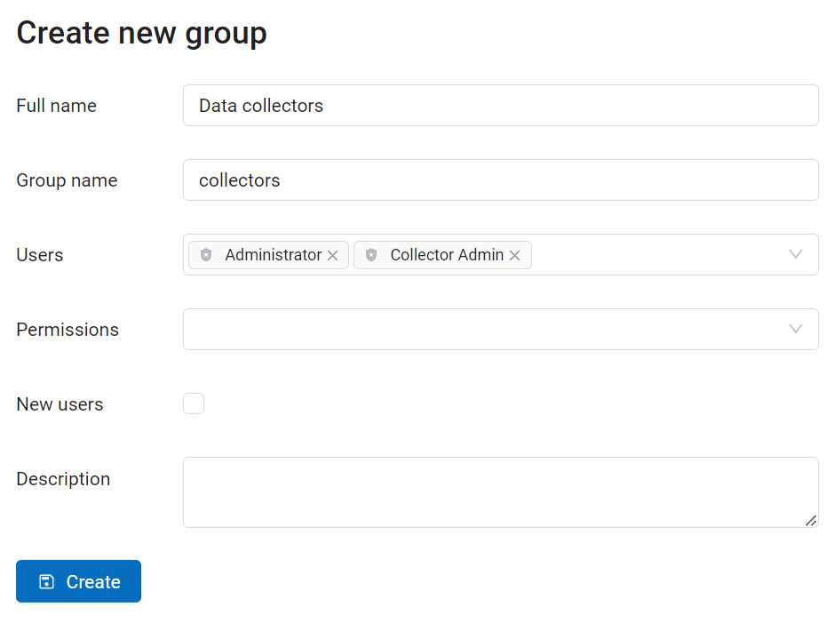
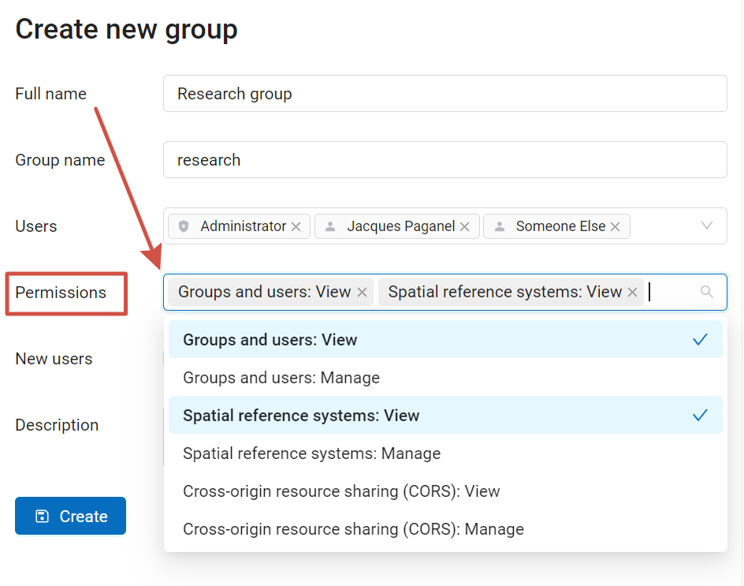
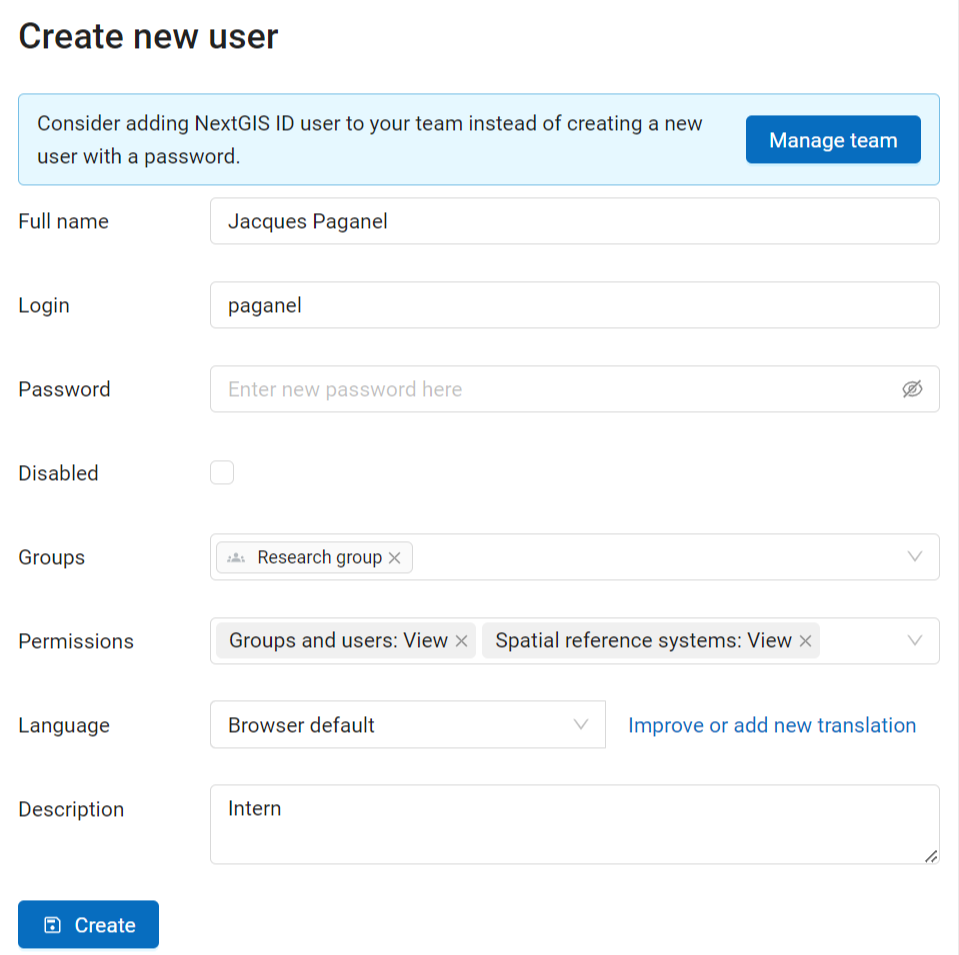
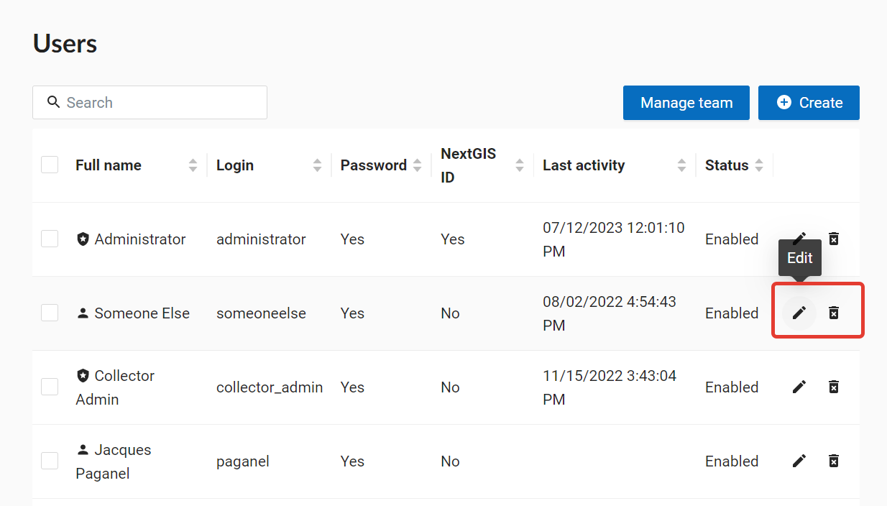
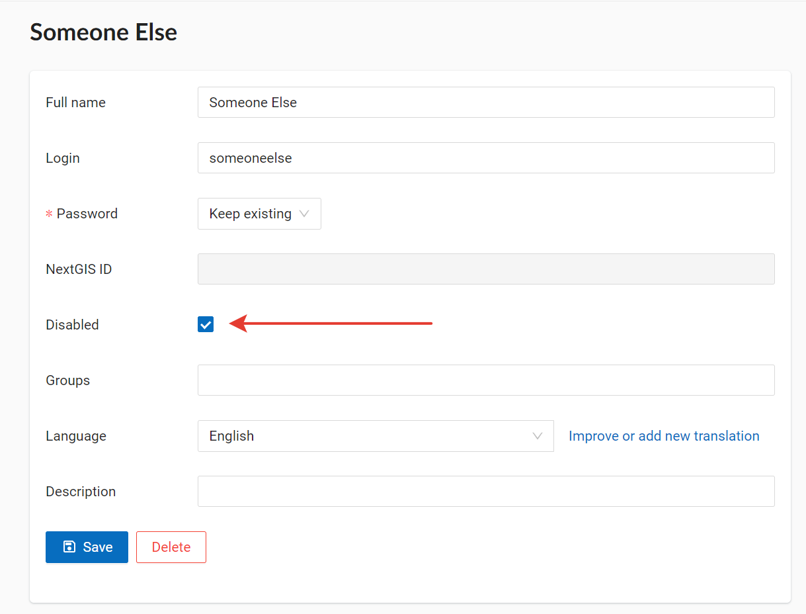
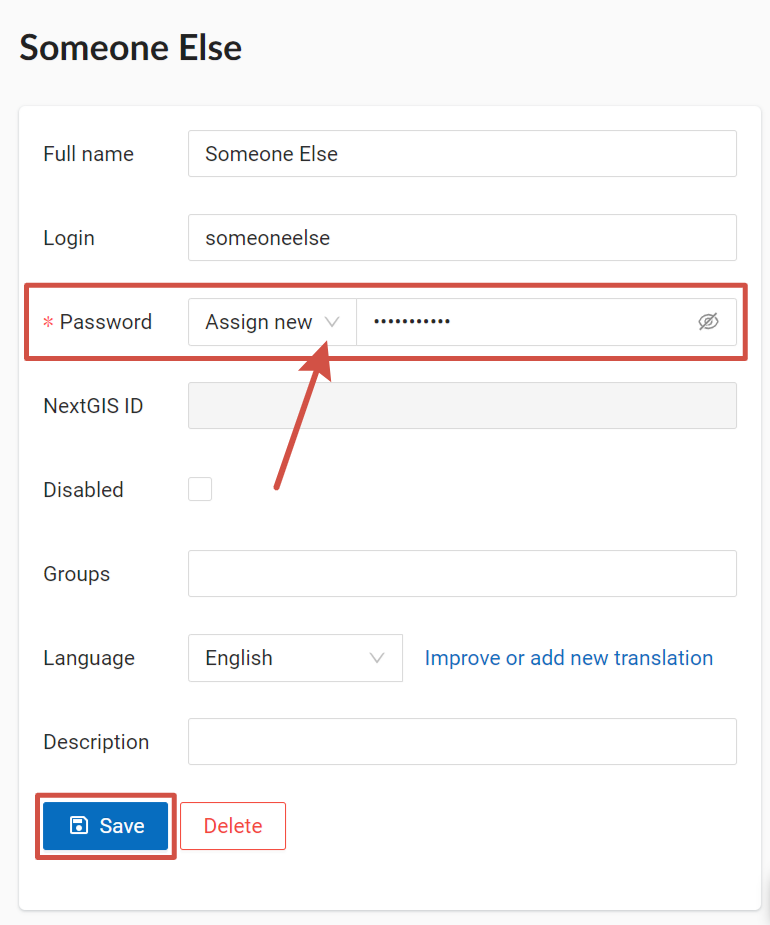

Managing users
================

If you want to add a user to your team, see the `Team management <https://docs.nextgis.com/docs_ngcom/source/teams.html#team-management>`_.

.. _ngw_create_group:

Create new user group
---------------------

A dialog for creation of a new user group presented on  :numref:`ngweb_admin_controlpanel_usergroup_create_pic`
To open this window select "Control panel" (see :numref:`ngweb_main_page_main_menu_pic`) in the main menu (see item 1 in :numref:`admin_index_pic`). From the control panel (see :numref:`admin_control_panel`) go to the "Groups" page and click **Create**.

   "Create new group" dialog

In "Create new group" dialog enter full name and group name (short name), if necessary enter a group description, set group members and global permissions (see `below <https://docs.nextgis.com/docs_ngweb/source/users.html#global-permissions>`_) and click **"Create"**. 
Set "New users" flag for a group to automatically assign new user to it.

.. note:: 
   A name for a group should contain only letters and numbers. 

Global permissions
-------------------

While creating or editing a user or user group, you can set global permissions concerning Web GIS a whole:

* creating users and groups of users, managing access permissions;

* manage spacial reference systems of the Web GIS;

* manage CORS settings.

These global permissions are separate from `access permissions <https://docs.nextgis.com/docs_ngcom/source/permissions.html>`_ applied to particular resources (vector and raster layers, resource groups, services, Web Maps etc). The latter regulate working with resources, while global permissions allow users to manage Web GIS functions.

   Setting up global permissions for a group

.. warning:: 
   If you include Guest to a group that has global permissions, anyone will be able to access Control panel even without logging in.

.. _ngw_create_user:

Create new user
---------------

A dialog for creation of a new user is presented on :numref:`admin_controlpanel_user_create`. 
To open this window select "Control panel" (see :numref:`ngweb_main_page_main_menu_pic`) in the main menu (see item 1 in :numref:`admin_index_pic`). From the control panel (see :numref:`admin_control_panel`) go to the "Users" page and click **Create**.

   "Create new user" dialog
   
In "Create new user" dialog enter the following information:

* Full user name (e.g. John Smith)
* Login – user login (e.g. smith)
* Password
* Group(-s) user belongs to (select from a dropdown menu. If the required group is absent you need to create a new one (see :ref:`ngw_create_group`)).
* Permissions - `global permissions <https://docs.nextgis.com/docs_ngweb/source/users.html#global-permissions>`_ concerning Web GIS as a whole
* Interface language for the user

You can add some more information about the user in the "Description" field.

Then click **"Create"**.

.. note:: 
   The password is limited in length in the range of 5-25 characters. Login can have symbols of the Latin alphabet, numbers and an underscore, but must begin necessarily with a letter.

You can set up `access permissions <https://docs.nextgis.com/docs_ngcom/source/permissions.html>`_ for particular users and groups of users.

.. _ngw_disable_delete_user:

Disable or delete users
----------------------------------

In the main menu (see item 1 in :numref:`admin_index_pic`) open the Control panel (see :numref:`ngweb_main_page_main_menu_pic`) and select "Users". Each user has "Edit" and "Delete" icons on the right end of the line.

   
   User list

On the editing page you can modify properties of the user and **disable** the user. Tick "Disabled" and press **Save**.

   
   Disabling the user

Users that are turned off in this fashion do not count in the user limit of your plan. It allows you to enable various users as needed, all within the limits of your current plan.

If you need to **delete a user permanently**, you can do so by pressing the "Delete" icon in the user list (see :numref:`ngweb_admin_controlpanel_user_list_pic`) and confirming the action in the pop-up window.

Alternatively, you can open the editing page and press **Delete**.

.. _ngw_change_password:

Update user password
--------------------

To update user password you can use administrative interface. To do it select "Control panel" (see :numref:`ngweb_main_page_main_menu_pic`) in the main menu (see item 1 in :numref:`admin_index_pic`). In control panel (see :numref:`admin_control_panel`) select "List" option in "Users" block and click pencil icon near the user you want to update password for  (see :numref:`ngweb_change_password_pic`). In opened window in "Password" field select "Assign new" in the dropdown menu, fill in a new password and click **Save** button.

   User editting window
   

Also there is an option to change user password using command line:

.. warning:: Setting a password using a command line is not safe.

.. code:: bash

  env/bin/nextgisweb --config config.ini change_password user password
  env/bin/nextgisweb --config config.ini change_password user password

.. note:: 
   The password is limited in length in the range of 5-25 characters.
