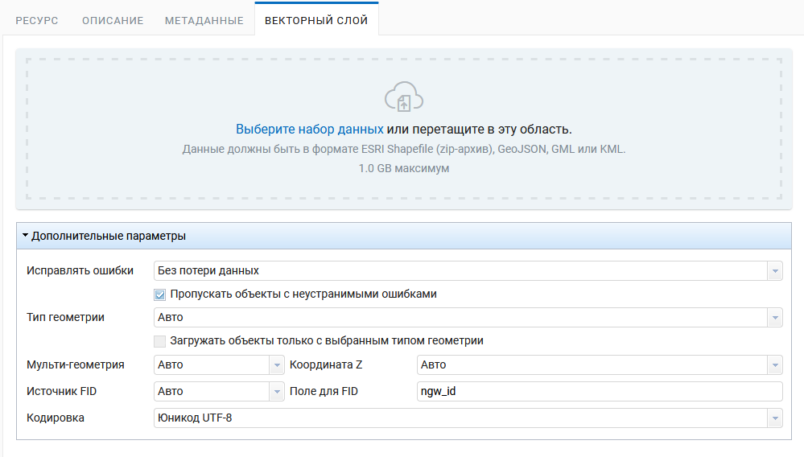

.. sectionauthor:: Роман Гайнуллов <roman.gaynullov@nextgis.ru>

Дополнительные параметры загрузки векторного слоя из файла
==========================================================

При загрузке векторного слоя из файла доступны дополнительные настройки. В скобках приводятся ключи и значения настроек в API (:numref:`ngweb_vect_layer_upload_params`).

   
   Дополнительные параметры загрузки векторного слоя

.. _general:

Общие настройки обработки возможных ошибок
------------------------------------------

**Fix errors (fix_errors)**

Возможные значения:

* None (NONE) - ошибки не исправляются;
* Without losing data (SAFE) - исправляются ошибки без потери данных. Исправляемые ошибки:

  * Извлечение геометрий из Geometry Collection и Multi-геометрий, если внутри содержится одна геометрия;
  * Закрытие колец полигонов;
* Whatever possible (LOSSY) - ошибки исправляются по-максимуму с возможной потерей данных. В этом режиме будут исправляться все ошибки из режима SAFE, а также:

  * При извлечении геометрий из Geometry Collection и Multi-геометрий  будет браться первая подходящая геометрия, остальные геометрии отбрасываются.

**Skip features with unfixable errors (skip_errors)**

Если ошибки не удается исправить с помощью режима *Fix errors*, то при выборе этой функции объекты будут пропускаться.
Если функция не выбрана, то слой не загрузится и покажутся первые 10 ошибок, которые к этому привели.

.. _geometry_type:

Настройки определения типа геометрии
-------------------------------------

В Nextgis Web векторных слой должен иметь определённый тип геометрии.
Если в исходном файле содержатся разные типы геометрий, необходимо либо задать настройки для фильтрации, либо привести геометрии к определённому типу.

**Geometry type (cast_geometry_type)**

Возможные значения:

* Auto (null)
* POINT
* LINESTRING и POLYGON

Эта настройка задаёт класс геометрий. Например, к классу POINT относятся геометрии типа POINT, MULTIPOINT, POINTZ, MULTIPOINTZ.

Если выбран класс геометрий, а в исходном слое содержатся геометрии других классов, это будет считаться ошибкой.
Если взвести галку **Only load features of the selected geometry type (skip_other_geometry_types)**, тогда геометрии других классов будут пропускаться.

Тип геометрии можно уточнить настройками **Multi-geometry (cast_is_multi)** и **Z-Coordinate (cast_is_multi)**.
Возможные значения:
* Yes (true)
* No (false)
* Auto (null)

.. _fid:

Настройки определения ID объекта (FID)
-------------------------------------

**FID source (fid_source)**

Возможные значения:

* Sequence (SEQUENCE, null) - FID начинается с 1
* Field (FIELD) - FID берётся из поля *integer*, оно не загружается в состав атрибутов слоя. Имя поля задаётся в настройке **FID field (fid_field)**. Например, если слой был экспортирован в файл из NextGIS Web, в нём по-умолчанию создаётся поле *ngw_id*, в которое записывается FID. Чтобы загрузить слой в Nextgis Web с тем же составом полей и значениями FID, нужно задать *FID source = FIELD* и *FID field = ngw_id*. 
* Auto (AUTO) - FID берётся из поля, если оно существует, иначе будет начинаться с 1.
