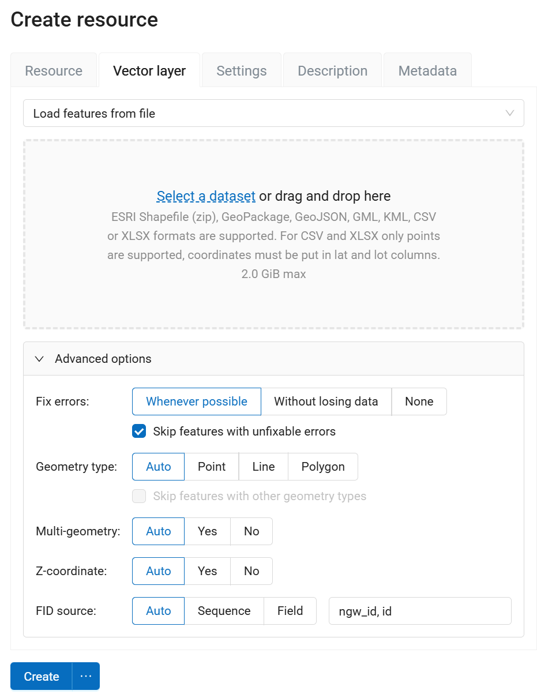

Advanced options for uploading vector layer from a file
========================================================

Advanced settings are available when uploading a vector layer from a file (:numref:`ngweb_vect_layer_upload_params`).

   
   Advanced vector layer uploading options

.. _general:

Processing possible errors
----------------------------------------------

**Fix errors**

Possible values:

* **Whatever possible** - errors will be corrected to the maximum with possible data loss;
* **Without losing data** - errors will be corrected without data loss;
* **None** - no error will be corrected.

The following fixes are made:

* Extract geometries from Geometry Collection and Multigeometries if they have only one part;
* Close the rings of polygons;
* When extracting geometries from a Geometry Collection and Multigeometries the first matching geometry is taken, the others are discarded. This correction is not performed in "Without losing data" mode.

**Skip features with unfixable errors** - defines what happens if the errors cannot be corrected using the *Fix errors* mode. If ticked, features with errors will be skipped and the layer will be created.
If unticked, then the layer will not be created and the first 10 errors that led to this will be listed.

.. _geometry_type:

Detecting geometry type
-----------------------------------

In NextGIS Web vector layers must have a single type of geometry.
If the source file contains different types of geometry, you must either set up filtering or convert the geometries to a specific type.

**Geometry type**

Possible values:

* Auto
* Point
* Linesrting
* Polygon

This setting specifies the geometry class. For example, the POINT class includes geometries such as POINT, MULTIPOINT, POINTZ, MULTIPOINTZ.

If a geometry class is selected and the original layer contains geometries from other classes, this will be considered an error.
If you check **Only load features of the selected geometry type**, then geometries of other classes will be skipped.

Geometry type can be further specified by parameters **Multi-geometry** and **Z-Coordinate**.

Possible values for those two parameters are:

* Auto
* Yes
* No

.. _fid:

Object ID detection settings (FID)
-------------------------------------

Every feature in a NextGIS Web vector layer must have a unique identifier. If the file has no field that can serve as FID, a new field is created. You can select how to define FID for the layer.

**FID source**

Possible values:

* **Auto** - FID is taken from the *integer* field with unique values if it exists. The field is not included into the layer's attributes. Otherwise, a new hidden field is created, numbers start with 1;
* **Sequence** - a new field is created, FID starts with 1;
* **Field** - FID is taken from the field defined by user. For example, if a layer was exported from NextGIS Web, it has a field *ngw_id*.

