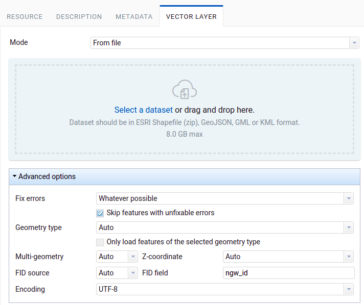

.. sectionauthor:: Roman Gainullov <roman.gaynullov@nextgis.com>

Additional options for uploading vector layer from file
========================================================

Additional settings are available when uploading a vector layer from a file (:numref:`ngweb_vect_layer_upload_params`).

   
   Additional vector layer uploading options

.. _general:

General Settings processing of possible errors
----------------------------------------------

**Fix errors**

Possible values:

* **None** - no error will be corrected;
* **Without losing data** - errors will be corrected without data loss. Correctable errors::

  * Extraction of geometries from Geometry Collection and Multigeometries if one geometry is contained inside;
  * Closing the rings of polygons;
* **Whatever possible** - errors will be corrected to the maximum with possible data loss. In this mode all errors from the *Without losing data* mode will be corrected, as well as:

  * When extracting geometries from a Geometry Collection and Multigeometries the first matching geometry will be taken, the rest will be discarded.

**Skip features with unfixable errors**

If errors cannot be corrected using the *Fix errors* mode, then when this function is selected, objects will be skipped.
If the function is not selected, then the layer will not upload and the first 10 errors that led to this will appear.

.. _geometry_type:

Geometry type definition settings
-----------------------------------

In NextGIS Web vector layers must have a certain type of geometry.
If the source file contains different types of geometries, you must either set the filtering settings or convert the geometries to a specific type.

**Geometry type**

Possible values:

* Auto
* Point
* Linesrting
* Polygon

This setting specifies the geometry class. For example, the POINT class includes geometries such as POINT, MULTIPOINT, POINTZ, MULTIPOINTZ.

If a geometry class is selected and the original layer contains geometries from other classes, this will be considered an error.
If you set a checkbox **Only load features of the selected geometry type**, then geometries of other classes will be skipped.

Geometry type can be specified by settings **Multi-geometry** and **Z-Coordinate**.

Possible values:

* Auto
* Yes
* No

.. _fid:

Object ID detection settings (FID)
-------------------------------------

**FID source**

Possible value:

* **Sequence** - FID starts with 1
* **Field** - FID is taken from the *integer* field, it is not loaded into the layer's attributes. The field name is specified in the **FID Field** setting. For example, if a layer was exported to a file from NextGIS Web, a field *ngw_id* is created in it by default in which the FID is written. To upload a layer in NextGIS Web with the same set of fields and FID values, you need to set *FID source = FIELD* and *FID field = ngw_id*.
* **Auto** - FID is taken from the field if it exists. Otherwise, it starts with 1.
