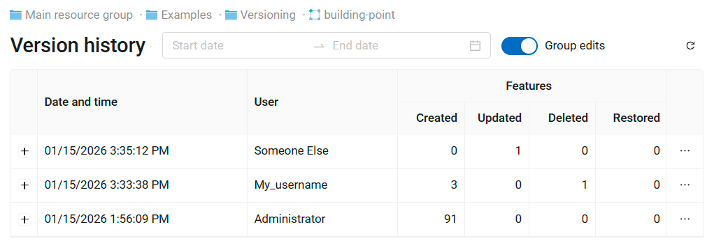
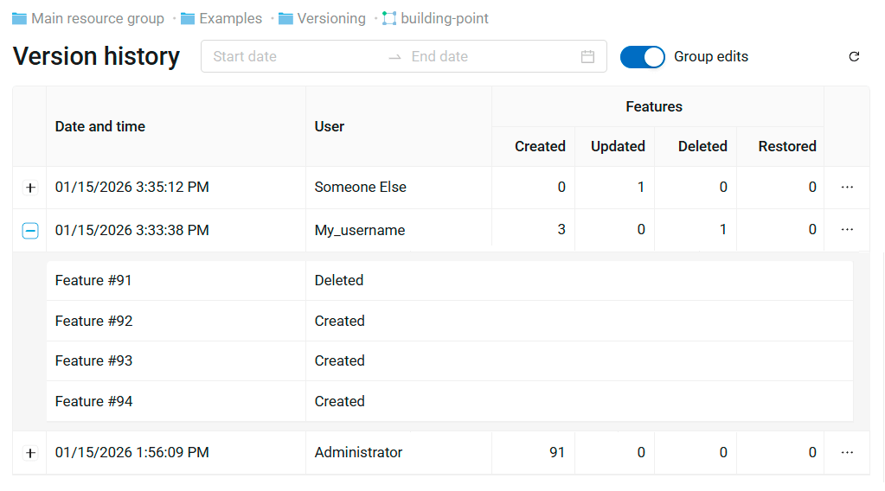
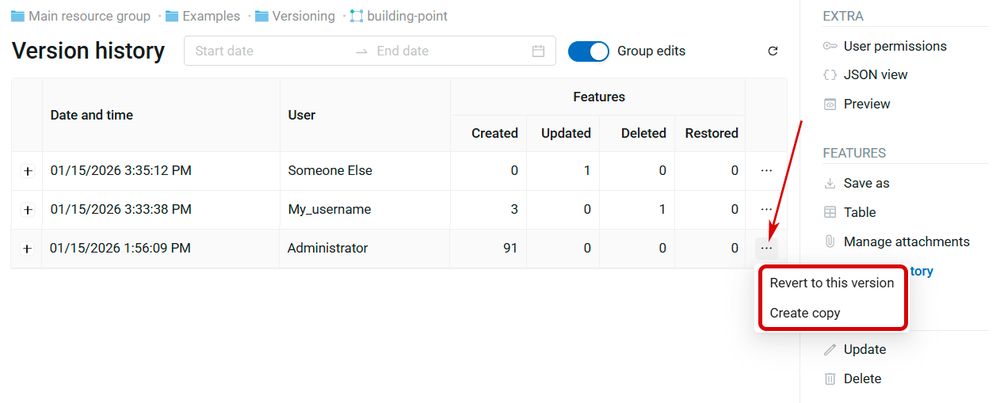
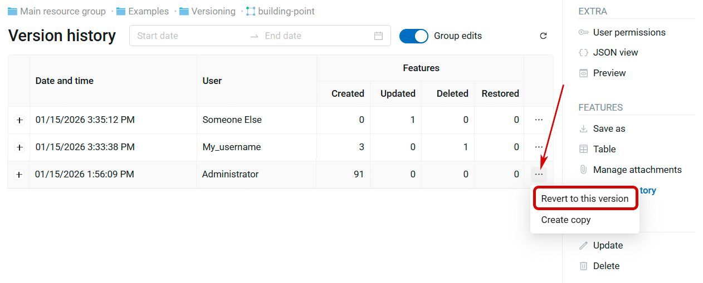
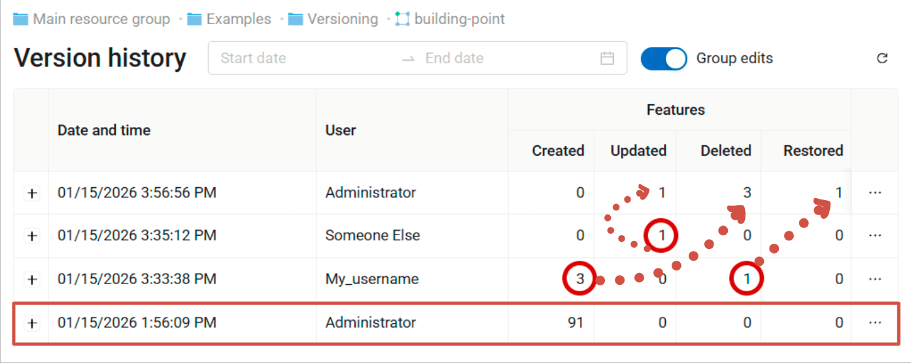
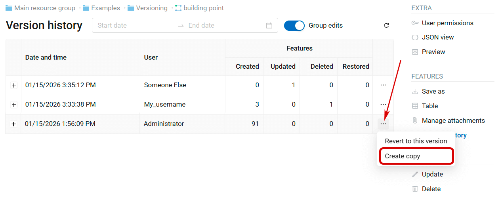
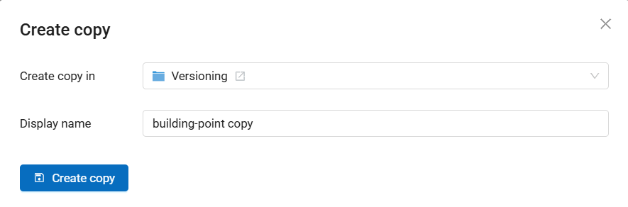
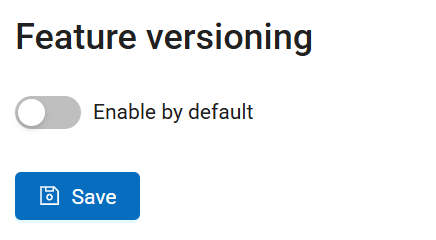

.. _versioning:

Versioning
============

Geodata storage NextGIS Web supports **versioning**, a mechanism that logs changes made to features of vector layers. 

When a feature is created, deleted or edited, this change is registered (who made it and when), and the state of the database before the change is saved in a special way. 

It allows NextGIS Web administrator to:

* Learn who and when made any change to the vector layer;
* Learn who, when and how changed the attributes or the geometry of the feature;
* Access any recorded state of the vector layer and reset incorrect changes;
* Get a list of all the edits made by one user;
* Get a list of all the edits for a given period, for example, a particular date or since a connected database was last updated;

etc. Changes in both **attributes** and **geometry** are logged.

Versioning is **disabled by default**. You can `turn it on <https://docs.nextgis.com/docs_ngweb/source/layers.html#create-vector-layer-vers-pic>`_ for a specific vector layer if needed. Logging activates when the versioning is turned on, the changes made before that are not registered anywhere.

When the versioning is turned off, all the logged information about the changes in the layer is **deleted**.

.. _vers_ngw_ui:

Versioning in the NextGIS Web interface
------------------------------------------

At the moment in the user interface of NextGIS Web you can access the following functions:

* Enable and disable versioning `in the vector layer settings <https://docs.nextgis.com/docs_ngweb/source/layers.html#create-vector-layer-vers-pic>`_;
* Enable `feature versioning by default <https://docs.nextgis.com/docs_ngweb/source/version.html#vers-ngw-default>`_ for your Web GIS;
* View versioning status (yes/no) on the Vector layer resource page;
* View history of a vector layer;
* Additional virtual field "Last changed" in the attribute table of the versioned layer. It allows to see the time and author of the latest change for each feature of the layer;
* Revert vector layer to the selected version;
* Copy selected version to a new layer.

.. _vers_ngw_view_history:

View history of a versioned layer
~~~~~~~~~~~~~~~~~~~~~~~~~~~~~~~~~~~

To see the history of vector layer edits, go to the resource page and click **Version history** in the actions panel on the right.

A table opens:

   History of feature edits

Each version entry has the following information:

* Date and time of the edits;
* Editor username;
* Stats: how many features were created, updated, deleted or restored.

Click on the + on the left end of the row to expand the list of the modified features. The number of the feature is its fid.

   Details of the edits

Click on the tree dots on the right end of the row to open the version menu. It has two options:

* Revert the layer to the selected version;
* Create a copy of the layer, reproducing its state in the selected version.

   Version menu

.. _vers_ngw_revert:

Revert a versioned layer to the selected version
~~~~~~~~~~~~~~~~~~~~~~~~~~~~~~~~~~~~~~~~~~~~~~~~~~

If feature versioning is enabled for a layer, you can revert it to any of the previous recorded states.

Open the layer resource page. Click **Version history** in the right panel.

In the Version history table find the row that logs the last edits you wish to keep. Click on the three dots on the right end of the row to open the menu and select **Revert to this version**.

   Restoring an earlier version of the layer

Confirm your action in the pop-up window. The layer is reverted to the selected version.

A new entry is added to the version history. It logs undoing of all the edits after the selected version. If features were added, deletion is recorded, and vice versa: if features were deleted, their restoration is recorded.

All the previously recorded history entries are preserved. You can restore the layer to any of the versions, including the one that was current before reverting.

   Reverting to the Administrator's version is logged in the layer history. Edits made by users My_username and Someone Else are reverted

.. _vers_ngw_copy:

Create a copy of the selected version
~~~~~~~~~~~~~~~~~~~~~~~~~~~~~~~~~~~~~~~

Versioning allows to undo the latest changes by reverting to an earlier version of the layer, or save a version of a layer recorded in its history as a separate resource.

Open the layer resource page. Click **Version history** in the right panel.

In the Version history table find the row that logs the last edits you wish to keep. Click on the three dots on the right end of the row to open the menu and select **Create copy**.

   Creating copy of a layer version

In the pop-up window select the resource group where you want to create a copy of the layer. By default the copy is created in the same group. Press |button_open_resource| to select another group.

.. |button_open_resource| image:: _static/button_open_resource.png
   :width: 5mm

Also here you can enter a custom name for the new layer. By default the name is "Copy" + name of the initial layer.

   Resource group and name for the copy

Click **Create copy** to finish.

.. _vers_ngw_default:

Enable feature versioning by default
~~~~~~~~~~~~~~~~~~~~~~~~~~~~~~~~~~~~~~~

You can have feature versioning enabled by default for all new layers added to your Web GIS.

Go to the `Control panel  <https://docs.nextgis.com/docs_ngweb/source/admin_interface.html#ngw-control-panel>`_ and select **Feature versioning**.

On the opened page switch the slider and click **Save**.

   Feature versioning disabled by default

For all the layers you subsequently create in the Web GIS via web interface or `add from QGIS with NextGIS Connect <https://docs.nextgis.com/docs_ngconnect/source/ngc_data_transfer.html#vector-data>`_ the versioning is on by default. 

You can also enable and disable versioning for individual layers `in the layer setttings <https://docs.nextgis.com/docs_ngweb/source/layers.html#create-vector-layer-vers-pic>`_.

.. _vers_ngw_api:

Versioning in NextGIS Web API
--------------------------------

The main options for obtaining information about versioned layers are now available only in the NextGIS Web API. Through API queries, you can get the states of layers and features for different time periods, the difference between different states, and so on. Here are some examples of API methods for versioned layers:

- ``/api/resource/{id}`` you can get the information on the versioning status and the current version of the data in the general layer query ('versioning' property).
- ``/api/resource/{id}/feature/`` add layer version to get its state at a particular moment
- ``/api/resource/{id}/feature/changes/check`` to get information about the difference between two given versions of the layer
- ``/api/resource/{id}/feature/version/{vid}`` get metadata for a given version

.. _vers_qgis:

Versioning in QGIS
--------------------

Versioning is actively used in QGIS plugin `NextGIS Connect <https://docs.nextgis.com/docs_ngconnect/source/ngconnect.html>`_ that allows integration with NextGIS Web. When versioning is enabled, QGIS can get information about all the changes made to the layer stored in NextGIS Web since the last time it had been accessed. It allows to `simultaneously edit <https://docs.nextgis.com/docs_ngconnect/source/edit.html>`_ a layer stored on the server from several QGIS sessions on separate computers.

