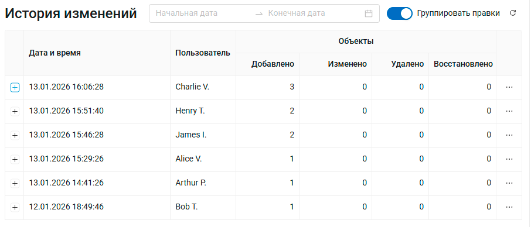
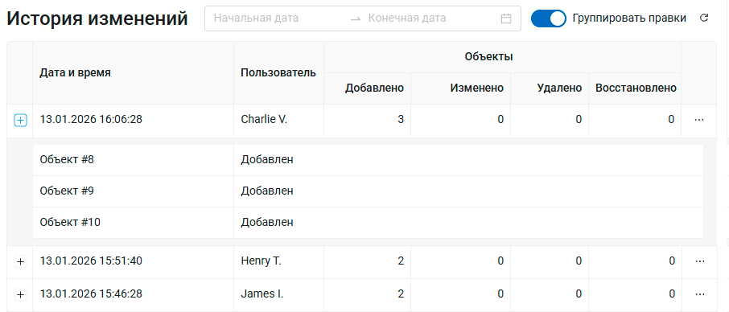
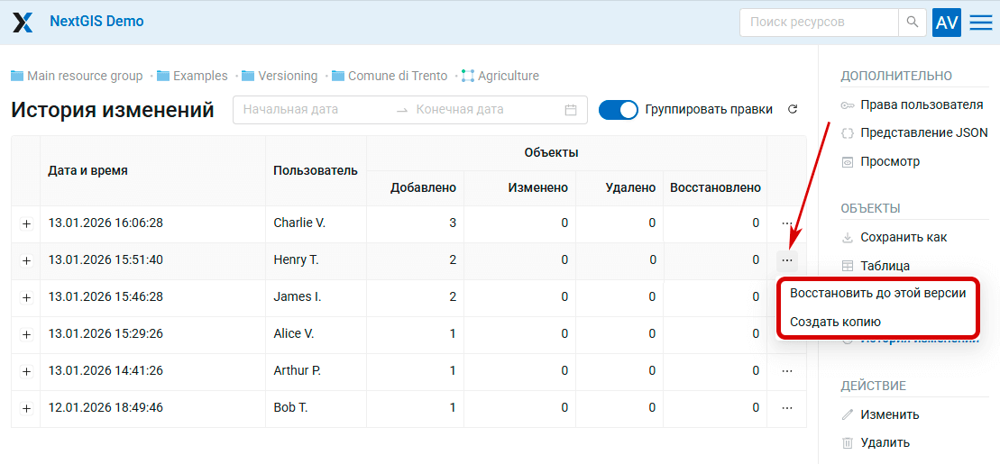
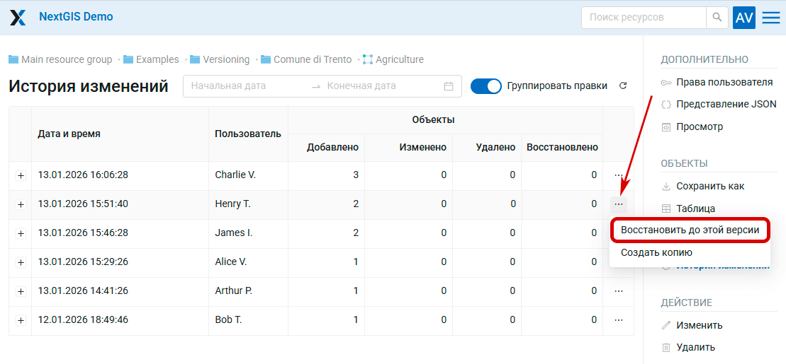
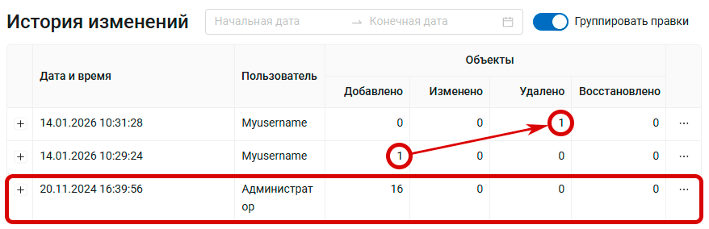
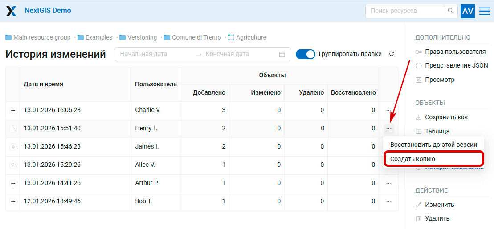
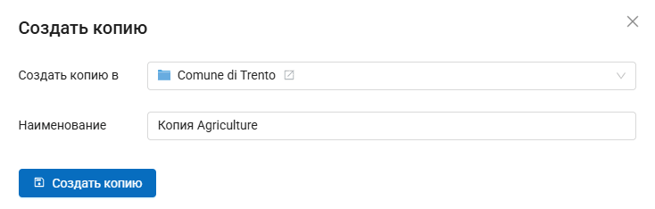
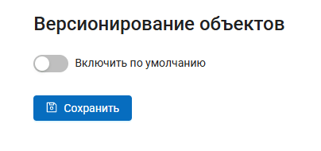
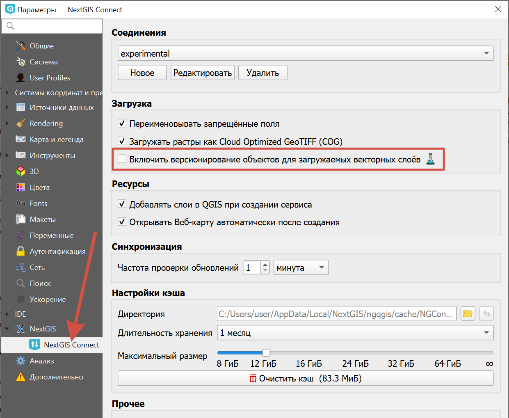

.. _versioning:

Версионирование
===================

Хранилище векторных геоданных в NextGIS Web поддерживает **версионирование** — механизм накопления истории всех изменений, происходящих с объектами векторных слоёв. 

Общая идея версионирования заключается в том, что при изменении, а также создании и удалении объектов, происходит регистрация этого изменения (кто и когда его осуществил), а состояние базы данных на момент до изменения специальным образом сохраняется. 

В практическом смысле для администратора NextGIS Web это означает возможность:

* Узнать время и автора любого изменения в векторном слое;
* Узнать как, когда и кем и менялись атрибуты или пространственное положение объекта в векторном слое;
* Получить состояние векторного слоя на любой момент времени в прошлом, откатить ошибочные изменения;
* Получить список всех правок определенного автора;
* Получить список всех правок за определенный период, например за день или с момента последнего обновления связанной базы данных

и так далее. 

Регистрируются изменения, связанные как с **атрибутивными**, так и с **пространственными свойствами объектов**.

Версионирование **по умолчанию отключено**, и `включается <https://docs.nextgis.ru/docs_ngweb/source/layers.html#create-vector-layer-vers-pic>`_ для каждого отдельного ресурса типа “Векторный слой” где это требуется. Модуль NextGIS Connect позволяет также автоматически включать версионирование `для всех загружаемых в QGIS слоёв <https://docs.nextgis.ru/docs_ngweb/source/version.html#qgis>`_. Накопление изменений активируется с момента включения версионирования, все события, произошедшие со слоем до этого, нигде не регистрируются.

.. important:: При отключении версионирования вся накопленная информация об истории изменений слоя **удаляется**.

.. _vers_ngw_ui:

Версионирование в графическом интерфейсе NextGIS Web
-----------------------------------------------------

На данный момент в графический интерфейс NextGIS Web вынесено:

* Включение и выключение версионирования в `свойствах векторного слоя <https://docs.nextgis.ru/docs_ngweb/source/layers.html#create-vector-layer-vers-pic>`_;
* Включение версионирование объектов по умолчанию `для всей Веб ГИС <https://docs.nextgis.ru/docs_ngweb/source/version.html#vers-ngw-default>`_;
* Отображение информации о версионировании на странице ресурса Векторный слой;
* `Просмотр истории версионируемого слоя <https://docs.nextgis.ru/docs_ngweb/source/version.html#vers-ngw-view-history>`_;
* Дополнительное виртуальное поле `“Последнее изменение” <https://docs.nextgis.ru/docs_ngweb/source/feature_table.html#ngw-feature-table-fields>`_ в таблице атрибутов версионируемого слоя. Оно позволяет для каждого объекта слоя увидеть автора и время последнего изменения;
* `Откат версионируемого слоя к версии <https://docs.nextgis.ru/docs_ngweb/source/version.html#vers-ngw-revert>`_;
* `Создание копии определенной версии слоя <https://docs.nextgis.ru/docs_ngweb/source/version.html#vers-ngw-copy>`_.

.. _vers_ngw_view_history:

Просмотр истории версионируемого слоя
~~~~~~~~~~~~~~~~~~~~~~~~~~~~~~~~~~~~~~~

Чтобы увидеть историю изменений слоя, откройте страницу ресурса и в панели справа нажмите **История изменений**.

Откроется таблица:

   История изменений

Для каждой зафиксированной версии слоя доступна следующая информация:

* Дата и время внесения изменения;
* Имя пользователя, внесшего изменения;
* Статистика изменённых объектов: сколько объектов добавлено, изменено, удалено, восстановлено.

Нажмите на + слева от строки, чтобы развернуть список изменённых объектов. Номер объекта - это его fid.

   Детали внесённых изменений

Меню из трёх точек в правом конце строки позволяет:

* Восстановить слой до выбранной версии;
* Создать копию слоя, соответствующую его состоянию в выбранной версии.

   Меню версии слоя

.. _vers_ngw_revert:

Откат версионируемого слоя к версии
~~~~~~~~~~~~~~~~~~~~~~~~~~~~~~~~~~~~

Слой с включённым версионированием можно вернуть к любому из предыдущих записанных состояний.

Откройте страницу ресурса слоя. В панели справа нажмите  **История изменений**.

В таблице изменений найдите строку, описывающую последние изменения, которые вы хотите оставить. В правом конце этой строки нажмите три точки для вызова меню и выберите **Восстановить до выбранной версии**.

   Откат к выбранной версии слоя

Появится всплывающее окно, где необходимо подтвердить действие. Слой вернётся к той версии, которая была выбрана.

В историю изменений будут записаны соответствующие действия, отменяющие изменения. Если были добавлены объекты, запишется их удаление, если наоборот, удалены - восстановление.

Вся предыдущая история слоя также сохранится и вы можете вернуть в том числе ту версию, с которой откатывали к предыдущей.

   Откат к версии Администратора зафиксирован в истории. Объект, добавленный пользователем Myusername, был удалён

.. _vers_ngw_copy:

Создание копии определенной версии слоя
~~~~~~~~~~~~~~~~~~~~~~~~~~~~~~~~~~~~~~~

Механизм версионирования  позволяет как отменить последние изменения, откатив слой к одной из предыдущих версий, так и сохранить в отдельный ресурс состояние слоя на момент одной из зафиксированных в истории версий.

Откройте страницу ресурса слоя. В панели справа нажмите  **История изменений**.

В таблице изменений найдите строку, описывающую последние изменения, которые вы хотите оставить. В правом конце этой строки нажмите три точки для вызова меню и выберите **Создать копию**.

   Создание копии версии слоя

Во всплывающем окне выберите группу ресурсов, в которой будет сохранена копия слоя. По умолчанию выбрана группа, в которой расположен исходный слой. Нажмите |button_open_resource|, чтобы выбрать другую папку.

.. |button_open_resource| image:: _static/button_open_resource.png
   :width: 5mm

Также вы можете задать имя для слоя, по умолчанию к имени текущего слоя добавляется слово "Копия".

   Расположение и название копии

Нажмите **Создать копию** для завершения.

.. _vers_ngw_default:

Включение версионирования по умолчанию
~~~~~~~~~~~~~~~~~~~~~~~~~~~~~~~~~~~~~~~

Если вы хотите, чтобы для всех векторных слоёв, создаваемых в вашей Веб ГИС, сохранялась история изменений, вы можете сделать версионирование включённым по умолчанию.

Для этого зайдите в `Панель управления <https://docs.nextgis.ru/docs_ngweb/source/admin_interface.html#ngw-control-panel>`_ и выберите пункт "Версионирование объектов".

На странице настройки версионирования переведите переключатель в положение "вкл" и нажмите **Сохранить**.

   Версионирование объектов по умолчанию выключено

После этого для всех новых слоёв, создаваемых через веб-интерфейс или `добавляемых из QGIS при помощи NextGIS Connect <https://docs.nextgis.ru/docs_ngconnect/source/ngc_data_transfer.html#vector-data>`_, версионирование будет включено.

Также вы можете включать и выключать версионирование для отдельных слоёв `в настройках слоя <https://docs.nextgis.ru/docs_ngweb/source/layers.html#create-vector-layer-vers-pic>`_.

.. _vers_ngw_api:

Версионирование в программном интерфейсе NextGIS Web
---------------------------------------------------------

Основные возможности получения информация о версионируемых слоях сейчас доступны только в API NextGIS Web. Через запросы к API можно получать состояния слоёв и объектов на разные периоды времени, разницу между разными состояниями и так далее. Примеры методов API для работы с версионируемыми слоями:

- ``/api/resource/{id}`` в общем обращении к слою доступна информация о состоянии версионирования и текущей версии данных (свойство versioning)
- ``/api/resource/{id}/feature/`` с указанием версии слоя для получения его состояния в заданной версии
- ``/api/resource/{id}/feature/changes/check`` для получения информации о разнице между двумя заданными версиями слоя
- ``/api/resource/{id}/feature/version/{vid}`` для получения метаданных о заданной версии

.. _vers_qgis:

Использование версионирования в интеграции с QGIS
----------------------------------------------------

Версионирование активно используется в `NextGIS Connect <https://docs.nextgis.ru/docs_ngconnect/source/ngconnect.html>`_ — модуле интеграции NextGIS Web с настольной ГИС QGIS. При включенном версионировании QGIS может получать информацию о всех изменениях, произошедших со слоем, хранящимся в NextGIS Web, за время с последнего обращения. Это позволяет, в частности, вести `одновременное редактирование <https://docs.nextgis.ru/docs_ngconnect/source/edit.html>`_ одного и того же слоя на сервере с разных рабочих станций QGIS одновременно.

С помощью NextGIS Connect можно включить версионирование объектов для загружаемых в QGIS векторных слоёв. Отройте настройки модуля, нажав на кнопку в панели или из главного меню перейдите в :menuselection:`Настройки --> Параметры --> NextGIS --> NextGIS Connect`. В подразделе "Загрузка" активируйте пункт "Версионирование объектов для загружаемых векторных слоёв".

   Включение версионирования в настройках NextGIS Connect

Уже загруженных в QGIS слоёв это не коснётся, для них версионирование можно включить через `веб-интерфейс <https://docs.nextgis.ru/docs_ngweb/source/layers.html#create-vector-layer-vers-pic>`_.
