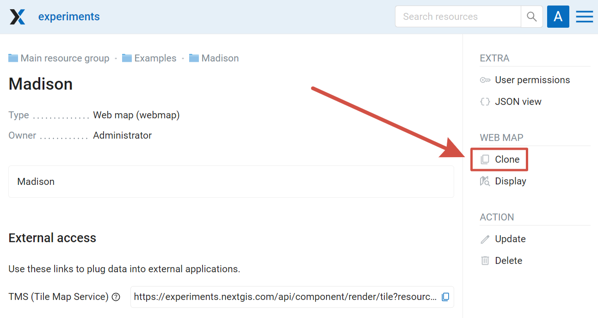
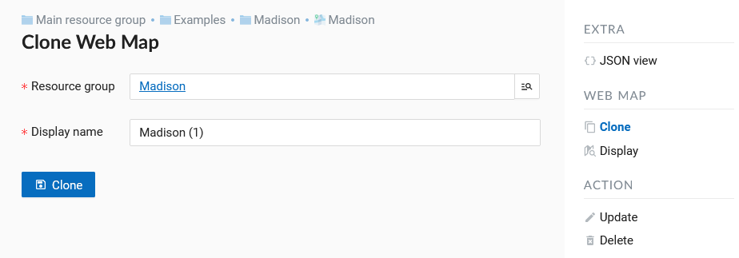
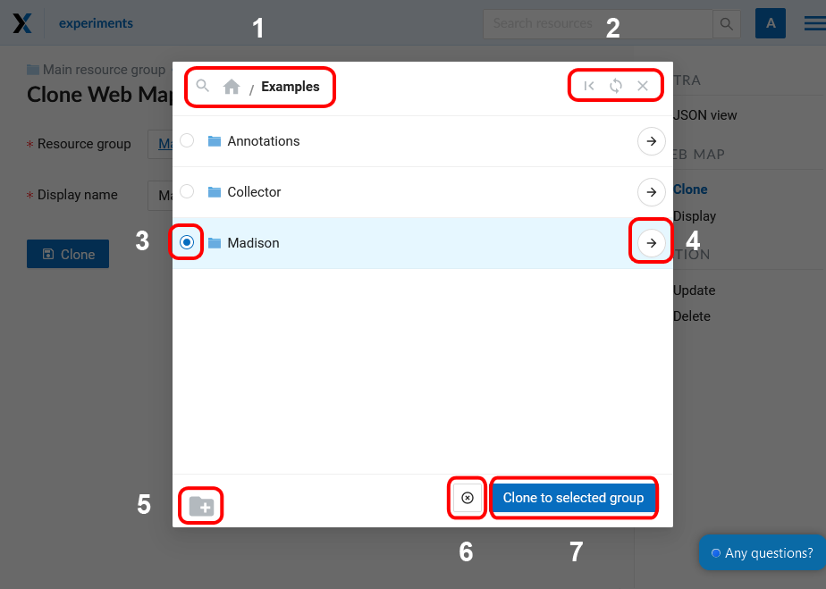
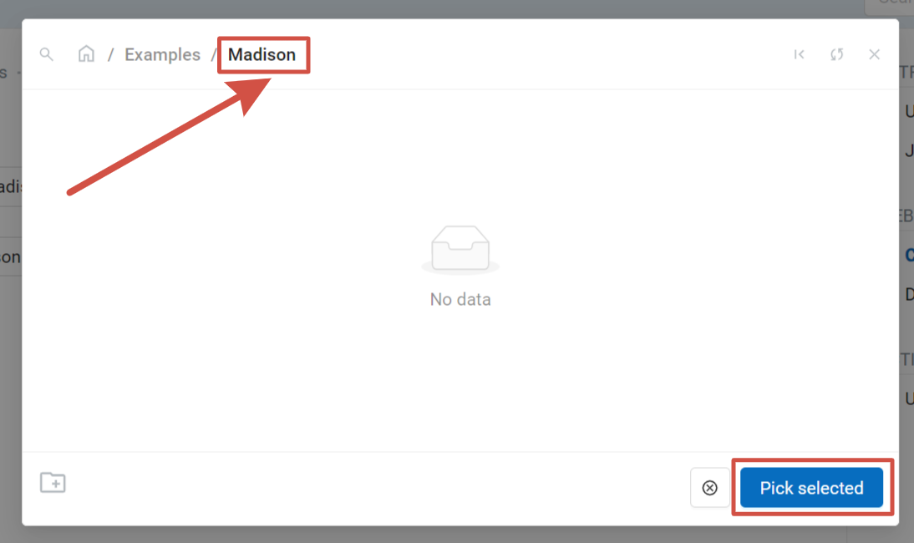
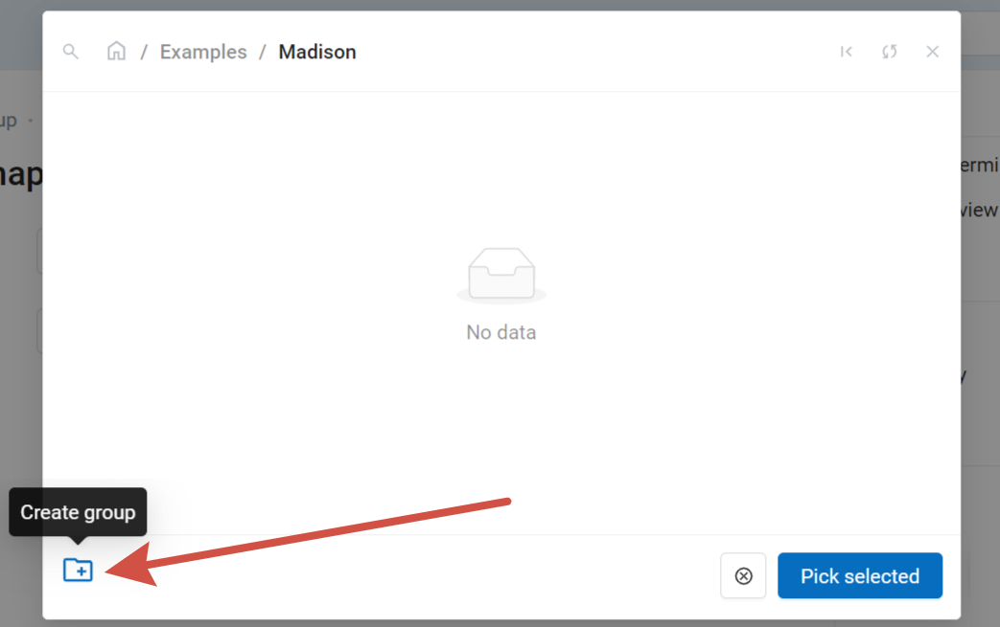
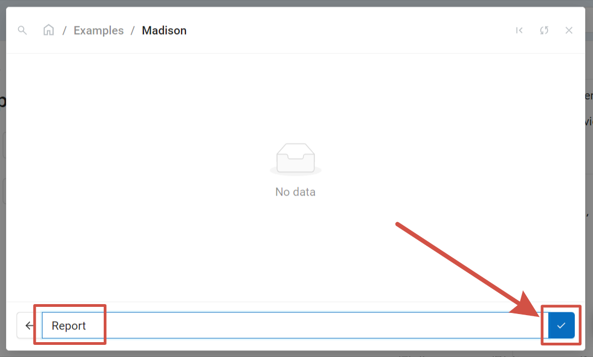

.. _ngw_map_clone:

Web Map Cloning
=======================

With NextGIS Web you can create a copy of an existing Web Map by cloning it. To copy a Web Map, select "Clone" in the actions pane of its resource page.

   Selecting "Clone" action

You will be redirected to "Clone Web Map" page to set up the location of the copy in the resource tree and the name for it.  

   
   "Clone Web Map" page

By default it's the name of the original Web Map with an added number, "(1)", "(2)" etc. By default a copy is created in the group containing the original Web Map.

If all the parameters are correct, press "Clone". A copy of the map will be created.
After the cloning process is completed successfully you will be redirected to "Update resource" page where you can change the settings of the newly created copy.

See the process of cloning a Web Map in our video:

.. raw:: html

   <iframe width="560" height="315" src="https://www.youtube.com/embed/Ra3rzjz3-LA?si=97AySE2dSDHFxXWy" title="YouTube video player" frameborder="0" allow="accelerometer; autoplay; clipboard-write; encrypted-media; gyroscope; picture-in-picture; web-share" referrerpolicy="strict-origin-when-cross-origin" allowfullscreen></iframe>

Watch on `youtube <https://youtu.be/Ra3rzjz3-LA?si=tpO0k-Zn9NCSop9K>`_.

If you wish to create a copy in a **different folder**, press the magnifying glass icon at the end of the "Resource group" field. See detailed description below.

.. _ngw_webmap_clone_select:

Clone to another group
------------------------------

A magnifying glass icon in the right end of the "Resource group" field opens the group selection pop-up window.

This window contains the following elements:

1. Search bar and path to the resource the copy will be created in
2. Return to the initial folder (the one containing the original Web Map) **|<**, refresh the resource tree state and close the window
3. Option button to select a group (folder)
4. Open the selected group (folder)
5. Create new resource group (folder)
6. Clear selection
7. Button that complets group selection. 

   
   Group selection window

If a group (folder) is selected, the button reads "Clone to selected group". If no group is selected, it reads "Clone to this folder", in this case the copy will be created in the group currently open (the path to it is indicated in the top panel of the pop-up window).

   
   A opened group in the group selection window

Use the second way to copy a Web Map to the main resource group (marked by a house icon in the path panel).

.. _ngw_webmap_clone_new:

Clone to a new group
--------------------------------------

If you need to create a new group, click on the folder icon with a plus in the bottom left corner of the pop-up window.

   
   Selecting "Create group" action
   
A field will appear where you need to enter the name for the new group. To confirm group creation click the blue button with a tick.

   
   Creating new group
   
The group witll appear in the list.
New group is created inside the group that is open in the window.
