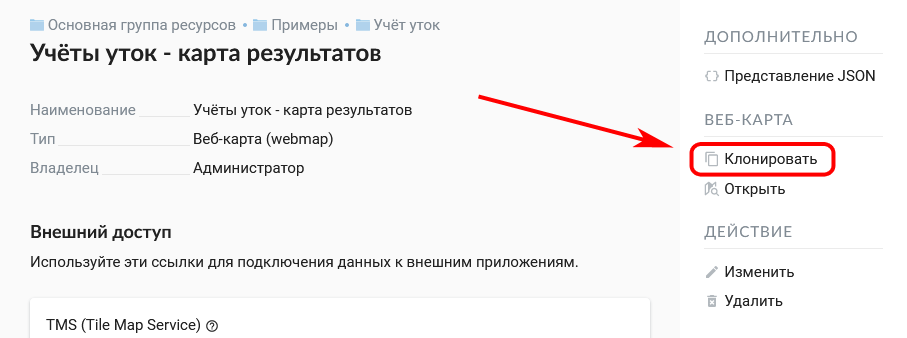
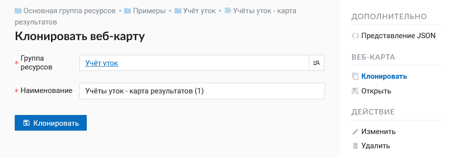
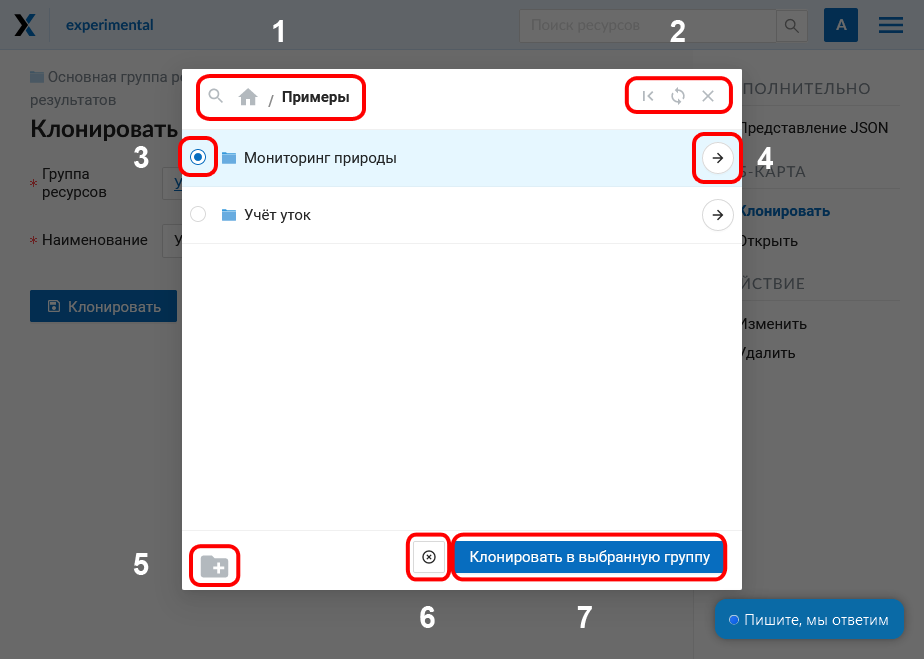
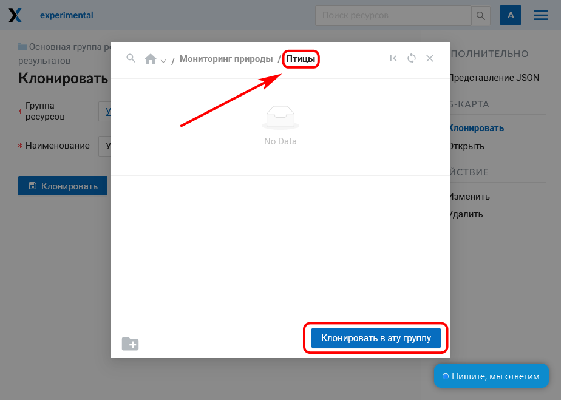
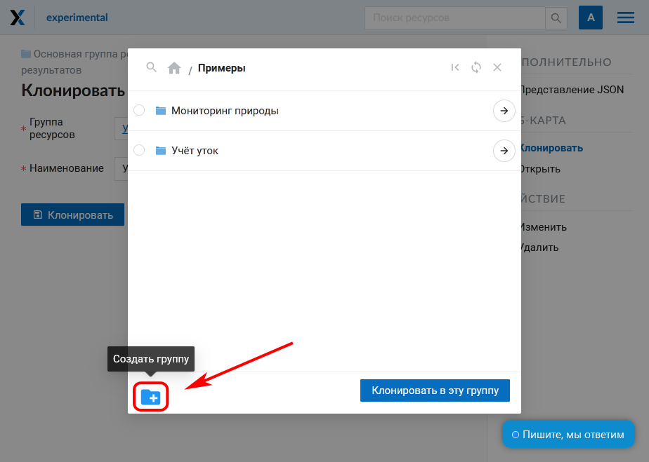
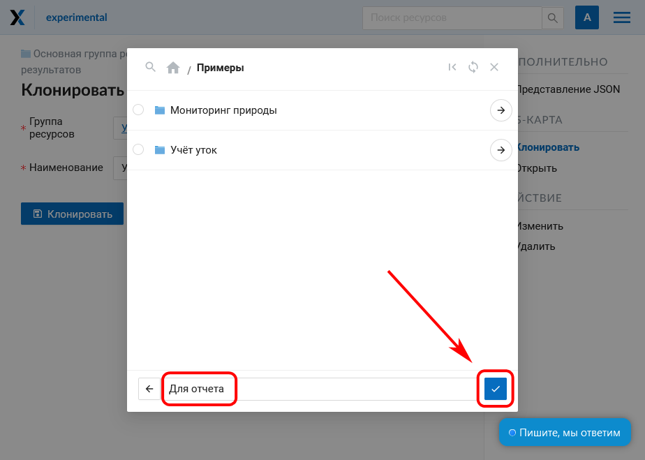

.. _ngw_map_clone:

Клонирование веб-карты
=======================

NextGIS Web позволяет создавать копию уже существующей веб-карты. Это действие выбирается на странице ресурса в панели справа.

   Выбор действия "Клонировать"

После этого пользователь перенаправляется на страницу “Клонирование веб-карты”. Здесь нужно указать расположение будущей копии в дереве ресурсов и ее название. 

   
   Страница "Клонирование веб-карты"

По умолчанию к названию исходной карты добавляется номер в скобках, “(1)”, “(2)” и т.д. Расположение по умолчанию - та же группа, где находится исходная карта.

Если все параметры вас устраивают, нажмите “Клонировать”. Копия карты будет создана.
После успешного завершения клонирования будет открыта страница “Обновить ресурс”, где вы можете изменить настройки только что созданной копии карты.

Если вы хотите создать копию в другой папке, нажмите на иконку с лупой в правом конце поля “Группа ресурсов”.

.. _ngw_webmap_clone_select:

Выбор группы для клонирования
------------------------------

Выбор группы ресурсов осуществляется через всплывающее окно, вызываемое кнопкой с лупой в правой части поля.

В этом окне доступны следующие элементы:

1. Панель поиска папок (групп ресурсов) и путь до ресурса, в который осуществляется клонирование;
2. Возврат к исходой папке (содержащей копируемую веб-карту) **|<**, обновление текущего состояния ресурсов и закрытие формы
3. Радиокнопка выбора группы (папки)
4. Переход к выбранной группе ресурсов (папке)
5. Создание новой группы ресурсов (папки)
6. Отмена выбора группы ресурсов (папки)
7. Кнопка, завершающая выбор расположения. 

   
   Окно выбора группы

Если одна из групп (папок) выбрана, имеет вид “Клонировать в выбраную группу”. Если выделения нет, имеет вид “Клонировать в эту группу” и копия будет создана в открытой группе, путь к которой указан в верхней панели окна.

   
   Открытая группа в окне выбора группы

Используйте второй способ, если нужно скопировать веб-карту в основную группу ресурсов (обозначена домиком в строке пути к папке).

.. _ngw_webmap_clone_new:

Создание новой группы для клонирования
--------------------------------------

Если нужно создать новую группу, нажмите на изображение папки со знаком “плюс” в левом нижнем углу всплывающего окна.

   
   Выбор действия "Создать группу"
   
Появится поле, в которое нужно ввести название новой группы. Для подтверждения создания группы нажмите синюю галочку справа.

   
   Создание новой группы
   
Созданная группа появится в списке.
Группа создаётся внутри той группы, которая отрыта в настоящий момент. 
