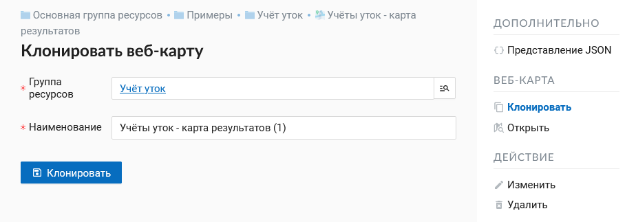
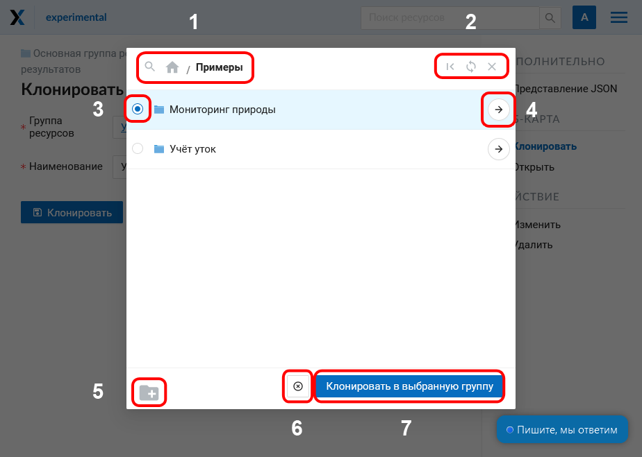

.. _ngw_map_clone:

Клонирование веб-карты
=======================

NextGIS Web позволяет создавать копию уже существующей веб-карты. Это действие выбирается на странице ресурса в панели справа.
После этого пользователь перенаправляется на страницу “Клонирование веб-карты”. Здесь нужно указать расположение будущей копии в дереве ресурсов и ее название.

   
   Страница "Клонирование веб-карты"

Выбор группы ресурсов осуществляется через всплывающее окно, вызываемое кнопкой с лупой в правой части поля.

В этом окне доступны следующие элементы:

1. Панель поиска папок (групп ресурсов) и путь до ресурса, в который осуществляется клонирование;
2. Возврат к исходой папке (содержащей копируемую веб-карту), обновление текущего состояния ресурсов и закрытие формы
3. Радиокнопка выбора группы (папки)
4. Переход к выбранной группе ресурсов (папке)
5. Создание новой группы ресурсов (папки)
6. Отмена выбора группы ресурсов (папки)
7. Кнопка, завершающая выбор расположения. Если одна из групп (папок) выбрана, имеет вид “Клонировать в выбраную группу”. Если выделения нет, имеет вид “Клонировать в эту группу” и копия будет создана в открытой группе, путь к которой указан в верхней панели окна.

   
   Окно выбора группы
