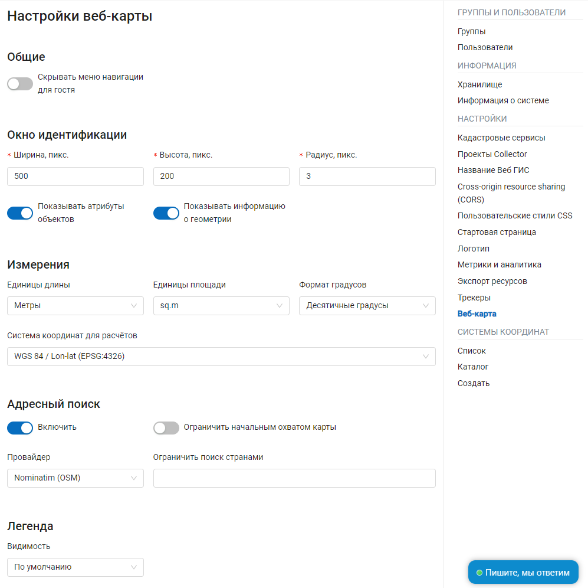
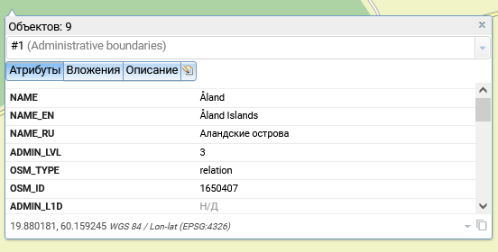

.. _ngw_contr_panel_webmap_settings:

Настройки веб-карты
====================

Через панель управления администратор может задать ряд общих настроек для всех веб-карт в NextGIS Web (:numref:`admin_webmap_panel_settings`):

* Видимость меню навигации для гостя
* Размер окна идентификации
* Параметры измерений
* Параметры адресного поиска
* Параметры видимости легенды

   Страница настроек веб-карты

.. _ngw_contr_panel_webmap_no_menu:

Видимость меню навигации
-------------------------

Вы можете скрыть переход к списку ресурсов для гостей, просматривающих веб-карту.

В панели управления вашей Веб ГИС в разделе Настройки веб-карты включите опцию *Скрывать меню навигации для гостя*.

.. figure:: _static/admin_webmap_no_menu_ru.png
   :name: admin_webmap_no_menu_pic
   :align: center
   :width: 17cm

   Веб-карта без кнопки главного меню навигации

.. _ngw_contr_panel_webmap_ident:

Окно идентификации
--------------------

Может быть в формате всплывающего окна или панели. Переключение между этими режимами осуществляется ползунком "Использовать панель вместо всплывающего окна для идентификаци".

Можно настроить следующие параметры:

* Радиус области вокруг объекта, в рамках которой индентификация работает.
* Включить показ информации о геометрии.
* Для всплывающего окна можно задать размеры. 

Размеры задаются в пикселях (:numref:`admin_webmap_panel_indentify`)

   Идентификация объекта на веб-карте

Одновременно с этим можно включить/выключить отображение атрибутов объектов слоя.

.. _ngw_contr_panel_webmap_measure:

Измерения
----------

В разделе задаются параметры, отвечающие за различные измерения на веб-карте (:numref:`admin_webmap_panel_settings`):

* Единицы измерения длин (в соответствии с выбранной СК)
* Единицы измерения площадей (в соответствии с выбранной СК)
* Формат градусов
* Система координат для расчета измерений

.. _ngw_contr_panel_webmap_search:

Адресный поиск
--------------

Адресный поиск в NextGIS Web осуществляется по двум базам адресов (провайдерам):

* OpenStreetMap - используется по-умолчанию
* Yandex Maps - внешний геокодер с использованием API ключа 

Параметры:

* "Включить" - результаты поиска на веб-картах будут включать не только атрибутивные данные, но и базу адресов, если найдутся совпадения
* "Ограничить охватом карты" - поиск будет произведен в пределах того охвата, который установлен в настройках веб-карты
* "Ограничить странами" - работает для провайдера OSM. Формат заполения - ru, de и т.д.
* "Ключ геокодера API Яндекс.Карт" - для провайдера Yandex Maps. Пользователь получает самостоятельно через https://developer.tech.yandex.ru

.. figure:: _static/admin_webmap_panel_search_rus.png
   :name: admin_webmap_panel_search
   :align: center
   :width: 30cm

   Настройки адресного поиска на веб-карте

.. figure:: _static/admin_webmap_search_bar_rus.png
   :name: admin_webmap_search_bar
   :align: center
   :width: 10cm

   Поиск по веб-карте

