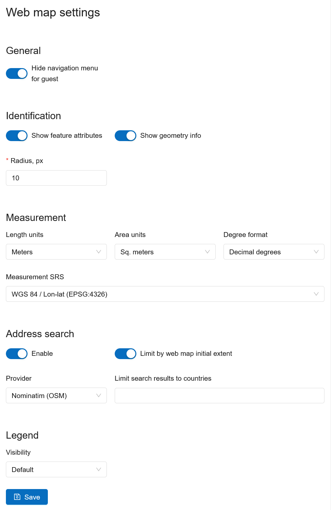
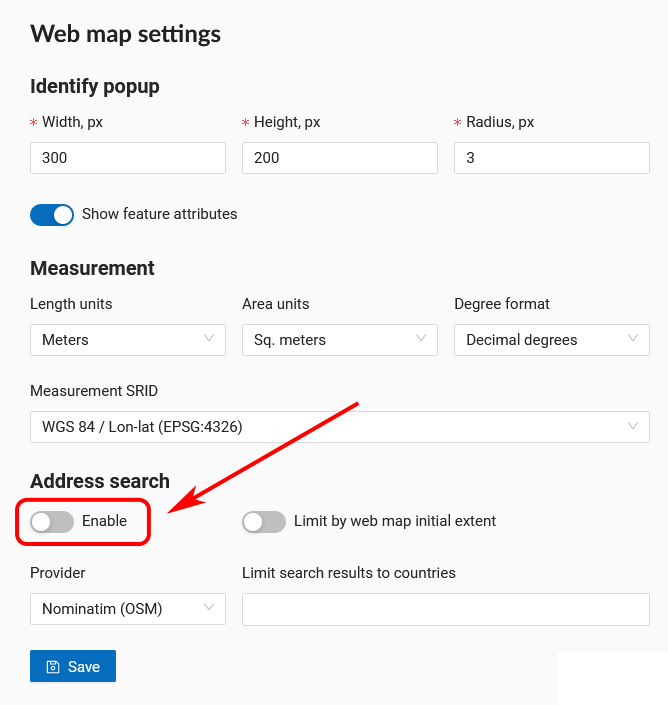
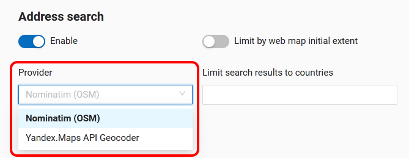
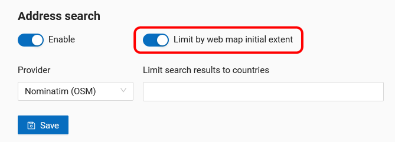
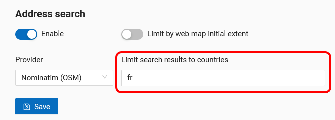

.. _ngw_contr_panel_webmap_settings:

Web Map Settings
===================

Using the control panel administrator can set a number of general settings for all Web Maps in NextGIS Web:

* Visibility of the navigation menu for guests;
* Identification popup parameters;
* Measurement units;
* Address search parameters;
* Legend visibility.

   Web Map Settings Page

.. _ngw_contr_panel_webmap_no_menu:

Navigation menu vizibility
-------------------------------

You can hide the navigation menu for guests. While veiwing your Web Maps, guests will not have access to the main dropdown menu in the top right corner that has link to the main resource group.

In the Control panel of your Web GIS go to the Web Map settings (:numref:`admin_webmap_panel_settings_pic`) and enable the option *Hide navigation menu for guest*.

.. figure:: _static/admin_webmap_no_menu_en.png
   :name: admin_webmap_no_menu_pic
   :align: center
   :width: 17cm

   Web Map without the navigation menu icon

.. _ngw_contr_panel_webmap_ident:

Identify panel
---------------

The section regulates the following parameters:

* The radius of the area around the object within which the identification works;
* Enabling or disabling geometry info;

.. figure:: _static/webmap_identification_eng_3.png
   :name: admin_webmap_panel_indentify_eng
   :align: center
   :width: 20cm

   Feature identification on the Web Map

.. _ngw_contr_panel_webmap_measure:

Measurements
------------

The section sets the parameters responsible for various measurements on the Web Map:

* Units of length measurement (according to the selected SRS)
* Units of measurement of areas (in accordance with the selected SRS)
* Degree format
* Coordinate system for calculating measurements

.. _ngw_contr_panel_webmap_search:

Address search
----------------

NextGIS Web address search is performed through one of the two data bases (providers):

* Nominatim (OpenStreetMap) - used by default
* Yandex.Maps - an external geocoder with API key

The following parameters can be set up:

* "Enable" - the search results on the Web Map will include not only the attribute data but also the address base if there are matches
* "Limit by Web Map initial extent" - the search will be performed within the extent set in the Web Map settings
* "Provider" - defines the geocoder used for address search. OpenStreetMap by default, can be changed to Yandex.Maps
* "Limit search results to countries" - while using OSM, if a country code is specified (de, fr, gb etc), the search results will only include matches from the selected country's territory
* "Yandex.Maps API Geocoder Key" - when Yandex.Maps is selected as provider, this is the field to enter the API key. Users obtain the keys independently by signing up on https://developer.tech.yandex.ru.

.. figure:: _static/adress_search_yandex_API_en.png
   :name: adress_search_yandex_API_pic
   :align: center
   :width: 16cm
   
   Address search settings for Web Map

.. figure:: _static/admin_webmap_search_bar_eng.png
   :name: admin_webmap_search_bar
   :align: center
   :width: 10cm

   Web Map search

.. ngw_address_search_disable:

Disabling address search
~~~~~~~~~~~~~~~~~~~~~~~~~

Address search can be turned off. In that case the search will only be performed in the feature attributes of the layers added to the Web Map (except the basemap).
From the control panel go to `Web Map settings <https://docs.nextgis.com/docs_ngweb/source/admin_tasks.html#web-map-settings>`_. Set the toggle of the "Address search" section to the off position.

   
   Address search disabled

.. ngw_address_search_provider:

Selecting search provider
~~~~~~~~~~~~~~~~~~~~~~~~~

NextGIS Web can use one of the two data bases for searching: Nominatim of OpenStreetMap or Yandex.Maps API Geocoder 
By default the OSM search is used.
To select a provider, go to control panel and open `Web Map settings <https://docs.nextgis.com/docs_ngweb/source/admin_tasks.html#web-map-settings>`_. In the "Address search" section use the dropdown menu of the "Provider" field to select the desired geocoder.

   
   Selecting address search provider

To use Yandex.Maps enter your API key in the field on the right. API keys can be obtained by users signed up on https://developer.tech.yandex.ru.

.. figure:: _static/adress_search_yandex_API_en.png
   :name: adress_search_yandex_API_key_pic
   :align: center
   :width: 16cm
   
   Entering API key to use Yandex.Maps

.. ngw_address_search_area:

Limit search area
~~~~~~~~~~~~~~~~~~

You can limit the search area to the Web Map's initial extent.
From the control panel go to `Web Map settings <https://docs.nextgis.com/docs_ngweb/source/admin_tasks.html#web-map-settings>`_. Set the toggle of the "Limit by Web Map initial extent" to the on position.

   
   Search limited to the initial extent of the Web Map

While using OSM, you can also limit the search to a particular country. In the field "Limit search results to countries" enter the code of the country using the ISO of the OSM data base: de, gb, fi etc. To find out the code, use the search on https://www.openstreetmap.org.

   
   Search limited to the territory of France

