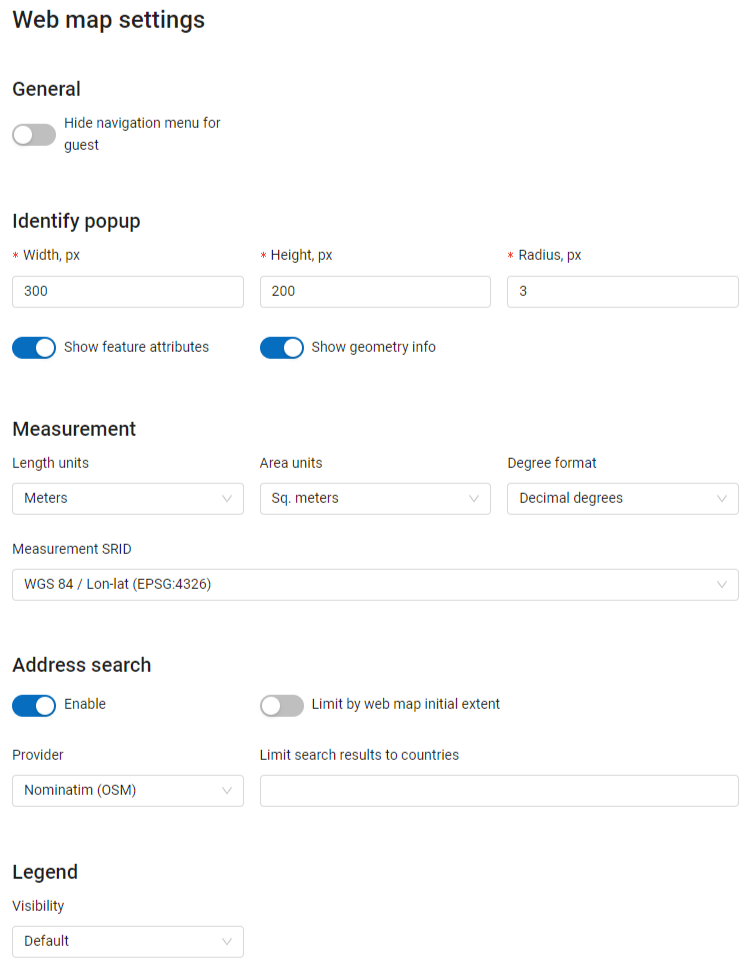
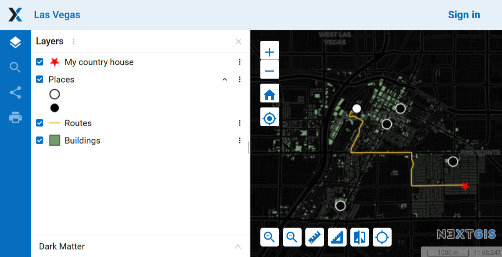
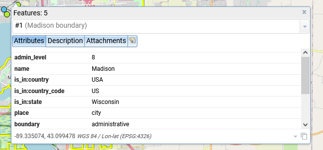
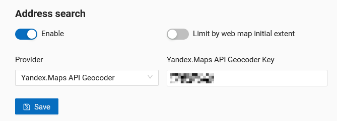
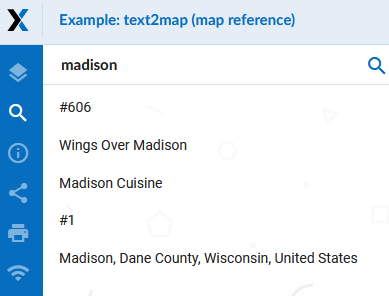

.. _ngw_contr_panel_webmap_settings:

Web Map Settings
===================

Using the control panel administrator can set a number of general settings for all Web Maps in NextGIS Web:

* Visibility of the navigation menu for guests;
* Identification popup parameters;
* Measurement units;
* Address search parameters;
* Legend visibility.

   Web Map Settings Page

.. _ngw_contr_panel_webmap_no_menu:

Navigation menu vizibility
~~~~~~~~~~~~~~~~~~~~~~~~~~~~

You can hide the navigation menu for guests. While veiwing your Web Maps, guests will not have access to the main dropdown menu in the top right corner that has link to the main resource group.

In the Control panel of your Web GIS go to the Web Map settings (:numref:`admin_webmap_panel_settings_pic`) and enable the option *Hide navigation menu for guest*.

   Web Map without the navigation menu icon

.. _ngw_contr_panel_webmap_ident:

Identify popup
~~~~~~~~~~~~~~~

Feature identification information can be displayed as a pop-up window or as a side panel. To select a display mode, move the switch marked "Use panel instead of popup identification".

The section regulates the following parameters:

* The radius of the area around the object within which the identification works;
* Enabling or disabling geometry info;
* For the pop-up window you can also set up the dimentions;

Dimensions are in pixels.

   Object identification on the Web Map

At the same time you can turn on/off the display of feature attributes.

.. _ngw_contr_panel_webmap_measure:

Measurement
~~~~~~~~~~~

The section sets the parameters responsible for various measurements on the Web Map:

* Units of length measurement (according to the selected SRS)
* Units of measurement of areas (in accordance with the selected SRS)
* Degree format
* Coordinate system for calculating measurements

.. _ngw_contr_panel_webmap_search:

Address search
~~~~~~~~~~~~~~

NextGIS Web address search is performed through one of the two data bases (providers):

* Nominatim (OpenStreetMap) - used by default
* Yandex.Maps - an external geocoder with API key

The following parameters can be set up:

* "Enable" - the search results on the Web Map will include not only the attribute data but also the address base if there are matches
* "Limit by Web Map initial extent" - the search will be performed within the extent set in the Web Map settings
* "Provider" - defines the geocoder used for address search. OpenStreetMap by default, can be changed to Yandex.Maps
* "Limit search results to countries" - while using OSM, if a country code is specified (de, fr, gb etc), the search results will only include matches from the selected country's territory
* "Yandex.Maps API Geocoder Key" - when Yandex.Maps is selected as provider, this is the field to enter the API key. Users obtain the keys independently by signing up on https://developer.tech.yandex.ru.

   
   Address search settings for Web Map

   Web Map search
