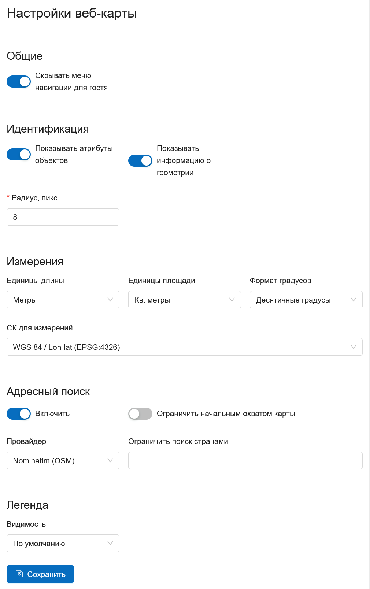
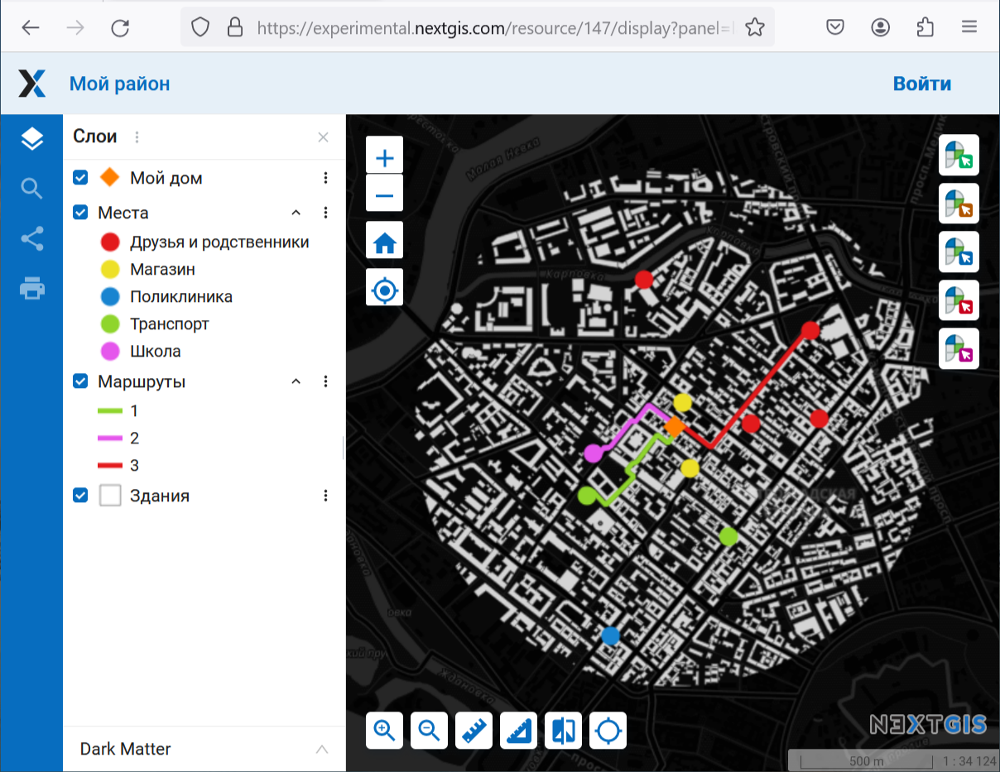
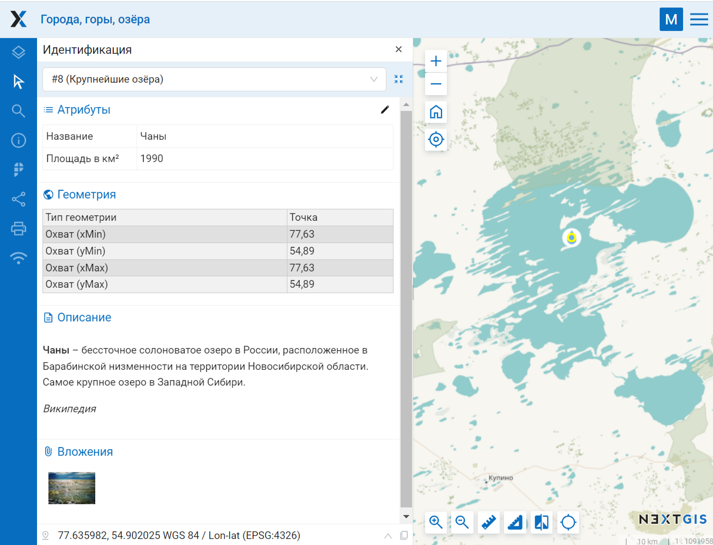
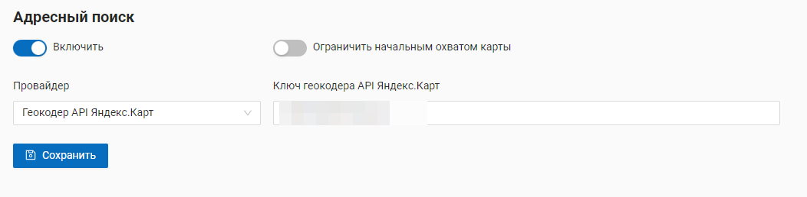
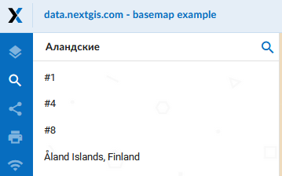
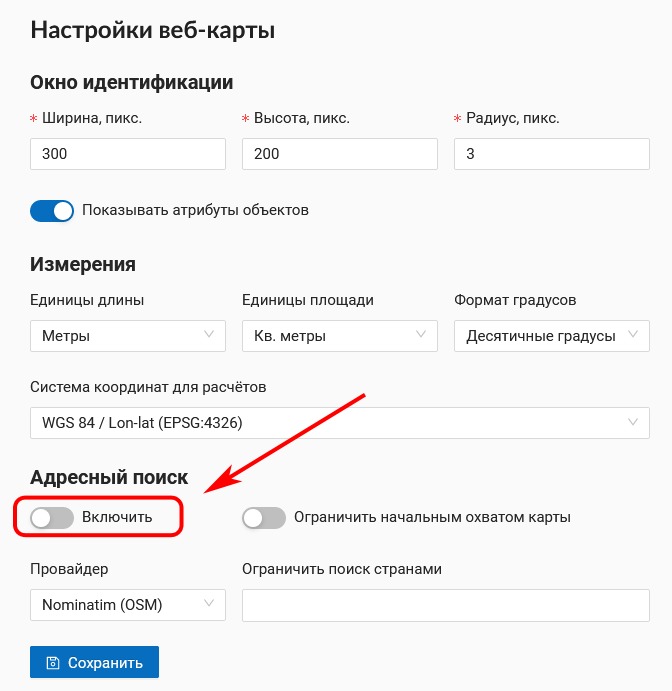
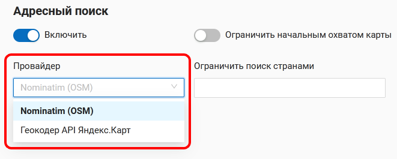
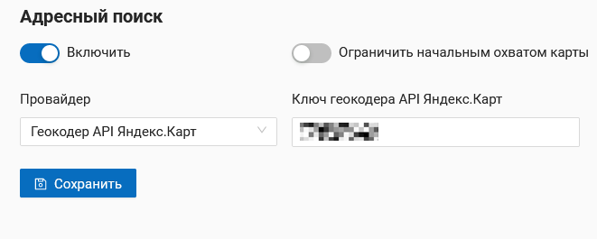
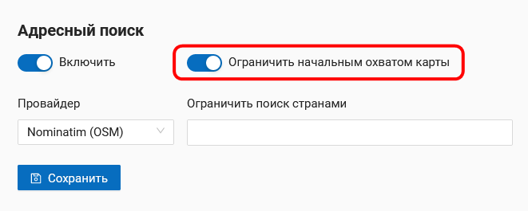
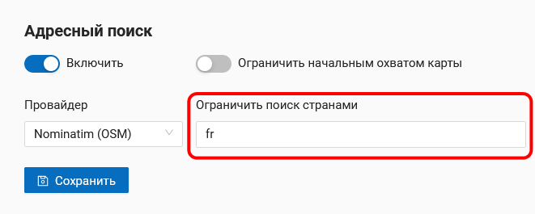

.. _ngw_contr_panel_webmap_settings:

Настройки веб-карт
====================

Через панель управления администратор может задать ряд общих настроек для всех веб-карт в NextGIS Web (:numref:`admin_webmap_panel_settings`):

* Видимость меню навигации для гостя
* Параметры измерений
* Параметры адресного поиска
* Параметры видимости легенды

   Страница настроек веб-карты

.. _ngw_contr_panel_webmap_no_menu:

Видимость меню навигации
-------------------------

Вы можете скрыть переход к списку ресурсов для гостей, просматривающих веб-карту.

В панели управления вашей Веб ГИС в разделе Настройки веб-карты включите опцию *Скрывать меню навигации для гостя*.

   Веб-карта без кнопки главного меню навигации

.. _ngw_contr_panel_webmap_ident:

Панель идентификации
--------------------

Можно настроить следующие параметры:

* Радиус области вокруг объекта, в рамках которой индентификация работает.
* Включить показ атрибутов.
* Включить показ информации о геометрии.

   Идентификация объекта на веб-карте

.. _ngw_contr_panel_webmap_measure:

Измерения
----------

В разделе задаются параметры, отвечающие за различные измерения на веб-карте (:numref:`admin_webmap_panel_settings`):

* Единицы измерения длин (в соответствии с выбранной СК)
* Единицы измерения площадей (в соответствии с выбранной СК)
* Формат градусов
* Система координат для расчета измерений

.. _ngw_contr_panel_webmap_search:

Адресный поиск
--------------

Адресный поиск в NextGIS Web осуществляется по двум базам адресов (провайдерам):

* OpenStreetMap - используется по-умолчанию
* Yandex Maps - внешний геокодер с использованием API ключа 

Параметры:

* "Включить" - результаты поиска на веб-картах будут включать не только атрибутивные данные, но и базу адресов, если найдутся совпадения
* "Ограничить охватом карты" - поиск будет произведен в пределах того охвата, который установлен в настройках веб-карты
* "Ограничить странами" - работает для провайдера OSM. Формат заполения - ru, de и т.д.
* "Ключ геокодера API Яндекс.Карт" - для провайдера Yandex Maps. Пользователь получает самостоятельно через https://developer.tech.yandex.ru

   Настройки адресного поиска на веб-карте

   Поиск по веб-карте

.. ngw_address_search_disable:

Отключение адресного поиска
~~~~~~~~~~~~~~~~~~~~~~~~~~~

Адресный поиск можно отключить. Тогда поиск будет осуществляться только по атрибутивной информации добавленных на карту слоёв (не считая подложки).
Через панель управления перейдите в `настройки веб-карты <https://docs.nextgis.com/docs_ngweb/source/admin_tasks.html#web-map-settings>`_ и передвиньте ползунок в пункте «Адресный поиск» в выключенное состояние.

   
   Адресный поиск отключен

.. ngw_address_search_provider:

Выбор провайдера для поиска
~~~~~~~~~~~~~~~~~~~~~~~~~~~~~

NextGIS Web может производить поиск, используя одну из двух баз данных: Nominatim OpenStreetMap или Геокодер API Яндекс.Карт. 
По умолчанию на веб-карте подключен поиск OSM.
Для того, чтобы выбрать провайдера, через панель управления перейдите в `настройки веб-карты <https://docs.nextgis.com/docs_ngweb/source/admin_tasks.html#web-map-settings>`_. В разделе «Адресный поиск» в пункте «Провайдер» выберете необходимый геокодер в выпадающем меню.

   
   Выбор провайдера для адресного поиска

Для провайдера Яндекс.Карты необходимо ввести Ключ API в поле справа. Пользователь получает ключ самостоятельно через https://developer.tech.yandex.ru.

   
   Введение ключа API для использования базы данных Яндекс.Карт

.. ngw_address_search_area:

Ограничение зоны поиска
~~~~~~~~~~~~~~~~~~~~~~~~

Можно ограничить зону поиска начальным охватом веб-карты.
Через панель управления перейдите в `настройки веб-карты <https://docs.nextgis.com/docs_ngweb/source/admin_tasks.html#web-map-settings>`_  и передвиньте ползунок в пункте "Ограничить начальным охватом карты" во включенное состояние.

   
   Поиск ограничен начальным охватом веб-карты

При использовании OSM можно ограничить поиск территорией определенной страны. Для этого в поле «Ограничить поиск странами» введите код страны в формате ru, gb, de и т.п. в соответствии с ISO базы OSM (можно проверить на сайте https://www.openstreetmap.org, введя в строку поиска название страны).

   
   Поиск ограничен территорией Франции

