.. sectionauthor:: Artem Svetlov <artem.svetlov@nextgis.ru>

.. _ngw_webmaps_admin:

How to administrate Web Maps
============================

There could be several Web Maps in NextGIS Web. For example one map is for work, another is for public access and third is for testing of layer styles.

Each Web Map has its own URL address. Different access permissions for Web Map viewing can be set for users and groups. 

Web Map displays layers. They can be turned on or off by the user. You can set the order of the layers, default layer visibility and create layer groups. Groups on a map do not relate to resource groups in the Control Panel. There is no option to transfer layers between groups. Groups may be nested.

.. _ngw_map_create:
    
Creating a Web Map
---------------------

To create a Web Map, open the resource group where you want to add it, then in the actions pane “Create resource” select “Web Map”. (see :numref:`ngweb_admin_layers_create_webmap`). 

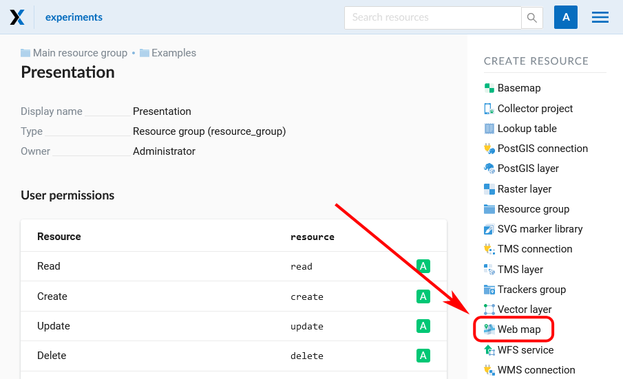

   Selection of “Web Map” action 
   
Create resource dialog for a Web Map will open, see :numref:`admin_webmap_name`. 

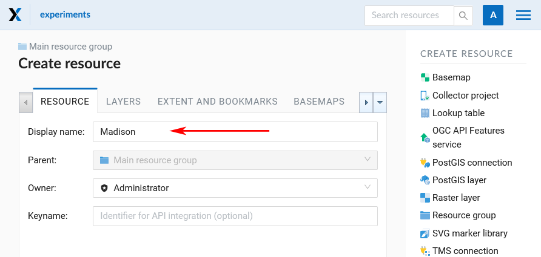

   “Create resource” dialog for Web Map

Enter Web Map display name that will be visible in the administrator interface and in the Web Map viewer.

“Keyname” field is optional.

You can also add resource description and metadata on the corresponding tabs.

.. _ngw_map_layers:

Web Map Layers
~~~~~~~~~~~~~~

In the “Layers” tab you can add, group or remove layers and change their order using the buttons “Add layer”, “Add group”, "Customize draw order" and "Delete layer" (X at the end of each row). 

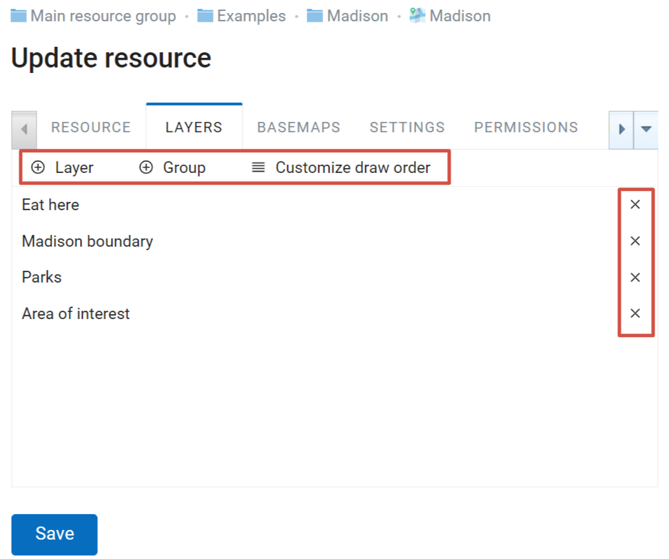

   "Layers" tab

To view the data of the layer on a map, you need to create at least one layer style. More on creating styles for different layer types :ref:`here <ngcom_styles>`. 

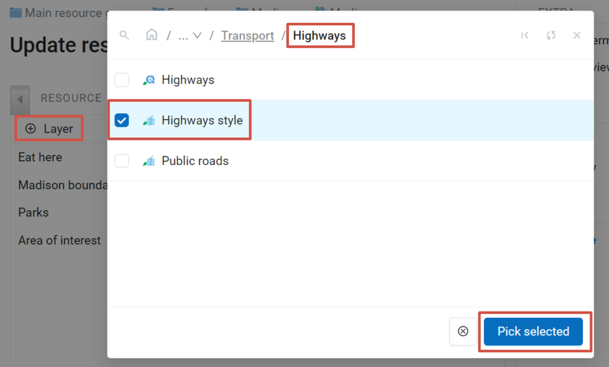
   
   Using style to add a layer to the Web Map

Layers of a particular map have several settings, see :numref:`admin_webmap_create_layers`.

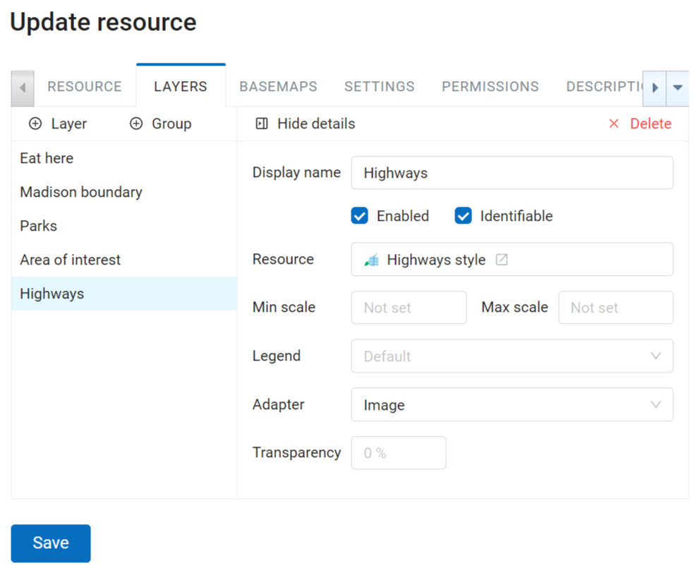
   
   Layer settings
 
"Enabled" checkbox sets default visibility of a layer.

The “Transparency” field sets the layer transparency on a map between 0% (opaque) and 100% (completely transparent). 

We recommend setting the "Adapter" field to "Image" (a single image for the entire map), unless there are some special requirements. Alternatively, you can choose “Tiles” (images of 256 x 256 pixels).

You can also set up a scale range. Min scale corresponds to the smaller image, max scale - to the larger, more detailed image. For example, if you want a layer to be displayed in scales between 1 : 250,000 and 1 : 5,000, the higher number (250,000) is the minimal scale.
   
.. note:: 
   Max and min scale can be set not only using the Web Map’s Layers tab, but also in the layer style itself (See an `example <https://docs.nextgis.com/docs_ngweb/source/mapstyles.html#osm-water-line>`_). If the layer should not be displayed in a certain range of scales, we recommend to mark it in the Web Map’s layer settings. If the scale limit is only set within the style, empty tiles will be generated in other scales, which is less efficient.

To go back to the layer list, press **Hide details**.

The order of the layers on a map can be different from the order in which they appear in the tree. Click "Customize draw order" in the "Layers" tab of the map settings. It allows to choose the order of the displayed layers without affecting the groups.

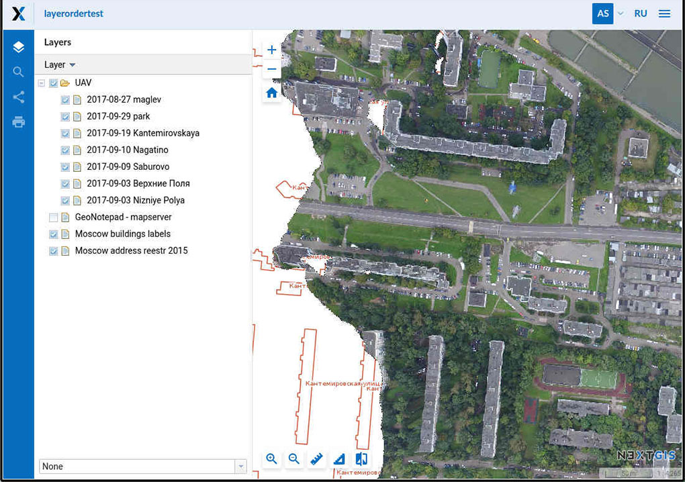
   
   Layer order as is: satellite images obscure the layer where the buildings are marked

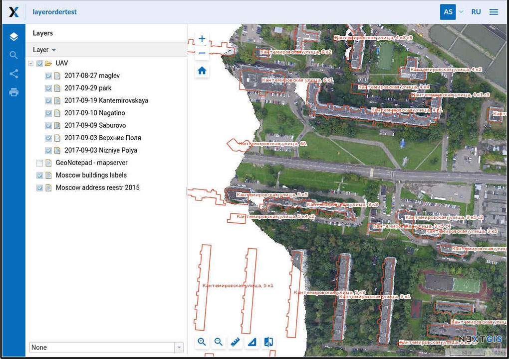
   
   Different layer arrangement: the layer marking the buildings is above the satellite images, while the layer groups on the left remain unchanged

To go back to the list of layers, press **Back to layers and groups**. To restore the initial layer order, press **Use default draw order**. 

Press **Save** to save the changes.

.. _ngw_map_basemaps:

Basemaps
~~~~~~~~~

"Basemaps" tab allows to add and remove basemaps using corresponding buttons "Add" and "Remove" (see :numref:`admin_webmap_basemaps`). 

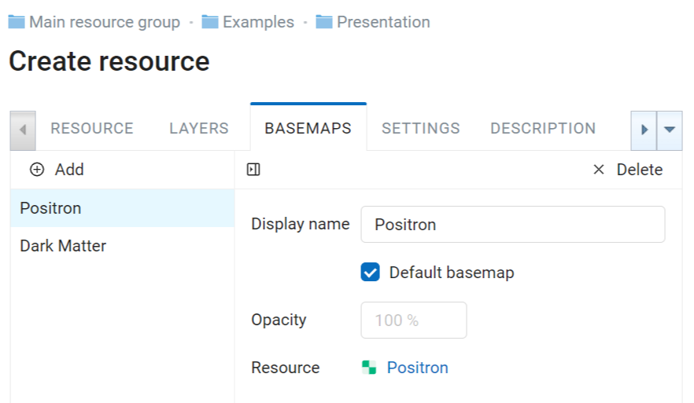

   “Basemaps” tab

If “Default basemap” is checked, this basemap will be visible when the Web Map is opened.

"Opacity" field sets basemap transparency on a map in a range between 0 and 100%.

.. _ngw_map_no_base:

Web Map with no basemap
~~~~~~~~~~~~~~~~~~~~~~~

By default a Web Map is created with OpenStreetMap basemap. If you need a map without a basemap: 
create a new basemap and add it to your Web Map. Then turn this newly created basemap off.

.. _ngw_map_settings:

Settings
~~~~~~~~~

In the "Settings" tab you can modify several parameters:

* legend visibility (more `here <https://docs.nextgis.com/docs_ngcom/source/legend.html>`_);
* enable annotations (more on annotations see :ref:`here <ngcom_annotation>`);
* select measurement spacial reference system;
* allow layer editing;
* set up initial and constraining extent (see below);
* select bookmark resource.

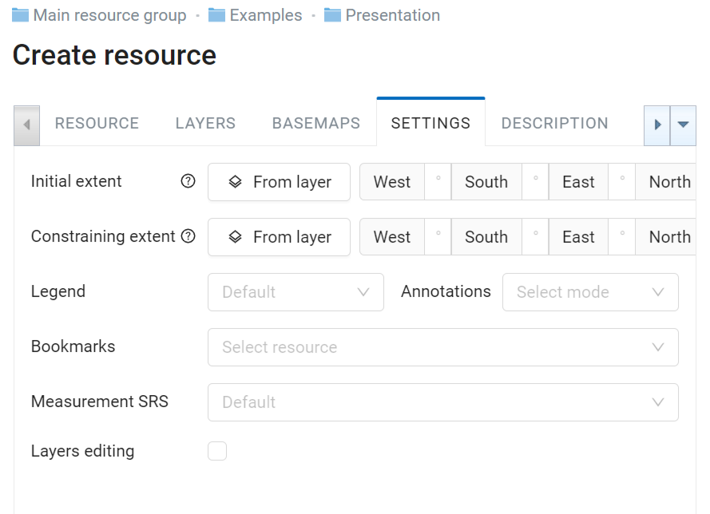
   
   "Settings" tab

.. _ngw_map_extent:

Extent
~~~~~~

Switch from “Resource” tab to “Extent and bookmarks” tab, presented on :numref:`admin_webmap_bbox`.

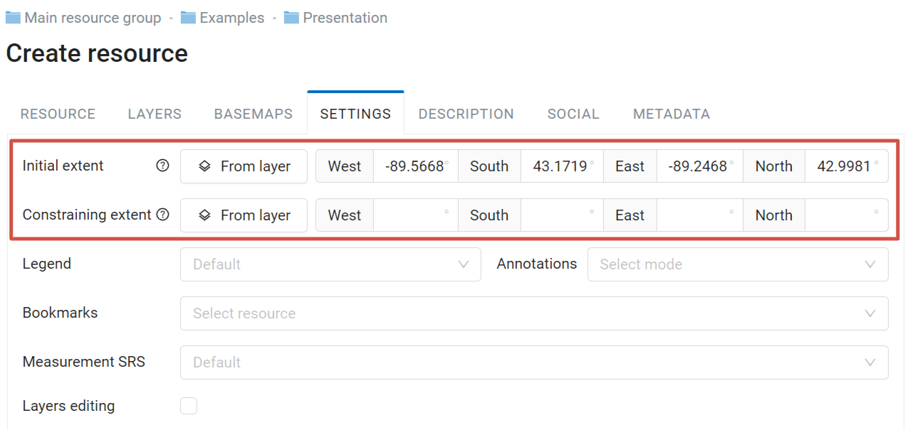

   Extent settings

In this tab you can set up:

* Initial extent - part of the Web Map that is shown upon its opening
* Constraining extent - users will not be able to zoom out or scroll past this extent

Use the four fields to set the extent measured in degrees.

**Extent from layer** button allows to set Web Map extent from the layer's extent. Click it to open the “Select layer” window, where you can select a layer to use for setting the Web Map extent (see :numref:`ngw_select_resource2`). The four fields for the extent coordinates will be filled in. 

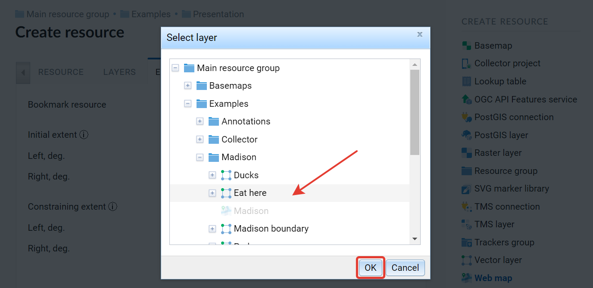

   “Select layer” window

.. tip::
   Extent coordinates could be generated using third-party services, for example http://boundingbox.klokantech.com/ (select csv in a list).

.. _ngw_map_bookmarks:

Bookmarks
~~~~~~~~~

In the “Bookmark resource” field you can select a vector layer with any type of geometry to use for bookmarks.  The Web Map will show bookmarks panel (see :numref:`ngw_bookmarks`) with names defined by “Label attribute” if it is set (see :numref:`bookmark_attribute`).

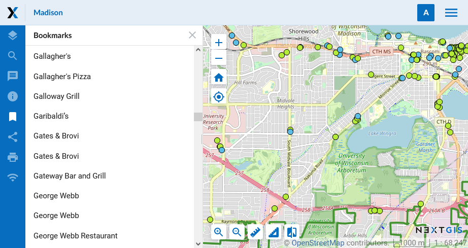
   
   "Bookmarks" tab and the bookmarks viewed on the map

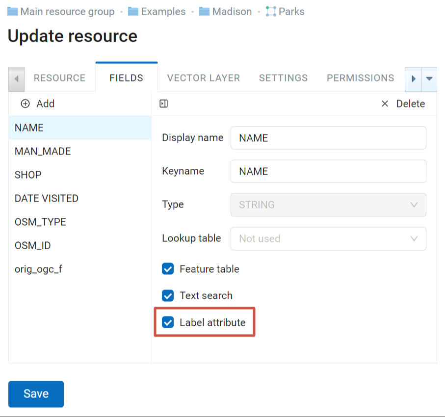
   
   Setting attributes for the vector layer containing boundaries

.. _ngw_map_socials:

Social
~~~~~~~

The "Social" tab is used to upload an image to be used as preview in social media.

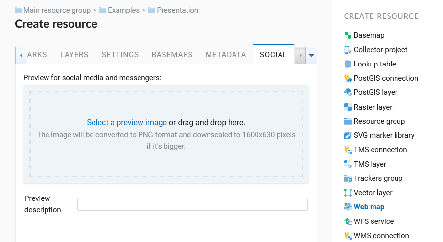
   
   "Social" tab

.. _ngw_map_save:

Final steps
~~~~~~~~~~~

After creating the map content and adjusting settings for all the layers, click "Save" button. A saved map will be shown in the list of maps. 
Click an icon with a map in the list of Web Maps or select "Display" action in the tab on the Web Map properties page to open it in the viewer. While the Web Map resource page is open, you can also open the map by clicking the "View" button on the right. Web Maps viewer is described :ref:`here <ngw_webmaps_client>`.
A Web Map URL displayed in the viewer may be shared with other users because it is static. 

.. warning::  
   After a map is deleted, its URL will no longer be available.

.. _ngw_map_clone:

Web Map Cloning
----------------------

With NextGIS Web you can create a copy of an existing Web Map by cloning it. To copy a Web Map, select "Clone" in the actions pane of its resource page.
You will be redirected to "Clone Web Map" page to set up the location of the copy in the resource tree and the name for it. 

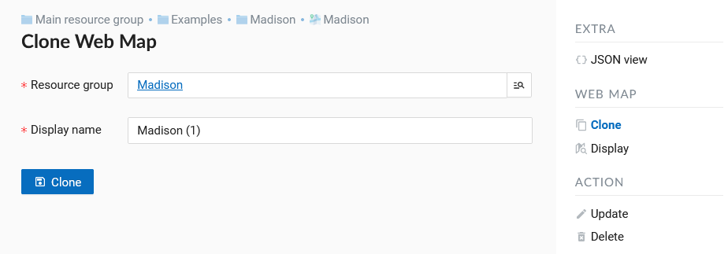
   
   "Clone Web Map" page

A magnifying glass icon in the right end of the "Resource group" field opens the group selection pop-up window.

This window contains the following elements:

1. Search bar and path to the resource the copy will be created in
2. Return to the initial folder (the one containing the original Web Map), refresh the resource tree state and close the window
3. Option button to select a group (folder)
4. Open the selected group (folder)
5. Create new resource group (folder)
6. Clear selection
7. Button that complets group selection. If a group (folder) is selected, the button reads "Clone to selected group". If no group is selected, it reads "Clone to this folder", in this case the copy will be created in the group currently open (the path to it is indicated in the top panel of the pop-up window).

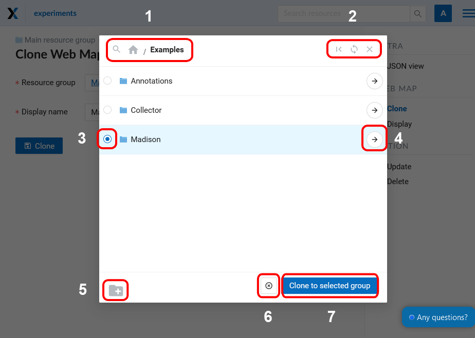
   
   Group selection window
