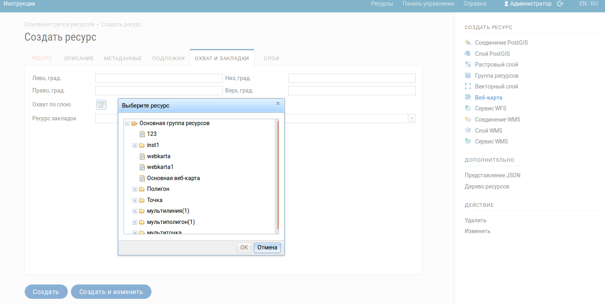

.. sectionauthor:: Артём Светлов <artem.svetlov@nextgis.ru>

.. _ngw_webmaps_admin:

Администрирование веб-карты
===========================

В NextGIS Web может быть несколько отдельных веб-карт. Например, одна может быть 
рабочей, вторая – для общего доступа, третья –  тестовая для настройки слоев.

У разных веб-карт разные URL-адреса. Для разных пользователей и групп пользователей 
можно задавать права для просмотра разных веб-карт. 

На карте показываются слои. Пользователь может их включать и выключать. В настройках 
можно задавать порядок следования слоев, определять, какие слои будут показываться 
сразу же при открытии карты, и раскладывать слои по группам. Группы слоев на карте 
никак не связаны с группами слоев в панели управления. Переносить слои между группами 
нельзя. Группы могут быть вложенными.

.. _ngw_map_create:
    
Добавление веб-карты
--------------------

Для добавления веб-карты перейдите в группу, где необходимо её создать. В блоке операций 
выберите ``Добавить --> Веб-карта``. Откроется окно, представленное 
на :numref:`ngweb_admin_webmap_name`. 

.. figure:: _static/admin_webmap_name.png
   :name: ngweb_admin_webmap_name
   :align: center
   :width: 16cm

   Окно создания веб-карты.

Введите наименование веб-карты, которое будет отображаться в административном интерфейсе, а также в дереве слоев карт.
Поля ``Ключ`` и ``Описание`` являются необязательными параметрами.

Переключитесь с вкладки "Ресурс" на вкладку "Охват и закладки". 
Откроется окно, представленное на :numref:`ngweb_admin_webmap_bbox`.

.. figure:: _static/admin_webmap_bbox.png
   :name: ngweb_admin_webmap_bbox
   :align: center
   :width: 16cm

   Окно ввода охвата.

Задайте охват, заполнив четыре строки. Охват измеряется в градусах. 

Вкладка "Охват по слою" позволяет установить охват веб-карты по охвату выбранного слоя. 
Напротив этой вкладки имеется значок в виде папки с плюсом. Если нажать 
на этот значок, то откроется окно "Выбрать ресурс" с деревом слоев, из которого можно 
выбрать слой, по которому будет установлен охват веб-карты, :numref:`ngw_select_resource2` 
(будут заполнены четыре строки с координатами охвата):

   Окно Выбрать ресурс.

.. tip:: 
   Координаты охвата вы можете сгенерировать на сторонних веб-сайтах http://boundingbox.klokantech.com/ (выберите в списке csv), http://lxbarth.com/bbox.

В поле ``Слой закладок`` можно указать векторный слой. Тогда в клиенте появится выпадающее 
меню с закладками, названия которых будут браться в соответствии с установленным 
полем ``Атрибут наименования``. 

Теперь необходимо перейти на вкладку "Дерево слоев". На этой вкладке можно 
добавлять слои и объединять их в группы, для чего предусмотрены соответствующие 
кнопки "Добавить слой" и "Добавить группу".

При добавлении слоя задаётся его стиль. Стиль привязан к конкретному слою, поэтому 
вы не найдете пункта "Стиль" в основном списке ресурсов. Для создания стиля необходимо 
сначала зайти в ресурс слоя. В окне действий можно выбрать "Стиль MapServer" или "Стиль QGIS". 
При этом откроется окно, в котором можно импортировать стиль из QGIS в формате QML 
или ввести его вручную (см. :numref:`ngweb_layer_properties_window_pic`). 

Настройки слоев на веб-карте представлены на :numref:`ngweb_admin_webmap_layers`.

.. figure:: _static/admin_webmap_layers.png
   :name: ngweb_admin_webmap_layers
   :align: center
   :width: 16cm
   
   Настройки слоев на веб-карте.
 
Поле ``Включить`` обозначает, что при открытии страницы карты этот слой 
будет по умолчанию отображаться.

Поле ``Прозрачность`` обозначает степень просвечивания слоя на карте. 
Прозрачность каждого слоя может быть настроена от 0 до 100 процентов. Слой со степенью 
непрозрачности 1 % является практически прозрачным. Совершенно непрозрачный слой 
имеет степень непрозрачности 100 %.

Поле ``Адаптер`` рекомендуется выставить в "Тайлы", изображения 
размером 256 x 256 пикселов, если нет каких-либо особых требований. Вторым вариантом 
из выпадающего меню в поле ``Адаптер`` можно выбрать "Изображение", 
изображение отрисовывается в виде единой картинки на всю карту. 

В полях ``Масштаб`` следует указать масштаб в формате, например "1 : 10 000".

Минимальный и максимальный масштаб можно указывать в стиле слоя и в настройках 
слоя. Если весь слой не надо показывать на каком-то диапазоне масштабов, то это 
лучше задать в свойствах слоя, а не в стиле.
   
.. note:: 
   Если же выставить ограничение масштаба только в стиле, то в том диапазоне 
   масштабов будут отдаваться пустые тайлы, что неэффективно.

После создания контента карты и настройки всех слоев следует нажать кнопку 
"Сохранить". После сохранения созданная карта появится в списке карт. 
В списке веб-карт, при нажатии на икнку в виде карты - веб-карта будет 
открыта в веб-клиенте (если зайти внутрь ресурса веб-карты, то пункт действий "Просмотр" также откроет веб-карту). 
Веб-клиент подробнее рассмотрен в главе :ref:`ngw_webmaps_client`.
Адрес, по которому открывается веб-клиент, можно передавать другим пользователям, 
он статичный. 

.. warning:: 
   При удалении карты адрес больше доступен не будет.

