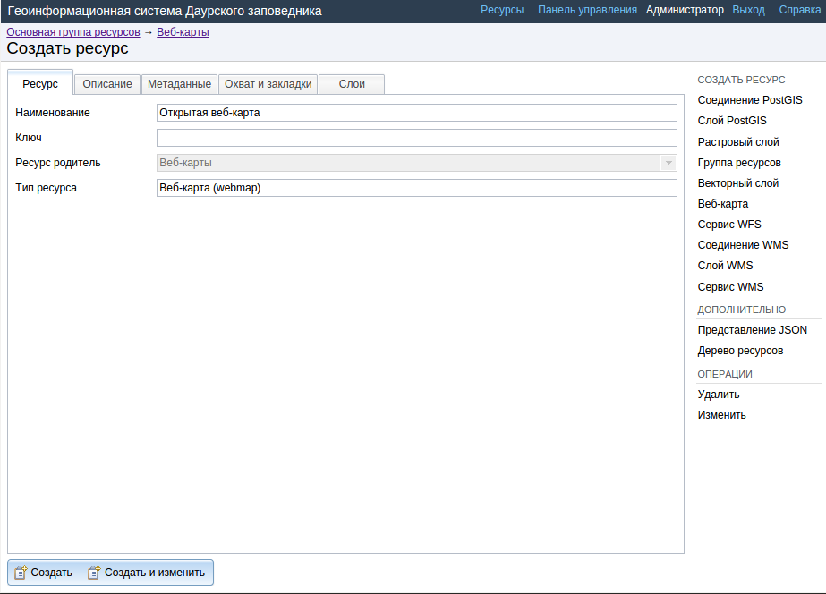
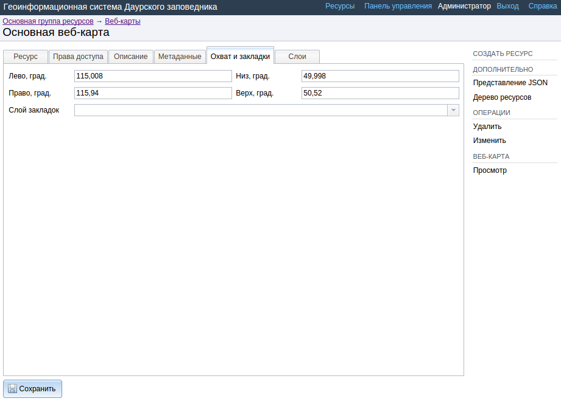
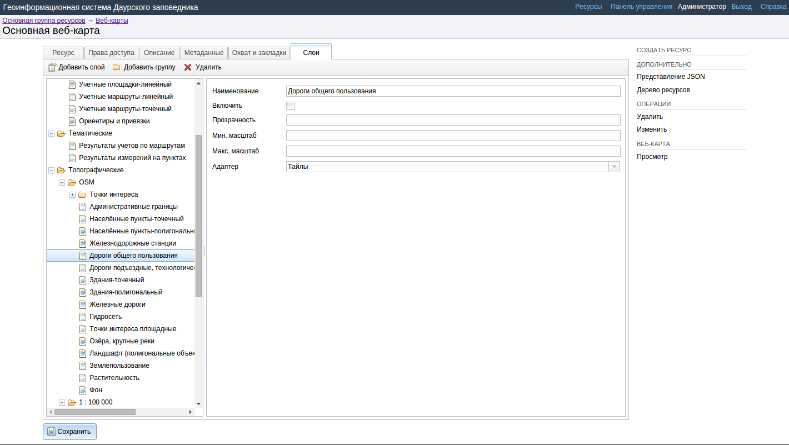

.. sectionauthor:: Артём Светлов <artem.svetlov@nextgis.ru>

.. _ngw_webmaps_admin:

Администрирование веб-карты
===========================

В NextGIS Web может быть несколько отдельных веб-карт. Например, одна может быть 
рабочей, вторая – для общего доступа, третья –  тестовая для настройки слоев.

У разных веб-карт разные URL-адреса. Для разных пользователей и групп пользователей 
можно задавать права на просмотр разных веб-карт. 

На карте показываются слои. Пользователь может их включать и выключать. В настройках 
можно задавать порядок следования слоев, определять, какие слои будут показываться 
сразу же при открытии карты, и раскладывать слои по группам. Группы слоев на карте 
никак не связаны с группами слоев в панели управления. Переносить слои между группами 
нельзя. Группы могут быть вложенными.

.. _ngw_map_create:
    
Добавление веб-карты
--------------------

Для добавления веб-карты перейдите в группу, где необходимо её создать. В блоке операций выберите :menuselection:`Добавить --> Веб-карта`. Откроется окно, представленное на :numref:`ngweb_admin_webmap_name`. 

   Окно создания веб-карты.

Введите наименование веб-карты, которое будет отображаться в административном веб 
интерфейсе, а также в дереве слоев карт.
Поля :guilabel:`Ключ` и :guilabel:`Описание` являются необязательными параметрами.

Переключитесь с вкладки :guilabel:`Ресурс` на вкладку :guilabel:`Охват и закладки`. 
Откроется окно, представленное на :numref:`ngweb_admin_webmap_bbox`.

   Окно ввода охвата.

Задайте охват.

.. note:: Координаты охвата вы можете сгенерировать на сторонних веб-сайтах http://boundingbox.klokantech.com/ (выберите в списке csv), http://lxbarth.com/bbox.

В поле слой закладок можно указать векторный слой. Тогда в клиенте появится выпадающее 
меню с закладками, названия которых будут браться в соответствии с установленным 
полем :guilabel:`Атрибут наименования`. 

Теперь необходимо перейти на вкладку :guilabel:`Дерево слоев`. На этой вкладке можно 
добавлять слои и объединять их в группы, для чего предусмотрены соответствующие 
кнопки :guilabel:`Добавить слой` и :guilabel:`Добавить группу`.

При добавлении слоя задаётся его стиль. Настройки слоев на веб-карте представлены на :numref:`ngweb_admin_webmap_layers`..

   
   Настройки слоев на веб-карте.
 
Поле :guilabel:`Включить` обозначает, что при открытии страницы карты этот слой 
будет по умолчанию отображаться.

Поле :guilabel:`Прозрачность` обозначает степень просвечивания слоя на карте. 
Прозрачность каждого слоя может быть настроена от 0 до 100 процентов. Слой со степенью 
непрозрачности 1 % является практически прозрачным. Совершенно непрозрачный слой 
имеет степень непрозрачности 100 %.

Поле :guilabel:`Адаптер` рекомендуется выставить в :guilabel:`Тайлы`, изображения 
размером 256 x 256 пикселов, если нет каких-либо особых требований. Вторым вариантом 
из выпадающего меню в поле :guilabel:`Адаптер` можно выбрать :guilabel:`Изображение`, 
изображение отрисовывается в виде единой картинки на всю карту. 

В полях :guilabel:`Масштаб` следует указать масштаб в формате, например :guilabel:`1 : 10 000`.

Минимальный и максимальный масштаб можно указывать в стиле слоя и в настройках 
слоя. Если весь слой не надо показывать на каком-то диапазоне масштабов, то это 
лучше задать в свойствах слоя, а не в стиле.
   
.. note:: 
   Если же выставить ограничение масштаба только в стиле, то в том диапазоне 
   масштабов будут отдаваться пустые тайлы, что неэффективно.

После создания контента карты и настройки всех слоев следует нажать кнопку 
:guilabel:`Сохранить`. После сохранения созданная карта появится в списке карт. 
В списке веб-карт, при нажатии на ссылку :guilabel:`Просмотр` карта будет 
открыта в веб-клиенте. Веб-клиент подробнее рассмотрен в главе :ref:`ngw_webmaps_client`.
Адрес, по которому открывается веб-клиент, можно передавать другим пользователям, 
он статичный. 

.. note:: 
   При удалении карты адрес больше доступен не будет.

