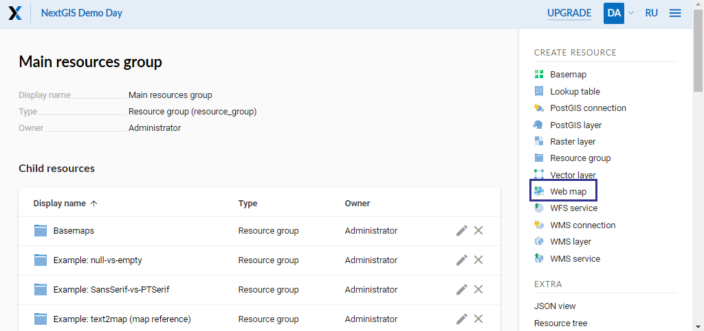
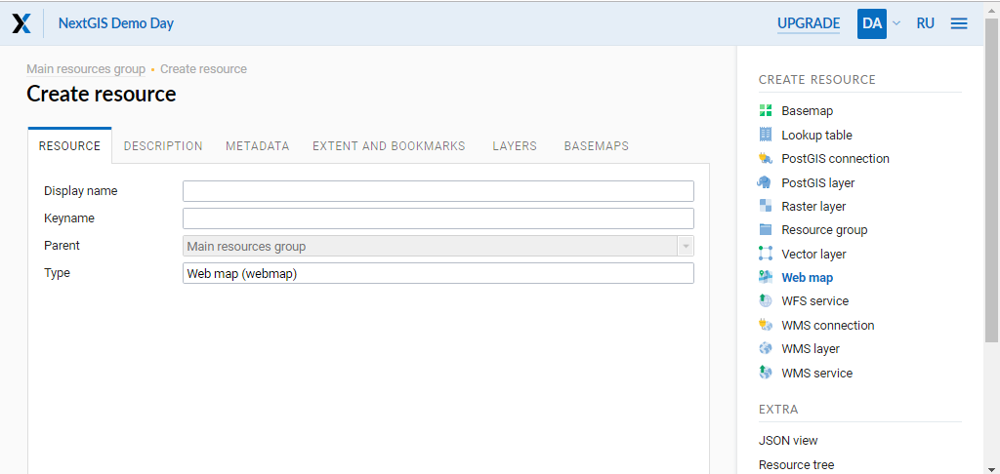
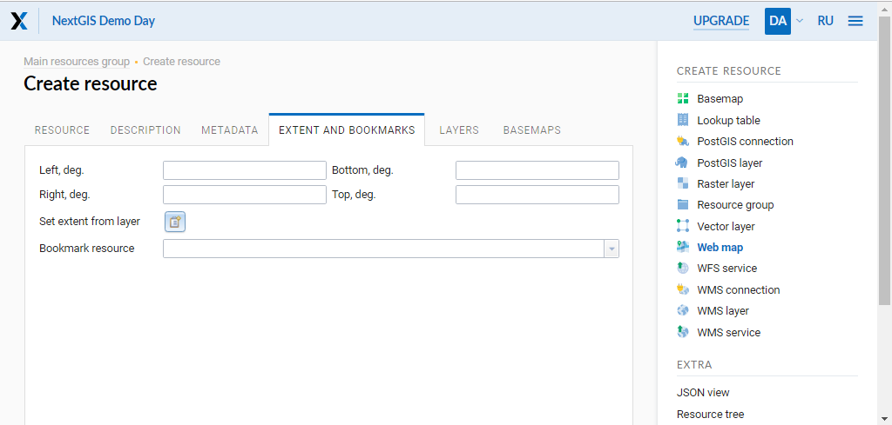
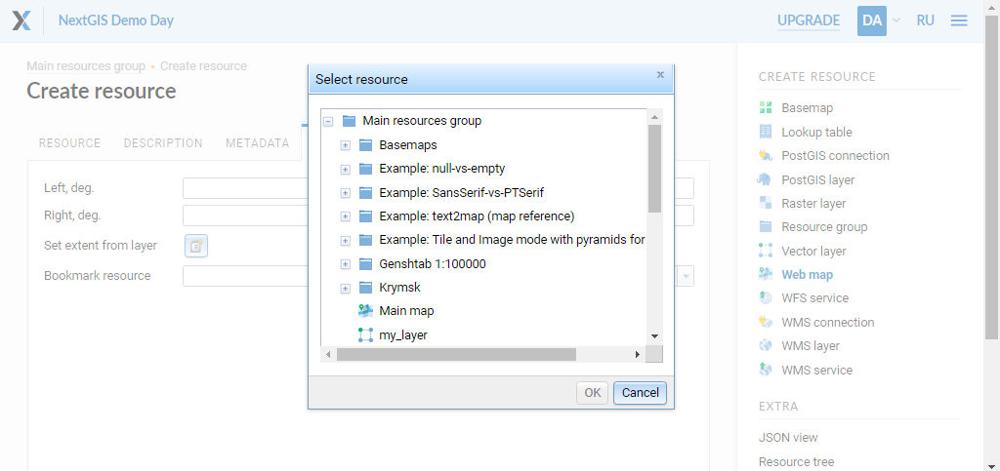
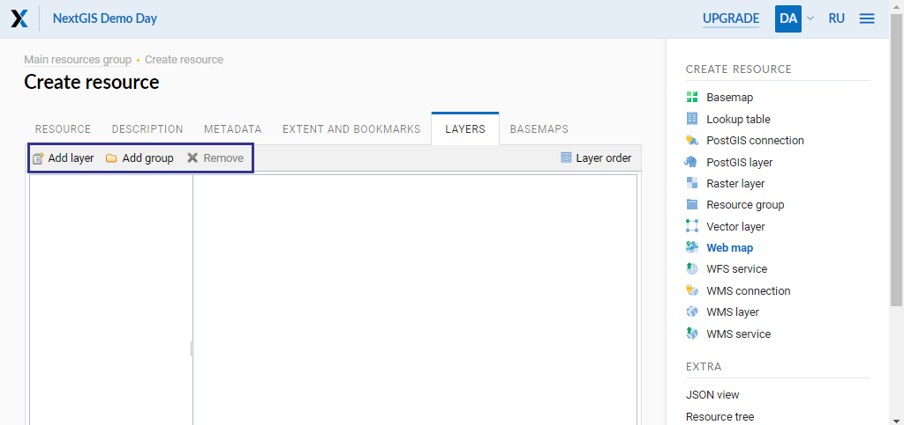
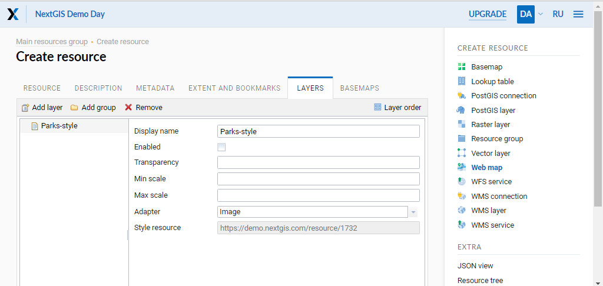

.. sectionauthor:: Artem Svetlov <artem.svetlov@nextgis.ru>

.. _ngw_webmaps_admin:

How to administrate Web Maps
============================

There could be several Web Maps in NextGIS Web. For example one map is for work, another is for public access and third is for testing of layer styles.

Web Maps have their own URL addresses. You can manage display Web Map access permission for different users and groups. 

Web Map displays layers. User can turn Web Maps on and off. You can set the order for layers, define layers default visibility, create group layers. Groups on a map do not relate to resours groups in the Control Panel. There is no option to transfer layers between groups. Groups may be nested.

.. _ngw_map_create:
    
Creating a Web Map
---------------------

To create a Web Map, open the resource group where you want to add it, then in the actions pane “Create resource” select “Web Map”. (see :numref:`ngweb_admin_layers_create_webmap`). 

   Selection of “Web Map” action. 
   
Create resource dialog for a Web Map will open, see :numref:`admin_webmap_name`. 

   “Create resource” dialog for Web Map.

Enter Web Map display name that will be visible in administrator interface and in the Web Maps viewer.

“Keyname” field is optional.

You can also add resource description and metadata on the corresponding tabs.

Extent
~~~~~~

Switch from “Resource” tab to “Extent and bookmarks” tab, presented on :numref:`admin_webmap_bbox`.

   “Extent and bookmarks” tab.

Use the four fields to set the extent measured in degrees.

The field “Extent from layer” allows to set Web Map extent from the layer's extent. Next to the field, there is a folder icon with a plus on it. Click it to open the “Select resource” window, where you can select a layer to use for setting the Web Map extent (four fields with the extent coordinates will be filled in, see :numref:`ngw_select_resource2`). 

   “Select resource” window.

.. tip::
   Extent coordinates could be generated using third-party services http://boundingbox.klokantech.com/ (select csv in a list), http://lxbarth.com/bbox.

In the “Bookmark resource” field you can select a vector layer with any type of geometry to use for bookmarks.  If a layer is set, the Web Map will show bookmarks panel with names defined by “Label attribute”.

Web Map Layers
~~~~~~~~~~~~~~

In the “Layers” tab you can add layers, group or remove them using the buttons “Add layer”, “Add group” and “Remove” respectively (see :numref:`admin_webmap_layers`). 

   "Layers" tab.

To view the data of the layer on a map, you need to create at least one layer style. More on creating styles for different layer types :ref:`here <ngcom_styles>`. 

Layers of a particular map have several settings, see the :numref:`admin_webmap_create_layers`.

   
   Layers tab of Create Resource dialog.
 
"Enabled" checkbox sets default visibility of a layer.

The “Transparency” field sets the layer transparency on a map between 0% (opaque) and 100% (completely transparent). 

We recommend setting the "Adapter" field to "Image" (the entire map rendered as a single image) if there are no specific requirements. Alternatively, you can choose “Tiles” (images of 256 x 256 pixels).

For "Scale" parameters you may enter a range, ex. "1 : 10 000". Scale range could be set in the layer's style or the layer settings.
   
.. note:: 
   Max and min scale can be set not only using the Web Map’s Layers tab, but also in the layer style itself (See an example). If the layer should not be displayed in a certain range of scales, we recommend to mark in in the Web Map’s layer settings. If the scale limit is only set within the style, empty tiles will be generated in other scales, which is less efficient.

The order of the layers on a map can be different from the order in which they appear in the tree. Click "Layer order" in the "Layers" tab of the map settings. It allows to choose the order of the displayed layers without affecting the groups.

Basemaps
~~~~~~~~~

"Basemaps" tab allows to add and remove basemaps using corresponding buttons "Add" and "Remove" (see :numref:`admin_webmap_basemaps`). 

.. figure:: _static/admin_webmap_basemaps_eng.png
   :name: admin_webmap_basemaps
   :align: center
   :width: 16cm

   "Basemaps" tab.

A checkbox "Enabled" sets default visibility of a basemap.

"Opacity" field sets basemap transparency on a map in a range between 0 (transparent) and 1 (opaque) with decimals separated by a full stop (ex. 0.2).

Web Map with no basemap
~~~~~~~~~~~~~~~~~~~~~~~

By default a Web Map is created with OpenStreetMap basemap. If you need a map without a basemap: 
create a new basemap, put 'blank' in name and URL and add it to your Web Map. Turn just added basemap off.

After creating the map content and adjusting settings for all the layers, click "Save" button. A saved map will be shown in the list of maps. 
Click an icon with a map in the list of Web Maps or a "Display" link in a window with Web Map properties to open the Web Map in the client application. Web Map client application is described in section :ref:`ngw_webmaps_client`.
Address which is used for web client may be transfered to other users because it is static. 

.. warning::  
   After a map is deleted, its address will no longer be available.

