.. sectionauthor:: Артём Светлов <artem.svetlov@nextgis.ru>

.. _ngw_webmaps_admin:

Добавление веб-карты
===========================

В NextGIS Web может быть несколько отдельных веб-карт. Например, одна может быть 
рабочей, вторая – для общего доступа, третья –  тестовая для настройки слоев.

У разных веб-карт разные URL-адреса. Для разных пользователей и групп пользователей 
можно `задавать права <https://docs.nextgis.ru/docs_ngcom/source/permissions.html>`_ для просмотра разных веб-карт. 

На карте показываются слои. Пользователь может их включать и выключать. В настройках 
можно задавать порядок следования слоев, определять, какие слои будут показываться 
сразу же при открытии карты, и раскладывать слои по группам. Группы слоев на карте 
никак не связаны с группами ресурсов в панели управления. Переносить слои между группами 
нельзя. Группы могут быть вложенными.

.. _ngw_map_create:
    
Создание веб-карты
--------------------

Для добавления веб-карты следует перейти в группу, где необходимо её создать, нажать кнопку **Создание ресурса** и во всплывающем окне выбрать "Веб-карта" (см. :numref:`ngweb_admin_layers_create_webmap`). 

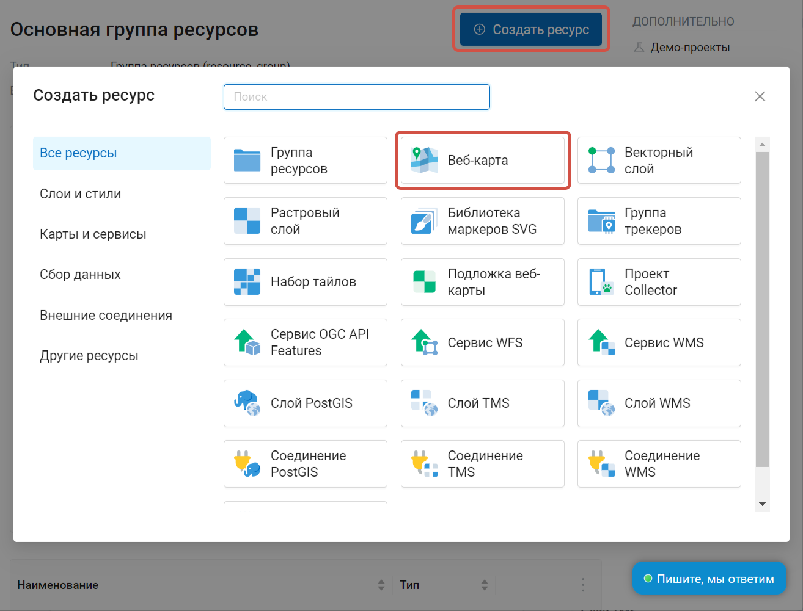

   Выбор типа ресурса "Веб-карта" 
   
В результате этих действий откроется окно, представленное на :numref:`ngweb_admin_webmap_name`. 

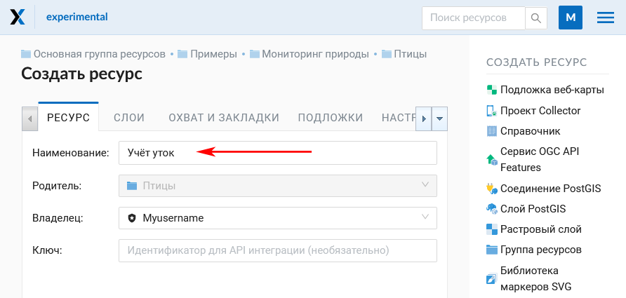

   Окно создания веб-карты

Далее следует ввести наименование веб-карты, которое будет отображаться в административном веб-интерфейсе и в :ref:`веб-клиенте <ngw_webmaps_client>` для просмотра карт (Можно задать заголовок веб-карты для веб-клиента, отличающийся от наименования ресурса, в панели `"Настройки" <https://docs.nextgis.ru/docs_ngweb/source/webmaps_admin.html#ngw-map-settings>`_). Поле "Ключ" является необязательным к заполнению.

Можно добавить **описание** ресурса и **метаданные** на соответствующих вкладках. 

.. _ngw_map_layers:

Слои веб-карты
-----------------

На  вкладке "Слои" можно добавлять слои, объединять их в группы и удалять их, а также менять порядок слоев, для чего предусмотрены соответствующие кнопки "Добавить слой", "Добавить группу", "Изменить порядок рисования слоев" и "Удалить слой" (крестик в конце строки). 

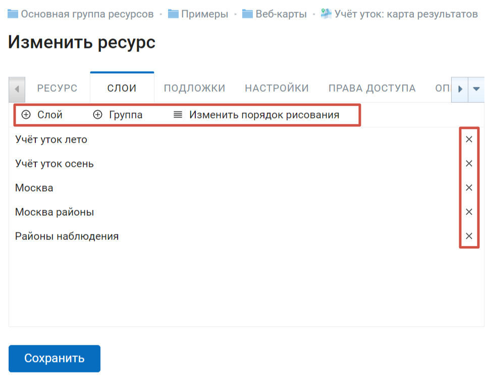

   Вкладка "Слои"

Для того, чтобы отобразить данные слоя на карте, необходимо создать для него хотя бы один стиль. О создании стилей для различных типов слоев можно прочитать :ref:`здесь <ngcom_styles>`. 

Нажмите **+ Слой** и выберите во всплывающем окне нужный стиль.

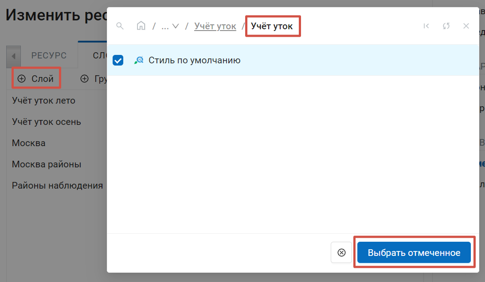
   
   Окно добавления стиля слоя на веб-карту

Настройки слоев на веб-карте представлены на :numref:`admin_webmap_create_layers`.

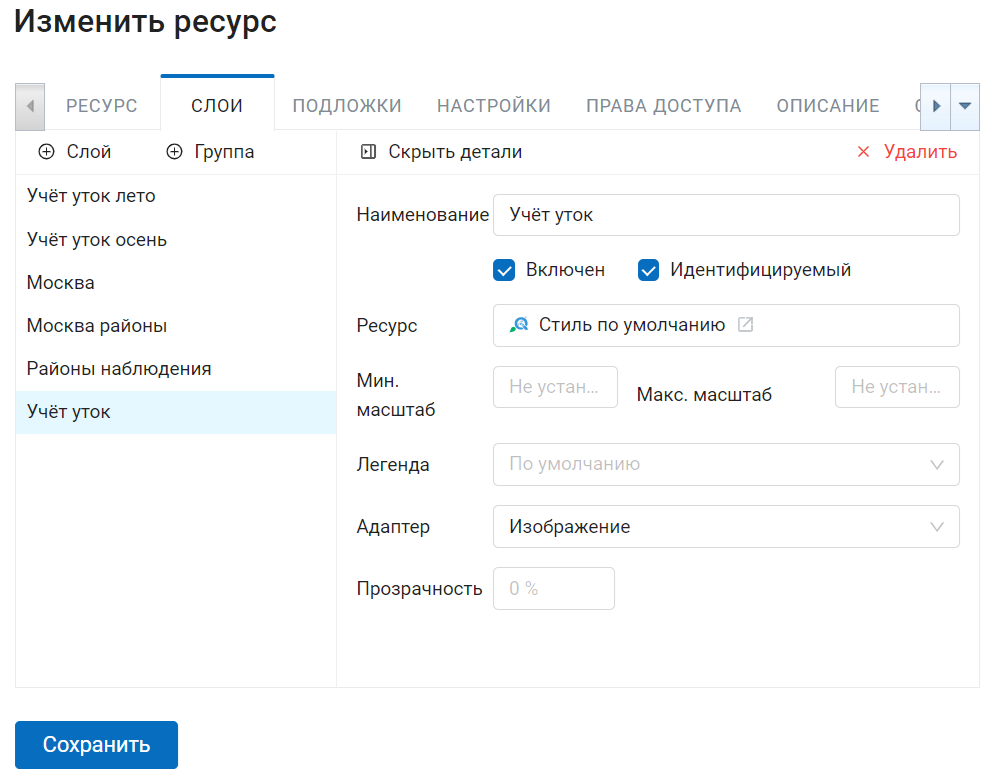
   
   Настройки слоев на веб-карте
 
Поле "Включен" обозначает, что при открытии страницы карты этот слой 
будет по умолчанию отображаться.

Поле "Прозрачность" обозначает степень просвечивания слоя на карте. 
Прозрачность каждого слоя может быть настроена от 0 до 100 %. Слой со степенью 
прозрачности 1 % является практически непрозрачным. Совершенно прозрачный слой 
имеет степень прозрачности 100 %.

В поле "Адаптер" рекомендуется выставить значение "Изображения" (отрисовка в виде единой картинки на всю карту), если нет каких-либо особых требований. Также в этом поле можно выбрать значение "Тайлы" (изображения размером 256 x 256 пикселов).

Можно также указать диапазон масштабов, в которых будет отбражаться слой, при помощи полей "Мин. масштаб" и "Макс. масштаб". Минимальный масштаб соответствует более мелкомасштабному отображению, а максимальный - более крупномасштабному. Например, для отображения слоя в диапазоне от 1 : 250 000 до 1 : 5 000, первое значение должно соответствовать минимальному масштабу, а второе - максимальному.  Минимальный и максимальный масштаб можно указывать в стиле слоя и в настройках слоя.
   
.. note:: 
   Минимальный и максимальный масштаб можно указывать не только в настройках слоя веб-карты, но и в стиле слоя (`пример <https://docs.nextgis.ru/docs_ngweb/source/mapstyles.html#osm-water-line>`_). Однако если весь слой не надо показывать на каком-то диапазоне масштабов, то это лучше задать в настройках слоя веб-карты. Если же выставить ограничение масштаба только в стиле, то в этом диапазоне масштабов будут отдаваться пустые тайлы, что неэффективно.

Чтобы вернуться к списку слоёв, нажмите **Скрыть детали**.

.. _ngw_map_layer_groups:

Группы слоёв
~~~~~~~~~~~~~

Слои, добавленные на карту, можно объединять в группы. Это повлияет только на отображаемое на веб-карте дерево слоёв, делая легенду более наглядной. На расположение слоёв в группах ресурсов их группировка на конкретной веб-карте не влияет.

Для добавления новой группы нажмите **+ Группа**. Чтобы поместить слой в группу, перетащите его.

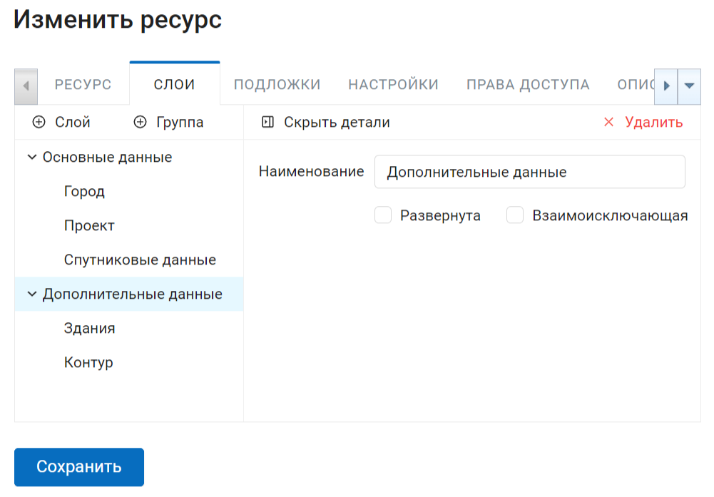
   
   Настройки группы слоев на веб-карте

Опция **Развернута** определяет вид группы в дереве слоёв при открытии веб-карты.

Если включена опция **Взаимоисключающая**, то только один слой из группы может отображаться на карте. При активации любого из слоев группы остальные входящие в неё слои скрываются. Это может быть удобно, например, при добавлении группы слоёв спутниковых данных, которые перекрывают друг друга полностью.

Чтобы вернуться к списку слоёв, нажмите **Скрыть детали**.

.. _ngw_map_layer_order:

Порядок рисования слоев на веб-карте
~~~~~~~~~~~~~~~~~~~~~~~~~~~~~~~~~~~~~~~

Кнопка **Изменить порядок рисования** открывает панель, в которой можно задать порядок отрисовки слоёв на карте, отличающийся от их порядка в списке слоёв. Эта функция нужна для демонстрации слоев при сохранении исходного разбиения слоев на папки.

.. figure:: _static/admin_webmap_layerorders_1_cut_ru.png
   :name: ngweb_admin_webmap_layerorders_1
   :align: center
   :width: 20cm
   
   Порядок слоёв как есть: аэрофотоснимки загораживают слой со зданиями

.. figure:: _static/admin_webmap_layerorders_2_cut_ru.png
   :name: ngweb_admin_webmap_layerorders_2
   :align: center
   :width: 20cm
   
   Другой порядок слоёв: слой со зданиями рисуется выше аэрофотоснимков, но структура слоёв слева не изменена

Выставив нужный порядок, нажмите "Назад к слоям и группам", чтобы вернуться к списку слоёв. Нажмите **Сохранить**, чтобы сохранить внесённые изменения.

Чтобы сбросить порядок отрисовки слоёв до исходного, в панели изменения порядка рисования нажмите **Порядок рисования по умолчанию**.

.. _ngw_map_basemaps:

Подложки 
--------
 
На  вкладке "Подложки" можно добавлять подложки и удалять их, для чего предусмотрены соответствующие 
кнопки "Добавить" и "Удалить" (см. :numref:`admin_webmap_basemaps`). 

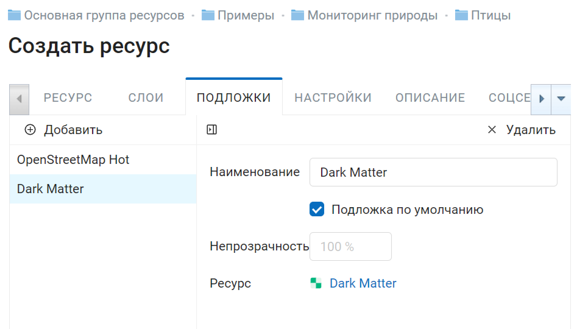

   Вкладка "Подложки"

Для каждой подложки можно настроить наименование, отличное от названия ресурса. 

Поле "Непрозрачность" обозначает степень просвечивания подложки на карте, настраивается в процентах.

Если поставить флажок "По умолчанию", то при открытии страницы карты будет отображаться именно эта подложка.

.. _ngw_map_no_base:

Карта без подложки
-------------------

По умолчанию веб-карта создаётся с подложкой OpenStreetMap. Если нужно получить карту без подложки, 
создайте новую подложку, добавьте её к веб-карте и отключите флажок "По умолчанию".

.. _ngw_map_settings:

Настройки
---------

На вкладке "Настройки" можно:

* задать заголовок, который будет отображаться на веб-карте вместо имени ресурса;
* настроить `легенду <https://docs.nextgis.ru/docs_ngcom/source/legend.html>`_;
* включить аннотации (о работе с аннотациями  см. `здесь <https://docs.nextgis.ru/docs_ngcom/source/annotation.html>`_);
* выбрать систему координат для измерений;
* разрешить редактирование слоев;
* выбрать начальный и ограничивающий охват;
* выбрать ресур закладок.

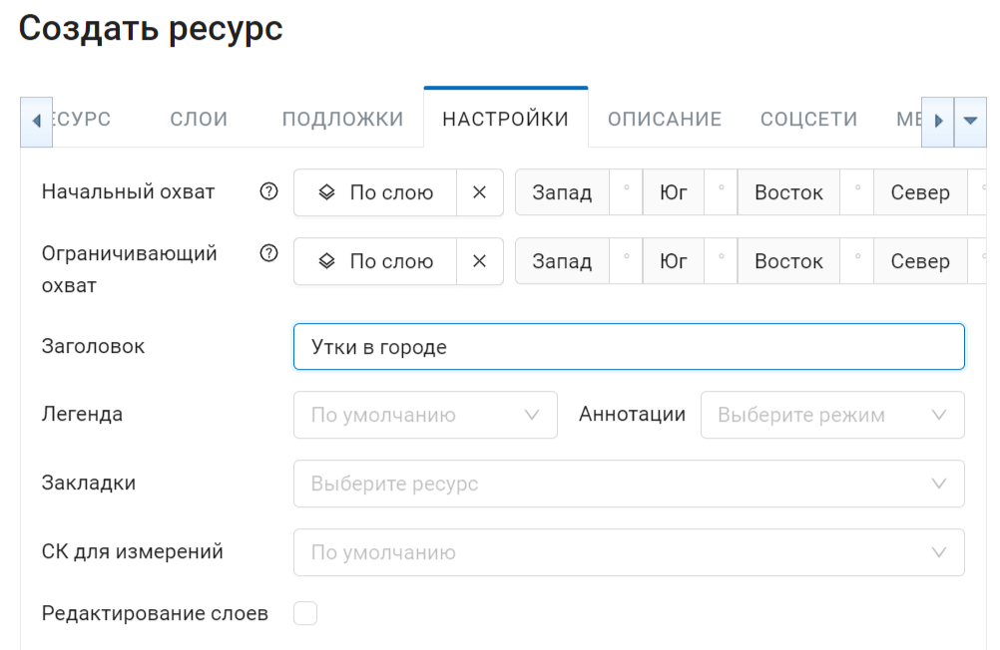
   
   Вкладка "Настройки" 

.. _ngw_map_extent:

Охват
------

На вкладке "Настройки" можно задать:

* Начальный охват - с таким охватом будет открываться веб-карта.
* Ограничивающий охват - на веб-карте нельзя будет выйти за его пределы.

Охват задается посредством заполнения четырех строк и измеряется в градусах. 

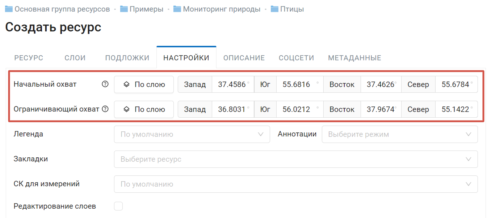

   Окно ввода охвата

Кнопка **Установить по слою** позволяет установить охват веб-карты по охвату выбранного слоя. 
Если нажать её, то откроется окно "Выберите слой" с деревом ресурсов, из которого можно 
выбрать слой, по которому будет установлен охват веб-карты (см. :numref:`ngw_select_resource2`). При этом будут заполнены четыре строки с координатами охвата.

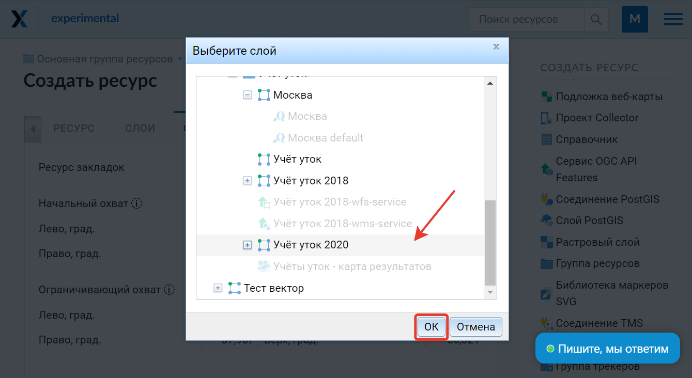

   Окно "Выберите слой"

.. tip:: 
   Координаты охвата вы можете сгенерировать на сторонних веб-сайтах, например http://boundingbox.klokantech.com/ (выберите в списке csv).

.. _ngw_map_bookmarks:

Закладки
---------

В поле "Закладки" можно указать векторный слой с любым типом геометрии. Тогда на Веб карте появится панель 
закладок (см. :numref:`ngw_bookmarks`). Названия закладок будут браться из "Атрибут наименования" (см. :numref:`bookmark_attribute`) если он установлен. 

.. figure:: _static/ngw_bookmarks_ru.png
   :name: ngw_bookmarks
   :align: center
   :width: 20cm
   
   Панель закладок и отображение по клику на Веб-карте

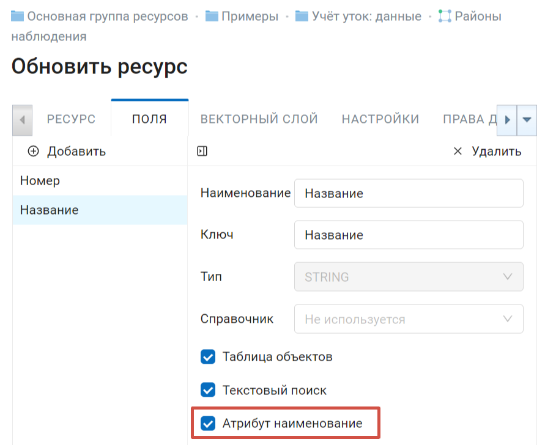
   
   Установка Атрибута наименования для векторного слоя границ районов

.. _ngw_map_socials:

Соцсети
-------

На этой вкладке можно выбрать изображение для предпросмотра, которое будет использовано в соцсетях.

.. figure:: _static/admin_webmap_social_ru.png
   :name: admin_webmap_social_pic
   :align: center
   :width: 20cm
   
   Вкладка "Соцсети"

.. _ngw_map_save:

Завершение создания веб-карты
------------------------------

После всех настроек нажмите "Сохранить". После сохранения созданная карта появится в списке карт. 
При нажатии на иконку в виде карты в списке ресурсов веб-карта будет открыта в браузере. Находясь
на странице ресурса веб-карты можно также открыть ее выбрав "Просмотр"в панели справа. 

Веб-клиент подробнее рассмотрен в главе :ref:`ngw_webmaps_client`.
Адрес, по которому открывается веб-клиент, можно передавать другим пользователям, 
он статичный. 

.. warning:: 
   При удалении карты адрес больше доступен не будет.

