.. sectionauthor:: Artem Svetlov <artem.svetlov@nextgis.ru>

.. _ngw_webmaps_admin:

Adding Web Maps
============================

There could be several Web Maps in NextGIS Web. For example one map is for work, another is for public access and third is for testing of layer styles.

Each Web Map has its own URL address. Different access permissions for Web Map viewing can be set for users and groups. 

Web Map displays layers. They can be turned on or off by the user. You can set the `order <https://docs.nextgis.com/docs_ngweb/source/webmaps_admin.html#layer-draw-order>`_ of the layers, default layer `visibility <https://docs.nextgis.com/docs_ngweb/source/webmaps_admin.html#admin-webmap-create-layers>`_ and create layer `groups <https://docs.nextgis.com/docs_ngweb/source/webmaps_admin.html#layer-groups>`_. Groups on a map do not relate to resource groups in the Control Panel. Groups may be nested.

To view Web Map in browser, press |button_open_web_map| next to its name in the resource list or open the resource page and select **Display** in the Actions panel on the right. It will open in a `web viewer <https://docs.nextgis.com/docs_ngweb/source/webmaps_client.html>`_.

.. |button_open_web_map| image:: _static/button_open_web_map.png
   :width: 8mm
   :alt: magnifying glass on map

.. _ngw_map_create:
    
Creating a Web Map
---------------------

To create a Web Map, open the resource group where you want to add it, press **Create resource** button and in the pop-up window select “Web Map”. (see :numref:`ngweb_admin_layers_create_webmap`). 

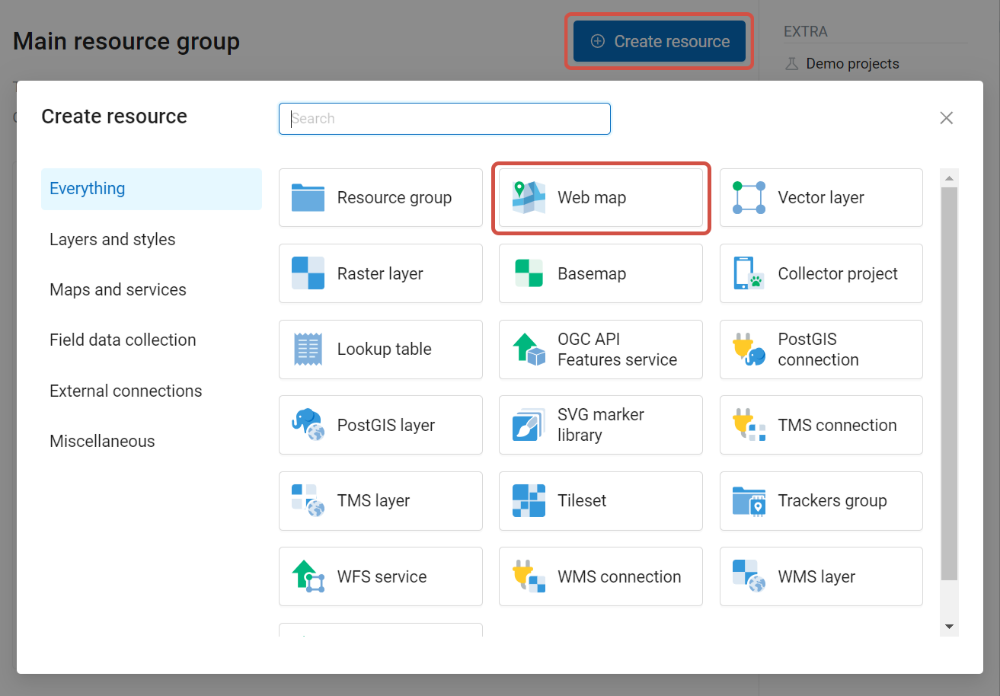

   Selection of “Web Map” resource type 
   
Create resource dialog for a Web Map will open, see :numref:`admin_webmap_name`. 

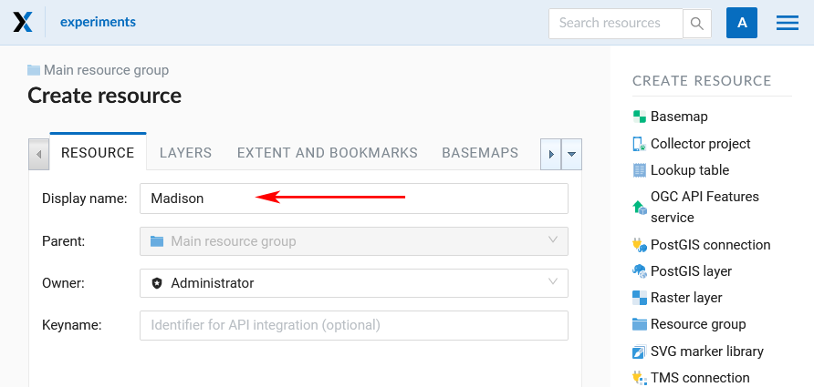

   “Create resource” dialog for Web Map

Enter Web Map display name that will be visible in the administrator interface and in the Web Map viewer. (You can set up a title to be displayed in Web Map viewer in the `Settings tab <https://docs.nextgis.com/docs_ngweb/source/webmaps_admin.html#ngw-map-settings>`_.)

“Keyname” field is optional.

You can also add resource description and metadata on the corresponding tabs.

If you want to create a copy of an existing Web Map, you can `clone <https://docs.nextgis.com/docs_ngweb/source/webmap_clone.html>`_ it.

.. _ngw_map_layers:

Web Map Layers
---------------

In the “Layers” tab you can add, group or remove layers and change their order using the buttons “Add layer”, “Add group”, "Customize draw order" and "Delete layer" (X at the end of each row). 

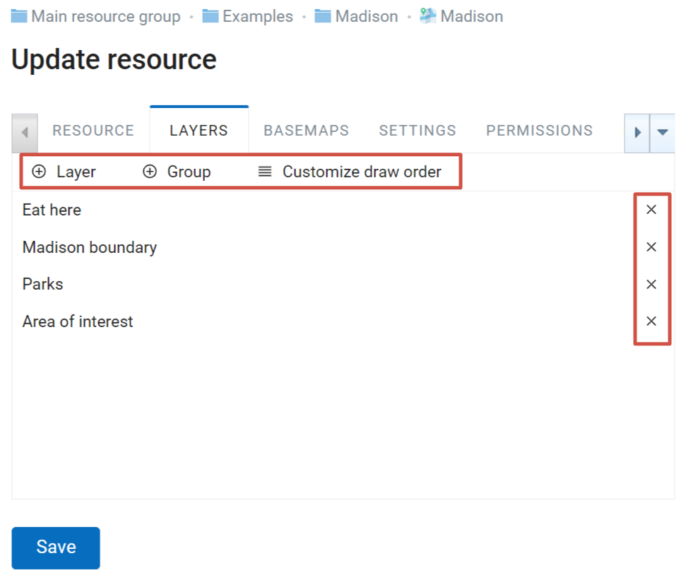

   "Layers" tab

To view the data of the layer on a map, you need to create at least one layer style. More on creating styles for different layer types :ref:`here <ngcom_styles>`. 

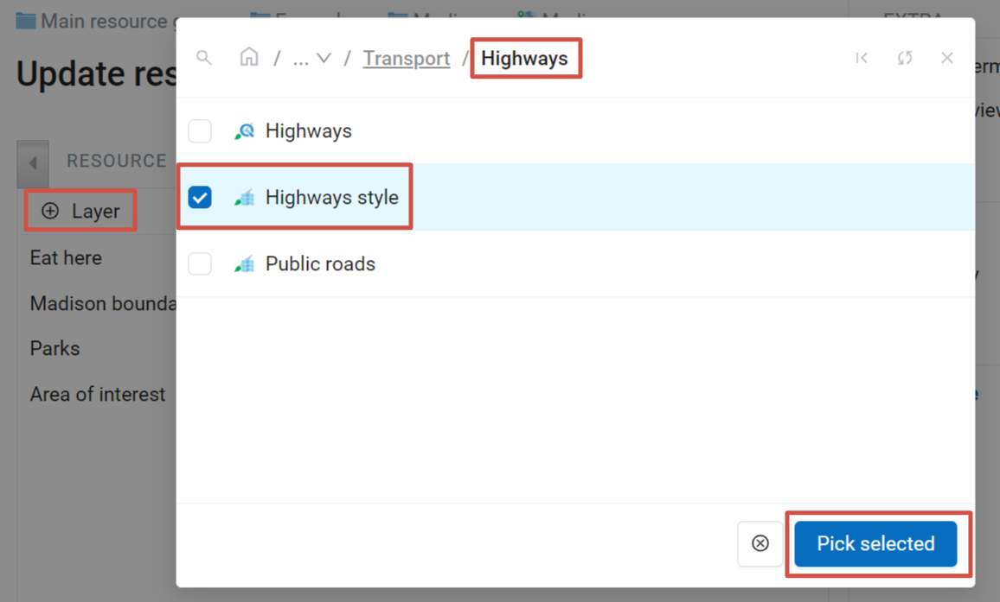
   
   Using style to add a layer to the Web Map

Layers of a particular map have several settings, see :numref:`admin_webmap_create_layers`.

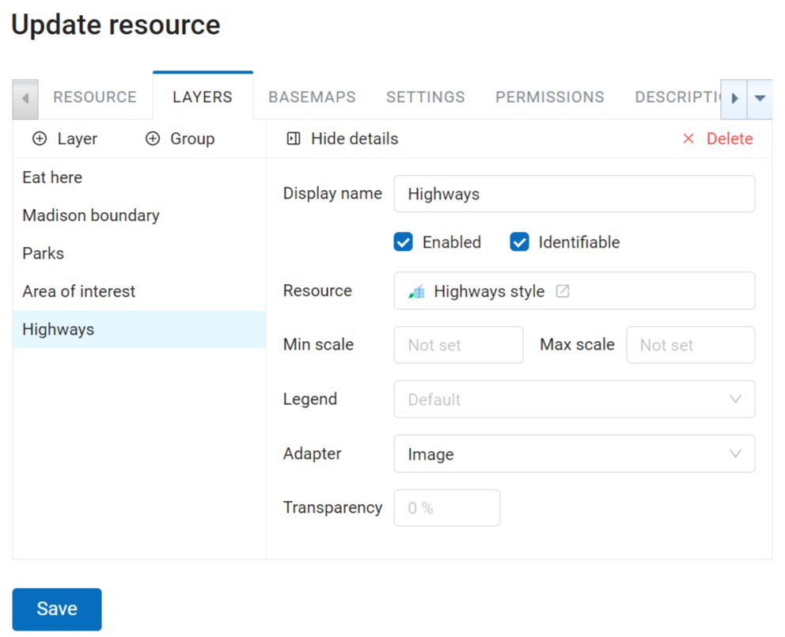
   
   Layer settings
 
"Enabled" checkbox sets default visibility of a layer.

The “Transparency” field sets the layer transparency on a map between 0% (opaque) and 100% (completely transparent). 

We recommend setting the "Adapter" field to "Image" (a single image for the entire map), unless there are some special requirements. Alternatively, you can choose “Tiles” (images of 256 x 256 pixels).

.. tip:: Use "Tiles" adapter to display correctly features crossing the 180th meridian.

You can also set up a scale range. Min scale corresponds to the smaller image, max scale - to the larger, more detailed image. For example, if you want a layer to be displayed in scales between 1 : 250,000 and 1 : 5,000, the higher number (250,000) is the minimal scale.
   
.. note:: 
   Max and min scale can be set not only using the Web Map’s Layers tab, but also in the layer style itself (See an `example <https://docs.nextgis.com/docs_ngweb/source/mapstyles.html#osm-water-line>`_). If the layer should not be displayed in a certain range of scales, we recommend to mark it in the Web Map’s layer settings. If the scale limit is only set within the style, empty tiles will be generated in other scales, which is less efficient.

To go back to the layer list, press **Hide details**.

.. _ngw_map_layer_groups:

Layer groups
~~~~~~~~~~~~

Layers added to Web Map can be gathered into groups. It will only affect the layer tree displayed on the map itself, making the legend more legible. It does not affect the actual resource group contents.

To add a new group press **+ Group**. To put a layer into a group, drag and drop.

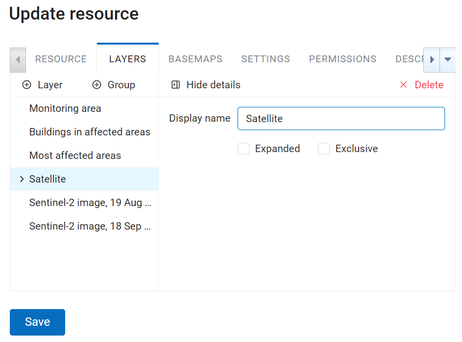
   
   Layer group settings

**Expanded** option defines the way the layer group is presented in the layer tree when the Web Map is opened.

If **Exclusive** is ticked, layers in the group will only be displayed one at a time. If you activate a layer, all other layers of the group are automatically hidden. It can be handy if you have, for example, a group of satellite data that completely overlaps. 

To go back to the layer list, press **Hide details**.

.. _ngw_map_layer_order:

Layer draw order
~~~~~~~~~~~~~~~~~

The order of the layers on a map can be different from the order in which they appear in the tree. Click "Customize draw order" in the "Layers" tab of the map settings. It allows to choose the order of the displayed layers without affecting the groups.

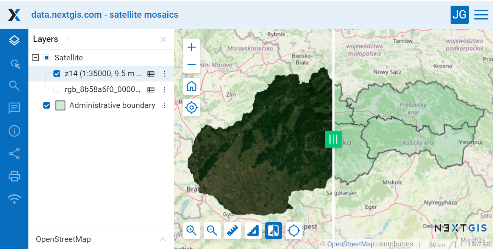
   
   Layer order as is: satellite images obscure the layer where the boundaries are marked

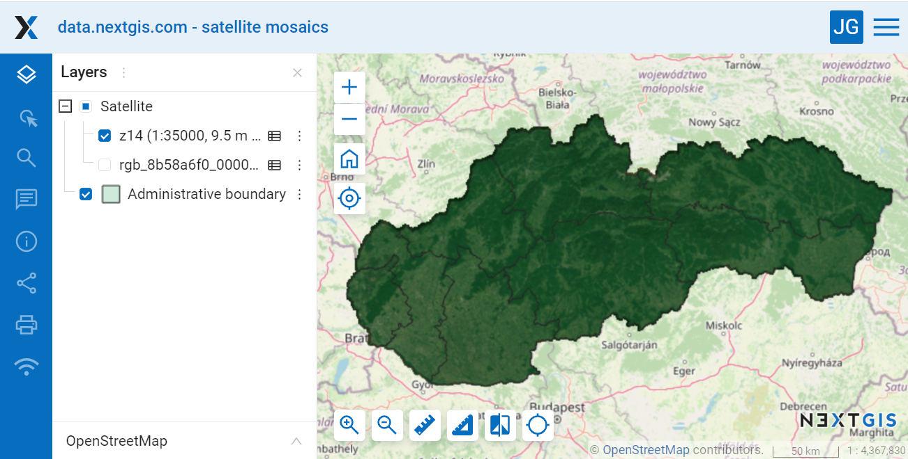
   
   Different draw order: the layer marking the boundaries is above the satellite images, while the layer groups on the left remain unchanged

To go back to the list of layers, press **Back to layers and groups**. To restore the initial layer order, press **Use default draw order**. 

Press **Save** to save the changes.

.. _ngw_map_basemaps:

Basemaps
--------

"Basemaps" tab allows to add and remove basemaps using corresponding buttons "Add" and "Remove" (see :numref:`admin_webmap_basemaps`). 

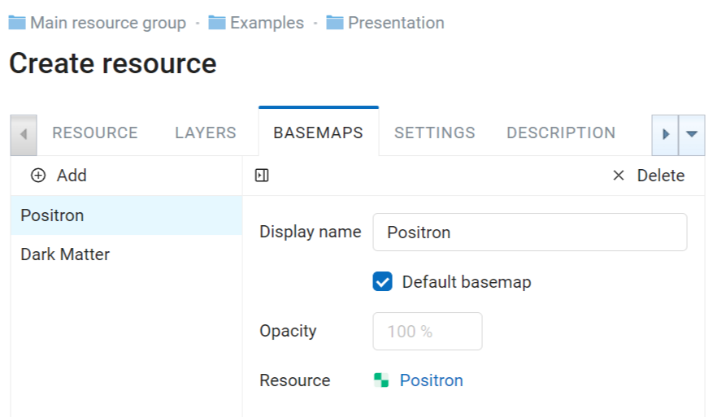

   “Basemaps” tab

If “Default basemap” is checked, this basemap will be visible when the Web Map is opened.

"Opacity" field sets basemap transparency on a map in a range between 0 and 100%.

.. _ngw_create_basemap:

Creating Basemap
~~~~~~~~~~~~~~~~~~~

Press **Create resource** button and select **Basemap** (:numref:`ngweb_admin_create_basemap`).
In the opened window enter the name of the resource that will be displayed in the administrator interface (:numref:`ngweb_admin_basemap_name`).

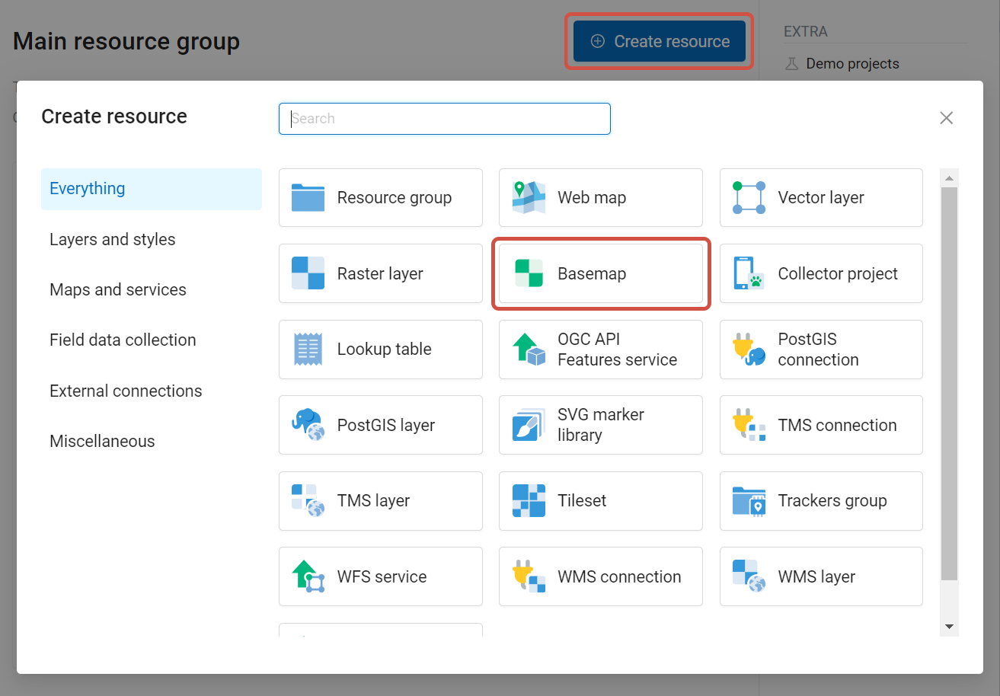

   Selection of "Basemap" resource type
   
   
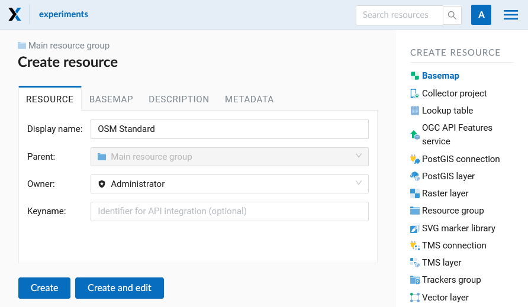

   Basemap name
   
   
The "Description" and "Metadata" of the resource are configured on the corresponding tabs (:numref:`ngweb_admin_basemap_desc`). On the “Description” tab you can add any text describing the content.

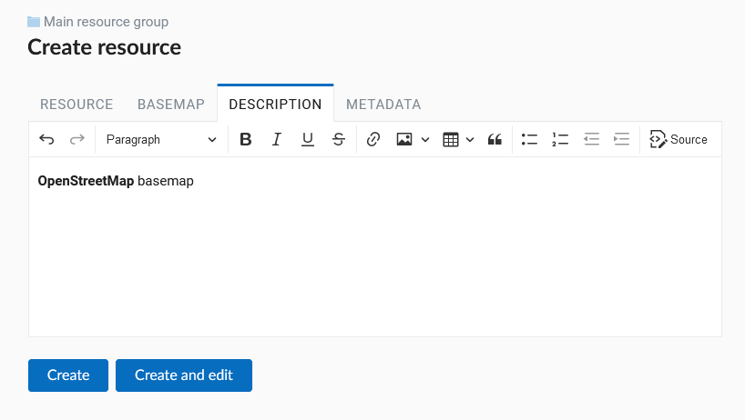

   Basemap description
   

In the “Basemap” tab you must enter the URL-address of the TMS service (:numref:`ngweb_admin_basemap_param`). There are two ways to do so:

* Use the search bar to find a map in the `QuickMapServices catalog <https://qms.nextgis.com/>`_. After a map is selected,  other fields will be filled in automatically.
* Enter the address manually. 

The basemap will be previewed below. Press |button_toggle_basemap| **Toggle basemap** and move the opacity slider to compare it to the standard OSM basemap.

.. |button_toggle_basemap| image:: _static/button_toggle_basemap.png

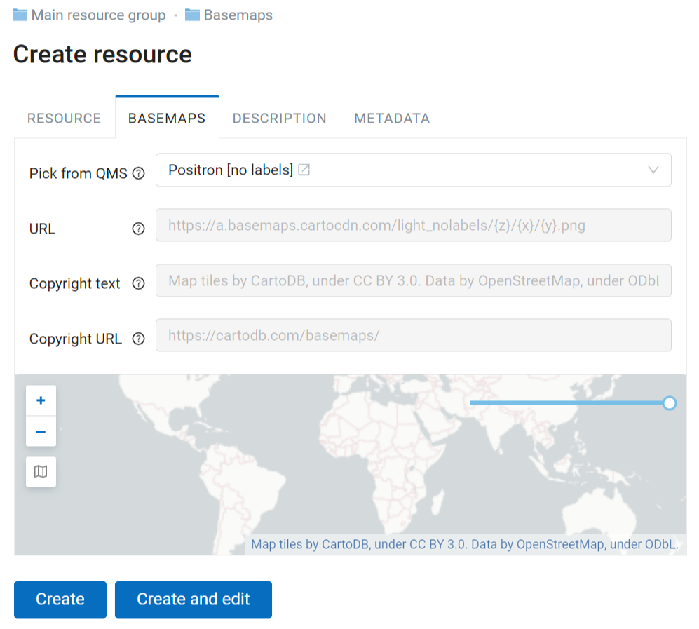

   Basemap settings

.. _ngw_map_no_base:

Web Map with no basemap
~~~~~~~~~~~~~~~~~~~~~~~~~

By default a Web Map is created with OpenStreetMap basemap. If you need a map without a basemap: 
create a new basemap and add it to your Web Map. Then turn this newly created basemap off.

See how it works in our video:

.. raw:: html

   <iframe width="560" height="315" src="https://www.youtube.com/embed/KUAzaL15TvI?si=Za1Lrfqvo6IHcuIp" title="YouTube video player" frameborder="0" allow="accelerometer; autoplay; clipboard-write; encrypted-media; gyroscope; picture-in-picture; web-share" referrerpolicy="strict-origin-when-cross-origin" allowfullscreen></iframe>

Watch on `youtube <https://youtu.be/KUAzaL15TvI?si=8dy3RS3YgCUBiBEC>`_.

.. _ngcom_layer_as_basemap:

How to use any layer in your Web GIS as a basemap
~~~~~~~~~~~~~~~~~~~~~~~~~~~~~~~~~~~~~~~~~~~~~~~~~~

Any layer (style) created in Web GIS can be used as a source of a tile service and connected as a **basemap**.
To do this, you should:

1. Create the required `layer <https://docs.nextgis.com/docs_ngweb/source/layers.html>`_ (vector or raster) and a `style <https://docs.nextgis.com/docs_ngweb/source/mapstyles.html>`_ for it. Inside the style you'll find a link marked **TMS service** - you will need it for step 3;
2. Enable `caching <https://docs.nextgis.com/docs_ngweb/source/mapstyles.html#tile-cache>`_ (to speed up Web Map processing, for `Premium plan <https://nextgis.com/pricing-base/>`_ only);
3. Create "Basemap" resource with unchecked "Use options from QMS" and the URL of the above-created TMS layer.

.. _ngw_map_settings:

Settings
---------

In the "Settings" tab you can modify several parameters:

* title that will be displayed on the Web Map instead of resource name;
* legend visibility (more `here <https://docs.nextgis.com/docs_ngcom/source/legend.html>`_);
* enable annotations (more on annotations see :ref:`here <ngcom_annotation>`);
* select measurement spacial reference system;
* allow layer editing;
* set up initial and constraining extent (see below);
* select bookmark resource.

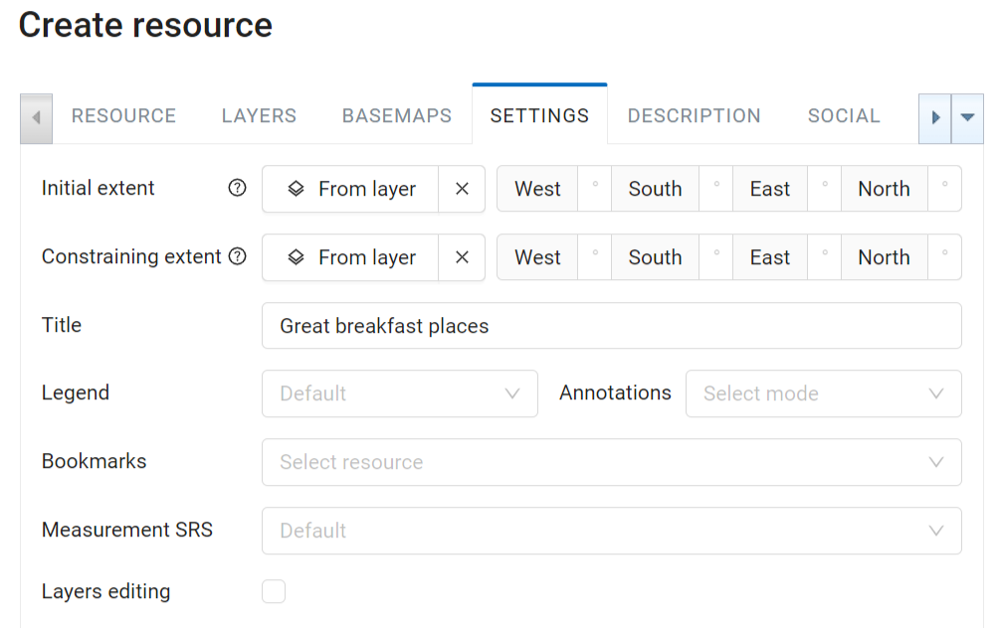
   
   "Settings" tab

.. _ngw_legend:

Legend
---------

Map symbols may need additional explanation. Paper maps and atlases use a separate page or an insert explaining what each symbol means. 

In NextGIS Web you have two options to display the information on symbols used in a layer:

Display the map symbols in the layer tree. The markers of the layer styles will be used.
In addition, you can add detailed description of the map symbols in the `Description panel <https://docs.nextgis.com/docs_ngcom/source/webmap_create.html#add-a-description-and-map-legend>`_  ("i" in a circle).

In NextGIS Web settings the term "legend" refers specifically to the map symbols displayed in the layer tree of the Web Map under the layer name.

Visibility settings of the legend can be modified at various levels, allowing customization for specific goals, from "display all legends" to "display the legend differently for specific layers of one Web Map". Legend visibility can be set: 

* for a layer of a Web Map
* for a Web Map (all layers)
* for the entire Web GIS

Legend visibility for a particular layer is set in the Layer tab of the Web Map settings.

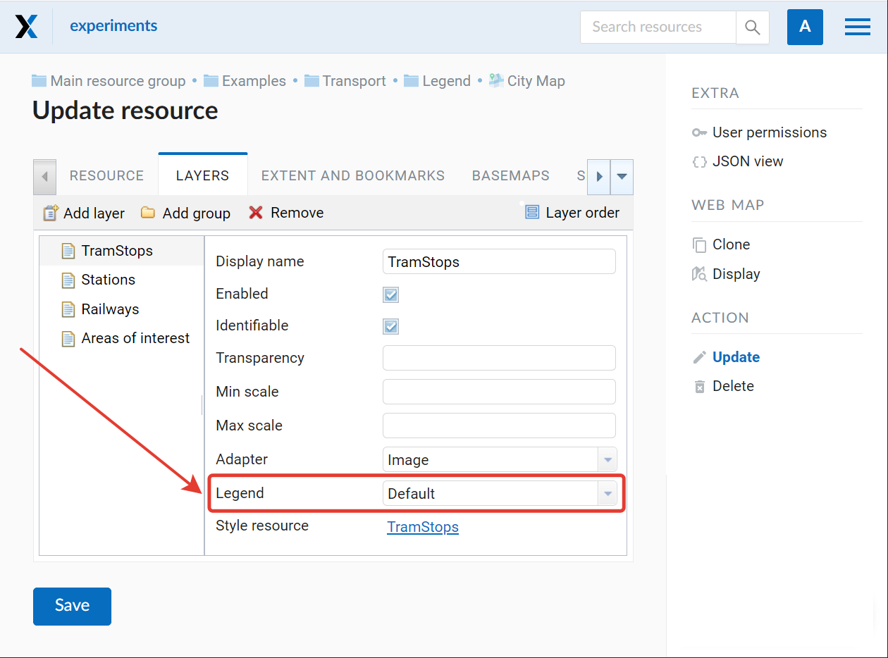

   Setting legend visibility for particular layers

Legend visibility for a Web Map is set in its Settings tab.

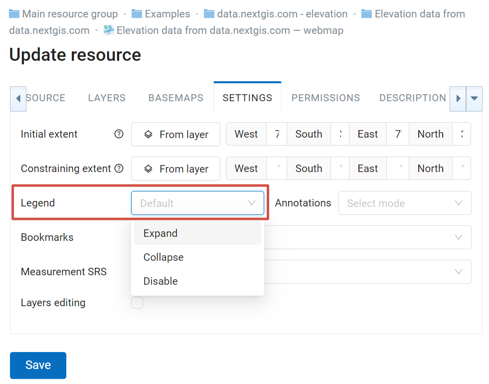
   
   Setting legend visibility for the Web Map

You can also set default legend visibility for the Web GIS: Control panel – Web Map – Legend. This setting will be used if both Web Map and the layer have "Default" selected for legend visibility.

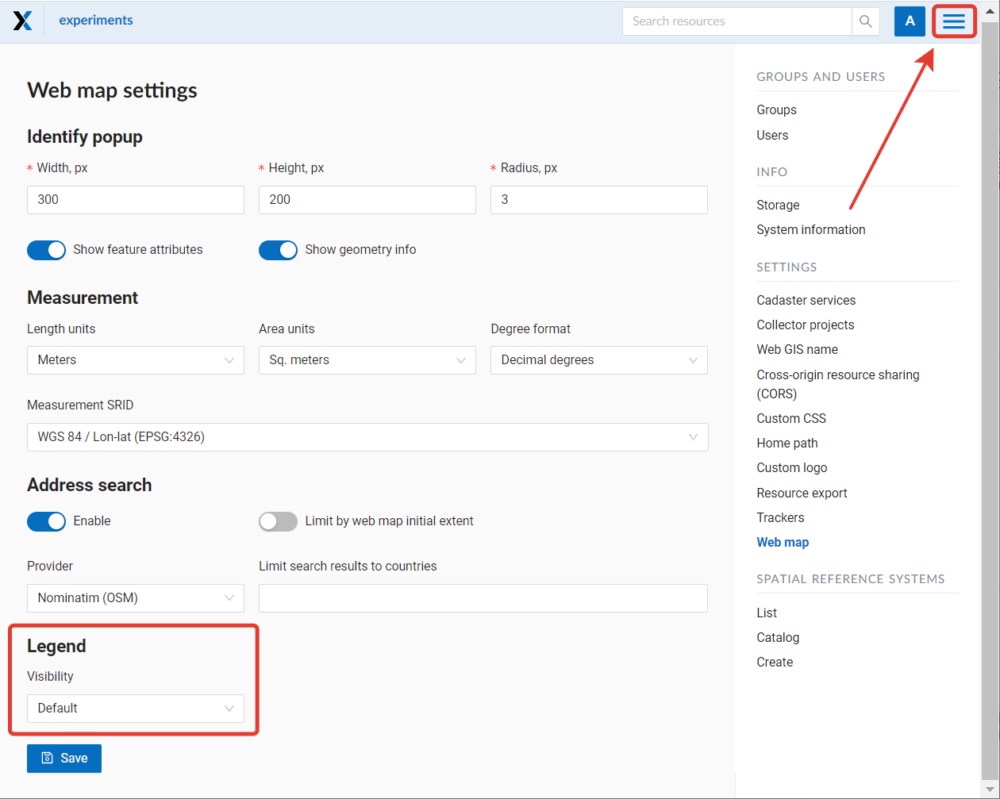
   
   Setting legend visibility for the entire Web GIS

Options for legend visibility are:

* Expand – the legend is displayed in the layer tree. If the style has multiple marker types or colors, a full list will be shown. To collapse the list click on the ^ symbol next to the layer menu.

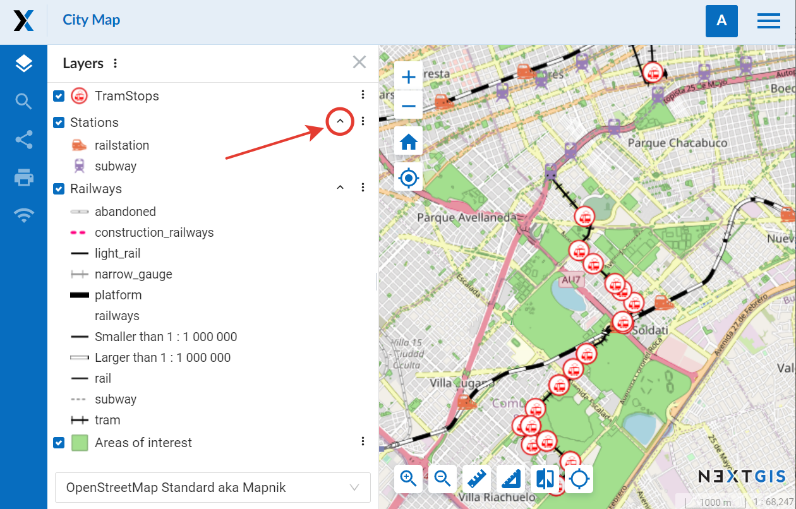
   
   Expanded legend on a Web Map

* Collapse – the legend is displayed, but the list of the map symbols for a specific layer is collapsed when the map is opened. To expand it, click on a table symbol next to the layer menu.

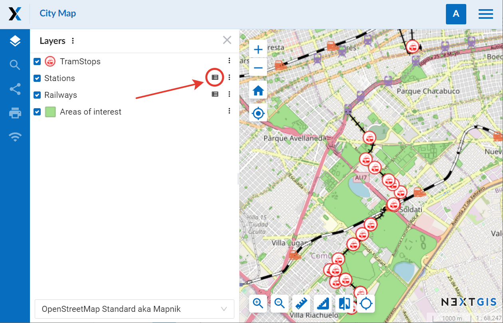
   
   Collapsed legend on a Web Map

* Disable – the legend is not displayed in the layer tree.

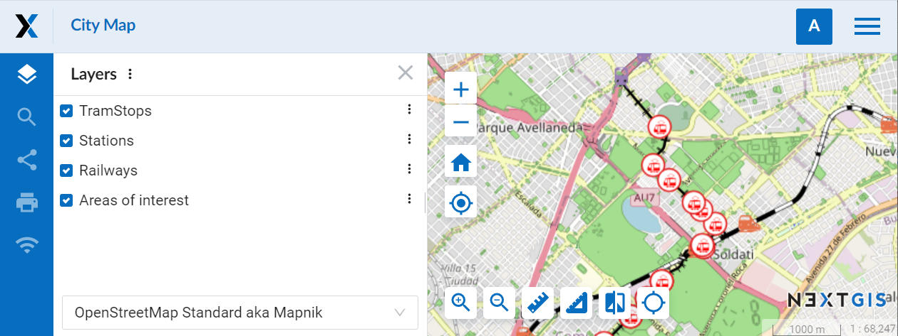
   
   Legend disabled. Only the names of the layers are displayed

* Default – the higher level setting is used. For the layers that have "default" selected for legend visibility, the setting of the Web Map will be used. If the Web Map also has "default" selected, the visibility setting selected for the Web GIS is applied.

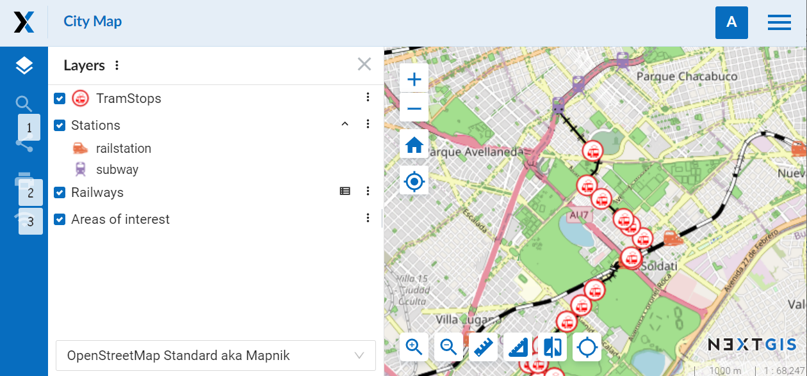
   
   Different legend visibility settings for layers of the same Web Map: 1 – disabled, 2 – collapsed, 3 – expanded

NextGIS Web GIS supports legends for both vector and raster layers. Raster data in geographic information systems can represent vegetation cover and its density, changes in elevation, and other similar indicators. In this case the legend will show the gradient steps and corresponding values of the parameter.

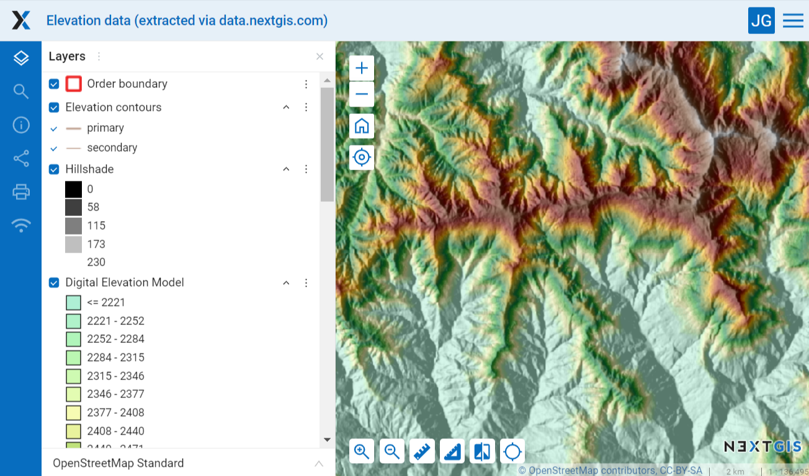

   Legend for raster layers: hillshade and digital elevation model

The way the legend is formed depends on the raster type:

* Multiband color - as it is RGB raster, the legend consists of red, green and blue squares;
* Paletted/unique values - each value is represented with the color it corresponds to;
* Singleband gray - it is a gradient, but the legend shows a set number of symbols (5 by default) marked by value range;
* Singledband pseudocolor - like singleband gray shows symbols marked by value range.

.. _ngw_map_extent:

Extent
--------

In the Settings tab you can set up:

* Initial extent - part of the Web Map that is shown upon its opening
* Constraining extent - users will not be able to zoom out or scroll past this extent

Use the four fields to set the extent measured in degrees.

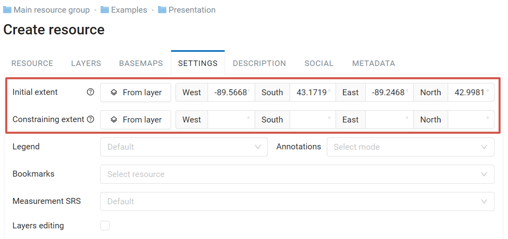

   Extent settings

**Extent from layer** button allows to set Web Map extent from the layer's extent. Click it to open the “Select layer” window, where you can select a layer to use for setting the Web Map extent (see :numref:`ngw_select_resource2`). The four fields for the extent coordinates will be filled in. 

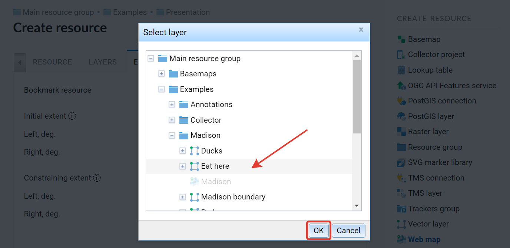

   “Select layer” window

.. tip::
   Extent coordinates could be generated using third-party services, for example http://boundingbox.klokantech.com/ (select csv in a list).

.. _ngw_map_bookmarks:

Bookmarks
----------

In the “Bookmark resource” field of the Settings tab you can select a vector layer with any type of geometry to use for bookmarks.  The Web Map will show bookmarks panel (see :numref:`ngw_bookmarks`) with names defined by “Label attribute” if it is set (see :numref:`bookmark_attribute`).

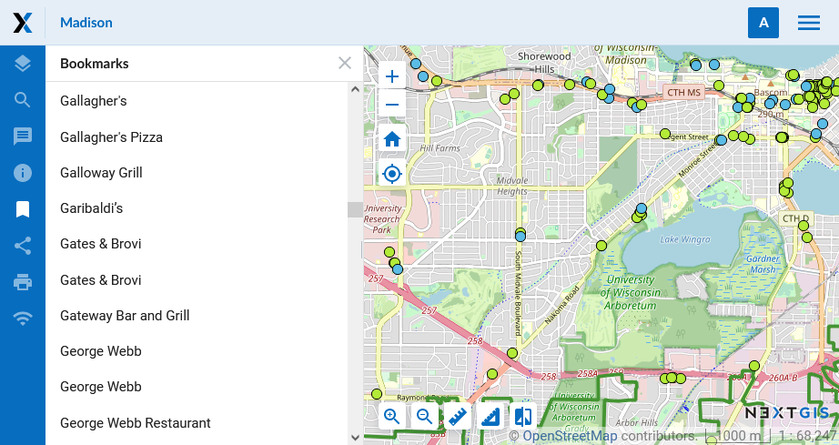
   
   "Bookmarks" tab and the bookmarks viewed on the map

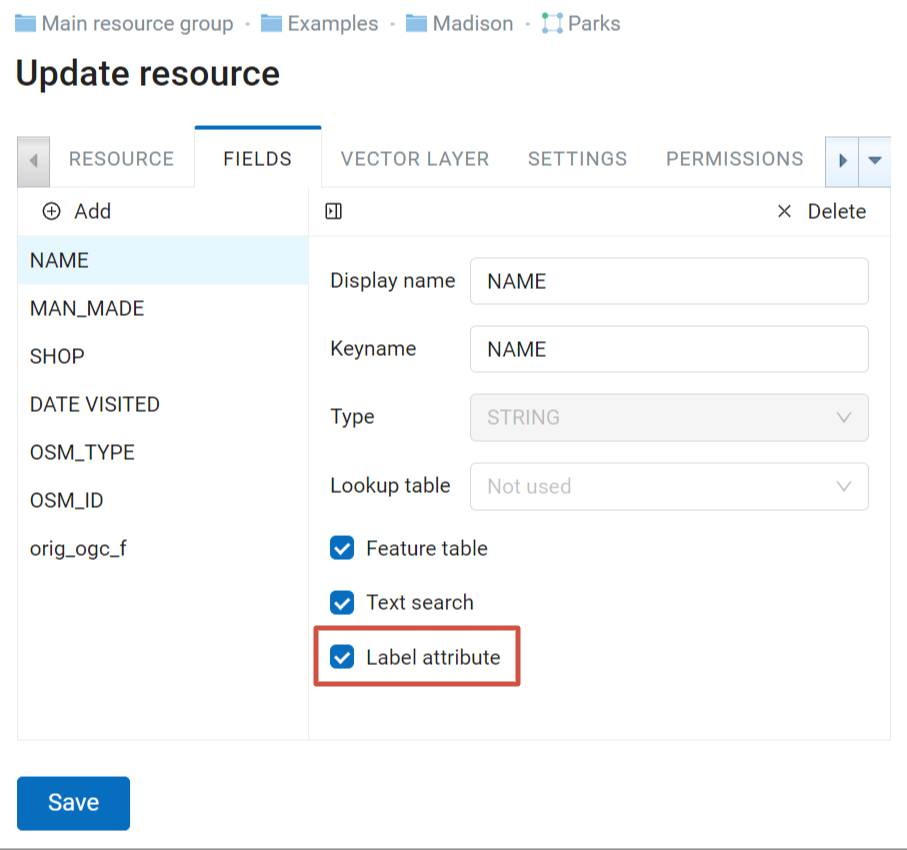
   
   Setting attributes for the vector layer containing boundaries

.. _ngw_map_socials:

Social
-------

The "Social" tab is used to upload an image to be used as preview in social media.

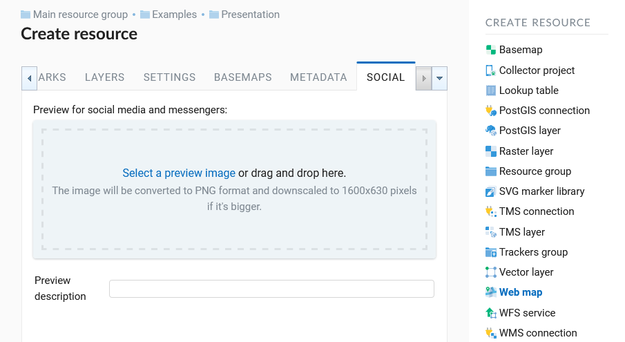
   
   "Social" tab

.. _ngw_map_save:

Final steps
-----------

After creating the map content and adjusting settings for all the layers, click "Save" button. A saved map will be shown in the list of maps. 
Click an icon with a map in the list of Web Maps or select "Display" action in the tab on the Web Map properties page to open it in the viewer. While the Web Map resource page is open, you can also open the map by clicking the "View" button on the right. Web Maps viewer is described :ref:`here <ngw_webmaps_client>`.
A Web Map URL displayed in the viewer may be shared with other users because it is static. 

.. warning::  
   After a map is deleted, its URL will no longer be available.

.. _ngw_webmap_optimize:

How to optimize Web Map performance
----------------------------------------

Web Maps show data rendered by the server. The more of this data you have, the more server resources are needed to render and the more time it takes. There are several techniques you can use to improve your map experience.

**Don't show everything at once**

This is a universal recommendation. Does your user need to see everything after opening the Web Map for the first time? Typically, it is not informative. On broad scales (smaller zooms) it is advisable to show limited amount of data as a start.

**Scale range**

Set a range of `scale levels <https://docs.nextgis.com/docs_ngweb/source/webmaps_admin.html?highlight=scale#admin-webmap-create-layers>`_ for displaying data on a Web Map.
This will allow you to avoid requesting data outside this range and showing excess data where it is not essential.

**Сaching**

Set up `caching <https://docs.nextgis.com/docs_ngweb/source/layers.html#tms-layer>`_ for your layer styles.
In this case, already rendered data will not be re-requested. Note that, while technically it's possible to turn on caching for rasters, this is not recommended.

**Services**

Today's interactive map is often a complex system that might include connections to external services, such as basemaps, WMS, TMS services and more. If you use them on your map, overall speed on it will depend on their performance. Remove them if you don't need them or at least turn them off not to show by default. 
**Select Image as an adapter**

In the Web Map settings, go to the Layers tab and `select <https://docs.nextgis.com/docs_ngweb/source/webmaps_admin.html?highlight=adapter#admin-webmap-create-layers>`_ **Image** as an adapter to allow for faster data processing. We do not recommend using Tiles if it isn't necessary. It slows down the entire Web GIS if large amounts of data are used.

**Raster styles instead of QGIS raster style**

If your map shows big rasters you can add few percents of performance by switching from QGIS raster styles to regular raster styles. Go to your raster, add a raster style (if possible), add them back to your Web map replacing QGIS ones.
