.. _ngw_webmaps_admin:

Веб-карта
==========

В NextGIS Web может быть несколько отдельных веб-карт. Например, одна может быть 
рабочей, вторая – для общего доступа, третья –  тестовая для настройки слоёв.

У разных веб-карт разные URL-адреса. Для разных пользователей и групп пользователей 
можно `задавать права <https://docs.nextgis.ru/docs_ngcom/source/permissions.html>`_ для просмотра разных веб-карт. 

На карте показываются слои. Пользователь может их включать и выключать. В настройках 
можно задавать `порядок <https://docs.nextgis.ru/docs_ngweb/source/webmaps_admin.html#ngw-map-layer-order>`_ следования слоёв, определять, какие слои будут `показываться <https://docs.nextgis.ru/docs_ngweb/source/webmaps_admin.html#admin-webmap-create-layers>`_ 
сразу же при открытии карты, и раскладывать слои по `группам <https://docs.nextgis.ru/docs_ngweb/source/webmaps_admin.html#ngw-map-layer-groups>`_. Группы слоёв на карте 
никак не связаны с группами ресурсов в панели управления. Группы могут быть вложенными.

Для просмотра карты в браузере используется `веб-клиент <https://docs.nextgis.ru/docs_ngweb/source/webmaps_client.html>`_. Чтобы открыть веб-карту, нажмите значок |button_open_web_map| рядом с названием карты в списке ресурсов. Или зайдите на страницу ресурса карты и выберите "Открыть" в панели действий справа.

.. |button_open_web_map| image:: _static/button_open_web_map.png
   :width: 8mm
   :alt: карта с лупой

Вы можете посмотреть два основных сценария создания веб-карты в видео:

.. raw:: html

   <iframe width="560" height="315" src="https://rutube.ru/play/embed/abfd6750a23b013af6221caa6b7a6863/" frameBorder="0" allow="clipboard-write; autoplay" webkitAllowFullScreen mozallowfullscreen allowFullScreen></iframe>

Посмотреть видео на `youtube <https://youtu.be/yd34OMKEED4>`_, `rutube <https://rutube.ru/video/abfd6750a23b013af6221caa6b7a6863/>`_.

Ниже более подробно описываются этапы создания веб-карты и доступные настройки.

.. _ngw_map_create:
    
Создание веб-карты
--------------------

Чтобы отобразить на карте данные, загрузите их в Веб ГИС, создав `слои <https://docs.nextgis.ru/docs_ngweb/source/layers.html>`_ и `стили <https://docs.nextgis.ru/docs_ngweb/source/mapstyles.html>`_ для их отображения.

Для добавления веб-карты следует перейти в группу, где необходимо её создать, нажать кнопку **Создание ресурса** и во всплывающем окне выбрать "Веб-карта" (см. :numref:`ngweb_admin_layers_create_webmap`). 

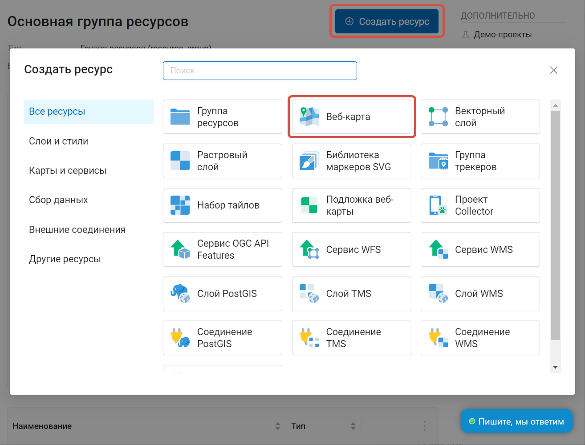

   Выбор типа ресурса "Веб-карта" 
   
В результате этих действий откроется окно, представленное на :numref:`ngweb_admin_webmap_name`. 

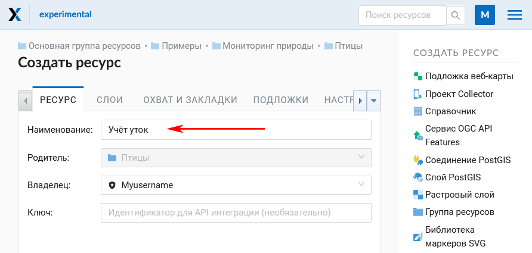

   Окно создания веб-карты

Далее следует ввести наименование веб-карты, которое будет отображаться в административном веб-интерфейсе и в :ref:`веб-клиенте <ngw_webmaps_client>` для просмотра карт (Можно задать заголовок веб-карты для веб-клиента, отличающийся от наименования ресурса, в панели `"Настройки" <https://docs.nextgis.ru/docs_ngweb/source/webmaps_admin.html#ngw-map-settings>`_). Поле "Ключ" является необязательным к заполнению.

Можно добавить **описание** ресурса и **метаданные** на соответствующих вкладках. 

.. _ngw_map_layers:

Слои веб-карты
-----------------

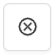

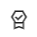

На  вкладке "Слои" можно добавлять слои, объединять их в группы и удалять их, а также менять порядок слоёв, для чего предусмотрены соответствующие кнопки "Добавить слой", "Добавить группу", "Изменить порядок рисования слоёв" и "Удалить слой" (крестик в конце строки). 

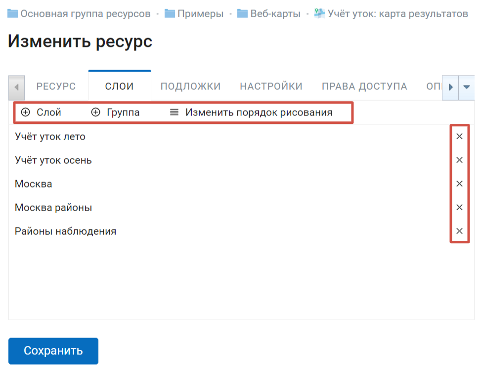

   Вкладка "Слои"

Для того, чтобы отобразить данные слоя на карте, необходимо создать для него хотя бы один стиль. О создании стилей для различных типов слоёв можно прочитать `здесь <https://docs.nextgis.ru/docs_ngweb/source/mapstyles.html>`_. 

Нажмите **+ Слой** и выберите во всплывающем окне нужный стиль.

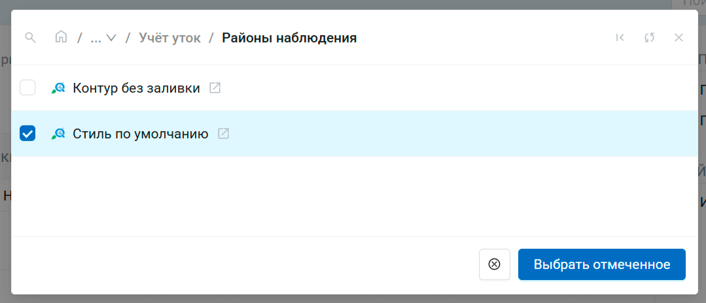
   
   Окно добавления стиля слоя на веб-карту

Если вы видите, что у нужного слоя ещё нет стиля, нажмите значок |button_open_resource|. В новой вкладке отроется страница ресурса слоя. На ней вы можете `создать стиль <https://docs.nextgis.ru/docs_ngweb/source/mapstyles.html>`_.

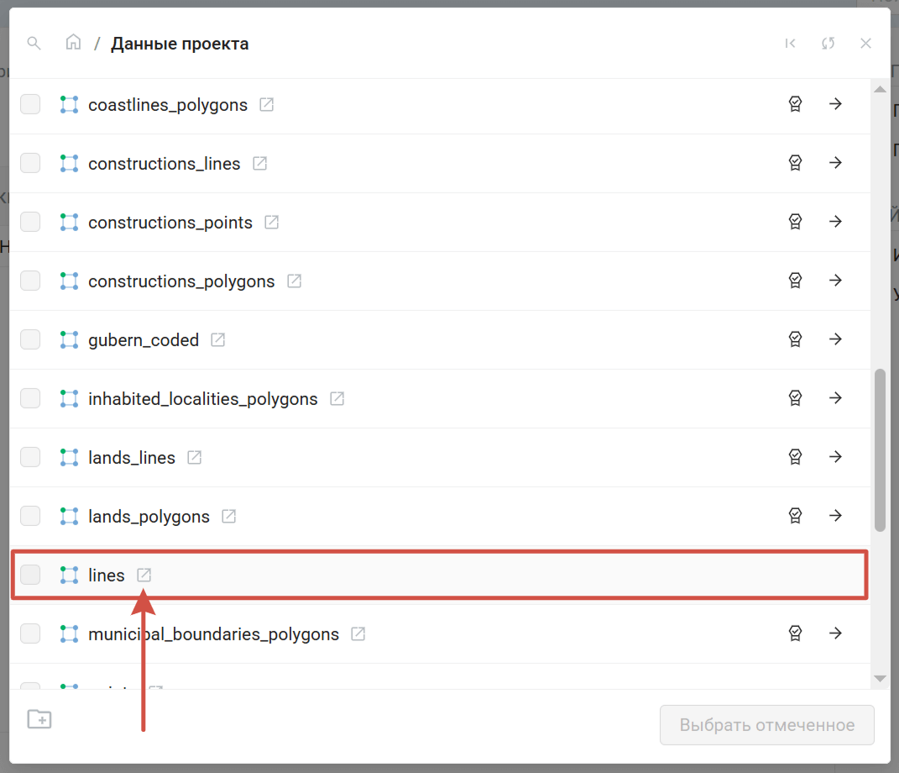

   Открыть ресурс слоя в новой вкладке

После того, как стиль создан, вернитесь на вкладку, где открыто окно выбора ресурсов, и нажмите |button_refresh| "Обновить". Созданный вами стиль отобразится в дереве ресурсов и его можно будет выбрать для добавления на веб-карту.

Можно добавить несколько стилей сразу. Слои, стили которых выбраны для добавления, отмечаются синей точкой. Вы можете перемещаться между группами ресурсов и отмечать нужные стили в разных слоях. На кнопке **Выбрать отмеченное** внизу отображется общее количество выбранных стилей. Чтобы снять выделение, нажмите кнопку |button_clear_selection| рядом с ней.

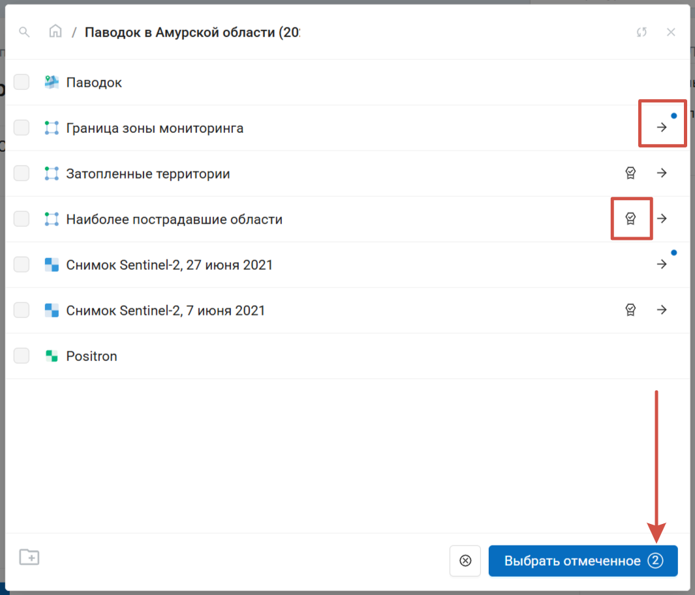
   
   Добавление нескольких стилей слоёв на веб-карту. Отмечено два стиля

Чтобы добавить стиль, не обязательно переходить внутрь слоя и выбирать сам стиль. Нажмите значок |button_pick_first| справа от имени слоя, чтобы выделить первый подходящий стиль.

Настройки слоёв на веб-карте представлены на :numref:`admin_webmap_create_layers`.

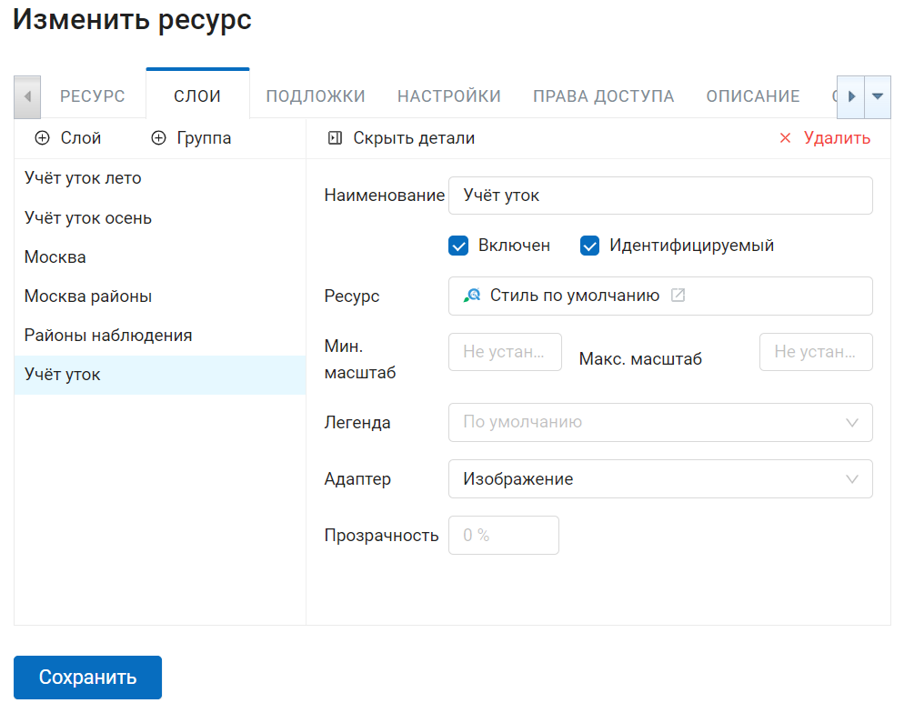
   
   Настройки слоёв на веб-карте
 
Поле "Включен" обозначает, что при открытии страницы карты этот слой 
будет по умолчанию отображаться.

Поле "Прозрачность" обозначает степень просвечивания слоя на карте. 
Прозрачность каждого слоя может быть настроена от 0 до 100 %. Слой со степенью 
прозрачности 1 % является практически непрозрачным. Совершенно прозрачный слой 
имеет степень прозрачности 100 %.

В поле "Адаптер" рекомендуется выставить значение "Изображения" (отрисовка в виде единой картинки на всю карту), если нет каких-либо особых требований. Также в этом поле можно выбрать значение "Тайлы" (изображения размером 256 x 256 пикселов). 

.. tip:: Адаптер "Тайлы" используется, например, для того чтобы корректно отображались объекты, пересекающие 180 меридиан. Посмотреть видео на `rutube <https://rutube.ru/video/8c7d98d7332b1483d731eb70645ca3f2/>`__.

Можно также указать диапазон масштабов, в которых будет отбражаться слой, при помощи полей "Мин. масштаб" и "Макс. масштаб". Минимальный масштаб соответствует более мелкомасштабному отображению, а максимальный - более крупномасштабному. Например, для отображения слоя в диапазоне от 1 : 250 000 до 1 : 5 000, первое значение должно соответствовать минимальному масштабу, а второе - максимальному.  Минимальный и максимальный масштаб можно указывать в стиле слоя и в настройках слоя.
   
.. note:: 
   Минимальный и максимальный масштаб можно указывать не только в настройках слоя веб-карты, но и в стиле слоя (`пример <https://docs.nextgis.ru/docs_ngweb/source/mapstyles.html#osm-water-line>`_). Однако если весь слой не надо показывать на каком-то диапазоне масштабов, то это лучше задать в настройках слоя веб-карты. Если же выставить ограничение масштаба только в стиле, то в этом диапазоне масштабов будут отдаваться пустые тайлы, что неэффективно.

Чтобы вернуться к списку слоёв, нажмите **Скрыть детали**.

.. _ngw_map_layer_groups:

Группы слоёв
~~~~~~~~~~~~~

Слои, добавленные на карту, можно объединять в группы. Это повлияет только на отображаемое на веб-карте дерево слоёв, делая легенду более наглядной. На расположение слоёв в группах ресурсов их группировка на конкретной веб-карте не влияет.

Для добавления новой группы нажмите **+ Группа**. Чтобы поместить слой в группу, перетащите его.

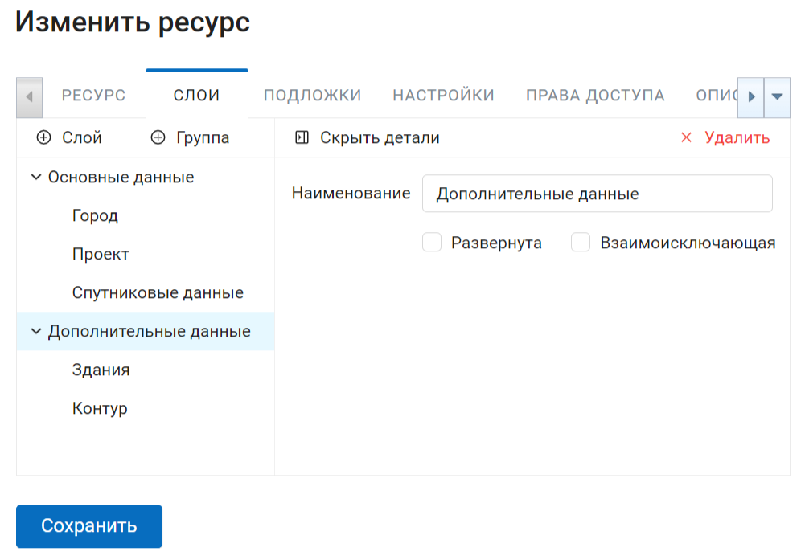
   
   Настройки группы слоёв на веб-карте

Опция **Развернута** определяет вид группы в дереве слоёв при открытии веб-карты.

Если включена опция **Взаимоисключающая**, то только один слой из группы может отображаться на карте. При активации любого из слоёв группы остальные входящие в неё слои скрываются. Это может быть удобно, например, при добавлении группы слоёв спутниковых данных, которые перекрывают друг друга полностью.

Чтобы вернуться к списку слоёв, нажмите **Скрыть детали**.

.. _ngw_map_layer_order:

Порядок рисования слоёв на веб-карте
~~~~~~~~~~~~~~~~~~~~~~~~~~~~~~~~~~~~~~~

Кнопка **Изменить порядок рисования** открывает панель, в которой можно задать порядок отрисовки слоёв на карте, отличающийся от их порядка в списке слоёв. Эта функция нужна для демонстрации слоёв при сохранении исходного разбиения слоёв на папки.

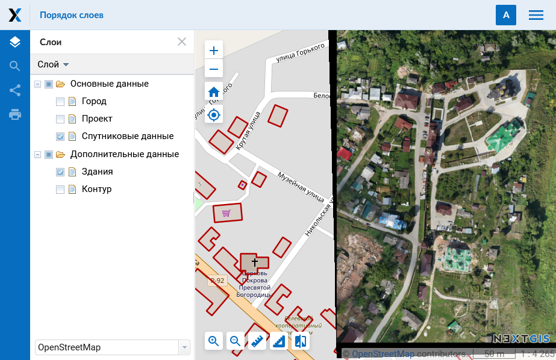
   
   Порядок слоёв как есть: аэрофотоснимки загораживают слой со зданиями

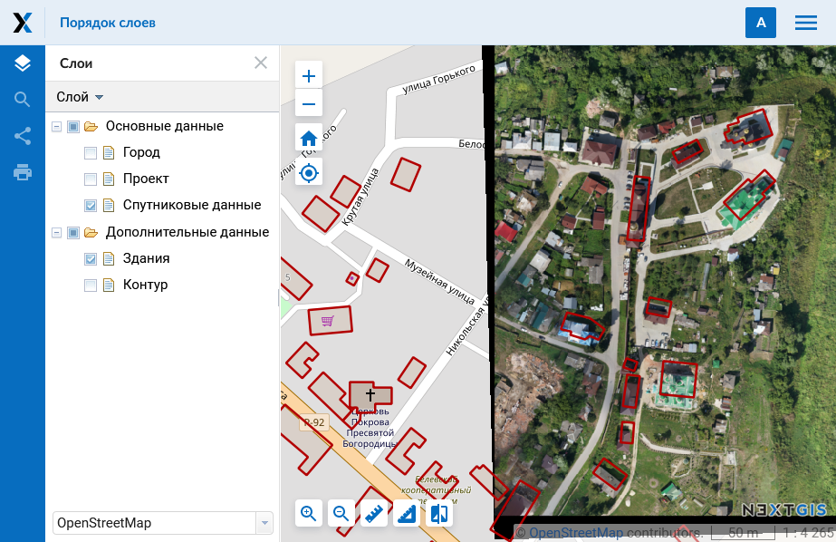
   
   Другой порядок слоёв: слой со зданиями рисуется выше аэрофотоснимков, но структура слоёв слева не изменена

Выставив нужный порядок, нажмите "Назад к слоям и группам", чтобы вернуться к списку слоёв. Нажмите **Сохранить**, чтобы сохранить внесённые изменения.

Чтобы сбросить порядок отрисовки слоёв до исходного, в панели изменения порядка рисования нажмите **Порядок рисования по умолчанию**.

.. _ngw_map_basemaps:

Подложки 
--------
 
На  вкладке "Подложки" можно добавлять подложки и удалять их, для чего предусмотрены соответствующие 
кнопки "Добавить" и "Удалить" (см. :numref:`admin_webmap_basemaps`). 

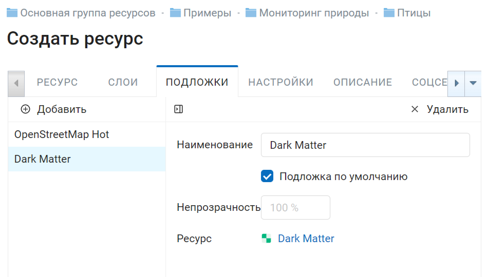

   Вкладка "Подложки"

Для каждой подложки можно настроить наименование, отличное от названия ресурса. 

Поле "Непрозрачность" обозначает степень просвечивания подложки на карте, настраивается в процентах.

Если поставить флажок "По умолчанию", то при открытии страницы карты будет отображаться именно эта подложка.

.. _ngw_create_basemap:

Создание подложки веб-карты
~~~~~~~~~~~~~~~~~~~~~~~~~~~~~~~

Нажмите кнопку **Создать ресурс** и выберите из списка **Подложка веб-карт** (:numref:`ngweb_admin_create_basemap`).
В открывшемся окне введите название ресурса, которое будет отображаться в административном интерфейсе (:numref:`ngweb_admin_basemap_name`).

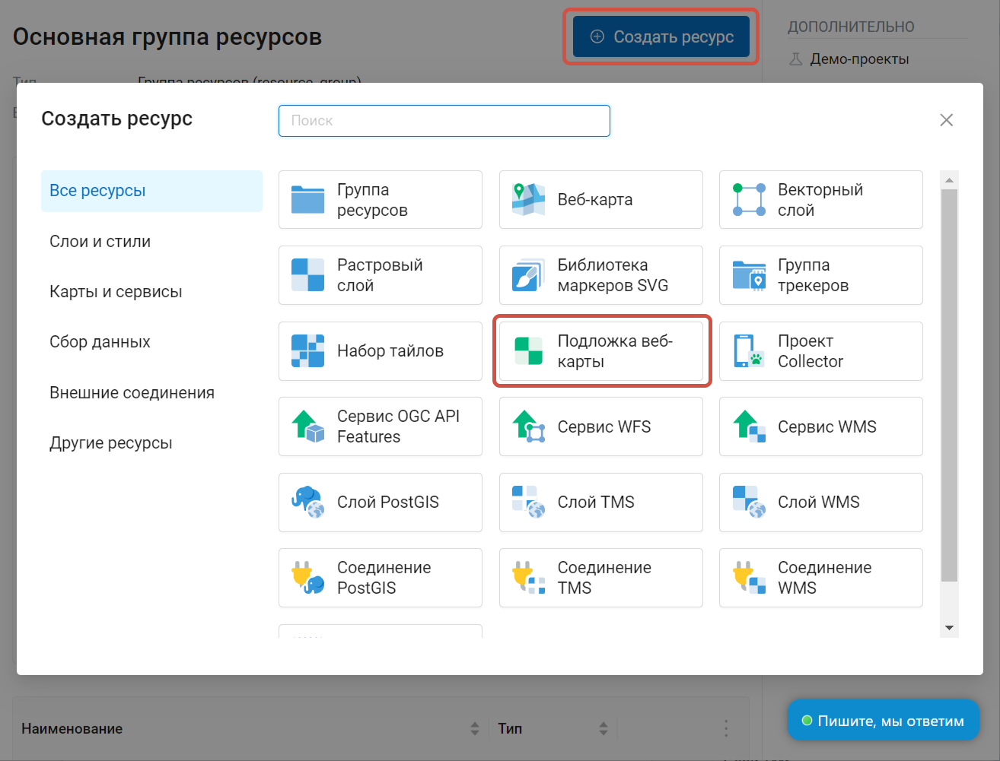

   Выбор типа ресурса "Подложка веб-карты"
   
   
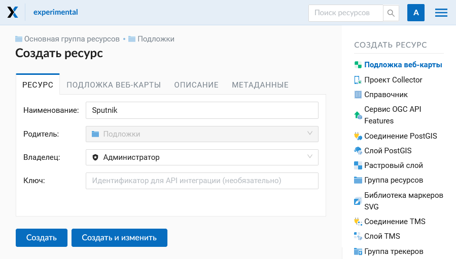

   Наименование подложки веб-карты
   
   
На соответствующих вкладках можно добавить "Описание" и "Метаданные" ресурса (:numref:`ngweb_admin_basemap_desc`).
Как правило, метаданные используются для разработки сторонних приложений с помощью `API <https://docs.nextgis.ru/docs_ngweb_dev/doc/developer/toc.html>`_.

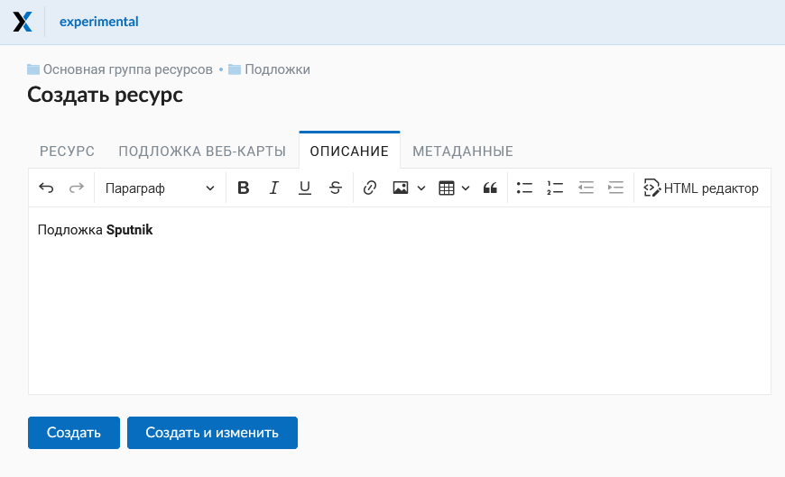

   Описание подложки веб-карты
   

На вкладке "Подложка веб-карты" задается URL-адрес TMS сервиса (:numref:`ngweb_admin_basemap_param`). Есть два пути для его указания:

* Найти нужный сервис в строке поиска. Остальные поля будут заполнены автоматически.
* Ввести адрес вручную. 

Внизу отображается превью подложки. Его можно сравнить со стандартной подложкой OpenStreetMap, нажав на кнопку |button_toggle_basemap| и двигая ползунок прозрачности.

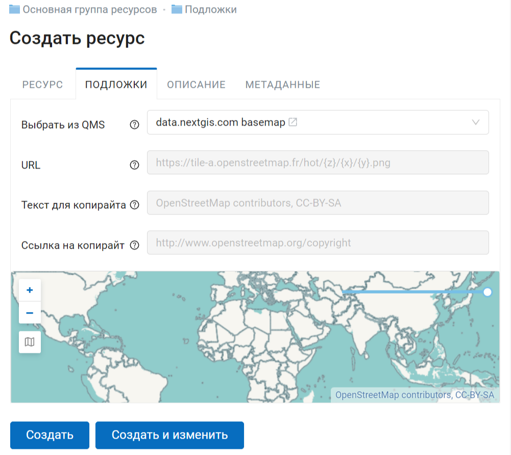

   Параметры подложки веб-карты

.. _ngw_map_no_base:

Карта без подложки
~~~~~~~~~~~~~~~~~~~

По умолчанию веб-карта создаётся с подложкой OpenStreetMap. Если нужно получить карту без подложки, 
создайте новую подложку, добавьте её к веб-карте и отключите флажок "По умолчанию".

Посмотрите, как это работает, в нашем видео:

.. raw:: html

   <iframe width="560" height="315" src="https://rutube.ru/play/embed/57ace793b43f9c145be6924b98f174c2/" frameBorder="0" allow="clipboard-write; autoplay" webkitAllowFullScreen mozallowfullscreen allowFullScreen></iframe>

Смотреть на `youtube <https://youtu.be/yFYByTiybMU>`__, `rutube <https://rutube.ru/video/57ace793b43f9c145be6924b98f174c2/>`__.

.. _ngw_layer_as_basemap:

Как использовать любой слой вашей Веб ГИС как подложку
~~~~~~~~~~~~~~~~~~~~~~~~~~~~~~~~~~~~~~~~~~~~~~~~~~~~~~~

Любой слой (стиль), созданный в Веб ГИС, можно использовать как источник тайлового сервиса и подключать его как **подложку** (базовую карту).
Для этого следует:

1. Создать нужный `слой <https://docs.nextgis.ru/docs_ngweb/source/layers.html#ngw-create-layers>`_ (векторный или растровый) и `стиль <https://docs.nextgis.ru/docs_ngweb/source/mapstyles.html#qgis>`_ для него. Внутри стиля будет ссылка **TMS сервиса** - она понадобится далее;  
2. Включить `кэширование <https://docs.nextgis.ru/docs_ngweb/source/mapstyles.html#ngw-create-tile-cache>`_ (для ускорения работы на веб-карте, доступно только на плане `Premium <https://nextgis.ru/pricing-base/>`_);
3. Создать ресурс "Подложка веб-карты" со снятой галочкой "Использовать настройки из QMS" и URL-адресом (ссылкой) вышесозданного TMS слоя.

.. _ngw_map_settings:

Настройки
---------

На вкладке "Настройки" можно:

* задать заголовок, который будет отображаться на веб-карте вместо имени ресурса;
* настроить `легенду <https://docs.nextgis.ru/docs_ngweb/source/webmaps_admin.html#ngw-legend>`_;
* включить аннотации (о работе с аннотациями  см. `здесь <https://docs.nextgis.ru/docs_ngweb/source/annotation.html>`__);
* выбрать систему координат для измерений;
* разрешить `редактирование слоёв <https://docs.nextgis.ru/docs_ngweb/source/feature_edit.html>`_;
* выбрать начальный и ограничивающий `охват <https://docs.nextgis.ru/docs_ngweb/source/webmaps_admin.html#ngw-map-extent>`_;
* выбрать ресурс `закладок <https://docs.nextgis.ru/docs_ngweb/source/webmaps_admin.html#ngw-map-bookmarks>`_;
* `установить видимость <https://docs.nextgis.ru/docs_ngweb/source/webmaps_admin.html#ngw-map-additional>`_ панелей и элементов идентификации объектов.

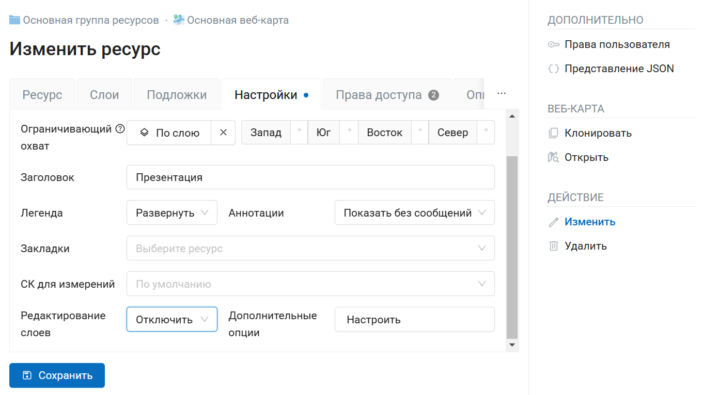
   
   Вкладка "Настройки" 

.. _ngw_legend:

Легенда
-------

Используемые на карте условные обозначения могут нуждаться в дополнительной расшифровке. На бумажных картах и в атласах для этого используется легенда - отдельная страница атласа или врезка на карте, в которой расписано, какой знак что обозначает. 

В NextGIS Web можно добавить информацию об условных обозначениях карты двумя способами:

Включить условные обозначения в дерево слоёв. Будут использованы маркеры, выбранные в стиле слоя.
Если этого не хватает, добавить расшифровку условных обозначений отдельно в `панели «описание» <https://docs.nextgis.ru/docs_ngcom/source/webmap_create.html#ngcom-webmap-create-info>`_ (i в кружочке).

В настройках NextGIS Web под «легендой» понимается именно отображение условных обозначений в дереве слоёв веб-карты, непосредственно под слоем.

Видимость легенды может задаваться на уровнях разных ресурсов. Таким образом вы можете эффективно решить разные задачи, от “включить легенду везде”, до “настроить легенду только на отдельной карте”. Настраивать видимость легенды можно: 

* на уровне конкретного слоя веб-карты
* на уровне всей веб-карты (все слои)
* на уровне всей Веб ГИС

На уровне слоя веб-карты видимость легенды задается в настройках веб-карты на вкладке «Слои».

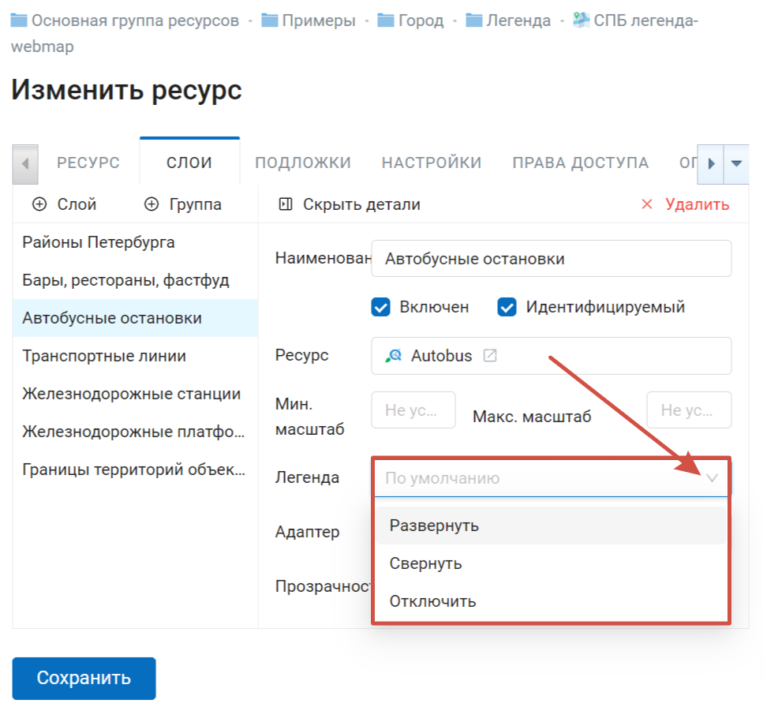

   Настройка видимости легенды отдельных слоёв

Режим видимости легенды для веб-карты в целом задаётся во вкладке «Настройки»:

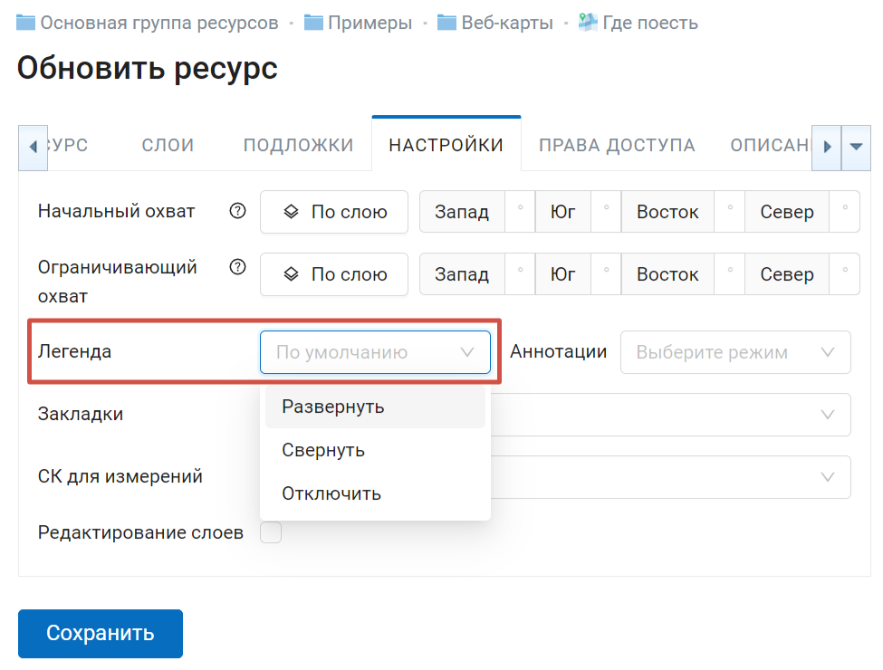
   
   Настройка видимости легенды для всей карты

Также можно задать значение «по умолчанию» для всей Веб ГИС: Панель управления – Веб-карта – Легенда. Выбранный здесь режим будет использоваться, если значение «по умолчанию» выставлено как для слоя, так и для веб-карты.

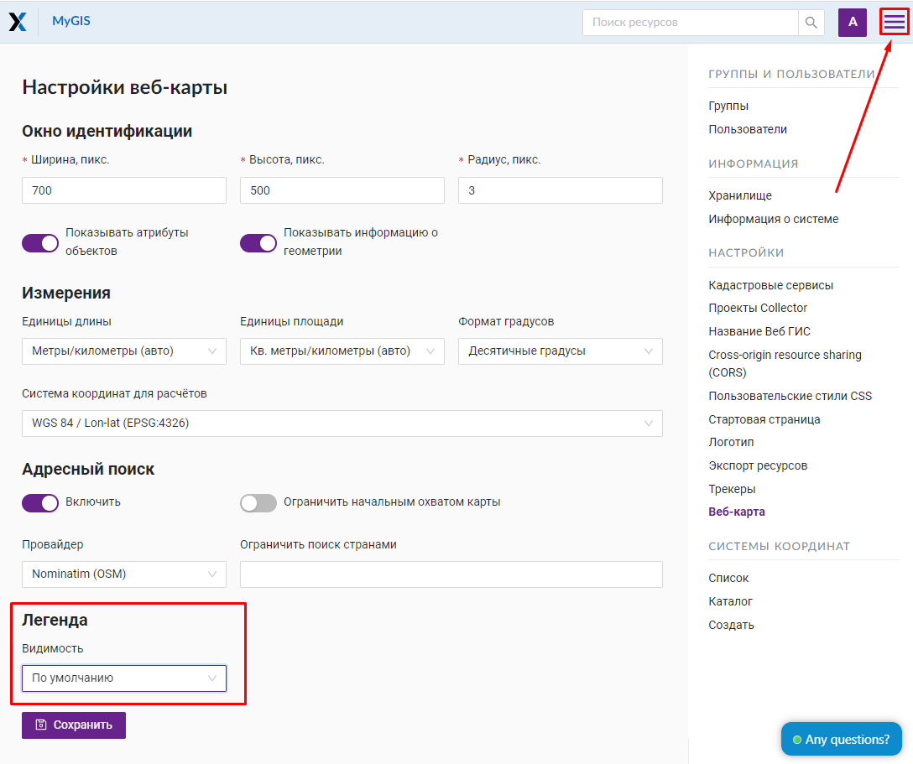
   
   Настройка видимости легенды для Веб ГИС в целом

Режимы видимости легенды следующие:

* Развернуть – легенда отображается в дереве слоёв, если стиль включает разные типы или цвета маркеров, то будет отображаться их полный список. Этот список можно свернуть, нажав на стрелочку рядом с меню слоя.

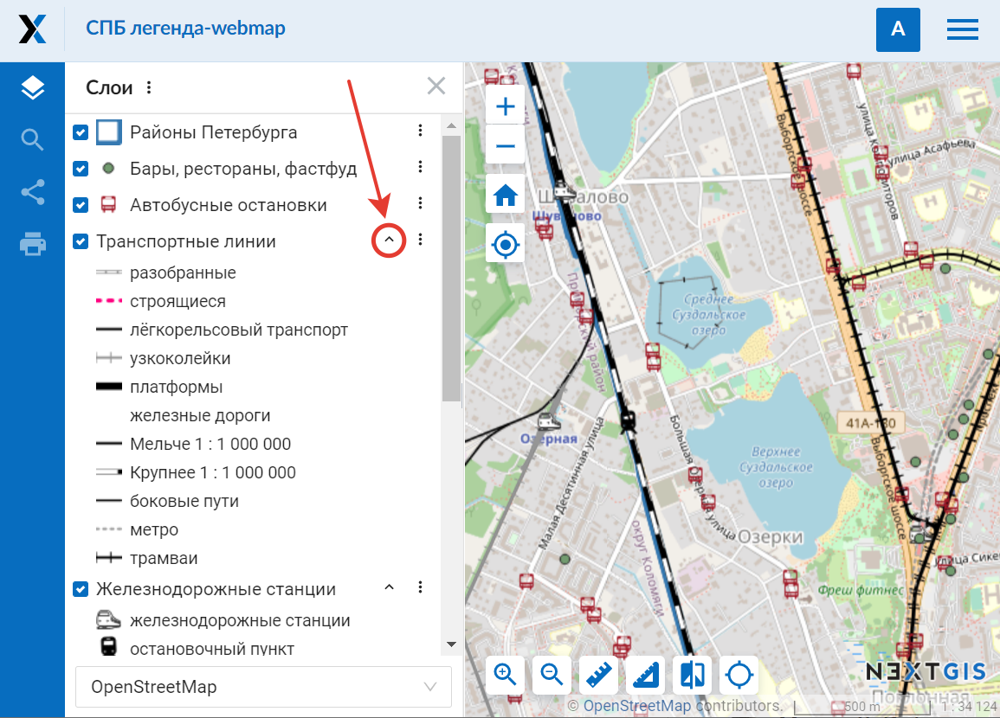
   
   Легенда на веб-карте показана в развёрнутом виде

* Свернуть – легенда отображается, но список условных обозначений отдельного слоя будет свёрнут при открытии карты. Чтобы развернуть его, нужно нажать на значок таблички рядом с меню слоя.

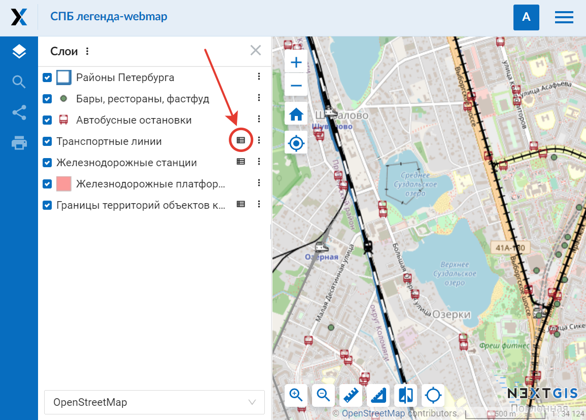
   
   Легенда на веб-карте свернута

* Отключить – легенда не отображается в дереве слоёв.

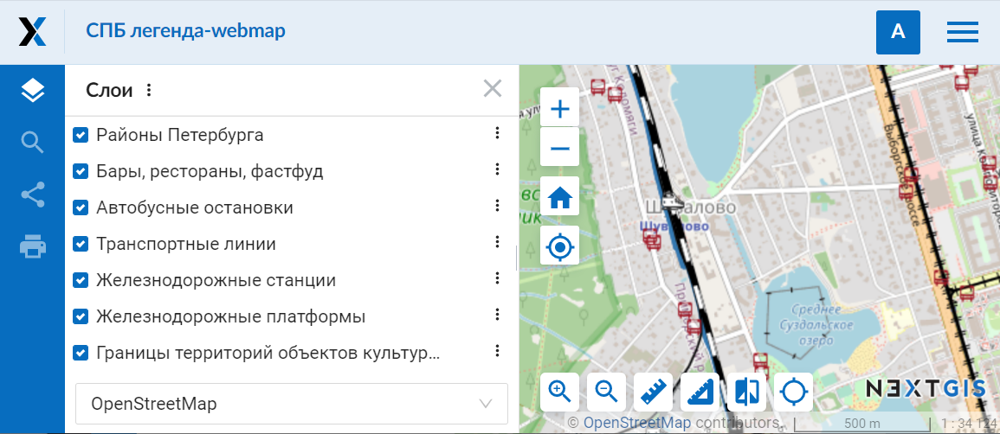
   
   Легенда отключена. Для всех слоёв отображается только название

* По умолчанию – используется более общая настройка. Для тех слоёв, для которых режим отображения легенды выбран «по умолчанию», будет использоваться настройка карты. Если и у веб-карты также стоит значение «по умолчанию» – работает общая настройка Веб ГИС.

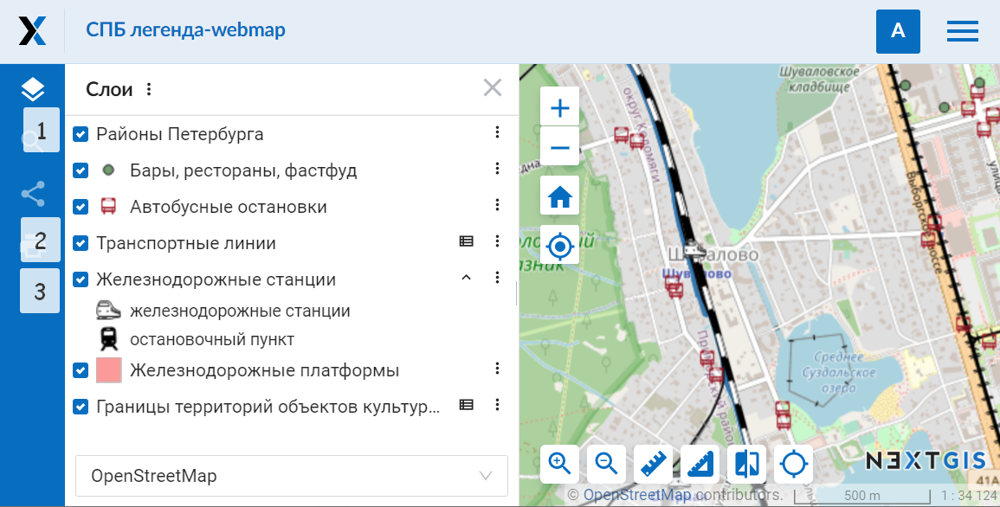
   
   Разные режимы видимости легенды для отдельных слоёв одной карты: 1 – отключена, 2 – свёрнута, 3 – развёрнута

Для растровых слоёв в Веб ГИС также поддерживается легенда. Растровые данные в геоинформационных системах могут отражать растительный покров и его плотность, рельеф поверхности и другие подобные показатели. В таком случае легенда будет отображать градиент используемых цветов в соотношении со значениями показателя.

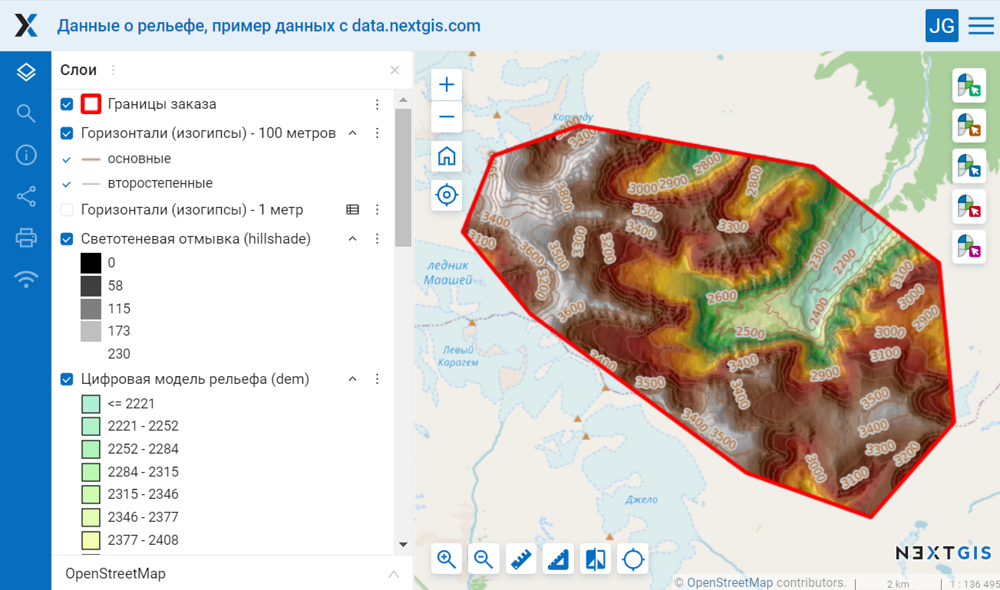

   Легенда растровых слоёв на веб-карте: светотеневая отмывка и цифровая модель рельефа 

Соотношение зависит от типа растра.

* Многоканальное цветное - растр в формате RGB, соответственно в легенде квадратики красного, зелёного и синего цвета;
* Палитра (уникальные значения) - легенда содержит список всех значений и соответствующих им цветов;
* Одноканальное серое - растр представляет собой непрерывный градиент, но в легенде отображается заданное количество символов (по умолчанию 5), для каждого из которых обозначено пороговое значение;
* Одноканальное псевдоцветное - аналогично одноканальному серому отображает символы с диапазоном значений.

Процесс и результат настройки легенды также демонстрируются в видео:

.. raw:: html

   <iframe width="560" height="315" src="https://rutube.ru/play/embed/b13377cbe4f79b985ebbda2469295438/" frameBorder="0" allow="clipboard-write; autoplay" webkitAllowFullScreen mozallowfullscreen allowFullScreen></iframe>

Посмотреть на `youtube <https://youtu.be/AToQmohz6QQ>`__, `rutube <https://rutube.ru/video/b13377cbe4f79b985ebbda2469295438/>`__.

.. _ngw_map_extent:

Охват
------

На вкладке "Настройки" можно задать:

* Начальный охват - с таким охватом будет открываться веб-карта.
* Ограничивающий охват - на веб-карте нельзя будет выйти за его пределы.

Охват задается четырьмя значениями в градусах.

Есть несколько вариантов задать охват.

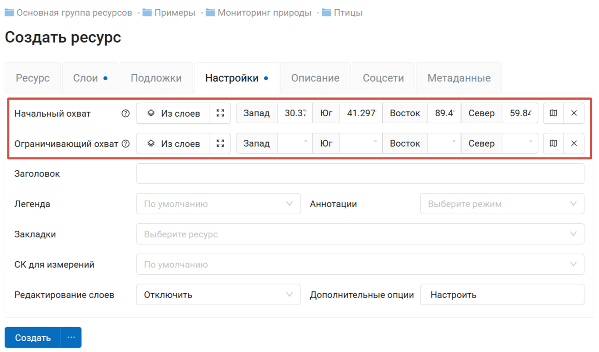

   Настройки охвата

Кнопка **Из слоёв** позволяет установить охват веб-карты по охвату любого выбранного слоя. 
Если нажать её, то откроется окно "Выберите слой" с деревом ресурсов, из которого можно выбрать слой, по которому будет установлен охват веб-карты (см. :numref:`ngw_select_resource2`). При этом будут заполнены четыре строки с координатами охвата.

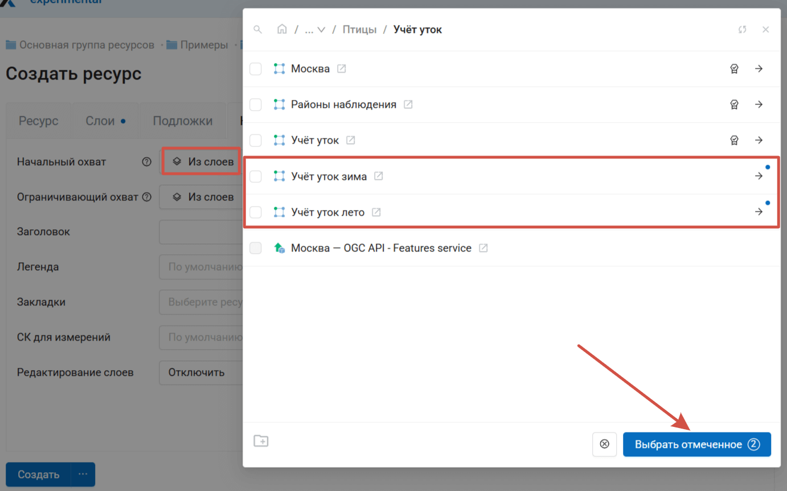

   Окно "Выберите слои": выбрано два слоя

Если нажать кнопку |button_extent_all|, охват установится так, что в него попадут данные всех добавленных на карту слоёв.

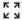

Нажав |button_toggle_basemap|, вы можете задать нужный охват на карте.

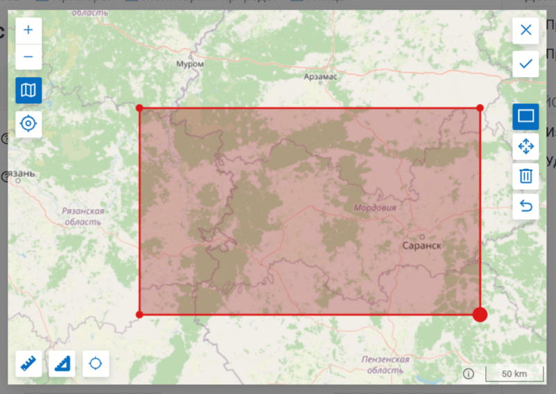

   Ввод границ охвата с карты

Также можно ввести координаты вручную.

Посмотреть, как настраивается и работает начальный и ограничивающий охват карты, можно в нашем видео:

.. raw:: html

   <iframe width="560" height="315" src="https://rutube.ru/play/embed/62a7266ee8bc054f85b675e74314644b/" frameBorder="0" allow="clipboard-write; autoplay" webkitAllowFullScreen mozallowfullscreen allowFullScreen></iframe>

Посмотреть видео на `youtube <https://youtu.be/KkihLvSYWmc>`__, `rutube <https://rutube.ru/video/62a7266ee8bc054f85b675e74314644b/>`__.

.. _ngw_map_bookmarks:

Закладки
---------

В поле "Закладки" можно указать векторный слой с любым типом геометрии. Тогда на Веб карте появится панель 
закладок (см. :numref:`ngw_bookmarks`). Названия закладок будут браться из "Атрибут наименования" (см. :numref:`bookmark_attribute`) если он установлен. 

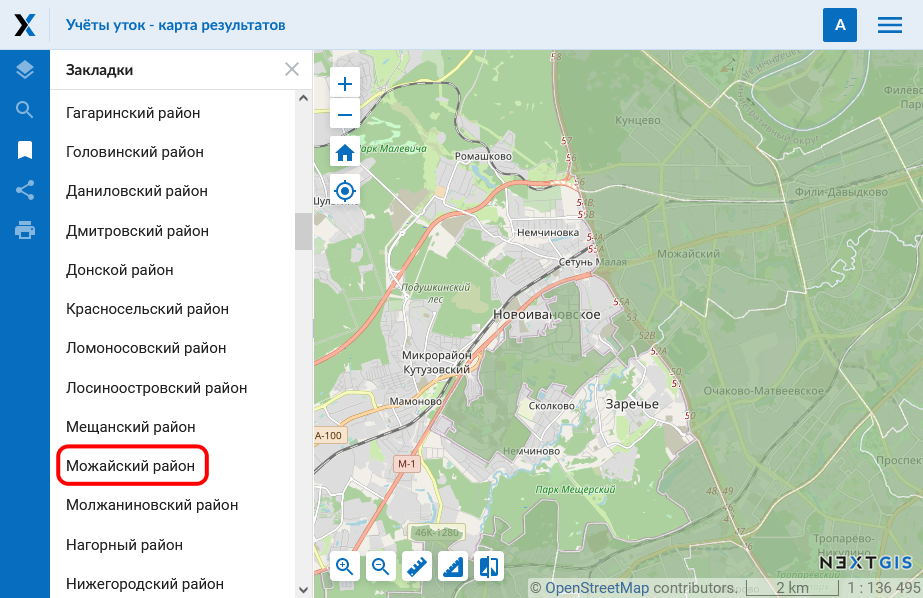
   
   Панель закладок и отображение по клику на Веб-карте

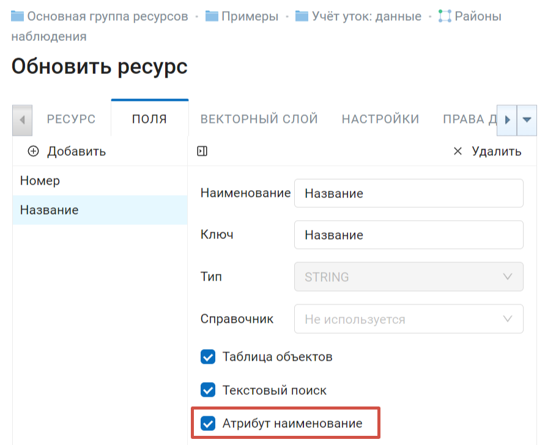
   
   Установка Атрибута наименования для векторного слоя границ районов

.. _ngw_map_additional:

Отображение панелей и элементов идентификации
----------------------------------------------

В разделе "Дополнительные опции" настроек веб-карты можно включить или выключить отображение следующих элементов:

* панели: `Кадастровые сервисы <https://docs.nextgis.ru/docs_ngweb/source/cadaster.html#ngw-cadaster-identify>`_ и `Трекеры <https://docs.nextgis.ru/docs_ngweb/source/trackers.html#tracking-web-map>`_;
* атрибуты объектов в панели идентификации;
* информация о геометрии в панели идентификации.

Можно установить один из трёх вариантов: "Да" - показывать, "Нет" - не показывать, "Авто" - будет применяться `настройка <https://docs.nextgis.ru/docs_ngweb/source/webmap_set.html#ngw-contr-panel-webmap-settings>`_, установленная для Веб ГИС в целом. Чтобы поставить режим "Авто", нажмите на крестик в правой части поля.

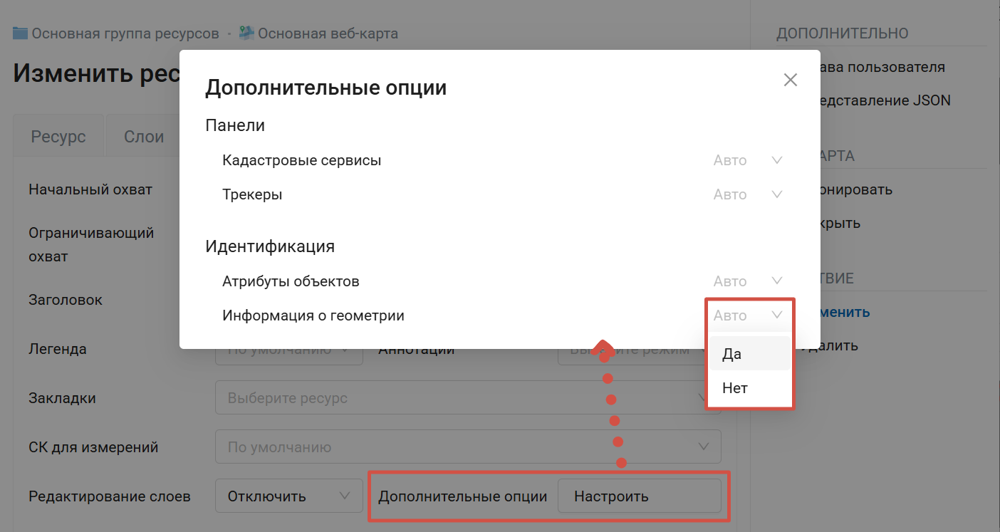

   Дополнительные опции веб-карты

.. _ngw_map_socials:

Соцсети
-------

На этой вкладке можно выбрать изображение для предпросмотра, которое будет использовано в соцсетях.

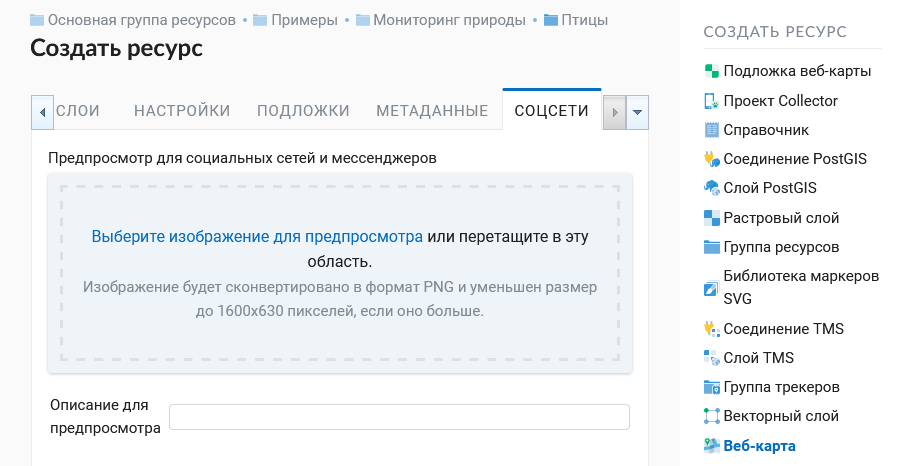
   
   Вкладка "Соцсети"

.. _ngw_webmap_create_info:

Описание
---------

На вкладке "Описание вы можете задать текстовое описание, гиперссылки, вставить изображение легенды с помощью URL или сохраненного в буфере обмена изображения.

`Пример <https://demo.nextgis.ru/resource/5467/display?panel=info>`__  Веб-карты с легендой в описании.

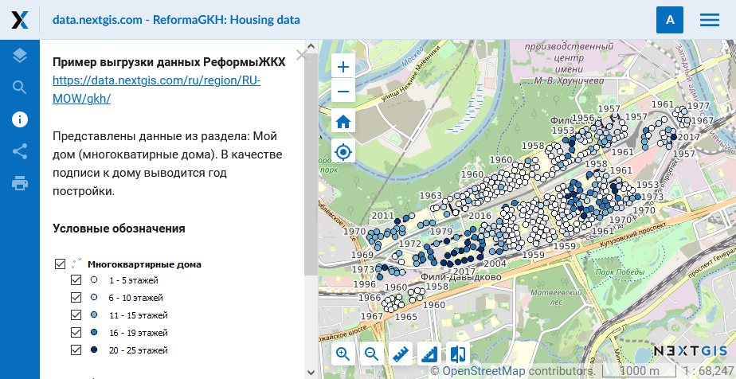
   
   Описание и легенда Веб-карты

Чтобы просмотреть описание, откройте Веб-карту и в левой части рабочей области активируйте соответствующую панель (иконка информации - кружок с буквой i). Информация в этой панели будет соответствовать заданной через настройки Веб-карты.

Чтобы поделиться Веб-картой с открытым описанием, скопируйте ссылку из адресной строки браузера. Ссылка должна заканчиваться на **panel=info**. При переходе по такой ссылке откроется Веб-карта сразу с полным описанием.

Легенда также отображается в дереве слоёв, о том, как настроить её вид, можно прочитать `выше <https://docs.nextgis.ru/docs_ngweb/source/webmaps_admin.html#ngw-legend>`_.

.. _ngw_map_save:

Завершение создания веб-карты
------------------------------

После всех настроек нажмите "Сохранить". После сохранения созданная карта появится в списке карт. 
При нажатии на иконку в виде карты в списке ресурсов веб-карта будет открыта в браузере. Находясь
на странице ресурса веб-карты можно также открыть ее выбрав "Просмотр"в панели справа. 

Веб-клиент подробнее рассмотрен в главе :ref:`ngw_webmaps_client`.
Адрес, по которому открывается веб-клиент, можно передавать другим пользователям, 
он статичный. 

.. warning:: 
   При удалении карты адрес больше доступен не будет.

.. _ngw_webmap_optimize:

Как оптимизировать работу Веб-карты
--------------------------------------

На Веб-карте показываются данные, отрисовываемые сервером. Чем больше этих данных, тем больше ресурсов сервера уходит на их отрисовку и тем медленнее может показываться ваша Веб-карта. Есть ряд моментов, которые можно продумать и настроить, чтобы увеличить производительность.

**Не показывайте всё сразу**

Это общая, универсальная рекомендация. Продумайте, хотите ли вы показывать пользователю вашей Веб-карты все данные сразу по открытии карты. Как правило, визуально это не информативно. На общих зумах лучше показывать небольшое количество данных "для ориентировки".

**Масштабные уровни**

Установите диапазон `масштабных уровней <https://docs.nextgis.ru/docs_ngweb/source/webmaps_admin.html?highlight=%D0%BC%D0%B0%D1%81%D1%88%D1%82%D0%B0%D0%B1#admin-webmap-create-layers>`_ отображения данных на веб-карте.
Это позволит не запрашивать данные вне этого интервала и, как следствие, не показывать много данных на масштабах, где это не нужно.

**Кэширование**

Настройте `кэширование <https://docs.nextgis.ru/docs_ngweb/source/mapstyles.html#ngw-create-tile-cache>`_ для стилей ваших векторных слоёв.
Это позволит не запрашивать повторно уже отрисованные данные. Обратите внимание, что несмотря на то, что технически это можно сделать, для растров включать кэширование - не следует.

**Сервисы**

Современная интерактивная карта - часто сложная конструкция и может подключать источники данных, такие как картографические подложки, сервисы WMS, TMS и т.п. из различных внешних источников. В зависимости от скорости работы этих источников они могут сильно замедлять и вашу карту. Удалите подключения внешних сервисов или хотя бы отключите их, чтобы они не показывались по-умолчанию.

**Установите адаптер Изображение**

В настройках Веб-карты на вкладке "Слои" `установите <https://docs.nextgis.ru/docs_ngweb/source/webmaps_admin.html?highlight=%D0%B0%D0%B4%D0%B0%D0%BF%D1%82%D0%B5%D1%80#admin-webmap-create-layers>`_ адаптер **Изображение** для ускорения отрисовки ваших данных. Без особых причин не стоит использовать тайлы - это может сказаться на скорости работы всей Веб ГИС при большом количестве данных.

**Используйте базовые растровые стили вместо стилей QGIS**

Если вы показываете на вашей карте большие растры, то вы сможете немного их ускорить за счет использования простых растровых стилей, вместо стилей QGIS. Зайдите в растровые слои, создайте растровые стили (не QGIS) и добавьте их на карту вместо стилей QGIS.

