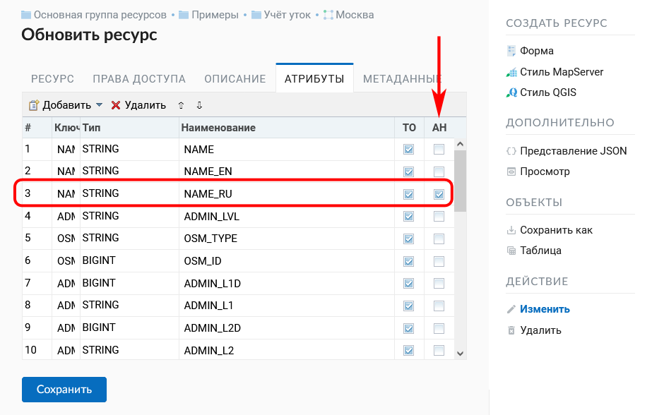

.. sectionauthor:: Артём Светлов <artem.svetlov@nextgis.ru>

.. _ngw_webmaps_admin:

Администрирование веб-карты
===========================

В NextGIS Web может быть несколько отдельных веб-карт. Например, одна может быть 
рабочей, вторая – для общего доступа, третья –  тестовая для настройки слоев.

У разных веб-карт разные URL-адреса. Для разных пользователей и групп пользователей 
можно задавать права для просмотра разных веб-карт. 

На карте показываются слои. Пользователь может их включать и выключать. В настройках 
можно задавать порядок следования слоев, определять, какие слои будут показываться 
сразу же при открытии карты, и раскладывать слои по группам. Группы слоев на карте 
никак не связаны с группами ресурсов в панели управления. Переносить слои между группами 
нельзя. Группы могут быть вложенными.

.. _ngw_map_create:
    
Добавление веб-карты
--------------------

Для добавления веб-карты следует перейти в группу, где необходимо её создать, и в блоке операций "Создать ресурс" выбрать "Веб-карта" (см. :numref:`ngweb_admin_layers_create_webmap`). 

   Выбор действия "Веб-карта" 
   
В результате этих действий откроется окно, представленное на :numref:`ngweb_admin_webmap_name`. 

   Окно создания веб-карты

Далее следует ввести наименование веб-карты, которое будет отображаться в административном веб-интерфейсе и в :ref:`веб-клиенте <ngw_webmaps_client>` для просмотра карт. Поле "Ключ" является необязательным к заполнению.

Можно добавить **описание** ресурса и **метаданные** на соответствующих вкладках. 

Охват
~~~~~

Если переключиться с вкладки "Ресурс" на вкладку "Охват и закладки", откроется окно, представленное на :numref:`ngweb_admin_webmap_bbox`.

   Окно ввода охвата

Охват задается посредством заполнения четырех строк и измеряется в градусах. 

"Охват по слою" позволяет установить охват веб-карты по охвату выбранного слоя. 
Напротив этой строки имеется значок в виде папки с плюсом. Если нажать 
на этот значок, то откроется окно "Выберите слой" с деревом ресурсов, из которого можно 
выбрать слой, по которому будет установлен охват веб-карты, 
(будут заполнены четыре строки с координатами охвата, см. :numref:`ngw_select_resource2`).

   Окно "Выберите слой"

.. tip:: 
   Координаты охвата вы можете сгенерировать на сторонних веб-сайтах, например http://boundingbox.klokantech.com/ (выберите в списке csv).

Закладки
~~~~~~~~

В поле "Ресурс закладок" можно указать векторный слой с любым типом геометрии. Тогда на Веб карте появится панель 
закладок (см. :numref:`ngw_bookmarks`). Названия закладок будут браться из "Атрибут наименования" (см. :numref:`bookmark_attribute`)
если он установлен. 

.. figure:: _static/ngw_bookmarks_ru.png
   :name: ngw_bookmarks
   :align: center
   :width: 20cm
   
   Панель закладок и отображение по клику на Веб-карте

   
   Установка Атрибута наименования для векторного слоя границ

Слои веб-карты
~~~~~~~~~~~~~~~~

На  вкладке "Слои" можно добавлять слои, объединять их в группы и удалять их, а также менять порядок слоев, для чего предусмотрены соответствующие 
кнопки "Добавить слой", "Добавить группу", "Удалить" и "Порядок слоев" (см. :numref:`admin_webmap_layers`). 

   Вкладка "Слои"

Для того, чтобы отобразить данные слоя на карте, необходимо создать для него хотя бы один стиль. О создании стилей для различных типов слоев можно прочитать :ref:`здесь <ngcom_styles>`. 

   
   Окно добавления стиля слоя на веб-карту

Настройки слоев на веб-карте представлены на :numref:`admin_webmap_create_layers`.

   
   Настройки слоев на веб-карте
 
Поле "Включен" обозначает, что при открытии страницы карты этот слой 
будет по умолчанию отображаться.

Поле "Прозрачность" обозначает степень просвечивания слоя на карте. 
Прозрачность каждого слоя может быть настроена от 0 до 100 %. Слой со степенью 
прозрачности 1 % является практически непрозрачным. Совершенно прозрачный слой 
имеет степень прозрачности 100 %.

В поле "Адаптер" рекомендуется выставить значение "Изображения" (отрисовка в виде единой картинки на всю карту), если нет каких-либо особых требований. Также в этом поле можно выбрать значение "Тайлы" (изображения размером 256 x 256 пикселов).

Можно также указать диапазон масштабов, в которых будет отбражаться слой, при помощи полей "Мин. масштаб" и "Макс. масштаб". Минимальный масштаб соответствует более мелкомасштабному отображению, а максимальный - более крупномасштабному. Например, для отображения слоя в диапазоне от 1 : 250 000 до 1 : 5 000, первое значение должно соответствовать минимальному масштабу, а второе - максимальному.  Минимальный и максимальный масштаб можно указывать в стиле слоя и в настройках слоя.
   
.. note:: 
   Минимальный и максимальный масштаб можно указывать не только в настройках слоя веб-карты, но и в стиле слоя (`пример <https://docs.nextgis.ru/docs_ngweb/source/mapstyles.html#osm-water-line>`_). Однако если весь слой не надо показывать на каком-то диапазоне масштабов, то это лучше задать в настройках слоя веб-карты. Если же выставить ограничение масштаба только в стиле, то в этом диапазоне масштабов будут отдаваться пустые тайлы, что неэффективно.
   
Кнопка "Порядок слоёв" открывает окно, в котором можно задать порядок отрисовки слоёв на карте отличающийся от порядка в списке слоёв. Эта функция нужна для демонстрации слоев при сохранении исходного разбиения слоев на папки.

   
   Порядок слоёв как есть: аэрофотоснимки загораживают слой со зданиями

   
   Другой порядок слоёв: слой со зданиями рисуется выше аэрофотоснимков, но структура слоёв слева не изменена
 
Настройки
~~~~~~~~~

На вкладке "Настройки" можно разрешить редактирование слоев и включить аннотации (о работе с аннотациями  см. :ref:`здесь <ngcom_annotation>`).

   
   Вкладка "Настройки" 

Подложки 
~~~~~~~~~~~
 
На  вкладке "Подложки" можно добавлять подложки и удалять их, для чего предусмотрены соответствующие 
кнопки "Добавить" и "Удалить" (см. :numref:`admin_webmap_basemaps`). 

   Вкладка "Подложки"

Поле "Включен" обозначает, что при открытии страницы карты эта подложка 
будет по умолчанию отображаться.

Поле "Непрозрачность" обозначает степень просвечивания подложки на карте, она может быть настроена от 0 до 1 с **точкой** в качестве разделителя (0 - прозрачная подложка, 1 - непрозрачная подложка).

Карта без подложки
~~~~~~~~~~~~~~~~~~

По умолчанию веб-карта создаётся с подложкой OpenStreetMap. Если нужно получить карту без подложки, 
создайте новую подложку, задайте ей URL и имя "blank", добавьте её к веб-карте и тут же отключите.

Соцсети
~~~~~~~

На этой вкладке можно выбрать изображение для предпросмотра, которое будет использовано в соцсетях.

.. figure:: _static/admin_webmap_social_ru.png
   :name: admin_webmap_social_pic
   :align: center
   :width: 20cm
   
   Вкладка "Соцсети"

Завершение создания веб-карты
~~~~~~~~~~~~~~~~~~~~~~~~~~~~~

После всех настроек нажмите "Сохранить". После сохранения созданная карта появится в списке карт. 
При нажатии на иконку в виде карты в списке ресурсов веб-карта будет открыта в браузере. Находясь
на странице ресурса веб-карты можно также открыть ее выбрав "Просмотр"в панели справа. 

Веб-клиент подробнее рассмотрен в главе :ref:`ngw_webmaps_client`.
Адрес, по которому открывается веб-клиент, можно передавать другим пользователям, 
он статичный. 

.. warning:: 
   При удалении карты адрес больше доступен не будет.

.. _ngw_map_clone:

Клонирование веб-карты
----------------------

NextGIS Web позволяет создавать копию уже существующей веб-карты с помощью инструмента клонирования. Это действие выбирается на странице ресурса в панели справа.
После этого пользователь перенаправляется на страницу “Клонирование веб-карты”. Здесь нужно указать расположение будущей копии в дереве ресурсов и ее название.

.. figure:: _static/webmap_clone_page_ru.png
   :name: webmap_clone_page_pic
   :align: center
   :width: 20cm
   
   Страница "Клонирование веб-карты"

Выбор группы ресурсов осуществляется через всплывающее окно, вызываемое кнопкой с лупой в правой части поля.

В этом окне доступны следующие элементы:

1. Панель поиска папок (групп ресурсов) и путь до ресурса, в который осуществляется клонирование;
2. Возврат к исходой папке (содержащей копируемую веб-карту), обновление текущего состояния ресурсов и закрытие формы
3. Радиокнопка выбора группы (папки)
4. Переход к выбранной группе ресурсов (папке)
5. Создание новой группы ресурсов (папки)
6. Отмена выбора группы ресурсов (папки)
7. Кнопка, завершающая выбор расположения. Если одна из групп (папок) выбрана, имеет вид “Клонировать в выбраную группу”. Если выделения нет, имеет вид “Клонировать в эту группу” и копия будет создана в открытой группе, путь к которой указан в верхней панели окна.

.. figure:: _static/webmap_clone_selected_group_elements_ru.png
   :name: webmap_clone_selected_group_elements_pic
   :align: center
   :width: 20cm
   
   Окно выбора группы

