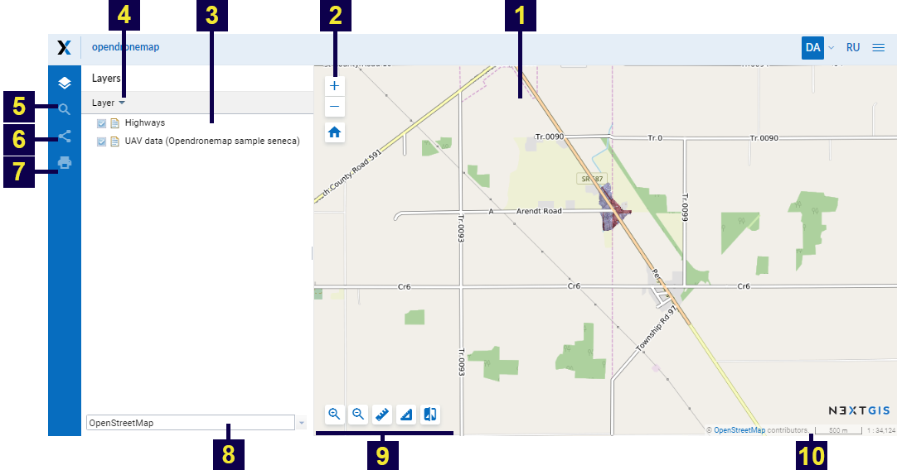
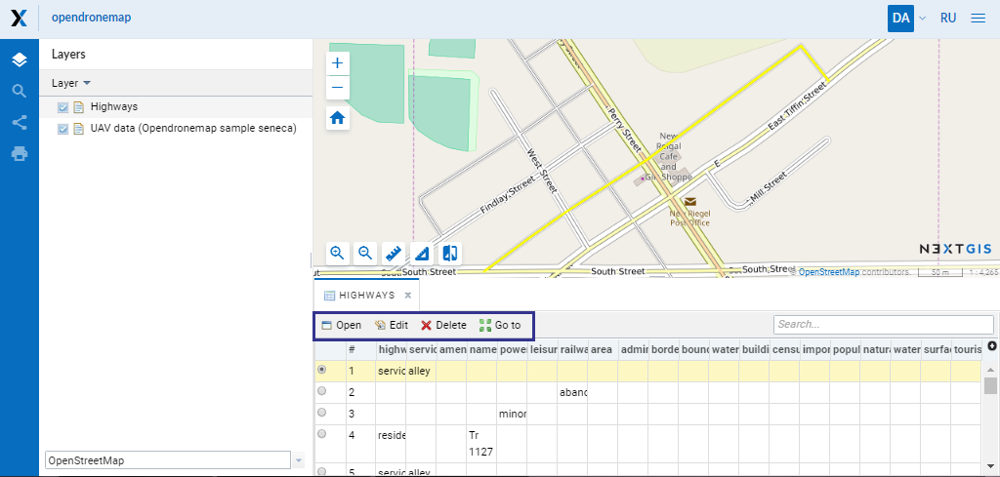

.. sectionauthor:: Artem Svetlov <artem.svetlov@nextgis.ru>

.. _ngw_webmaps_client:

A viewer for web maps
=============================

A special web application for viewing web maps is included with NextGIS Web (see :numref:`webmap_client`).
 

   
   The interface of viewer client application.

   Numbers indicate: 1 – map; 2 – map zoom tools; 3 - layer tree; 4 – dropdown menu for selected layer; 5 - search bar; 6 - "Share"; 7 - "Print map"; 8 - dropdown list of basemaps; 9 – map tools; 10 - status bar.
   
Web client includes three main components: a map (see item 1, 8, 10 in :numref:`webmap_client`), panels (see item 3-7 in :numref:`webmap_client`, map tools (see item 2, 9 in :numref:`webmap_client`. 

.. _ngw_webmaps_client_panels:

Panels
----------------------

In a search bar (see item 5 in :numref:`webmap_client`) during text input there will be performed a search using two sources:
1. In attributes of layers added to a map.
2. In address database of OpenStreetMap. 

Results are shown as user inputs text with feature numbers for attribute search and full addresses. Found features that have a text in attributes are shown first and then addresses containing search text are shown. After a click on a search result map changes extent to show selected feature.

To share a link to a map use the function "Share" (see item 6 in :numref:`webmap_client`), to print a map use the function "Print map" (see item 7 in :numref:`webmap_client`). 

Status bar (see item 10 in :numref:`webmap_client`) displays current map scale. After a click on a map a window with click coordinates and features in this point (if there are any of them) appears.

When a layer is  selected in a tree you can open a layer menu (see item 4 in :numref:`webmap_client`) with the following actions:
    
* Description
* Zoom to layer
* Feature table

Using "Description" option you can get a description of selected layer, which was written during creation or editing of the layer. "Zoom to layer" option allows you to zoom a map to display selected layer on the whole visible map area.

After a click on "Feature table" option you will see feature table of the selected layer under a map. Select a row in feature table and navigate to the feature on a map, it will be highlighted (see :numref:`ngweb_webmap_attribute_table`). For the selected feature you can open a window with its properties, edit it or delete it. "Go to" button allows you to zoom a map to display the selected feature on the whole visible map area (see :numref:`ngweb_webmap_attribute_table`). In feature table tab you have an option to dynamically filter records. When user types a text the contents of the window is filtered leaving only records that match a search text.

   
   Feature table of the selected layer on a web map.
   
To change a basemap use a dropdown list (see item 8 in :numref:`webmap_client`). By default there are the following basemaps:

* None
* OpenStreetMap

Basemap - is a map image that is shared by thrid-party services in the Internet. User can not influence their content. 
User has an option to disable a basemap so a white background will be shown instead. If a user is supposed to have a poor Internet access or if web gis is deployed in local network without an access to the Internet, it is possible to work without basemap adding base data as WebGIS layers. 

.. note:: 
   If it is supposed to work without an Internet access 
   edit a file with `basemap settings <https://github.com/nextgis/nextgisweb/blob/3/nextgisweb/webmap/basemaps.json>`_ and  
   delete records about Google basemaps.

.. _ngw_webmaps_client_tools:

Using map zoom tools (see item 2 in :numref:`webmap_client`) you can change a map zoom or return it to a default zoom using "Initial extent" button with house icon. 

There are some tools to work with map (see item 9 in :numref:`webmap_client`) named from left to the right:

* Zoom in
* Zoom out
* Measure distance
* Measure area
* Vertical swipe

There are some options to work with map: 

* if you click on ``alt + shift`` simultaneously and execute round cursor movements around a monitor, a map will turn for a certain degrees to the right or to the left,
* if you simultaneously click on ``shift`` and select of the necessary part of a map on a monitor by a cursor, you will highlight this part and zoom it in on a map.
