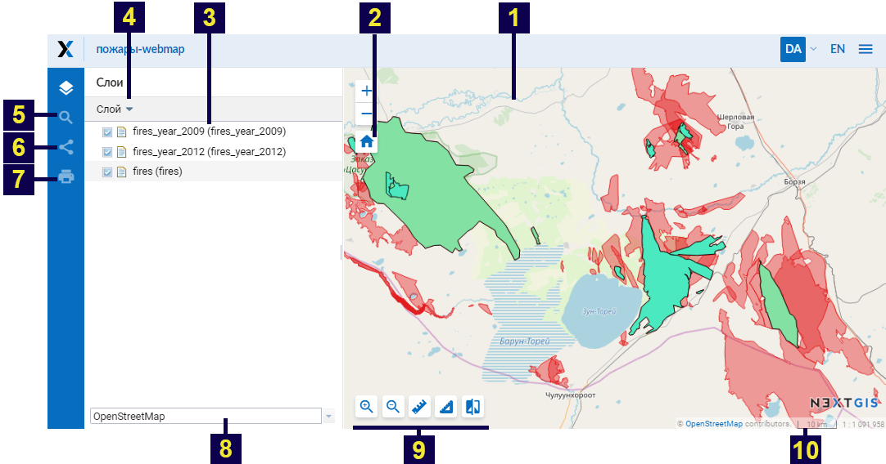
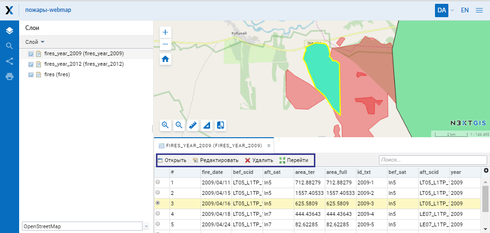
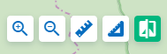
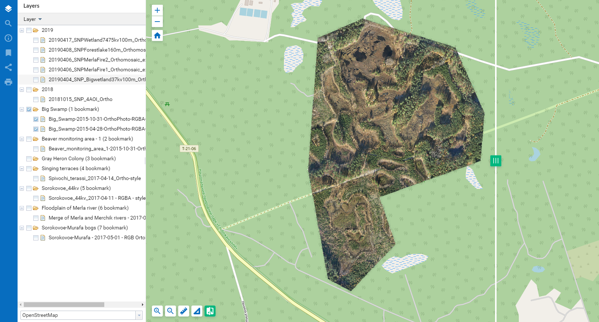
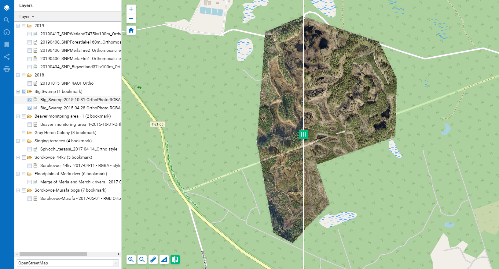
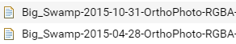

.. sectionauthor:: Артём Светлов <artem.svetlov@nextgis.ru>
.. sectionauthor:: Роман Гайнуллов <roman.gainullov@nextgis.ru>

.. _ngw_webmaps_client:

Веб-клиент для просмотра карт
=============================

В составе :program:`NextGIS Web` предусмотрено специальное клиентское веб приложение для 
просмотра веб-карт (см. :numref:`ngweb_webmap_client`).
 

   
   Внешний вид веб-клиента.

   Цифрами обозначено: 1 – карта; 2 - кнопки управления масштабом карты; 3 - дерево слоев; 4 - выпадающее меню выделенного слоя; 5 - строка поиска; 6 - "Поделиться"; 7 - "Распечатать карту"; 8 – выпадающий список выбора подложек; 9 – инструменты карты; 10 – строка статуса.

Веб-клиент включает в себя три основных компонента: карту (см. :numref:`ngweb_webmap_client`, п.1, 8, 10), панели (см. :numref:`ngweb_webmap_client`, п.3-7), инструменты карты (см. :numref:`ngweb_webmap_client`, п.2, 9). 

.. _ngw_webmaps_client_scale:

Масштаб карты можно изменять с помощью кнопок управления масштабом (см. :numref:`ngweb_webmap_client`, п.2), а также вернуть его к изначальному состоянию с помощью кнопки "Начальный охват" с иконкой в виде домика. 

Для работы с картой приложение имеет следующие возможности: 

* при одновременном нажатии клавиш ``alt + shift`` и осуществлении круговых движений 
  курсором по экрану монитора происходит поворот изображения на необходимое количество 
  градусов в нужную сторону - вправо или влево,
* при одновременном нажатии клавиши ``shift`` и выделении курсором необходимой части 
  изображения на экране монитора происходит выделение, а потом изменение масштаба 
  (увеличение) этой выделенной области на карте.

.. _ngw_webmaps_client_panels:

Панели
----------------------

В строке поиска (см. :numref:`ngweb_webmap_client`, п.5) по мере ввода строки будет производиться поиск по двум источникам:
1. Введенная строка ищется в атрибутивной информации добавленных на карту слоёв.
2. Строка так же ищется в адресной базе OpenStreetMap. 

Результаты показываются по мере ввода, номера объектов для поиска по атрибутам и 
полные адреса. Найденные объекты содержащие строку показываются первыми, сразу за 
ними отображаются так же найденные адреса, включающие вводимую строку. При выборе 
результата поиска из списка карта осуществляет переход к нему.

С помощью функции "Поделиться" (см. :numref:`ngweb_webmap_client`, п.6) можно передать ссылку на карту, а с помощью функции "Распечатать карту" (см. :numref:`ngweb_webmap_client`, п.7) можно распечатать ее. 

Строка статуса (см. :numref:`ngweb_webmap_client`, п.10) отображает текущий масштаб. Если кликнуть по карте инструментом идентификации, то во всплывающем окне будут указаны координаты клика и перечислены объекты, если они имеются в данной точке карты.

При выборе слоя в дереве слоев можно вызвать меню слоя (см. :numref:`ngweb_webmap_client`, п.4), в котором имеются 
следующие пункты:
    
* Описание
* Увеличить до слоя
* Таблица объектов

При выборе пункта "Описание" можно получить описание выбранного слоя, которое вводится при создании или редактировании слоя. При выборе пункта "Увеличить до слоя" происходит масштабирование карты, чтобы выбранный слой занимал всю видимую площадь карты. 

При выборе пункта "Таблица объектов" под картой появляется таблица объектов выбранного слоя и при выделении в ней отдельной 
записи можно перейти к просмотру соответствующей геометрии на карте, данная геометрия будет подсвечена на карте (см. :numref:`ngweb_webmap_attribute_table`). Для выбранного объекта можно открыть окно с его свойствами, редактировать его или удалить. При нажатии на кнопку "Перейти" карта масштабируется таким образом, чтобы выбранный объект оказался в центре (см. :numref:`ngweb_webmap_attribute_table`). В окне просмотра 
атрибутов можно выполнять поиск по текущим атрибутам. По мере ввода, содержимое 
окна фильтруется и остаются только записи, которые удовлетворяют критериям поиска.
 

   
   Таблица объектов слоя на веб-карте.

Для смены картографических подложек служит выпадающий список (см. :numref:`ngweb_webmap_client`, п.8). По умолчанию 
имеются следующие подложки:

* None
* OpenStreetMap

Подложка - это изображение карты, которое предоставляется другими, независимыми 
сервисами в сети Интернет. На их содержание пользователь влиять не может. 
Пользователь может выключить подложку, и тогда вместо нее будет показываться 
белый фон. Если предполагается, что у пользователя слабый канал доступа в 
интернет, или же Веб-ГИС развернута в локальной сети организации, из которой нет 
доступа в интернет, то можно работать и без подложки, разместив базовые данные в 
слоях Веб-ГИС. 

.. note:: 
   Если предполагается работа в сети без доступа к Интернету, то в 
   файле `настроек подложек </nextgisweb/nextgisweb/webmap/basemaps.json>`_ нужно 
   удалить записи про подложки из сети Интернет.

.. _ngw_webmaps_client_tools:

Инструменты карты
----------------------
Для работы с картой предусмотрены инструменты (см. :numref:`ngweb_webmap_client`, п.9), которые перечислены слева направо:

* Приблизить
* Отодвинуть
* Измерение расстояния
* Измерение площади
* Вертикальная шторка

**Вертикальная шторка**

   
   Иконка инструмента “Вертикальная шторка”

Вертикальная шторка (см. :numref:`ngweb_webmap_swype_tool`) делает прозрачной ту область выбранного слоя на карте, которая находится справа от неё (см. :numref:`ngweb_webmap_full_swype`).

   
   Снимок до применения вертикальной шторки

Это дает возможность “заглянуть” под выбранный слой и сравнить его с подложкой или другим слоем на карте (см. :numref:`ngweb_webmap_swyped`). Например, инструмент будет полезен, если мы хотим сравнить изменения на местности по космическим снимкам за разные даты (например - выявить лесные рубки).

   
   Снимок после применения вертикальной шторки
 
.. note:: 
   Выбранным слоем является тот, который выбран кликом и подсвечен серым цветом (см. :numref:`ngweb_webmap_choose_layer`).
   

   
   Выбор слоя для использования вертикальной шторки   
  
