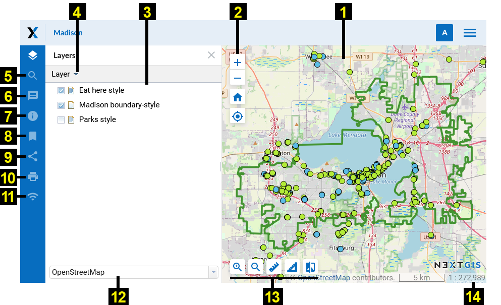
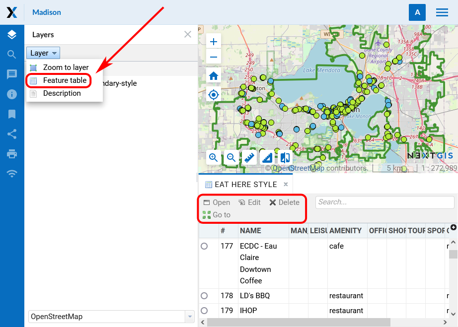
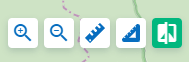
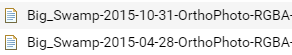

.. sectionauthor:: Artem Svetlov <artem.svetlov@nextgis.ru>

.. _ngw_webmaps_client:

A viewer for web maps
=============================

A special web application for viewing web maps is included with NextGIS Web (see :numref:`webmap_client`).
 

   
   The interface of viewer client application

   Numbers indicate: 1 – map; 2 – map zoom tools; 3 - layer tree; 4 – dropdown menu for selected layer; 5 - search bar; 6 annotations; 7 - Web Map description; 8 - bookmarks; 9 - "Share"; 10 - "Print map"; 11 - list of trackers; 12 - dropdown list of basemaps; 13 – map tools; 14 - status bar and copyright.

Web client includes three main components: a map (see item 1, 12, 14 in :numref:`webmap_client`), panels (see item 3-11 in :numref:`webmap_client`, map tools (see item 2, 13 in :numref:`webmap_client`. 

There are some options to work with map: 

* if you click on ``alt + shift`` simultaneously and execute round cursor movements around a monitor, a map will turn for a certain degrees to the right or to the left,
* if you simultaneously click on ``shift`` and select of the necessary part of a map on a monitor by a cursor, you will highlight this part and zoom it in on a map.

.. _ngw_webmaps_client_panels:

Panels
----------------------

On the left side of the workspace are the functional panels:

* Layers 
* `Search <https://docs.nextgis.com/docs_ngcom/source/address_search.html>`_
* `Annotations <https://docs.nextgis.com/docs_ngcom/source/annotation.html>`_
* `Description <https://docs.nextgis.com/docs_ngcom/source/webmap_create.html#add-a-description-and-map-legend>`_
* `Bookmarks <https://docs.nextgis.com/docs_ngweb/source/webmaps_admin.html#bookmarks>`_
* Share
* Print
* `Trackers <https://docs.nextgis.com/docs_ngcom/source/tracking.html>`_

The **layer tree** contains a list of all layer styles added to the web map. The panel allows:

* Disable/Enable style visibility
* Open layer attribute table
* Zoom map to layer
* Open layer description

**Search** is performed using three sources:

1. Coordinates.
2. Attributes of layers added to a map.
3. Address database (OpenStreetMap or Yandex.Maps, depending on `address search settings <https://docs.nextgis.com/docs_ngweb/source/admin_tasks.html#address-search>`_). 

Results are shown as user inputs text and are sorted in this order: points on the map matching the coordinates, then feature numbers for attribute search and finally full addresses.
After a click on a search result map changes extent to show selected feature.

.. note::
   To find a point using the coordinates, enter the latitude and longitude in or decimal degrees, for example: 
   
.. code-block:: bash

    79 W 43 N
    W 79 N 43
    -79 43 (the results will contain two points: 79 W, 43 N and 43 E, 79 S)
    79- 43
    -79 W 43 N
    79°4'14.08" W 43°4'59.37" N
    -79°4'14.08"  43°4'59.37"
    -79 4.25 W  43 4.95 N
    -79 4.25  43 4.95
    79.068493 43.079920
    79.068 W 43.08 N

To share a link to a map use the function **"Share"** (see item 9 in :numref:`webmap_client`), to print a map use the function **"Print map"** (see item 10 in :numref:`webmap_client`). 

**Status bar** (see item 14 in :numref:`webmap_client`) displays current map scale. After a click on a map a window with click coordinates and features in this point (if there are any of them) appears.

Using **"Description"** option you can get a description of selected layer, which was written during creation or editing of the layer. **"Zoom to layer"** option allows you to zoom a map to display selected layer on the whole visible map area.

After a click on **"Feature table"** option you will see feature table of the selected layer under a map. Select a row in feature table and navigate to the feature on a map, it will be highlighted (see :numref:`ngweb_webmap_attribute_table`). For the selected feature you can open a window with its properties, edit it or delete it. "Go to" button allows you to zoom a map to display the selected feature on the whole visible map area (see :numref:`ngweb_webmap_attribute_table`). In feature table tab you have an option to dynamically filter records. When user types a text the contents of the window is filtered leaving only records that match a search text.

   
   Feature table of the selected layer on a web map
   
To change a basemap use a dropdown list (see item 12 in :numref:`webmap_client`). By default there are the following basemaps:

* None
* OpenStreetMap

Basemap - is a map image that is shared by thrid-party services in the Internet. User can not influence their content. 
User has an option to disable a basemap so a white background will be shown instead. If a user is supposed to have a poor Internet access or if web gis is deployed in local network without an access to the Internet, it is possible to work without basemap adding base data as WebGIS layers. 

.. note:: 
   If it is supposed to work without an Internet access 
   edit a file with `basemap settings <https://github.com/nextgis/nextgisweb/blob/3/nextgisweb/webmap/basemaps.json>`_ and  
   delete records about Google basemaps.

.. _ngw_webmaps_client_tools:

Map tools
----------------------

Using map zoom tools (see item 2 in :numref:`webmap_client`) you can change a map zoom or return it to a default zoom using "Initial extent" button with house icon. 

There are some tools to work with map (see item 13 in :numref:`webmap_client`) named from left to the right:

* Zoom in
* Zoom out
* Measure distance
* Measure area
* Vertical swipe

**Vertical swipe**

   
   Tool icon “Vertical swipe”

Vertical swipe (see :numref:`ngweb_webmap_swipe_tool_en`) makes transparent the area of the selected layer on the map which is the right of it. (see :numref:`ngweb_webmap_full_swipe_en`).

.. figure:: _static/full_swipe_en.png
   :name: ngweb_webmap_full_swipe_en
   :scale: 70 %
   :align: center
   
   Satellite image before applying the vertical swipe

This makes it possible to “look” under the selected layer and compare it with the substrate or another layer on the map (see :numref:`ngweb_webmap_swiped_en`). This makes it possible to “look” under the selected layer and compare it with the substrate or another layer on the map. For example, the tool will be useful if we want to compare changes in the terrain by satellite images for different dates (for example, to identify forest felling).

.. figure:: _static/swiped_en.png
   :name: ngweb_webmap_swiped_en
   :scale: 70 %
   :align: center
   
   Satellite image after applying the vertical swipe

 
.. note:: 
   The selected layer is the layer that is selected by clicking on it in the layer tree (highlighted in gray) (see :numref:`ngweb_webmap_choose_layer_en`).
   

   
   Layer selection for using vertical swipe
  
