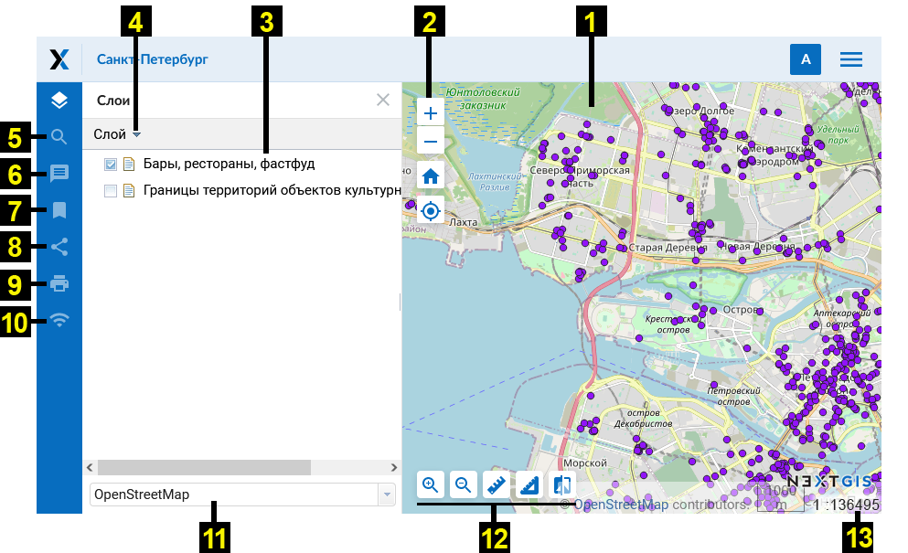
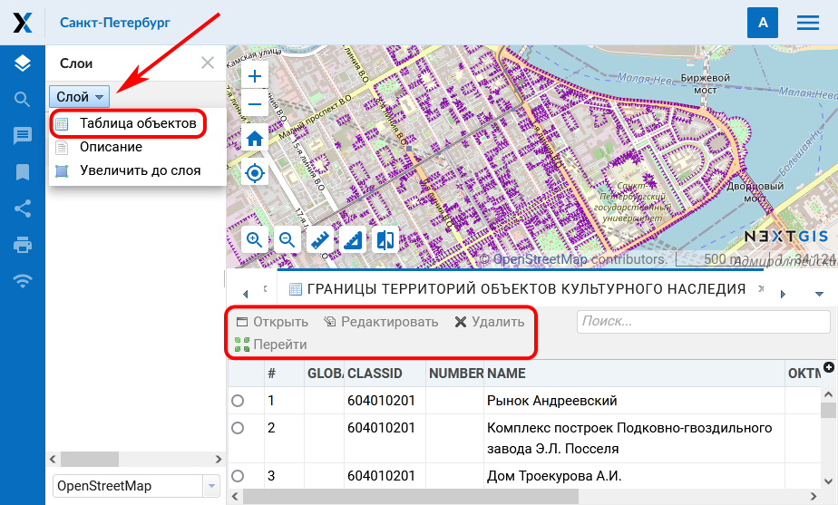

.. sectionauthor:: Артём Светлов <artem.svetlov@nextgis.ru>
.. sectionauthor:: Роман Гайнуллов <roman.gainullov@nextgis.ru>

.. _ngw_webmaps_client:

Веб-клиент для просмотра карт
=============================

В составе :program:`NextGIS Web` предусмотрено специальное клиентское веб приложение для 
просмотра веб-карт (см. :numref:`ngweb_webmap_client`).
 

   
   Внешний вид веб-клиента

   Цифрами обозначено: 1 – карта; 2 - кнопки управления масштабом карты; 3 - дерево слоев; 4 - выпадающее меню выделенного слоя; 5 - строка поиска; 6 - панель аннотаций; 7- панель закладок; 8- "Поделиться"; 9 - "Распечатать карту"; 10 - панель трекеров; 11 – выпадающий список выбора подложек; 12 – инструменты карты; 13 – строка статуса и копирайт.

Веб-клиент включает в себя три основных компонента: карту (см. :numref:`ngweb_webmap_client`, п. 1, 11, 13), панели (см. :numref:`ngweb_webmap_client`, п. 3-10), инструменты карты (см. :numref:`ngweb_webmap_client`, п. 2, 12). 

.. _ngw_webmaps_client_scale:

Масштаб карты можно изменять с помощью кнопок управления масштабом (см. :numref:`ngweb_webmap_client`, п. 2), а также вернуть его к изначальному состоянию с помощью кнопки "Начальный охват" с иконкой в виде домика. 

Для работы с картой приложение имеет следующие возможности: 

* при одновременном нажатии клавиш ``alt + shift`` и осуществлении круговых движений 
  курсором по экрану монитора происходит поворот изображения на необходимое количество 
  градусов в нужную сторону - вправо или влево,
* при одновременном нажатии клавиши ``shift`` и выделении курсором необходимой части 
  изображения на экране монитора происходит выделение, а потом изменение масштаба 
  (увеличение) этой выделенной области на карте.

.. _ngw_webmaps_client_panels:

Панели
----------------------

В левой части рабочей области располагаются функциональные панели:

* Дерево слоев
* `Поиск <https://docs.nextgis.ru/docs_ngcom/source/address_search.html>`_
* `Описание <https://docs.nextgis.ru/docs_ngcom/source/webmap_create.html#id4>`_
* `Аннотации <https://docs.nextgis.ru/docs_ngcom/source/annotation.html>`_
* `Закладки <https://docs.nextgis.ru/docs_ngweb/source/webmaps_admin.html?highlight=слой%20закладок#id4>`_
* Поделиться
* Печать
* `Трекеры <https://docs.nextgis.ru/docs_ngcom/source/tracking.html>`_

В **дереве слоев** находится список всех стилей слоев, добавленных на веб-карту. Панель позволяет:

* Отключить/Включить видимость стиля
* Открыть таблицу атрибутов слоя
* Приблизить карту до слоя
* открыть описание слоя

**Поиск** на веб-карте производится по:

1. Координатам
2. Атрибутивной информации добавленных на карту слоёв
3. Адресной базе (OpenStreetMap или Яндекс.Карты, в зависимости от `настроек адресного поиска <https://docs.nextgis.ru/docs_ngweb/source/admin_tasks.html#ngw-contr-panel-webmap-search>`_).

Результаты появляются по мере ввода и сортируются в этом порядке (координаты - аттрибутивная информация - адресная база).
При выборе результата поиска из списка карта осуществляет переход к нему.

.. note::
   Для того, чтобы найти точку по координатам, в строку поиска следует ввести значения долготы и широты в градусах, минутах и секундах (используйте только прямые кавычки и прямой апостроф) или в десятичном формате, например: 
   
.. code-block:: bash

    79 W 43 N
    W 79 N 43
    -79 43 (результаты поиска будут включать две точки: 79 W, 43 N и 43 E, 79 S)
    79- 43
    -79 W 43 N
    79°4'14.08" W 43°4'59.37" N
    -79°4'14.08"  43°4'59.37"
    -79 4.25 W  43 4.95 N
    -79 4.25  43 4.95
    79.068493 43.079920
    79.068 W 43.08 N

С помощью функции **"Поделиться"** (см. :numref:`ngweb_webmap_client`, п.8) формируется ссылка на карту, а с помощью функции **"Печать"** (см. :numref:`ngweb_webmap_client`, п.9) открывается окно подготовки к печати. 

Строка статуса (см. :numref:`ngweb_webmap_client`, п.13) отображает текущий масштаб. Если кликнуть по карте инструментом идентификации, то во всплывающем окне будут указаны координаты клика и перечислены объекты, если они имеются в данной точке карты.

При выборе пункта **"Описание"** отображается описание выбранного слоя, которое вводится при создании или редактировании слоя. При выборе пункта "Увеличить до слоя" происходит масштабирование карты таким образом, чтобы выбранный слой занимал всю видимую площадь карты. 

При выборе пункта **"Таблица объектов"** под картой появляется таблица объектов выбранного слоя. При выделении в таблице отдельной 
записи происходит переход к соответствующей геометрии на карте, данная геометрия будет подсвечена на карте (см. :numref:`ngweb_webmap_attribute_table`). Для выбранного объекта можно открыть окно с его свойствами, редактировать его или удалить. При нажатии на кнопку "Перейти" карта масштабируется таким образом, чтобы выбранный объект оказался в центре (см. :numref:`ngweb_webmap_attribute_table`). В окне просмотра атрибутов можно выполнять поиск по текущим атрибутам. По мере ввода, содержимое окна фильтруется и остаются только записи, которые удовлетворяют критериям поиска.
 

   
   Таблица объектов слоя на веб-карте

Для смены картографических подложек служит выпадающий список (см. :numref:`ngweb_webmap_client`, п.11). По умолчанию 
имеются следующие подложки:

* None
* OpenStreetMap

Подложка - это изображение карты, которое предоставляется другими, независимыми 
сервисами в сети Интернет. На их содержание пользователь влиять не может. 
Пользователь может выключить подложку, и тогда вместо нее будет показываться 
белый фон. Если предполагается, что у пользователя слабый канал доступа в 
интернет, или же Веб-ГИС развернута в локальной сети организации, из которой нет 
доступа в интернет, то можно работать и без подложки, разместив базовые данные в 
слоях Веб-ГИС. 

.. note:: 
   Если предполагается работа в сети без доступа к Интернету, то в 
   файле `настроек подложек <https://github.com/nextgis/nextgisweb/blob/3/nextgisweb/webmap/basemaps.json>`_ нужно 
   удалить записи про подложки из сети Интернет.

.. _ngw_webmaps_client_tools:

Инструменты карты
----------------------
Для работы с картой предусмотрены инструменты (см. :numref:`ngweb_webmap_client`, п.9), которые перечислены слева направо:

* Приблизить
* Отодвинуть
* Измерение расстояния
* Измерение площади
* Вертикальная шторка

Вертикальная шторка
~~~~~~~~~

.. figure:: _static/swipe_tool.png
   :name: ngweb_webmap_swype_tool
   :scale: 85 %
   :align: center
   
   Иконка инструмента “Вертикальная шторка”

Вертикальная шторка (см. :numref:`ngweb_webmap_swype_tool`) делает прозрачной ту область выбранного слоя на карте, которая находится справа от неё (см. :numref:`ngweb_webmap_full_swype`).

.. figure:: _static/full_swipe.png
   :name: ngweb_webmap_full_swype
   :scale: 125 %
   :align: center
   
   Снимок до применения вертикальной шторки

Это дает возможность “заглянуть” под выбранный слой и сравнить его с подложкой или другим слоем на карте (см. :numref:`ngweb_webmap_swyped`). Например, инструмент будет полезен, если мы хотим сравнить изменения на местности по космическим снимкам за разные даты (например - выявить лесные рубки).

.. figure:: _static/swiped.png
   :name: ngweb_webmap_swyped
   :scale: 125 %
   :align: center
   
   Снимок после применения вертикальной шторки
 
.. note:: 
   Выбранный слой - это слой, который выбран щелчком по нему в дереве слоёв (подсвечен серым цветом) (см. :numref:`ngweb_webmap_choose_layer`).
   
.. figure:: _static/choose_layer.png
   :name: ngweb_webmap_choose_layer
   :scale: 85 %
   :align: center
   
   Выбор слоя для использования вертикальной шторки   
  
