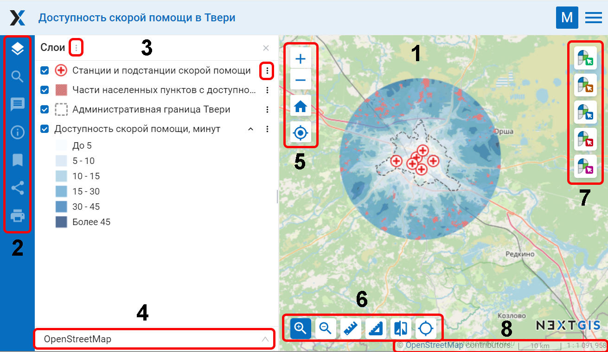
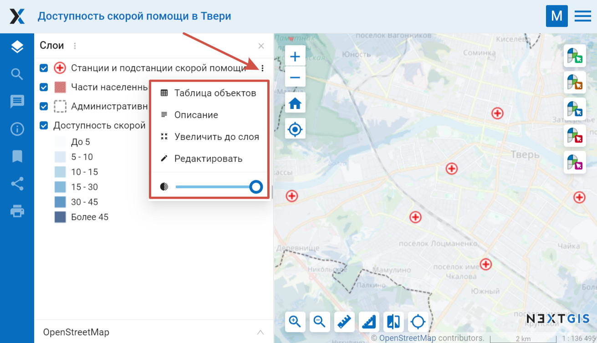
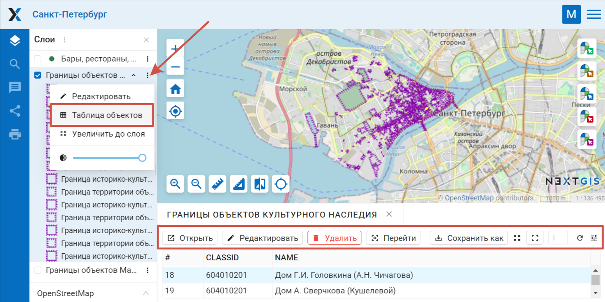
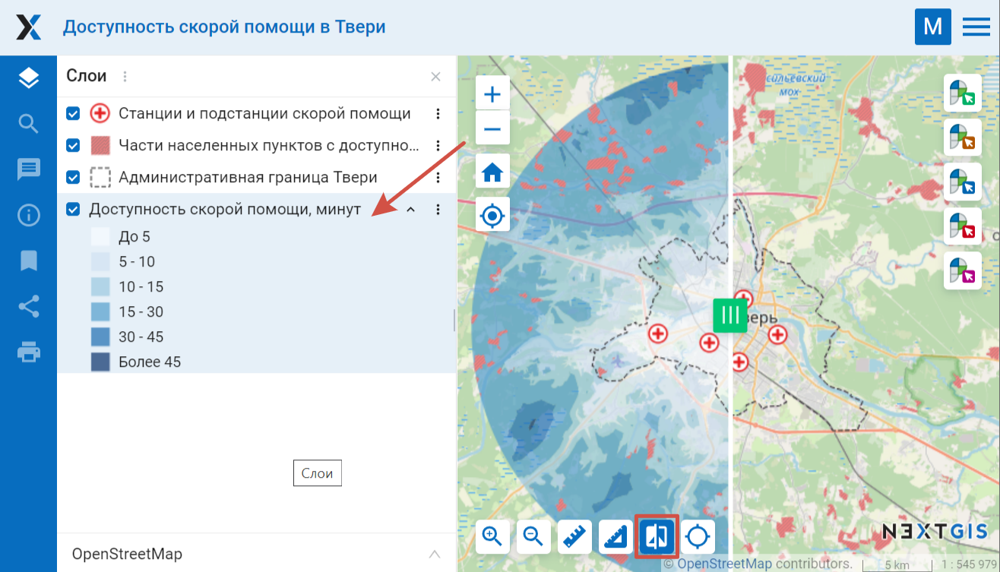
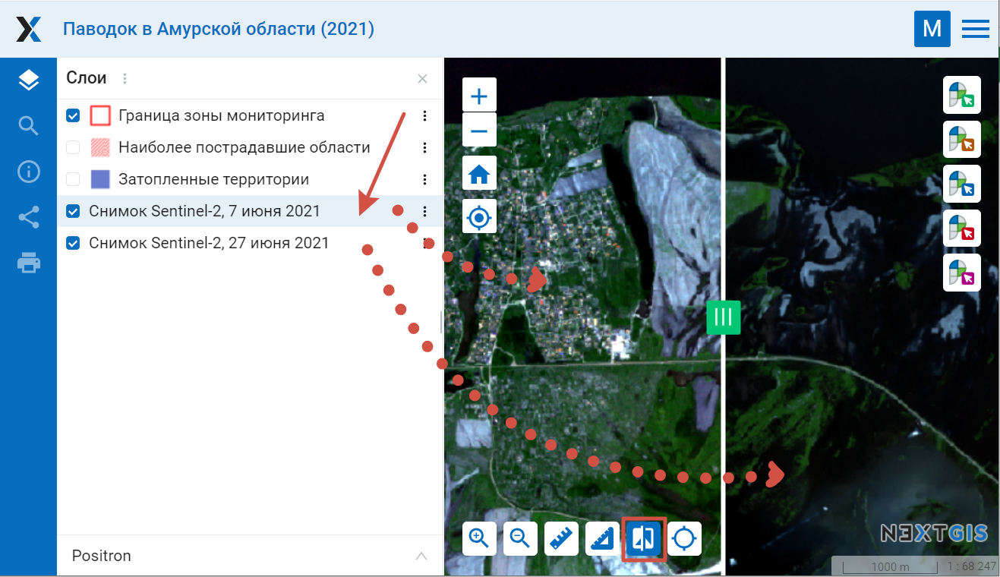
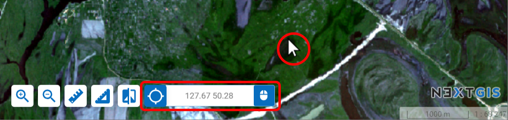
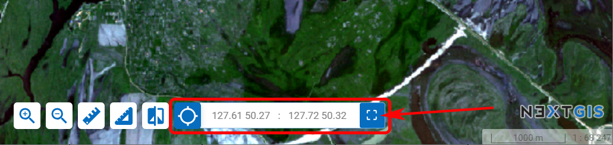
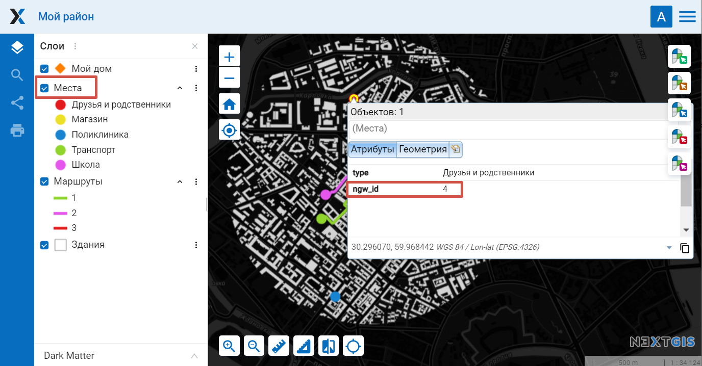

.. sectionauthor:: Артём Светлов <artem.svetlov@nextgis.ru>
.. sectionauthor:: Роман Гайнуллов <roman.gainullov@nextgis.ru>

.. _ngw_webmaps_client:

Веб-клиент для просмотра карт
=============================

В составе :program:`NextGIS Web` предусмотрено специальное клиентское веб приложение для 
просмотра веб-карт (см. :numref:`ngweb_webmap_client`).
 

   
   Внешний вид веб-клиента

   Цифрами обозначено: 1 - карта; 2 - панели карты; 3 - дерево слоёв с кнопками вызова меню; 4 - выпадающий список выбора подложек; 5 - кнопки управления масштабом карты; 6 - инструменты карты; 7 - инструменты работы с кадастром; 8 - строка статуса и копирайт

Веб-клиент включает в себя три основных компонента: карту, панели, инструменты карты. 

.. _ngw_webmaps_client_scale:

Изменение масштаба и поворот карты
-----------------------------------

Строка статуса (см. :numref:`ngweb_webmap_client`) отображает текущий масштаб. Если кликнуть по карте инструментом идентификации, то во всплывающем окне будут указаны координаты клика и перечислены объекты, если они имеются в данной точке карты.

Масштаб карты можно изменять с помощью кнопок управления масштабом (см. :numref:`ngweb_webmap_client`, п. 2), а также вернуть его к изначальному состоянию с помощью кнопки "Начальный охват" с иконкой в виде домика. 

Для работы с картой приложение имеет следующие возможности: 

* при одновременном нажатии клавиш ``alt + shift`` и осуществлении круговых движений 
  курсором по экрану монитора происходит поворот изображения на необходимое количество 
  градусов в нужную сторону - вправо или влево,
* при одновременном нажатии клавиши ``shift`` и выделении курсором необходимой части 
  изображения на экране монитора происходит выделение, а потом изменение масштаба 
  (увеличение) этой выделенной области на карте.

.. _ngw_webmaps_client_panels:

Панели
----------------------

В левой части рабочей области располагаются функциональные панели:

* |panel_layers| Дерево слоев
* |panel_search| `Поиск <https://docs.nextgis.ru/docs_ngcom/source/address_search.html>`_
* |panel_annot| `Аннотации <https://docs.nextgis.ru/docs_ngcom/source/annotation.html>`_
* |panel_info| `Описание <https://docs.nextgis.ru/docs_ngcom/source/webmap_create.html#id4>`_
* |panel_bookmarks| `Закладки <https://docs.nextgis.ru/docs_ngweb/source/webmaps_admin.html?highlight=слой%20закладок#id4>`_
* |panel_share| Поделиться
* |panel_print| Печать
* |panel_trackers| `Трекеры <https://docs.nextgis.ru/docs_ngcom/source/tracking.html>`_

.. |panel_layers| image:: _static/panel_layers.png
.. |panel_search| image:: _static/panel_search.png
.. |panel_annot| image:: _static/panel_annot.png
.. |panel_info| image:: _static/panel_info.png
.. |panel_bookmarks| image:: _static/panel_bookmarks.png
.. |panel_share| image:: _static/panel_share.png
.. |panel_print| image:: _static/panel_print.png
.. |panel_trackers| image:: _static/panel_trackers.png

В **дереве слоев** находится список всех стилей слоев, добавленных на веб-карту. 

**Поиск** на веб-карте производится по:

1. Координатам
2. Атрибутивной информации добавленных на карту слоёв
3. Адресной базе (OpenStreetMap или Яндекс.Карты, в зависимости от `настроек адресного поиска <https://docs.nextgis.ru/docs_ngweb/source/admin_tasks.html#ngw-contr-panel-webmap-search>`_).

Результаты появляются по мере ввода и сортируются в этом порядке (координаты - аттрибутивная информация - адресная база).
При выборе результата поиска из списка карта осуществляет переход к нему.

.. note::
   Для того, чтобы найти точку по координатам, в строку поиска следует ввести значения долготы и широты в градусах, минутах и секундах (используйте только прямые кавычки и прямой апостроф) или в десятичном формате, например: 
   
.. code-block:: bash

    79 W 43 N
    W 79 N 43
    -79 43 (результаты поиска будут включать две точки: 79 W, 43 N и 43 E, 79 S)
    79- 43
    -79 W 43 N
    79°4'14.08" W 43°4'59.37" N
    -79°4'14.08"  43°4'59.37"
    -79 4.25 W  43 4.95 N
    -79 4.25  43 4.95
    79.068493 43.079920
    79.068 W 43.08 N

Также при открытии таблицы объектов слоя доступна фильтрация по области (`подробнее <https://docs.nextgis.ru/docs_ngweb/source/admin_interface.html#ngw-feature-table-filter-area>`_).

С помощью функции **"Поделиться"** формируется ссылка на карту, а с помощью функции **"Печать"**  открывается окно подготовки к печати. 

Меню слоя
-----------

В выпадающем меню слоя можно настроить его непрозрачность при помощи ползунка.

Пункт **Редактировать** позволяет начать вносить изменения в выбранный слой. Для завершения изменений нужно снова открыть то же меню и выбрать **Завершить редактирование** (`подробнее <https://docs.nextgis.ru/docs_ngweb/source/layers_settings.html#ngw-edit-objects>`_).

При выборе пункта **"Описание"** отображается описание выбранного слоя, которое вводится при создании или редактировании слоя. 

При выборе пункта **"Увеличить до слоя"** происходит масштабирование карты таким образом, чтобы выбранный слой занимал всю видимую площадь карты. 

При выборе пункта **"Таблица объектов"** под картой появляется таблица объектов выбранного слоя. 

   
   Меню слоя на веб-карте

При выделении в таблице отдельной записи происходит переход к соответствующей геометрии на карте, данная геометрия будет подсвечена на карте (см. :numref:`ngweb_webmap_attribute_table`). Для выбранного объекта можно открыть окно с его свойствами, редактировать его или удалить. При нажатии на кнопку **"Перейти"** карта масштабируется таким образом, чтобы выбранный объект оказался в центре (см. :numref:`ngweb_webmap_attribute_table`). В окне просмотра атрибутов можно выполнять поиск по текущим атрибутам. По мере ввода, содержимое окна фильтруется и остаются только записи, которые удовлетворяют критериям поиска. Также можно осуществлять фильтрацию объектов, входящих в заданную область (`подробнее <https://docs.nextgis.ru/docs_ngweb/source/admin_interface.html#ngw-feature-table-filter-area>`_).
 

   
   Таблица объектов слоя на веб-карте

Выбор подложки
--------------

Для смены картографических подложек служит выпадающий список (см. :numref:`ngweb_webmap_client`). По умолчанию имеются следующие подложки:

* None
* OpenStreetMap

Подложка - это изображение карты, которое предоставляется другими, независимыми 
сервисами в сети Интернет. На их содержание пользователь влиять не может. 
Пользователь может выключить подложку, и тогда вместо нее будет показываться 
белый фон. Если предполагается, что у пользователя слабый канал доступа в 
интернет, или же Веб-ГИС развернута в локальной сети организации, из которой нет 
доступа в интернет, то можно работать и без подложки, разместив базовые данные в 
слоях Веб-ГИС. 

Можно подключить к карте другую подложку, как это сделать см. в разделе `Добавление ресурсов <https://docs.nextgis.ru/docs_ngweb/source/layers.html#ngw-create-basemap>`_.

.. note:: 
   Если предполагается работа в сети без доступа к Интернету, то в 
   файле `настроек подложек <https://github.com/nextgis/nextgisweb/blob/3/nextgisweb/webmap/basemaps.json>`_ нужно 
   удалить записи про подложки из сети Интернет.

.. _ngw_webmaps_client_tools:

Инструменты карты
----------------------
Для работы с картой предусмотрены инструменты (см. :numref:`ngw_map_instruments`), которые перечислены слева направо:

* Приблизить
* Отодвинуть
* Измерение расстояния
* Измерение площади
* Вертикальная шторка
* Показ координат/охвата

.. figure:: _static/ngw_map_instruments.png
   :name: ngw_map_instruments
   :align: center

   Инструменты карты

.. _ngw_webmaps_client_tools_swipe:

Вертикальная шторка
~~~~~~~~~

Вертикальная шторка |button_swipe| делает прозрачной ту область выбранного слоя на карте, которая находится справа от неё (см. :numref:`ngweb_webmap_full_swype`).

.. |button_swipe| image:: _static/button_swipe.png

Выбранный слой - это слой, который выбран щелчком по нему в дереве слоёв (подсвечен голубым цветом) (см. :numref:`ngweb_webmap_choose_layer`).
   

   
   Выбор слоя для использования вертикальной шторки

Это дает возможность “заглянуть” под выбранный слой и сравнить его с подложкой или другим слоем на карте. Например, инструмент будет полезен, если мы хотим сравнить изменения на местности по космическим снимкам за разные даты.

   
   Снимок после применения вертикальной шторки

Показ координат/охвата
~~~~~~~~~~~~~~~~~~~~~~~~~~~

В интерфейсе карты можно включить поле, где будут показаны текущие координаты курсора или охват видимого участка карты. Для этого нажмите кнопку |button_extent_coord| в инструментах карты.

.. |button_extent_coord| image:: _static/button_extent_coord.png

Иконка справа показывает, что в данный момент отображается в поле и переключает между режимами.

   Включено отображение координат курсора

   Включено отображение охвата

.. _ngw_webmaps_client_feature_link:

Ссылка на объект карты
------------------------

Самый простой вариант - дать ссылку на область карты с нужными объектами. Это можно сделать через панель **Поделиться** (see :numref:`ngweb_webmap_client`).

С помощью специально сгенерированных GET-запросов можно поделиться ссылкой на конкретный объект веб-карты в конкретном слое. Ссылка будет открываться в географическом контексте, который вы можете настроить через веб-карты.

Вам понадобится только создать соответствующие ссылки в соответствующих информационных системах, переходя по которым пользователь сразу будет попадать на карту с искомым объектом и необходимым контекстом.

Такую ссылку может автоматически генерировать ваша связанная с NextGIS Web система.

Пример:

https://demo.nextgis.ru/resource/6144/display?panel=layers&hl_lid=6145&hl_attr=NID&hl_val=12

Можно создать такую ссылку и **вручную**, для этого вам понадобятся:

* "Чистая" ссылка на веб-карту: https://experimental.nextgis.com/resource/147/display?panel=layers

Параметры объекта и их значения:

* hl_lid – ID слоя (зайдите в ресурс слоя и посмотрите число, включенное в URL, например https://experimental.nextgis.com/resource/142 --> ``hl_lid=142``);

* hl_attr – атрибут слоя (название поля атрибутов, из которого берётся значение);

* hl_val – значение атрибута.

Также можно добавить:

* zoom - степень приближения к объекту (выражается в числах, наименьшее значение 1 - максимальное отдаление).

Итоговая ссылка:

https://experimental.nextgis.com/resource/147/display?panel=layers&hl_lid=142&hl_attr=ngw_id&hl_val=4&zoom=14

   Карта, открывающаяся по такой ссылке. В ссылку включен ID выделенного слоя и аттрибут и его значения, отмеченные в карточке объекта
