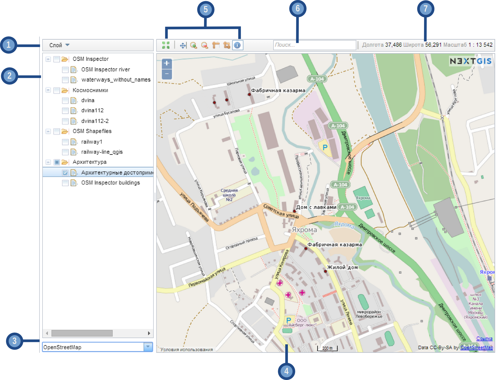

.. sectionauthor:: Artem Svetlov <artem.svetlov@nextgis.ru>

.. _ngw_webmaps_client:

A viewer for web maps
=============================

A special web application for viewing web maps is included with NextGIS Web (see :numref:`webmap_client`).
 

   
   The interface of viewer client application.

   Numbers indicate: 1 – dropdown menu for selected layer; 2 – layer tree; 
   3 – dropdown list of basemaps; 5 – map tools; 6 – search bar; 
   7 – status bar.

Web client includes two main components: layer tree (2) and a map (4). 
When a layer is  selected in a tree you can open a layer menu (1) with the following actions:
    
* Feature table (opens feature table)
* Description (opens description) 

To change a basemap use a dropdown list (3). By default there are the following basemaps:

* None
* OpenStreetMap
* Google – satellite
* Google – map
* Google – hybrid 
* Google – terrain

Basemap - is a map image that is shared by thrid-party services in the Internet. User can not influence their content. 
User has an option to disable a basemap so a white background will be shown instead. If a user is supposed to have a poor Internet access or if web gis is deployed in local network without an access to the Internet, it is possible to work without basemap adding base data as web gis layers. 

.. note:: 
   If it is supposed to work without an Internet access 
   edit a file with `basemap settings </nextgisweb/nextgisweb/webmap/basemaps.json>`_ and  
   delete records about Google basemaps.

.. _ngw_webmaps_client_tools:

There are some tools to work with map (5) - they are (from left to the right):

* initial extent of map
* permanent link
* pan (move a map)
* zoom in
* zoom out
* measure distance
* measure area
* identify

In a search bar (6) during text input there will be performed a search using two sources:
1. Entered string is searched in attributes of added layers
2. Also a text is searched in address database of OpenStreetMap. 

Results are shown as user inputs text with feature numbers for attribute search and full addresses. Found features that have a text in attributes are shown first and then addresses containing search text are shown. After a click on a search result map changes extent to show selected feature.

Status bar (7) displays mouse pointer coordinates and current map scale.

In feature table tab you have an option to select a row for a feature and then navigate to that feature on a map. To do this click a button :guilabel:`Go to` when a required feature is selected. In feature table tab you have an option to dynamically filter records. When user types a text the contents of the window is filtered leaving only records that match a search text.

