.. _ngw_webmaps_client:

Просмотр веб-карты
=============================

В составе :program:`NextGIS Web` предусмотрено специальное клиентское веб приложение для 
просмотра веб-карт (см. :numref:`ngweb_webmap_client`).

Чтобы открыть веб-карту, нажмите значок |button_open_web_map| рядом с названием карты в списке ресурсов. Или зайдите на страницу ресурса карты и выберите "Открыть" в панели действий справа.

Откроется страница просмотра карты: 

 
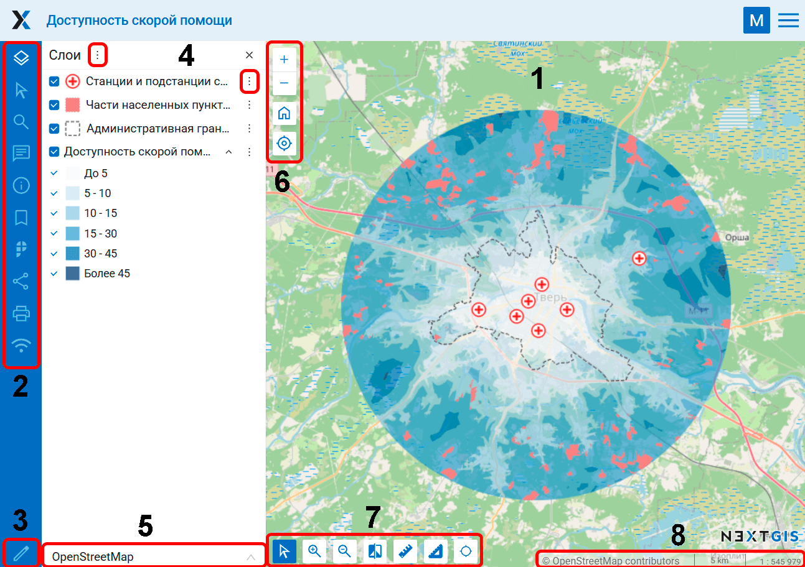
   
   Внешний вид веб-клиента для просмотра карт

Цифрами обозначены: 

* 1 - карта; 
* 2 - `панели <https://docs.nextgis.ru/docs_ngweb/source/webmaps_client.html#ngw-webmaps-client-panels>`_ карты; 
* 3 - кнопка перехода к `настройкам веб-карты <https://docs.nextgis.ru/docs_ngweb/source/webmaps_admin.html#ngw-map-layers>`_. Неавторизованные пользователи вместо неё видят кнопку связи с владельцем Веб ГИС;
* 4 - активная панель `дерево слоёв <https://docs.nextgis.ru/docs_ngweb/source/webmaps_client.html#ngw-webmaps-client-layers>`_ с кнопками вызова меню; 
* 5 - выпадающий список `выбора подложек <https://docs.nextgis.ru/docs_ngweb/source/webmaps_client.html#ngw-webmaps-client-basemap>`_; 
* 6 и 7 - `инструменты карты <https://docs.nextgis.ru/docs_ngweb/source/webmaps_client.html#ngw-webmaps-client-tools>`_; 
* 8 - `строка статуса <https://docs.nextgis.ru/docs_ngweb/source/webmaps_client.html#ngw-webmaps-client-scale>`_ и копирайт.

.. _ngw_webmaps_client_scale:

Масштаб и поворот карты
-----------------------------------

Строка статуса (см. :numref:`ngweb_webmap_client` п. 5) отображает текущий масштаб. Если кликнуть по карте инструментом идентификации, то во всплывающем окне будут указаны координаты клика и перечислены объекты, если они имеются в данной точке карты.

Масштаб карты можно изменять с помощью кнопок управления масштабом (см. :numref:`ngweb_webmap_client`, п.5), а также вернуть его к изначальному состоянию с помощью кнопки "Начальный охват" с иконкой в виде домика. 

Для работы с картой приложение имеет следующие возможности: 

* при одновременном нажатии клавиш ``alt + shift`` и осуществлении круговых движений курсором по экрану монитора происходит поворот изображения на необходимое количество градусов в нужную сторону - вправо или влево,
* при одновременном нажатии клавиши ``shift`` и выделении курсором необходимой части изображения на экране монитора происходит выделение, а потом изменение масштаба (увеличение) этой выделенной области на карте.

Также вы можете отобразить на карте своё текущее местоположение, нажав на кнопку |button_my_location|. Посмотрите, как это работает, в видео:

.. raw:: html

   <iframe width="560" height="315" src="https://rutube.ru/play/embed/1243c460657d47068a053714497dd390/" frameBorder="0" allow="clipboard-write; autoplay" webkitAllowFullScreen mozallowfullscreen allowFullScreen></iframe>

Посмотреть видео на `youtube <https://youtu.be/YLoUFO8ZywI>`_, `rutube <https://rutube.ru/video/1243c460657d47068a053714497dd390/>`_.

.. _ngw_webmaps_client_panels:

Панели
-------

В левой части рабочей области располагаются функциональные панели:

* |panel_layers| `Дерево слоев <https://docs.nextgis.ru/docs_ngweb/source/webmaps_client.html#ngw-webmaps-client-layers>`_
* |panel_ident| `Панель идентификации <https://docs.nextgis.ru/docs_ngweb/source/webmaps_client.html#ngw-webmaps-client-ident>`_
* |panel_search| `Поиск <https://docs.nextgis.ru/docs_ngweb/source/webmaps_client.html#ngw-webmaps-client-search>`_
* |panel_annot| `Аннотации <https://docs.nextgis.ru/docs_ngweb/source/annotation.html>`_
* |panel_info| `Описание <https://docs.nextgis.ru/docs_ngcom/source/webmap_create.html#ngcom-webmap-create-info>`_
* |panel_bookmarks| `Закладки <https://docs.nextgis.ru/docs_ngweb/source/webmaps_admin.html#ngw-map-bookmarks>`_
* |panel_cadaster| `Кадастровые сервисы <https://docs.nextgis.ru/docs_ngweb/source/cadaster.html>`_
* |panel_share| `Поделиться <https://docs.nextgis.ru/docs_ngweb/source/webmaps_client.html#ngw-webmaps-client-share>`_ - здесь формируется ссылка на карту и `код для встраивания <https://docs.nextgis.ru/docs_ngweb/source/embed_webmap.html>`_
* |panel_print| `Печать <https://docs.nextgis.ru/docs_ngweb/source/print.html>`_  открывает окно подготовки к печати. 
* |panel_trackers| `Трекеры <https://docs.nextgis.ru/docs_ngweb/source/trackers.html#tracking-web-map>`_

Ниже их функционал описывается подробнее.

.. _ngw_webmaps_client_tools:

Инструменты карты
----------------------

Для работы с картой предусмотрены инструменты, организованные в два блока.

Слева наверху:

* |button_zoom| кнопки управления масштабом;
* |button_home| вернуться к начальному масштабу карты;
* |button_my_location| показать местоположение устройства.

Слева внизу:

* |panel_ident_small| / |button_maptool_clear| `Идентификация / Очистить выделение <https://docs.nextgis.ru/docs_ngweb/source/webmaps_client.html#ngw-webmaps-client-ident>`_
* |button_zoom_in| `Приблизить <https://docs.nextgis.ru/docs_ngweb/source/webmaps_client.html#ngw-webmaps-client-scale>`_
* |button_zoom_out| `Отодвинуть <https://docs.nextgis.ru/docs_ngweb/source/webmaps_client.html#ngw-webmaps-client-scale>`_
* |button_measure_distance| `Измерение расстояния <https://docs.nextgis.ru/docs_ngweb/source/webmaps_client.html#ngw-webmaps-client-tools-measure>`_
* |button_measure_area_map| `Измерение площади <https://docs.nextgis.ru/docs_ngweb/source/webmaps_client.html#ngw-webmaps-client-tools-measure>`_
* |button_swipe_off| `Шторка <https://docs.nextgis.ru/docs_ngweb/source/webmaps_client.html#ngw-webmaps-client-tools-swipe>`_
* |button_extent_coord| `Показ координат/охвата <https://docs.nextgis.ru/docs_ngweb/source/webmaps_client.html#ngw-webmaps-client-tools-coord-extent>`_

.. _ngw_webmaps_client_tools_measure:

Инструменты измерения
~~~~~~~~~~~~~~~~~~~~~~~~

Измерять длины, в том числе ломаных линий, и площади можно при помощи инструментов измерения карты. Активируйте инструмент и отметьте узлы линии кликами по карте. Двойной клик завершает создание линии. Вы можете отметить на карте несколько линий и сравнить результаты измерений. Чтобы удалить линию измерения, нажмите на крестик рядом с результатами измерения. Чтобы сбросить выбранное полностью, нажмите ещё раз на кнопку с линейкой. 

.. figure:: _static/ngw_map_measure_line_ru.png
   :name: ngw_map_measure_line_pic
   :align: center
   :width: 20cm

   Измерение расстояний на карте

Аналогичным образом работает измерение площади. Выделите произвольную полигональную область на карте. Двойным кликом замкните полигон.

.. figure:: _static/ngw_map_measure_area_ru.png
   :name: ngw_map_measure_area_pic
   :align: center
   :width: 20cm

   Измерение площадей на карте

Единицы измерений настраиваются в `Панели управления <https://docs.nextgis.ru/docs_ngweb/source/webmap_set.html#ngw-contr-panel-webmap-measure>`_

.. _ngw_webmaps_client_tools_swipe:

Шторка
~~~~~~~~~~~~~~~~~~~~

Шторка делает прозрачной ту область выбранного слоя/группы слоёв на карте, которая находится с одной стороны от неё (см. :numref:`ngweb_webmap_swyped`).

Выберите слой щелчком в дереве слоёв (он будет подсвечен голубым цветом) и нажмите |button_swipe_off| в нижней части карты (см. :numref:`ngweb_webmap_choose_layer`). 
   
.. figure:: _static/choose_layer_swipe_ru_2.png
   :name: ngweb_webmap_choose_layer
   :width: 20cm
   :align: center
   
   Выбор слоя для использования шторки

Шторку можно сдвигать, зажимая квадрат по центру, или поворачивать на 90 градусов кликом по кружку на линии.

Шторка дает возможность “заглянуть” под выбранный слой и сравнить его с подложкой или другим слоем на карте. Например, инструмент будет полезен, если мы хотим сравнить изменения на местности по космическим снимкам за разные даты.

.. figure:: _static/swiped_satellite_ru.png
   :name: ngweb_webmap_swyped
   :width: 20cm
   :align: center
   
   Снимок после применения вертикальной шторки

.. _ngw_webmaps_client_tools_coord_extent:

Показ координат/охвата
~~~~~~~~~~~~~~~~~~~~~~~~~~~

В интерфейсе карты можно включить поле, где будут показаны текущие координаты курсора или охват видимого участка карты. Для этого нажмите кнопку |button_extent_coord| в инструментах карты.

Иконка справа показывает, что в данный момент отображается в поле и переключает между режимами.

.. figure:: _static/web_client_coordinates_ru.png
   :name: web_client_coordinates_pic
   :width: 20cm
   :align: center

   Включено отображение координат курсора

.. figure:: _static/web_client_extent_ru.png
   :name: web_client_extent_pic
   :width: 20cm
   :align: center

   Включено отображение охвата

.. _ngw_webmaps_client_layers:

Легенда в дереве слоёв
------------------------

В панели |panel_layers_small| **дерево слоёв** находится список всех стилей слоёв, добавленных на веб-карту. 

.. |panel_layers_small| image:: _static/panel_layers.png
   :width: 5mm

Вы можете **отключать видимость** не только слоёв, но и отдельных элементов этих слоёв, снимая галочки соответствующих элементов легенды. Это актуально для больших картографических проектов, где слои содержат множество объектов с различными значениями определённого столбца таблицы атрибутов. 

Также слои можно **перетаскивать** внутри дерева, меняя порядок их отображения. При перезагрузке страницы отображение слоёв будет сброшено к изначальному.

Чтобы убрать слой из легенды и с карты, нажмите |button_close| в меню слоя.

При нажатии на три точки рядом с заголовком панели откроется меню, с помощью которого можно:

* |button_extent_all| Увеличить до всех слоёв - все объекты всех добавленных слоёв попадут в охват отображаемой карты;
* |button_visibility_off| Скрыть все слои;
* |button_restore| Восстановить исходное состояние (не перезагружая страницу и не теряя текущий охват карты);
* |button_plus_layer| Добавить слои.

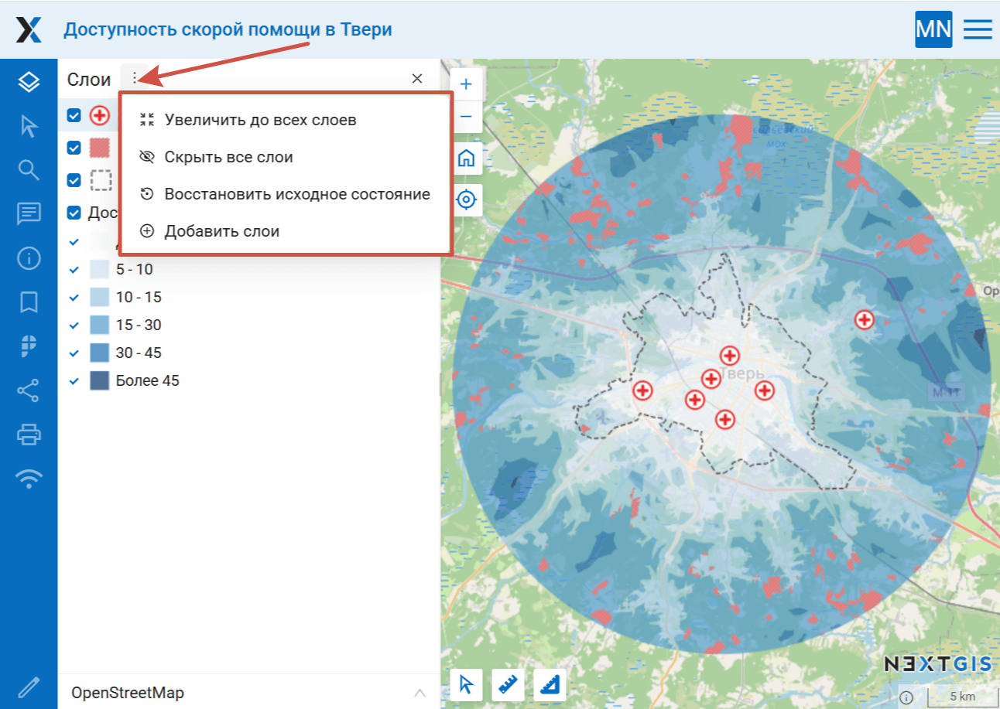

   Меню панели слоёв

Если вы хотите, чтобы текущее состояние дерева слоёв стало видом карты по умолчанию, нажмите |button_save_blue| в левом нижнем углу.

Возможности панели слоёв также представлены в видео:

.. raw:: html

   <iframe width="560" height="315" src="https://rutube.ru/play/embed/e13ac386c9c16068f5110c938dd17683/" frameBorder="0" allow="clipboard-write; autoplay" webkitAllowFullScreen mozallowfullscreen allowFullScreen></iframe>

Смотреть на `youtube <https://youtu.be/ZJJeJLO2KR4>`__, `rutube <https://rutube.ru/video/e13ac386c9c16068f5110c938dd17683/>`__. Как `настроить легенду <https://docs.nextgis.ru/docs_ngweb/source/webmaps_admin.html#ngw-legend>`_.

.. _ngw_webmaps_client_layer_menu:

Меню слоя
-----------

Чтобы вызвать меню слоя, нажмите на три точки рядом с его названием. Доступны следующие операции:

* |button_opacity| Настроить его непрозрачность при помощи ползунка.
* |button_table| **Таблица объектов** - открывает на карте `таблицу объектов векторного слоя <https://docs.nextgis.ru/docs_ngweb/source/feature_table.html#ngw-feature-table-webmap>`_. 
* |button_edit_black| **Редактировать** - активирует режим редактирования, который позволяет `изменять объекты <https://docs.nextgis.ru/docs_ngweb/source/feature_edit.html>`_ выбранного слоя. Для завершения изменений нужно снова открыть то же меню и выбрать **Завершить редактирование** (`подробнее <https://docs.nextgis.ru/docs_ngweb/source/feature_edit.html>`__) или нажать на кнопку |button_maptool_save| на карте.
* |button_filter| **Фильтр**  позволяет отображать на карте только те объекты слоя, которые отвечают заданным условиям (`подробнее <https://docs.nextgis.ru/docs_ngweb/source/webmaps_client.html#ngw-webmaps-client-filter>`_).
* |button_article| **Описание** - если у слоя добаввлено описание, оно открывается в соответствующей панели.
* |button_close| **Удалить слой** с карты (чтобы вернуть слой, нажмите **Восстановить** в меню дерева слоёв).
* |button_extent_all| **Увеличить до слоя** - происходит масштабирование карты таким образом, чтобы выбранный слой занимал всю видимую площадь карты. 
* |button_palette| **Редактировать ресурс стиля** - открывается во всплывающем окне, `подробнее о настройках стилей <https://docs.nextgis.ru/docs_ngweb/source/mapstyles.html>`_
* |button_gear| **Редактировать ресурс слоя** - открывается во всплывающем окне,  подробнее о настройках ресурса `векторного <https://docs.nextgis.ru/docs_ngweb/source/layers_settings.html>`_ слоя.
* |button_tune| **Свойства слоя** - позволяет настроить работу слоя на конкретной веб-карте, `подробнее <https://docs.nextgis.ru/docs_ngweb/source/webmaps_admin.html#admin-webmap-create-layers>`_. 

Флажок **Идентифицируемый** означает, что при клике на объекты слоя информация о них отображается в `панели идентификации <https://docs.nextgis.ru/docs_ngweb/source/webmaps_client.html#ngw-webmaps-client-ident>`_. Если его отключить, то объекты этого слоя будут игнорироваться инструментом идентификаци.

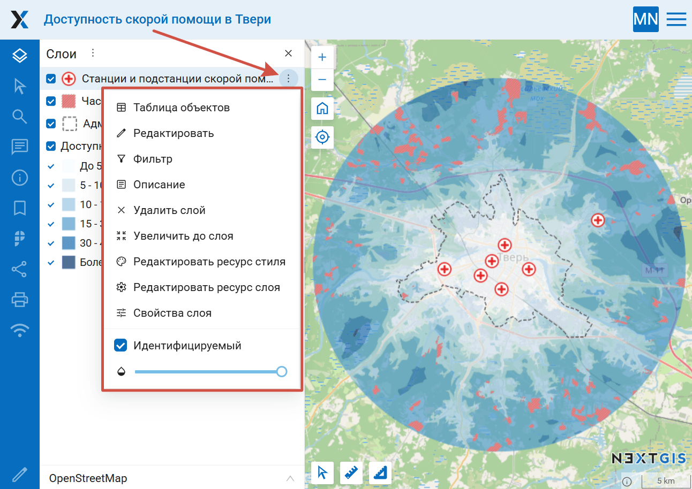
   
   Меню слоя на веб-карте

.. _ngw_webmaps_client_filter:

Фильтрация объектов слоя
------------------------------

Для каждого слоя можно задать фильтр. В меню слоя выберите **Фильтрация**. Во всплывающем окне добавьте одно или несколько условий. Если условий несколько, можно настроить, должны ли выполняться все или достаточно любого одного. 

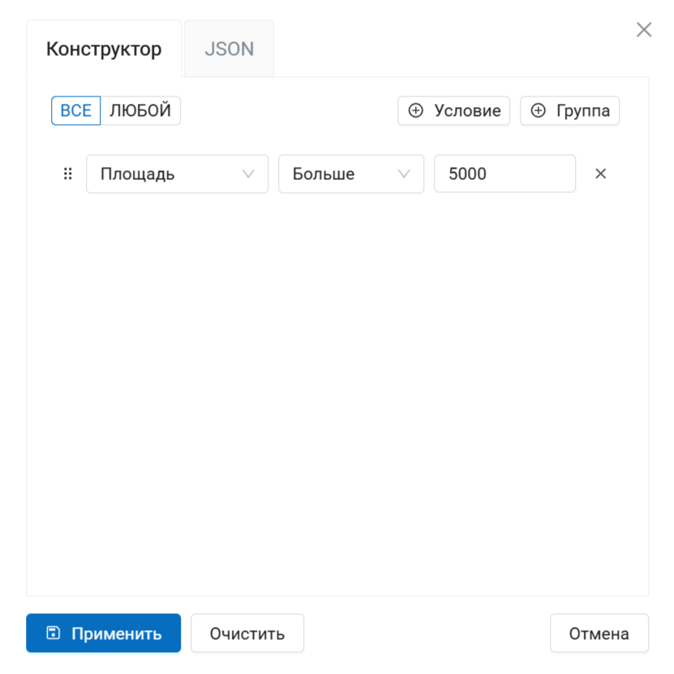

   Условие фильтра

На карте и в таблице атрибутов останутся только объекты, удовлетворяющие заданным условиям.

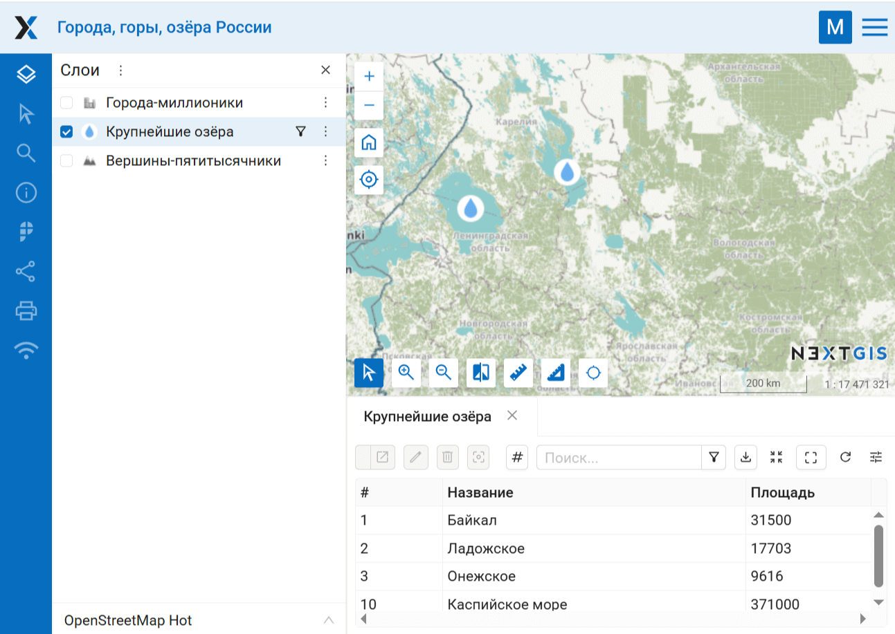

   Отфильтрованные объекты: озёра площадью более 5000 квадратных километров

Также можно отфильтровать объекты `по выбранной области карты <https://docs.nextgis.ru/docs_ngweb/source/feature_table.html#ngw-feature-table-filter-area>`_.

.. _ngw_webmaps_client_ident:

Идентификация объектов
-----------------------

.. |panel_ident_small| image:: _static/panel_ident.png
   :width: 6mm

Чтобы получить информацию об объектах, расположенных на веб-карте, активируйте |panel_ident_small| панель идентификации. Теперь по клику на любом месте карты вы получите информацию о расположенных в этой точке векторных объектах или пикселе растра.

В панели идентификации отображаются значения атрибутов объекта, сведения о геометрии, описание (если задано) и вложения.

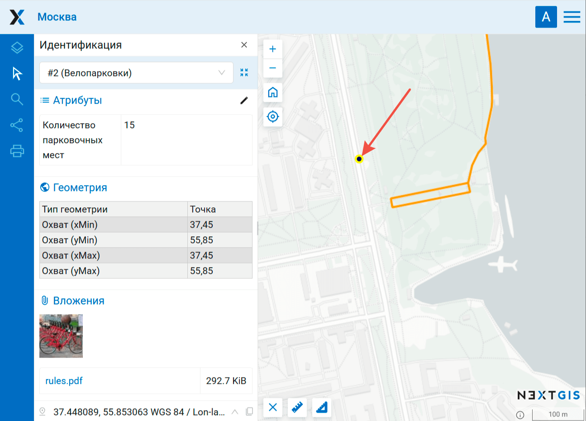

   Панель идентификации с информацией об объекте

Если вместе с растром загружена растровая таблица атрибутов, в панели идентификации будет отображаться не только числовое значение, но и прописанный в ней класс. 

.. note:: Обратите внимание, что растр должен быть создан `через веб-интерфейс <https://docs.nextgis.ru/docs_ngweb/source/layers.html#ngw-create-raster-layer>`_. Упакуйте в один архив файл .TIF и соответствующий ему файл .XML. Выберите этот архив при создании растрового слоя.

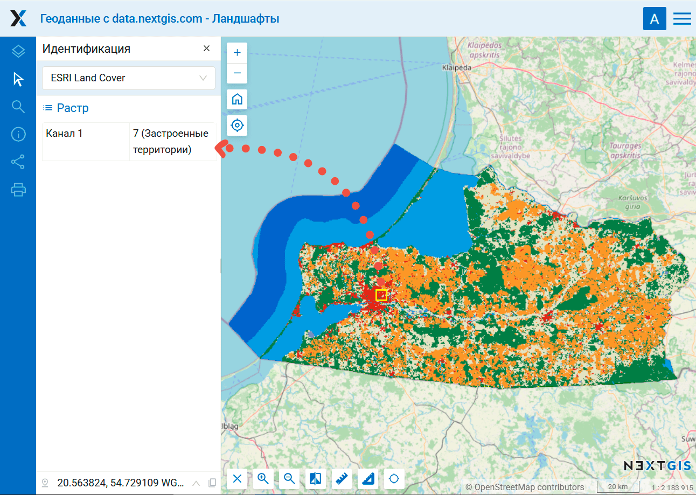

   Отображение класса из растровой таблицы атрибутов

Если объектов в месте клика несколько (например, линия и лежащая на этой линии точка), то в панели будет отображён объект из слоя, находящегося выше всего в дереве слоёв. Чтобы получить информацию по остальным объектам, кликните на стрелочку вниз рядом с именем объекта и выберите нужный из списка.

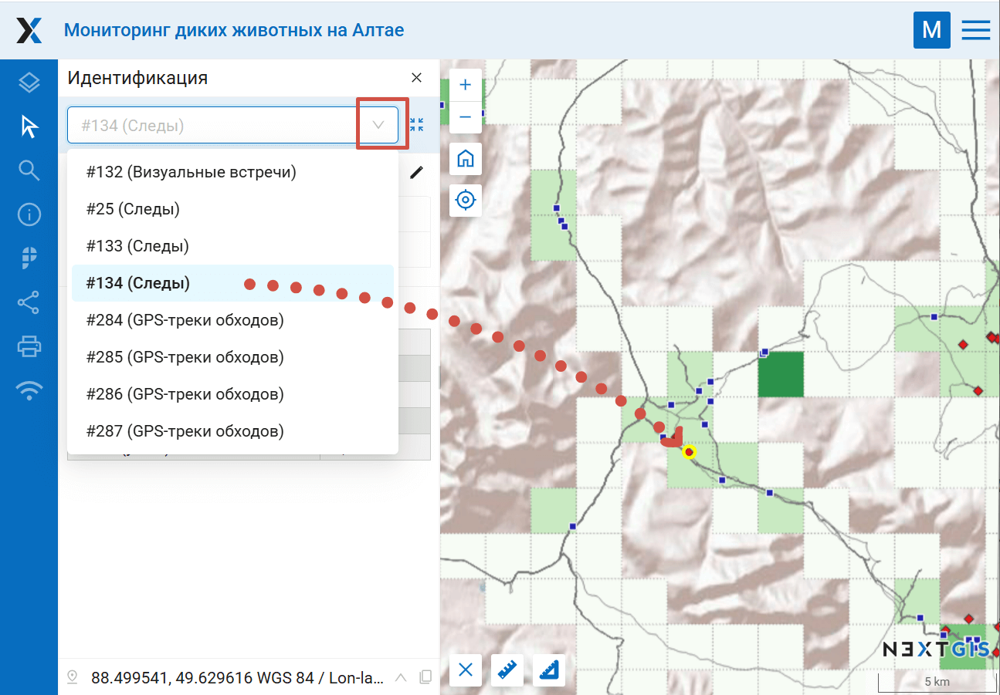

   Выбор объекта из списка найденных при идентификации

Чтобы снять выделение, нажмите кнопку |button_maptool_clear| в левом нижнем углу карты. Когда ни один объект не выделен, эта кнопка имеет вид |panel_ident_small|.

Задать, какой радиус вокруг клика учитывается при идентификации и какие параметры объектов отображаются, можно `через панель управления <https://docs.nextgis.ru/docs_ngweb/source/webmap_set.html#ngw-contr-panel-webmap-ident>`_.

В контекстном меню слоя можно отключить для него идентификацию. Также вы можете отключить идентификацию для отдельных слоёв и изменить их порядок в `настройках веб-карты <https://docs.nextgis.ru/docs_ngweb/source/webmaps_admin.html#ngw-map-layers>`_.

Чтобы изменить атрибуты объекта, нажмите значок карандаша в правом верхнем углу панели (`подробнее <https://docs.nextgis.ru/docs_ngweb/source/feature_edit.html#ngweb-editing-when-viewing-map>`_).

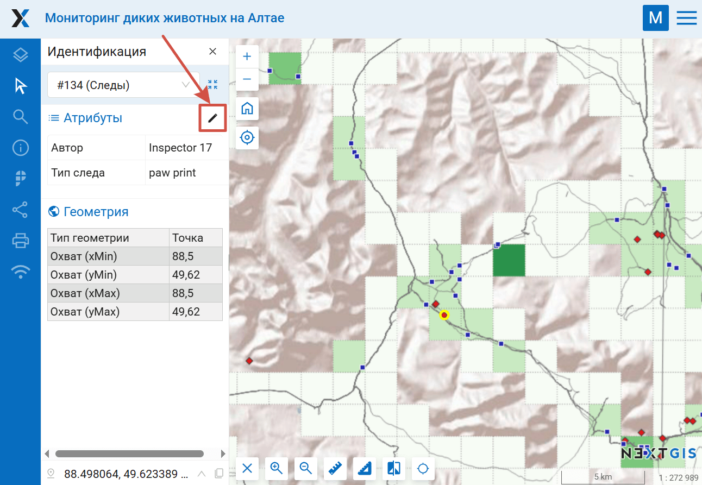

   Вызов окна редактирования атрибутов объекта

.. _ngw_webmaps_client_search:

Поиск на веб-карте
--------------------

**Поиск** на веб-карте производится по:

1. Координатам
2. Атрибутивной информации добавленных на карту слоёв
3. Адресной базе (OpenStreetMap или Яндекс.Карты, в зависимости от `настроек адресного поиска <https://docs.nextgis.ru/docs_ngweb/source/webmap_set.html#ngw-contr-panel-webmap-search>`_).

Результаты появляются по мере ввода и сортируются в этом порядке (координаты - аттрибутивная информация - адресная база).
При выборе результата поиска из списка карта осуществляет переход к нему.

.. figure:: _static/webmap_search_results_tram_ru.png
   :name: webmap_search_results_pic
   :align: center
   :width: 20cm
   
   Результаты поиска по запросу «трамвайный». На карте открыты атрибуты объекта #10 векторного слоя, где содержится запрашиваемое слово

Возможности текстового поиска также показаны в видео:

.. raw:: html

   <iframe width="560" height="315" src="https://rutube.ru/play/embed/6c2f59f025c88d7c533bf34bef3d3f17/" frameBorder="0" allow="clipboard-write; autoplay" webkitAllowFullScreen mozallowfullscreen allowFullScreen></iframe>

Посмотреть видео на `youtube <https://youtu.be/_isl86FjG6U>`__, `rutube <https://rutube.ru/video/6c2f59f025c88d7c533bf34bef3d3f17/>`__.

.. _ngw_webmaps_search_coord:

Поиск по координатам
~~~~~~~~~~~~~~~~~~~~~

Для того, чтобы найти точку по координатам, в строку поиска следует ввести значения долготы и широты в градусах, минутах и секундах (используйте только прямые кавычки и прямой апостроф) или в десятичном формате, например: 
   
.. code-block:: bash

    79 W 43 N
    W 79 N 43
    -79 43 (результаты поиска будут включать две точки: 79 W, 43 N и 43 E, 79 S)
    79- 43
    -79 W 43 N
    79°4'14.08" W 43°4'59.37" N
    -79°4'14.08"  43°4'59.37"
    -79 4.25 W  43 4.95 N
    -79 4.25  43 4.95
    79.068493 43.079920
    79.068 W 43.08 N

Посмотрите, как работает поиск по координатам, в нашем видео:

.. raw:: html

   <iframe width="560" height="315" src="https://rutube.ru/play/embed/81464ac6a48a81bb05c74bcb9f11c875/" frameBorder="0" allow="clipboard-write; autoplay" webkitAllowFullScreen mozallowfullscreen allowFullScreen></iframe>

Смотреть на `youtube <https://youtu.be/7nfXFrCSru0>`__, `rutube <https://rutube.ru/video/81464ac6a48a81bb05c74bcb9f11c875/>`__.

Также при открытии таблицы объектов слоя доступна `фильтрация по области <https://docs.nextgis.ru/docs_ngweb/source/feature_table.html#ngw-feature-table-filter-area>`_.

.. _ngw_webmaps_client_share:

Поделиться
-----------

В панели |panel_share_intext| "Поделиться" можно:

.. |panel_share_intext| image:: _static/panel_share.png
   :width: 6mm

* скопировать ссылку на веб-карту (в ссылке сохраняется текущий зум и видимость слоёв);
* добавить фрагмент веб-карты `в избранное <https://docs.nextgis.ru/docs_ngweb/source/favorites.html#ngw-favorites-wm-fragment>`_;
* настроить и скопировать код для встраивания веб-карты на сайт.

.. figure:: _static/web_client_share_ru.png
   :name: web_client_share_pic
   :width: 20cm
   :align: center

   Панель "Поделиться"

.. _ngw_webmaps_client_feature_link:

Ссылка на объект карты
------------------------

Самый простой вариант - дать ссылку на область карты с нужными объектами. Это можно сделать через панель 
|panel_share_intext| **Поделиться** (see :numref:`ngweb_webmap_client`). Приблизтесь к нужному объекту на карте и затем скопируйте ссылку.

С помощью специально сгенерированных GET-запросов можно поделиться ссылкой на конкретный объект веб-карты в конкретном слое. Ссылка будет открываться в географическом контексте, который вы можете настроить через веб-карты.

Вам понадобится только создать соответствующие ссылки в соответствующих информационных системах, переходя по которым пользователь сразу будет попадать на карту с искомым объектом и необходимым контекстом.

Такую ссылку может автоматически генерировать ваша связанная с NextGIS Web система.

Установка уровня отображения для ссылки на объект веб-карты работает следующим образом.

При наличии параметра zoom в URL объект должен отображаться на уровне масштабирования, который установлен в параметре zoom.

При отсутствии параметра zoom в URL объект должен масштабироваться по своим размерам, при условии, что эти размеры не слишком малы. Если размеры экстента объекта менее 100x100 метров по длине и ширине, то будет установлен уровень масштабирования веб-карты по умолчанию, если он не меньше 12 уровня. Если изначальный уровень масштабирования веб-карты меньше 12 уровня, то будет установлен уровень масштабирования 12.

Пример:

https://demo.nextgis.ru/resource/6144/display?panel=layers&hl_lid=9213&hl_attr=NID&hl_val=32104

Можно создать такую ссылку и **вручную**, для этого вам понадобятся:

* "Чистая" ссылка на веб-карту: https://demo.nextgis.ru/resource/6211/display?panel=layers

Параметры объекта и их значения:

* hl_lid – ID слоя (зайдите в ресурс слоя и посмотрите число, включенное в URL, например https://demo.nextgis.ru/resource/6209 --> ``hl_lid=6209``);

* hl_attr – атрибут слоя (название поля атрибутов, из которого берётся значение, например ``name``);

* hl_val – значение атрибута.

Также можно добавить:

* zoom - степень приближения к объекту (выражается в числах, наименьшее значение 1 - максимальное отдаление).

Итоговая ссылка:

https://demo.nextgis.ru/resource/6211/display?panel=layers&hl_lid=6209&hl_attr=name&hl_val=19-14&zoom=17

.. figure:: _static/webmap_feature_lik_ID_ru_2.png
   :name: webmap_feature_lik_ID_pic
   :width: 20cm
   :align: center

   Карта, открывающаяся по такой ссылке. В ссылку включен ID выделенного слоя и аттрибут и его значение, отмеченные в карточке объекта

.. _ngw_webmaps_client_basemap:

Выбор подложки
--------------

Для смены картографических подложек служит выпадающий список (см. :numref:`ngweb_webmap_client`). По умолчанию имеются следующие подложки:

* No basemap - без подложки
* OpenStreetMap

Подложка - это изображение карты, которое предоставляется другими, независимыми сервисами в сети Интернет. 
На их содержание пользователь влиять не может. 
Пользователь может выключить подложку, и тогда вместо нее будет показываться белый фон. 
Если предполагается, что у пользователя слабый канал доступа в интернет, или же Веб-ГИС развернута в локальной сети организации, из которой нет доступа в интернет, то можно работать и без подложки, разместив базовые данные в слоях Веб-ГИС. 

Можно подключить к карте другую подложку, как это сделать см. в разделе `Веб-карта <https://docs.nextgis.ru/docs_ngweb/source/webmaps_admin.html#ngw-map-basemaps>`_.

.. note:: 
   Если предполагается работа в сети без доступа к Интернету, то в 
   файле `настроек подложек <https://github.com/nextgis/nextgisweb/blob/3/nextgisweb/webmap/basemaps.json>`_ нужно 
   удалить записи про подложки из сети Интернет.

.. _getintouch:

Связь с владельцем Веб ГИС
--------------------------

Пользователи публично доступных веб-карт могут отправить сообщение владельцу Веб ГИС. 

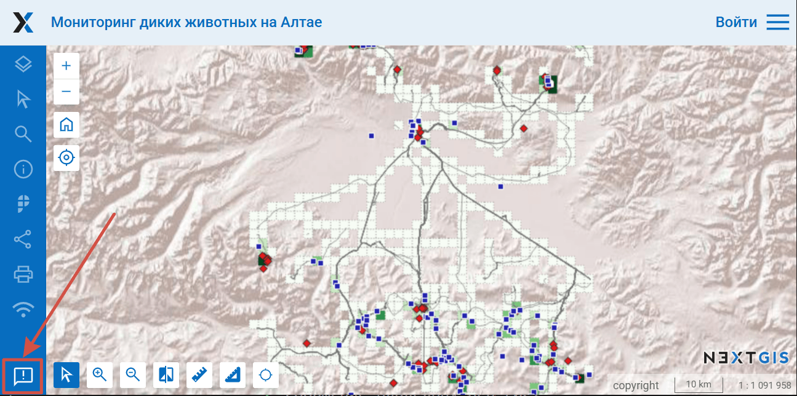

   Кнопка связи с владельцем Веб ГИС

Нажатие этой кнопки перенаправит вас в личный кабинет (нужно будет авторизоваться по `своему NextGIS ID <https://docs.nextgis.ru/docs_ngcom/source/create.html>`_). После этого откроется форма создания сообщения:

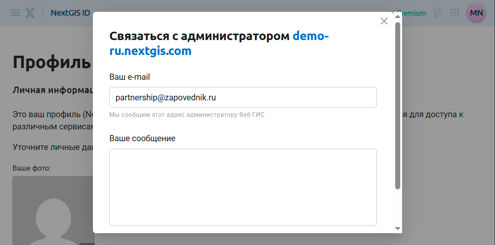

   Форма отправки сообщения

Владелец Веб ГИС получит сообщение с указанием адреса электронной почты, на который сможет вам ответить.

.. |panel_layers| image:: _static/panel_layers.png
.. |panel_ident| image:: _static/panel_ident.png
.. |panel_search| image:: _static/panel_search.png
.. |panel_annot| image:: _static/panel_annot.png
.. |panel_info| image:: _static/panel_info.png
.. |panel_bookmarks| image:: _static/panel_bookmarks.png
.. |panel_cadaster| image:: _static/panel_cadaster.png
.. |panel_share| image:: _static/panel_share.png
.. |panel_print| image:: _static/panel_print.png
.. |panel_trackers| image:: _static/panel_trackers.png

.. |button_open_web_map| image:: _static/button_open_web_map.png
   :width: 8mm
   :alt: карта с лупой

.. |button_extent_all| image:: _static/button_extent_all.png
   :width: 6mm

.. |button_plus_layer| image:: _static/button_plus_layer.png
   :width: 6mm
   :alt: +

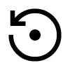

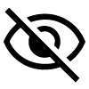

.. |button_my_location| image:: _static/button_my_location.png
   :width: 6mm

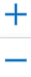

.. |button_swipe| image:: _static/button_swipe.png
   :width: 8mm

.. |button_extent_coord| image:: _static/button_extent_coord.png
   :width: 6mm

.. |button_open_feature_table| image:: _static/button_open_feature_table.png
   :width: 6mm
   :alt: таблица

.. |button_edit| image:: _static/button_edit.png
   :width: 6mm
   :alt: карандаш

.. |button_filter| image:: _static/button_filter.png
   :width: 6mm
   :alt: воронка

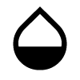

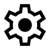

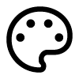

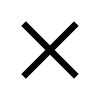

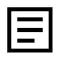

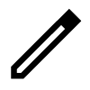

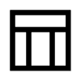

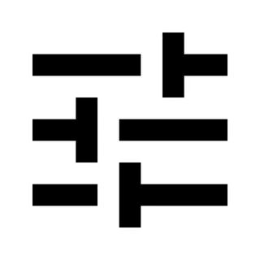

.. |button_maptool_save| image:: _static/button_maptool_save.png
   :width: 6mm
   :alt: дискета на белом фоне