.. _ngw_webmaps_client:

Просмотр веб-карты
=============================

В составе :program:`NextGIS Web` предусмотрено специальное клиентское веб приложение для 
просмотра веб-карт (см. :numref:`ngweb_webmap_client`).

Чтобы открыть веб-карту, нажмите значок |button_open_web_map| рядом с названием карты в списке ресурсов. Или зайдите на страницу ресурса карты и выберите "Открыть" в панели действий справа.

Откроется следующая страница:

.. |button_open_web_map| image:: _static/button_open_web_map.png
   :width: 8mm
   :alt: карта с лупой
 
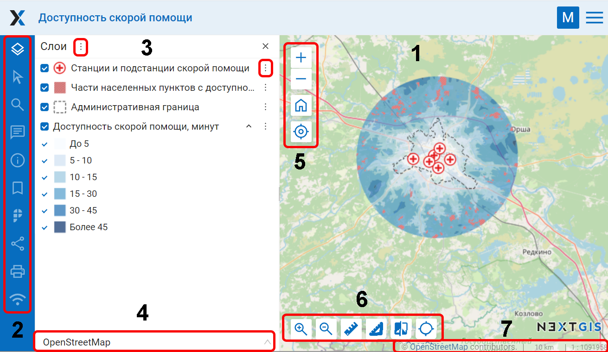
   
   Внешний вид веб-клиента

   Цифрами обозначено: 1 - карта; 2 - панели карты; 3 - дерево слоёв с кнопками вызова меню; 4 - выпадающий список выбора подложек; 5 - кнопки управления масштабом карты; 6 - инструменты карты; 7 - строка статуса и копирайт

Веб-клиент включает в себя три основных компонента: карту, `панели <https://docs.nextgis.ru/docs_ngweb/source/webmaps_client.html#ngw-webmaps-client-panels>`_, `инструменты карты <https://docs.nextgis.ru/docs_ngweb/source/webmaps_client.html#ngw-webmaps-client-tools>`_. 

.. _ngw_webmaps_client_scale:

Изменение масштаба и поворот карты
-----------------------------------

Строка статуса (см. :numref:`ngweb_webmap_client` п. 5) отображает текущий масштаб. Если кликнуть по карте инструментом идентификации, то во всплывающем окне будут указаны координаты клика и перечислены объекты, если они имеются в данной точке карты.

Масштаб карты можно изменять с помощью кнопок управления масштабом (см. :numref:`ngweb_webmap_client`, п.5), а также вернуть его к изначальному состоянию с помощью кнопки "Начальный охват" с иконкой в виде домика. 

Для работы с картой приложение имеет следующие возможности: 

* при одновременном нажатии клавиш ``alt + shift`` и осуществлении круговых движений 
  курсором по экрану монитора происходит поворот изображения на необходимое количество 
  градусов в нужную сторону - вправо или влево,
* при одновременном нажатии клавиши ``shift`` и выделении курсором необходимой части 
  изображения на экране монитора происходит выделение, а потом изменение масштаба 
  (увеличение) этой выделенной области на карте.

Также вы можете отобразить на карте своё текущее местоположение, нажав на кнопку |button_my_location|. Посмотрите, как это работает, в видео:

.. |button_my_location| image:: _static/button_my_location.png
   :width: 6mm

.. raw:: html

   <iframe width="560" height="315" src="https://rutube.ru/play/embed/1243c460657d47068a053714497dd390/" frameBorder="0" allow="clipboard-write; autoplay" webkitAllowFullScreen mozallowfullscreen allowFullScreen></iframe>

Посмотреть видео на `youtube <https://youtu.be/YLoUFO8ZywI>`_, `rutube <https://rutube.ru/video/1243c460657d47068a053714497dd390/>`_.

.. _ngw_webmaps_client_panels:

Панели
----------------------

В левой части рабочей области располагаются функциональные панели:

* |panel_layers| Дерево слоев
* |panel_ident| Панель идентификации
* |panel_search| `Поиск <https://docs.nextgis.ru/docs_ngweb/source/webmaps_client.html#ngw-webmaps-client-search>`_
* |panel_annot| `Аннотации <https://docs.nextgis.ru/docs_ngweb/source/annotation.html>`_
* |panel_info| `Описание <https://docs.nextgis.ru/docs_ngcom/source/webmap_create.html#ngcom-webmap-create-info>`_
* |panel_bookmarks| `Закладки <https://docs.nextgis.ru/docs_ngweb/source/webmaps_admin.html#ngw-map-bookmarks>`_
* |panel_cadaster| `Кадастровые сервисы <https://docs.nextgis.ru/docs_ngweb/source/cadaster.html>`_
* |panel_share| `Поделиться <https://docs.nextgis.ru/docs_ngweb/source/webmaps_client.html#ngw-webmaps-client-share>`_
* |panel_print| `Печать <https://docs.nextgis.ru/docs_ngweb/source/print.html>`_
* |panel_trackers| `Трекеры <https://docs.nextgis.ru/docs_ngweb/source/trackers.html#tracking-web-map>`_

.. |panel_layers| image:: _static/panel_layers.png
.. |panel_ident| image:: _static/panel_ident.png
.. |panel_search| image:: _static/panel_search.png
.. |panel_annot| image:: _static/panel_annot.png
.. |panel_info| image:: _static/panel_info.png
.. |panel_bookmarks| image:: _static/panel_bookmarks.png

.. |panel_share| image:: _static/panel_share.png
.. |panel_print| image:: _static/panel_print.png
.. |panel_trackers| image:: _static/panel_trackers.png

С помощью функции **"Поделиться"** формируется ссылка на карту и код для встраивания (`подробнее <https://docs.nextgis.ru/docs_ngcom/source/embed_webmap.html#ngcom-embed-webmap>`_), а с помощью функции **"Печать"**  открывается `окно подготовки к печати <https://docs.nextgis.ru/docs_ngcom/source/webmap_print.html>`_. 

В **дереве слоев** находится список всех стилей слоев, добавленных на веб-карту. 

Вы можете отключать видимость не только слоёв, но и отдельных элементов этих слоёв, снимая галочки соответствующих элементов легенды. Это актуально для больших картографических проектов, где слои содержат множество объектов с различными значениями определённого столбца таблицы атрибутов. Также слои можно перетаскивать внутри дерева, меняя порядок их отображения. При перезагрузке страницы отображение слоёв будет сброшено к изначальному.

Возможности панели слоёв также представлены в видео:

.. raw:: html

   <iframe width="560" height="315" src="https://rutube.ru/play/embed/e13ac386c9c16068f5110c938dd17683/" frameBorder="0" allow="clipboard-write; autoplay" webkitAllowFullScreen mozallowfullscreen allowFullScreen></iframe>

Смотреть на `youtube <https://youtu.be/ZJJeJLO2KR4>`__, `rutube <https://rutube.ru/video/e13ac386c9c16068f5110c938dd17683/>`__. Как `настроить легенду <https://docs.nextgis.ru/docs_ngweb/source/webmaps_admin.html#ngw-legend>`_.

.. _ngw_webmaps_client_search:

Поиск на веб-карте
--------------------

**Поиск** на веб-карте производится по:

1. Координатам
2. Атрибутивной информации добавленных на карту слоёв
3. Адресной базе (OpenStreetMap или Яндекс.Карты, в зависимости от `настроек адресного поиска <https://docs.nextgis.ru/docs_ngweb/source/webmap_set.html#ngw-contr-panel-webmap-search>`_).

Результаты появляются по мере ввода и сортируются в этом порядке (координаты - аттрибутивная информация - адресная база).
При выборе результата поиска из списка карта осуществляет переход к нему.

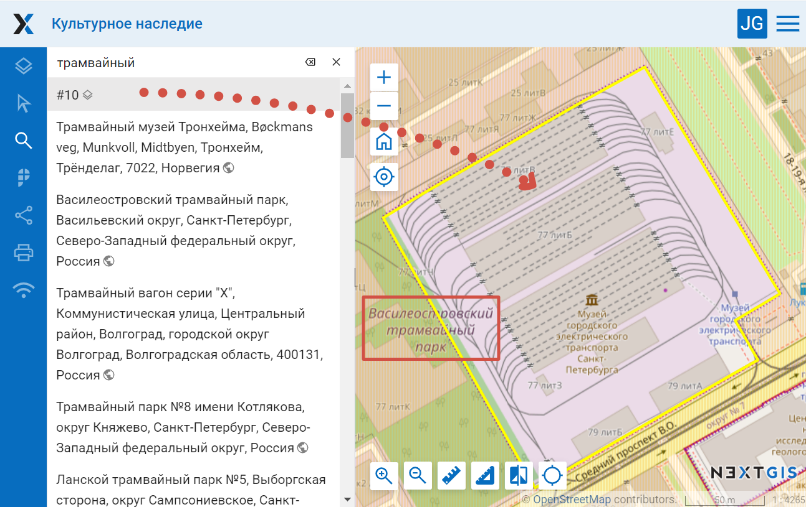
   
   Результаты поиска по запросу «трамвайный». На карте открыты атрибуты объекта #10 векторного слоя, где содержится запрашиваемое слово

Возможности текстового поиска также показаны в видео:

.. raw:: html

   <iframe width="560" height="315" src="https://rutube.ru/play/embed/6c2f59f025c88d7c533bf34bef3d3f17/" frameBorder="0" allow="clipboard-write; autoplay" webkitAllowFullScreen mozallowfullscreen allowFullScreen></iframe>

Посмотреть видео на `youtube <https://youtu.be/_isl86FjG6U>`__, `rutube <https://rutube.ru/video/6c2f59f025c88d7c533bf34bef3d3f17/>`__.

.. _ngw_webmaps_search_coord:

Поиск по координатам
~~~~~~~~~~~~~~~~~~~~~

Для того, чтобы найти точку по координатам, в строку поиска следует ввести значения долготы и широты в градусах, минутах и секундах (используйте только прямые кавычки и прямой апостроф) или в десятичном формате, например: 
   
.. code-block:: bash

    79 W 43 N
    W 79 N 43
    -79 43 (результаты поиска будут включать две точки: 79 W, 43 N и 43 E, 79 S)
    79- 43
    -79 W 43 N
    79°4'14.08" W 43°4'59.37" N
    -79°4'14.08"  43°4'59.37"
    -79 4.25 W  43 4.95 N
    -79 4.25  43 4.95
    79.068493 43.079920
    79.068 W 43.08 N

Посмотрите, как работает поиск по координатам, в нашем видео:

.. raw:: html

   <iframe width="560" height="315" src="https://rutube.ru/play/embed/81464ac6a48a81bb05c74bcb9f11c875/" frameBorder="0" allow="clipboard-write; autoplay" webkitAllowFullScreen mozallowfullscreen allowFullScreen></iframe>

Смотреть на `youtube <https://youtu.be/7nfXFrCSru0>`__, `rutube <https://rutube.ru/video/81464ac6a48a81bb05c74bcb9f11c875/>`__.

Также при открытии таблицы объектов слоя доступна `**фильтрация по области** <https://docs.nextgis.ru/docs_ngweb/source/feature_table.html#ngw-feature-table-filter-area>`_.

.. _ngw_webmaps_client_layer_menu:

Меню слоя
-----------

В выпадающем меню слоя можно настроить его непрозрачность при помощи ползунка.

Пункт **Редактировать** позволяет начать вносить изменения в выбранный слой. Для завершения изменений нужно снова открыть то же меню и выбрать **Завершить редактирование** (`подробнее <https://docs.nextgis.ru/docs_ngweb/source/layers_settings.html#ngw-edit-objects>`__).

При выборе пункта **"Описание"** отображается описание выбранного слоя, которое вводится при создании или редактировании слоя. 

При выборе пункта **"Увеличить до слоя"** происходит масштабирование карты таким образом, чтобы выбранный слой занимал всю видимую площадь карты. 

При выборе пункта **"Таблица объектов"** под картой появляется таблица объектов выбранного слоя. 

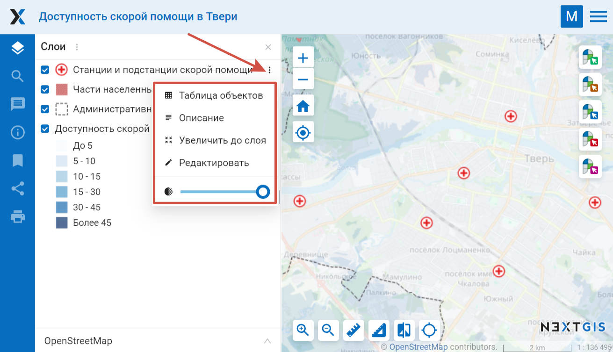
   
   Меню слоя на веб-карте

При выделении в таблице отдельной записи происходит переход к соответствующей геометрии на карте, данная геометрия будет подсвечена на карте (см. :numref:`ngweb_webmap_attribute_table`). Для выбранного объекта можно открыть окно с его свойствами, редактировать его или удалить. При нажатии на кнопку **"Перейти"** карта масштабируется таким образом, чтобы выбранный объект оказался в центре (см. :numref:`ngweb_webmap_attribute_table`). В окне просмотра атрибутов можно выполнять поиск по текущим атрибутам. По мере ввода, содержимое окна фильтруется и остаются только записи, которые удовлетворяют критериям поиска. Также можно осуществлять `фильтрацию объектов, входящих в заданную область <https://docs.nextgis.ru/docs_ngweb/source/feature_table.html#ngw-feature-table-filter-area>`_.
 
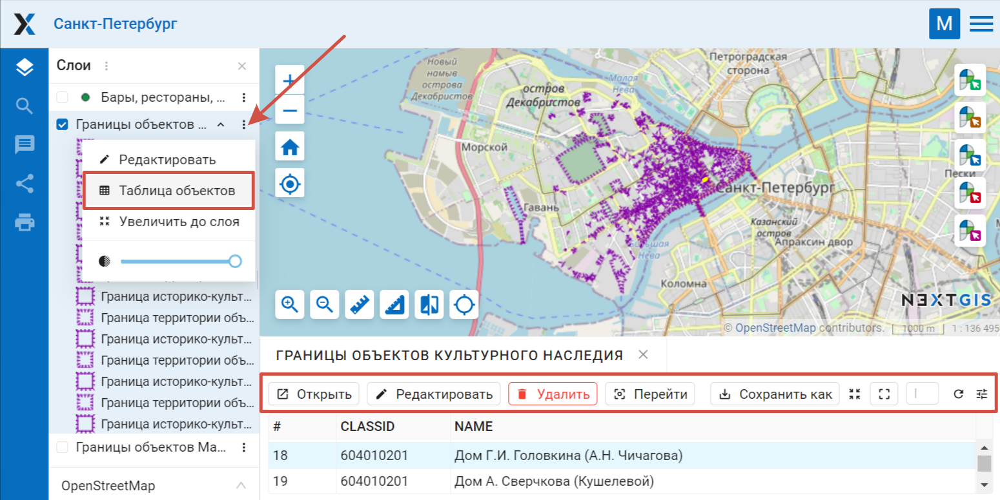
   
   Таблица объектов слоя на веб-карте

.. _ngw_webmaps_client_basemap:

Выбор подложки
--------------

Для смены картографических подложек служит выпадающий список (см. :numref:`ngweb_webmap_client`). По умолчанию имеются следующие подложки:

* None
* OpenStreetMap

Подложка - это изображение карты, которое предоставляется другими, независимыми 
сервисами в сети Интернет. На их содержание пользователь влиять не может. 
Пользователь может выключить подложку, и тогда вместо нее будет показываться 
белый фон. Если предполагается, что у пользователя слабый канал доступа в 
интернет, или же Веб-ГИС развернута в локальной сети организации, из которой нет 
доступа в интернет, то можно работать и без подложки, разместив базовые данные в 
слоях Веб-ГИС. 

Можно подключить к карте другую подложку, как это сделать см. в разделе `Добавление ресурсов <https://docs.nextgis.ru/docs_ngweb/source/layers.html#ngw-create-basemap>`_.

.. note:: 
   Если предполагается работа в сети без доступа к Интернету, то в 
   файле `настроек подложек <https://github.com/nextgis/nextgisweb/blob/3/nextgisweb/webmap/basemaps.json>`_ нужно 
   удалить записи про подложки из сети Интернет.

.. _ngw_webmaps_client_tools:

Инструменты карты
----------------------

Для работы с картой предусмотрены инструменты (см. :numref:`ngw_map_instruments` п. 6), которые перечислены слева направо:

* Приблизить
* Отодвинуть
* Измерение расстояния
* Измерение площади
* Вертикальная шторка
* Показ координат/охвата

.. figure:: _static/ngw_map_instruments.png
   :name: ngw_map_instruments
   :align: center

   Инструменты карты

.. _ngw_webmaps_client_tools_measure:

Инструменты измерения
~~~~~~~~~~~~~~~~~~~~~~~~

Измерять длины, в том числе ломаных линий, и площади можно при помощи инструментов измерения карты. Активируйте инструмент и отметьте узлы линии кликами по карте. Двойной клик завершает создание линии. Вы можете отметить на карте несколько линий и сравнить результаты измерений. Чтобы удалить линию измерения, нажмите на крестик рядом с результатами измерения. Чтобы сбросить выбранное полностью, нажмите ещё раз на кнопку с линейкой. 

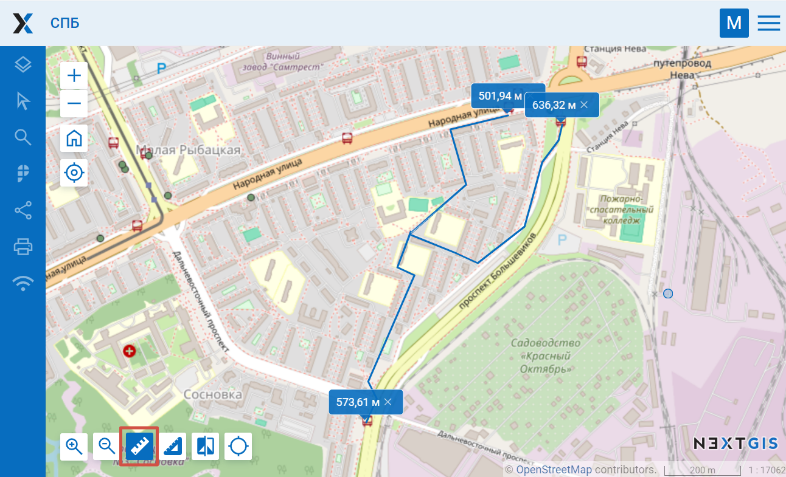

   Измерение расстояний на карте

Аналогичным образом работает измерение площади. Выделите произвольную полигональную область на карте. Двойным кликом замкните полигон.

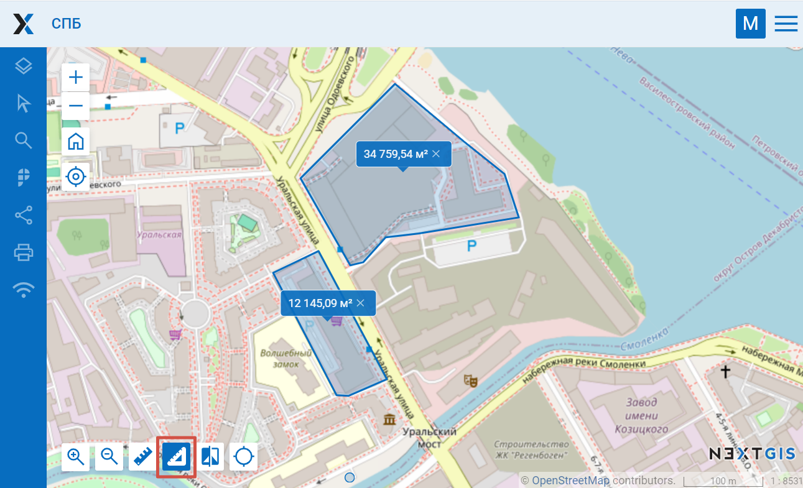

   Измерение площадей на карте

Единицы измерений настраиваются в `Панели управления <https://docs.nextgis.ru/docs_ngweb/source/webmap_set.html#ngw-contr-panel-webmap-measure>`_

.. _ngw_webmaps_client_tools_swipe:

Шторка
~~~~~~~~~~~~~~~~~~~~

Шторка делает прозрачной ту область выбранного слоя на карте, которая находится справа от неё (см. :numref:`ngweb_webmap_swyped`).

.. |button_swipe| image:: _static/button_swipe.png
   :width: 8mm

Выберите слой щелчком в дереве слоёв (он будет подсвечен голубым цветом) и нажмите |button_swipe| в нижней части карты (см. :numref:`ngweb_webmap_choose_layer`). 
   
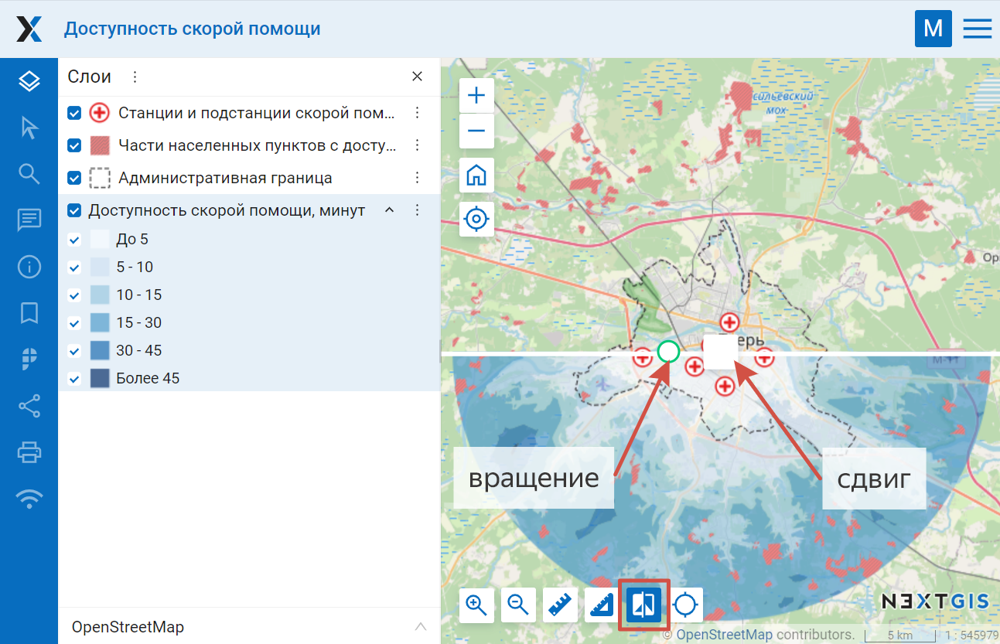
   
   Выбор слоя для использования вертикальной шторки

Шторку можно сдвигать, зажимая квадрат по центру, или поворачивать на 90 градусов кликом по кружку на линии.

Шторка дает возможность “заглянуть” под выбранный слой и сравнить его с подложкой или другим слоем на карте. Например, инструмент будет полезен, если мы хотим сравнить изменения на местности по космическим снимкам за разные даты.

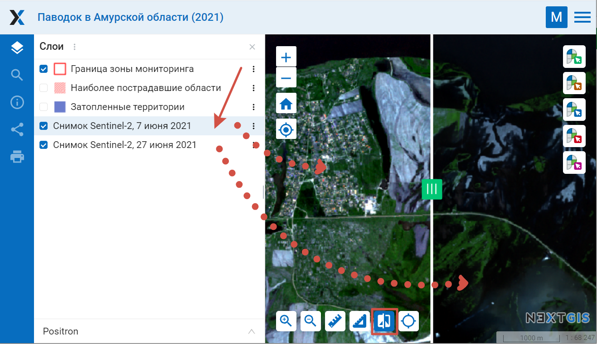
   
   Снимок после применения вертикальной шторки

.. _ngw_webmaps_client_tools_coord_extent:

Показ координат/охвата
~~~~~~~~~~~~~~~~~~~~~~~~~~~

В интерфейсе карты можно включить поле, где будут показаны текущие координаты курсора или охват видимого участка карты. Для этого нажмите кнопку |button_extent_coord| в инструментах карты.

.. |button_extent_coord| image:: _static/button_extent_coord.png
   :width: 8mm

Иконка справа показывает, что в данный момент отображается в поле и переключает между режимами.

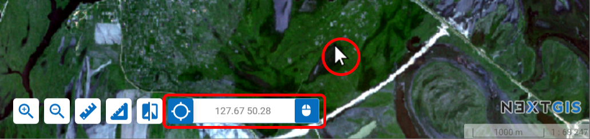

   Включено отображение координат курсора

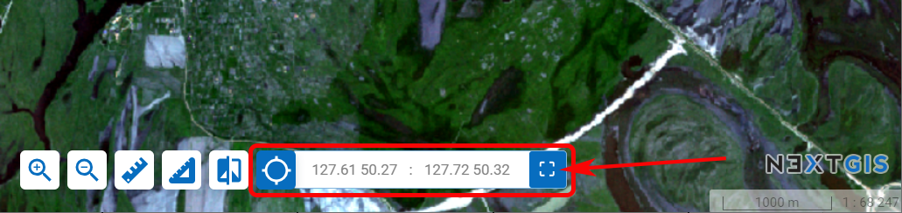

   Включено отображение охвата

.. _ngw_webmaps_client_share:

Поделиться
-----------

В панели |panel_share_intext| "Поделиться" можно:

.. |panel_share_intext| image:: _static/panel_share.png
   :width: 6mm

* скопировать ссылку на веб-карту (в ссылке сохраняется текущий зум и видимость слоёв);
* добавить фрагмент веб-карты `в избранное <https://docs.nextgis.ru/docs_ngweb/source/favorites.html#ngw-favorites-wm-fragment>`_;
* настроить и скопировать код для встраивания веб-карты на сайт.

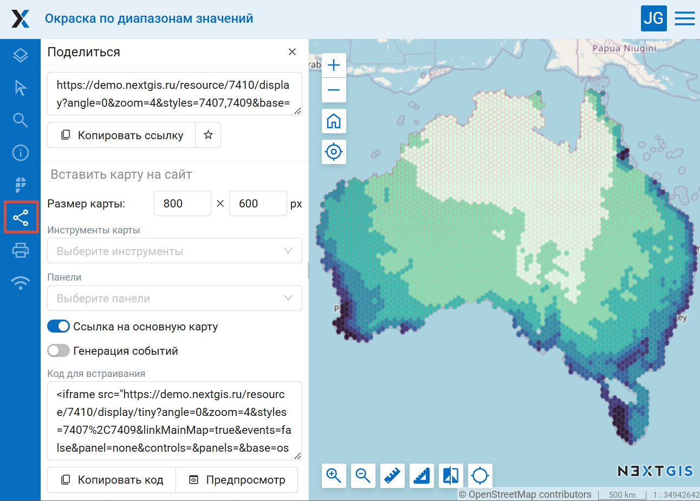

   Панель "Поделиться"

.. _ngw_webmaps_client_feature_link:

Ссылка на объект карты
------------------------

Самый простой вариант - дать ссылку на область карты с нужными объектами. Это можно сделать через панель 
|panel_share| **Поделиться** (see :numref:`ngweb_webmap_client`). Приблизтесь к нужному объекту на карте и затем скопируйте ссылку.

С помощью специально сгенерированных GET-запросов можно поделиться ссылкой на конкретный объект веб-карты в конкретном слое. Ссылка будет открываться в географическом контексте, который вы можете настроить через веб-карты.

Вам понадобится только создать соответствующие ссылки в соответствующих информационных системах, переходя по которым пользователь сразу будет попадать на карту с искомым объектом и необходимым контекстом.

Такую ссылку может автоматически генерировать ваша связанная с NextGIS Web система.

Установка уровня отображения для ссылки на объект веб-карты работает следующим образом.

При наличии параметра zoom в URL объект должен отображаться на уровне масштабирования, который установлен в параметре zoom.

При отсутствии параметра zoom в URL объект должен масштабироваться по своим размерам, при условии, что эти размеры не слишком малы. Если размеры экстента объекта менее 100x100 метров по длине и ширине, то будет установлен уровень масштабирования веб-карты по умолчанию, если он не меньше 12 уровня. Если изначальный уровень масштабирования веб-карты меньше 12 уровня, то будет установлен уровень масштабирования 12.

Пример:

https://demo.nextgis.ru/resource/6144/display?panel=layers&hl_lid=9213&hl_attr=NID&hl_val=32104

Можно создать такую ссылку и **вручную**, для этого вам понадобятся:

* "Чистая" ссылка на веб-карту: https://demo.nextgis.ru/resource/6211/display?panel=layers

Параметры объекта и их значения:

* hl_lid – ID слоя (зайдите в ресурс слоя и посмотрите число, включенное в URL, например https://demo.nextgis.ru/resource/6209 --> ``hl_lid=6209``);

* hl_attr – атрибут слоя (название поля атрибутов, из которого берётся значение, например ``name``);

* hl_val – значение атрибута.

Также можно добавить:

* zoom - степень приближения к объекту (выражается в числах, наименьшее значение 1 - максимальное отдаление).

Итоговая ссылка:

https://demo.nextgis.ru/resource/6211/display?panel=layers&hl_lid=6209&hl_attr=name&hl_val=19-14&zoom=17

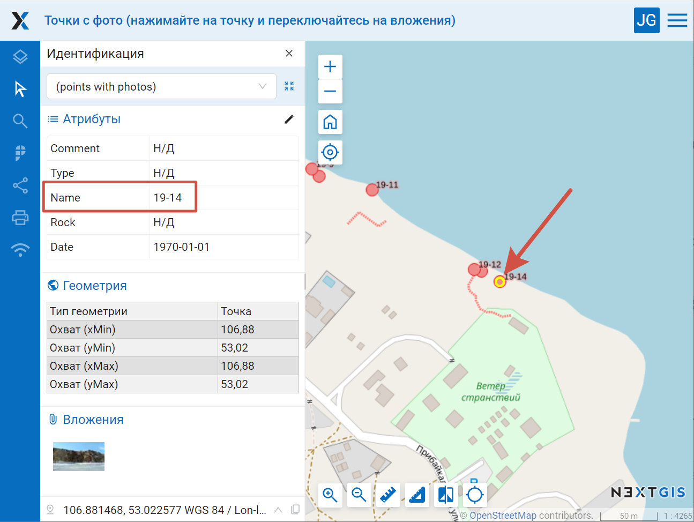

   Карта, открывающаяся по такой ссылке. В ссылку включен ID выделенного слоя и аттрибут и его значение, отмеченные в карточке объекта
