.. sectionauthor:: Artem Svetlov <artem.svetlov@nextgis.ru>

.. _ngw_webmaps_client:

A viewer for Web Maps
=============================

A special web application for viewing Web Maps is included in NextGIS Web (see :numref:`webmap_client`).

To view the Web Map press |button_open_web_map| next to its name in the resource list or open the resource page and select **Display** in the Actions panel on the right. The following page will open:

.. |button_open_web_map| image:: _static/button_open_web_map.png
   :width: 8mm
   :alt: magnifying glass on map
 
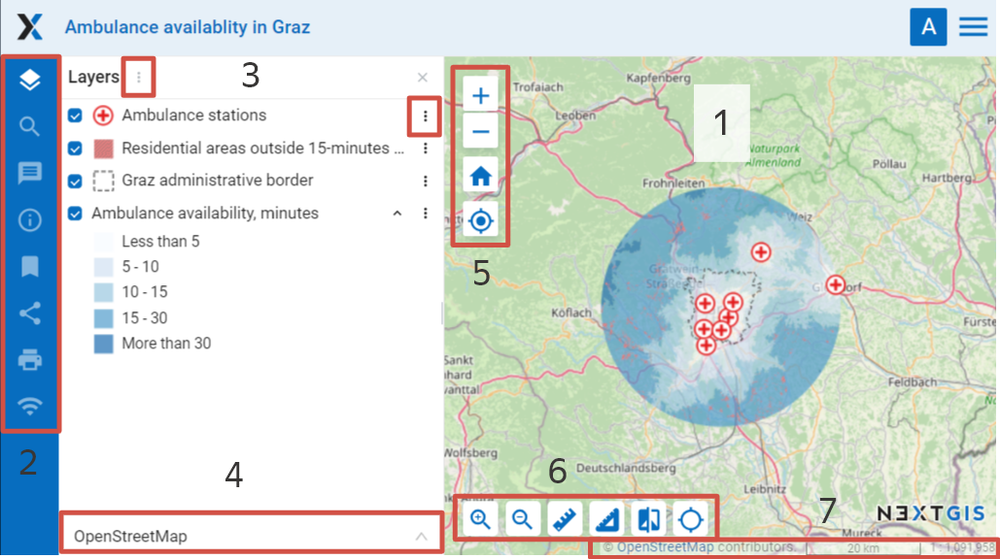
   
   The interface of viewer client application

   Numbers indicate: 1 – map; 2 – map panels; 3 - layer tree with layer menu buttons; 4 – dropdown list of basemaps; 5 - zoom tools; 6 - map tools;  7 - status bar and copyright.

Web client includes three main components: a map, `panels <https://docs.nextgis.com/docs_ngweb/source/webmaps_client.html#ngw-webmaps-client-panels>`_, `map tools <https://docs.nextgis.com/docs_ngweb/source/webmaps_client.html#ngw-webmaps-client-tools>`_. 

.. _ngw_webmaps_client_scale:

Zoom and rotation
--------------------

The status bar (see :numref:`webmap_client`) displays the current scale of the map. If you use the identify tool to click on the map, a pop-up window will show the coordinates of the point you clicked on and list map features if present in this point of the map.

You can change the scale of the map using zoom tools (see item 5 in :numref:`webmap_client`). To reset the map to its initial extent, press the house icon.
 
There are some options to work with map: 

* if you click on ``alt + shift`` simultaneously and execute round cursor movements around a monitor, a map will turn for a certain degrees to the right or to the left,
* if you simultaneously click on ``shift`` and select of the necessary part of a map on a monitor by a cursor, you will highlight this part and zoom in it on the map.

To view your current location on the map, press |button_my_location|. See how it works in our video:

.. raw:: html

   <iframe width="560" height="315" src="https://www.youtube.com/embed/HVvuDMX1pEo?si=u4ALUrxkaUHGzqcB" title="YouTube video player" frameborder="0" allow="accelerometer; autoplay; clipboard-write; encrypted-media; gyroscope; picture-in-picture; web-share" referrerpolicy="strict-origin-when-cross-origin" allowfullscreen></iframe>

Watch on `youtube <https://youtu.be/HVvuDMX1pEo?si=YzQcqFMw-ge50qPA>`_.

.. _ngw_webmaps_client_panels:

Panels
----------------------

On the left side of the workspace are the functional panels:

* |panel_layers| Layers 
* |panel_ident| Feature identification 
* |panel_search| `Search <https://docs.nextgis.com/docs_ngcom/source/address_search.html>`_
* |panel_annot| `Annotations <https://docs.nextgis.com/docs_ngcom/source/annotation.html>`_
* |panel_info| `Description <https://docs.nextgis.com/docs_ngcom/source/webmap_create.html#add-a-description-and-map-legend>`_
* |panel_bookmarks| `Bookmarks <https://docs.nextgis.com/docs_ngweb/source/webmaps_admin.html#bookmarks>`_
* |panel_share| Share
* |panel_print| Print
* |panel_trackers| `Trackers <https://docs.nextgis.com/docs_ngcom/source/tracking.html>`_

.. |panel_trackers| image:: _static/panel_trackers.png

To share a link to a map or generate embed code use the function **"Share"** (see item 9 in :numref:`webmap_client`, `learn more <https://docs.nextgis.com/docs_ngcom/source/embed_webmap.html#ngcom-embed-webmap>`_), to print a map use the function **"Print map"** (see item 10 in :numref:`webmap_client`, `learn more <https://docs.nextgis.com/docs_ngcom/source/webmap_print.html>`__).

The **layer tree** contains a list of all layer styles added to the web map. The panel allows:

* Disable/Enable layer visibility. You can also hide parts of a layer by selecting items in the Web Map lengend. It's helpful for big projects where one layer may contain a variety of features grouped by value of an attribute.
* Open layer attribute table
* Zoom map to layer
* Open layer description
* Change the order of the layers by dragging them within the layer tree. Refresh the page to restore the original order.

Functionality of the layer panel is presented in our video:

.. raw:: html

   <iframe width="560" height="315" src="https://www.youtube.com/embed/4Pd5AKtoR2g?si=-PsdgClPwYiUyNvh" title="YouTube video player" frameborder="0" allow="accelerometer; autoplay; clipboard-write; encrypted-media; gyroscope; picture-in-picture; web-share" referrerpolicy="strict-origin-when-cross-origin" allowfullscreen></iframe>

Watch on `youtube <https://youtu.be/4Pd5AKtoR2g?si=0lMooDE3ZzpO0xxz>`__.

.. _ngw_webmaps_client_search:

Search
------

**Search** is performed using three sources:

1. Coordinates.
2. Attributes of layers added to a map.
3. Address database (OpenStreetMap or Yandex.Maps, depending on `address search settings <https://docs.nextgis.com/docs_ngweb/source/webmap_set.html#address-search>`_). 

Results are shown as user inputs text and are sorted in this order: points on the map matching the coordinates, then feature numbers for attribute search and finally full addresses.
After a click on a search result map changes extent to show selected feature.

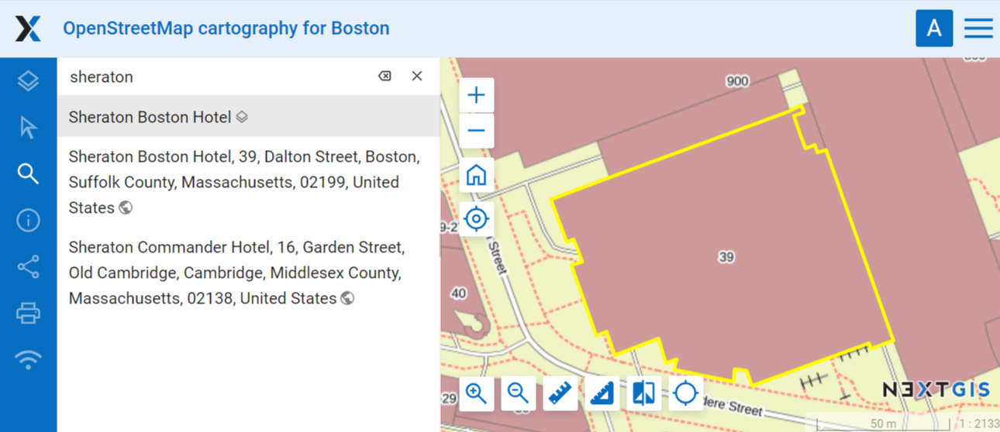

   Feature selected in search results is displayed on the map

.. _ngw_webmaps_search_coord:

Search by coordinates
~~~~~~~~~~~~~~~~~~~~~

To find a point using the coordinates, enter the latitude and longitude in degrees, minutes and second, degrees and decimal minutes or decimal degrees (make sure to use straight single and double quotes), for example: 
   
.. code-block:: bash

    79 W 43 N
    W 79 N 43
    -79 43 (the results will contain two points: 79 W, 43 N and 43 E, 79 S)
    79- 43
    -79 W 43 N
    79°4'14.08" W 43°4'59.37" N
    -79°4'14.08"  43°4'59.37"
    -79 4.25 W  43 4.95 N
    -79 4.25  43 4.95
    79.068493 43.079920
    79.068 W 43.08 N

See how it works in our video:

.. raw:: html

   <iframe width="560" height="315" src="https://www.youtube.com/embed/tjPHvUWtpKs?si=Nbod2AQEUzjQZU01" title="YouTube video player" frameborder="0" allow="accelerometer; autoplay; clipboard-write; encrypted-media; gyroscope; picture-in-picture; web-share" referrerpolicy="strict-origin-when-cross-origin" allowfullscreen></iframe>

Watch on `youtube <https://youtu.be/tjPHvUWtpKs?si=Od-yUzIhM0yr4JwM>`__.

When the feature table is opened on the Web Map, you can filter features by area (`read more <https://docs.nextgis.com/docs_ngweb/source/admin_interface.html#ngw-feature-table-filter-area>`_).

 

.. _ngw_webmaps_client_layer_menu:

Layer menu
------------

To change the transparency of the layer use the slider in the dropdown menu of the layer.

Choose **Edit** to modify the selected layer. To complete the process, open the dropdown menu again and select **Stop editing** (`read more here <https://docs.nextgis.com/docs_ngweb/source/layers_settings.html#ngw-edit-objects>`_).

Using **"Description"** option you can view the description of the selected layer, added during creation or editing of the layer. 

**"Zoom to layer"** option allows you to zoom a map so that the selected layer takes up all the visible map area.

See how it works in our video:

.. raw:: html

   <iframe width="560" height="315" src="https://www.youtube.com/embed/M4cThWxdaZg?si=VtCw4Coh2Lg1E5BV" title="YouTube video player" frameborder="0" allow="accelerometer; autoplay; clipboard-write; encrypted-media; gyroscope; picture-in-picture; web-share" referrerpolicy="strict-origin-when-cross-origin" allowfullscreen></iframe>

Watch on `youtube <https://youtu.be/M4cThWxdaZg?si=8sohojUzoB8oovvY>`__.

After a click on **"Feature table"** option you will see feature table of the selected layer under the map. 

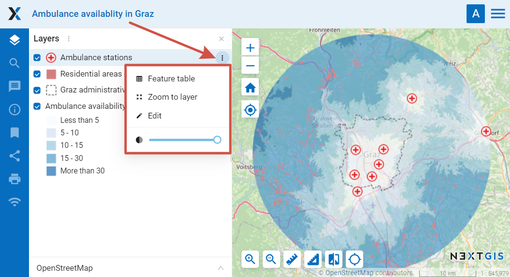
   
   Layer menu on the Web Map

Select a row in feature table to navigate to the feature on a map, it will be highlighted (see :numref:`ngweb_webmap_attribute_table`). For the selected feature you can open a window with its properties, edit it or delete it. **"Go to"** button allows you to zoom a map to display the selected feature on the whole visible map area (see :numref:`ngweb_webmap_attribute_table`). In feature table tab you have an option to dynamically filter records. When user types a text the contents of the window are filtered leaving only the records that match the search text. Filter by area option is also available (`more on how to use it <https://docs.nextgis.com/docs_ngweb/source/feature_table.html#filter-layer-features-on-the-web-map-by-area>`_).
 

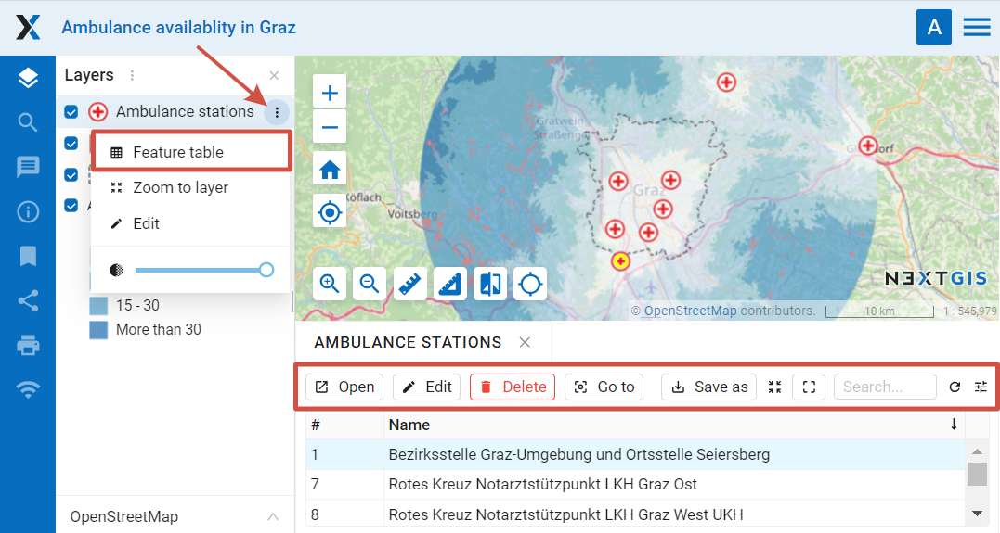
   
   Feature table of the selected layer on a Web Map
   
.. _ngw_webmaps_client_basemap:

Basemap
----------

To change a basemap use the dropdown list (see :numref:`webmap_client`). By default there are the following basemaps:

* None
* OpenStreetMap

Basemap is a map image that is shared by thrid-party services in the Internet. Users can not influence their content. 
You can disable the basemap so that a white background is shown instead. If the Internet access is expected to be poor or if the Web GIS is deployed in local network without access to the Internet, it is possible to work without a basemap adding base data as WebGIS layers.

You can add other basemaps, see the instructions in `Adding resources <https://docs.nextgis.com/docs_ngweb/source/layers.html#ngw-create-basemap>`_.

.. note:: 
   If the Web Map is supposed to work without Internet access, edit the file with `basemap settings <https://github.com/nextgis/nextgisweb/blob/3/nextgisweb/webmap/basemaps.json>`_ and delete records about Google basemaps.

.. _ngw_webmaps_client_tools:

Map tools
----------------------

Tools to work with the Web Map (see :numref:`webmap_client` item 6) named from left to the right:

* Zoom in
* Zoom out
* Measure distance
* Measure area
* Vertical swipe
* Show cursor coordinates/extent

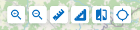

   Map tools

.. _ngw_webmaps_client_tools_measure:

Measuring tools
~~~~~~~~~~~~~~~~~~~~~~~~

Map tools allow to measure distance (straight or segmented line) and area. Activate the tool and draw a line by clicking on the map. Double-click to finish line creation. You can draw multiple measuring lines on a map and compare results. To delete one of the measurement lines, press X on the measurement results lable. To clear selection, press the tool button again.

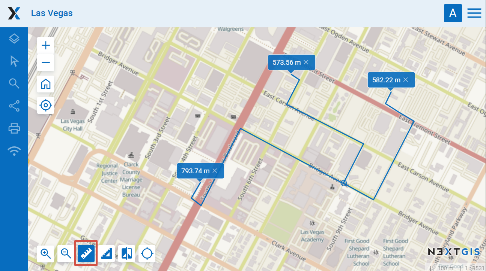

   Measuring distance on the Web Map

To measure area draw a custom polygon on the map.  Double-click to finish the polygon.

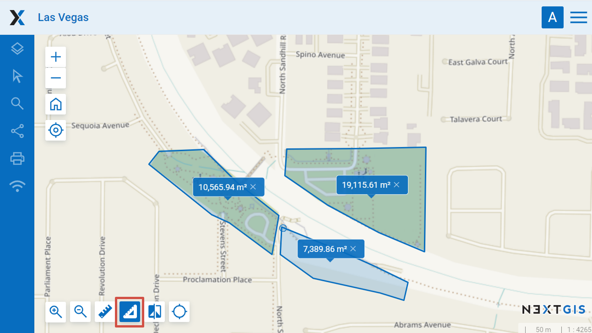

   Measuring areas on the Web Map

Measurement units are selected in the `Control panel <https://docs.nextgis.com/docs_ngweb/source/webmap_set.html#ngw-contr-panel-webmap-measure>`_

.. _ngw_webmaps_client_tools_swipe:

Swipe
~~~~~~~~~~~~~~~~~~

Swipe  makes the selected layer transparent to one side of the line.

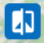

To select a layer click on it in the layer tree (it will be highlighted in blue), then press the swipe button |button_swipe| (see :numref:`ngweb_webmap_choose_layer`).
   
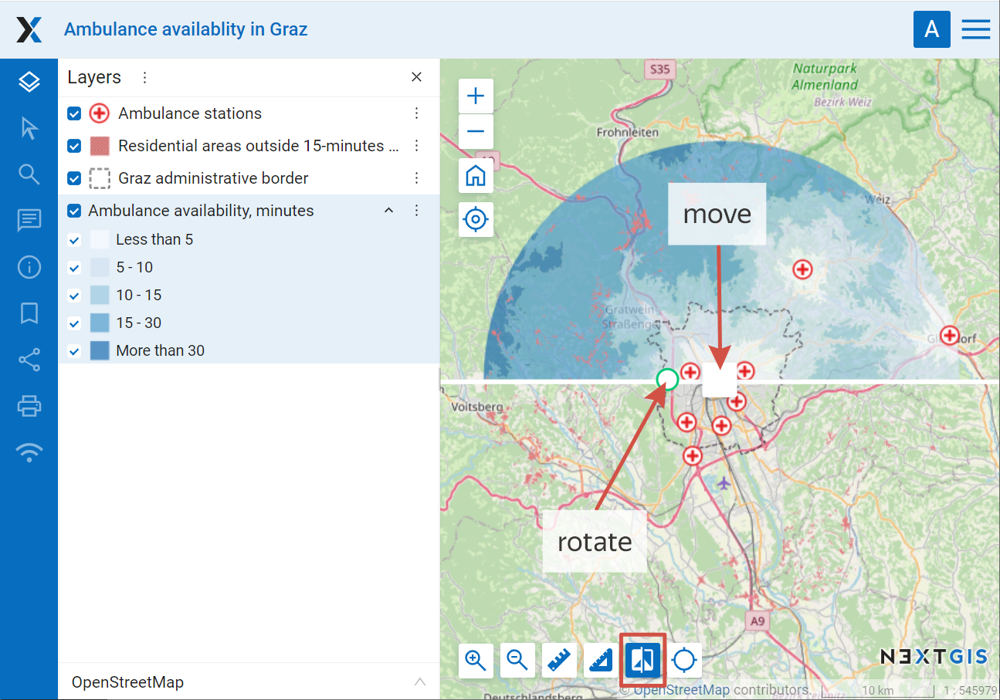
   
   Horizontal swipe. Selected layer is marked in blue

Use the square in the center to move the swipe and the circle on the line to rotate it 90 degrees.

Swipe makes it possible to “peek” under the selected layer and compare it with the substrate or another layer on the map. The tool will be useful if we want to compare changes in the terrain by satellite images for different dates (for example, to identify forest felling or floods).

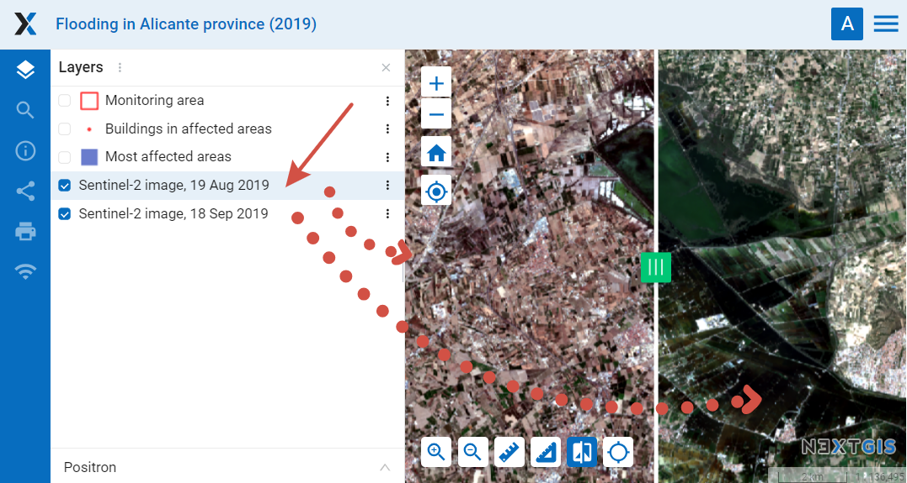
   
   Satellite image after applying the vertical swipe

.. _ngw_webmaps_client_tools_coord_extent:
 
Show extent or cursor coordinates
~~~~~~~~~~~~~~~~~~~~~~~~~~~~~~~~~~

A field can be added to the Web Map interface to show the coordinates of the current cursor position or the extent of the visible map area. To activate it, press the |button_extent_coord| button in the map tools panel.

The icon on the right indicates what is displayed. Click on it to switch between modes. 

.. figure:: _static/web_client_coordinates.png
   :name: web_client_coordinates_pic
   :width: 20cm
   :align: center

   Cursor coordinates mode

.. figure:: _static/web_client_extent.png
   :name: web_client_extent_pic
   :width: 20cm
   :align: center

   Extent mode

.. _ngw_webmaps_client_feature_link:

Link to a Web Map feature
--------------------------

The easiest way is to zoom in on the area and copy the link via the **Share** panel (:numref:`webmap_client`)

Using specially generated GET queries you can share a link to a particular feature of a layer. The link will open with the geographical context that you can select in the Web Map settings.

All you need to do is create links in the information systems. By clicking on them users will be directed to the map with the selected feature and context.

Such links can be automatically generated by your system integrated with NextGIS Web.

Example:

https://demo.nextgis.com/resource/6118/display?panel=layers&hl_lid=6108&hl_attr=OSM_ID&hl_val=230629285&zoom=17

You can make such a link **manually**. Here's what you need:

* Link to the Web Map: https://demo.nextgis.com/resource/6118/display?panel=layers

For the feature:

* hl_lid - layer ID (open the layer resource page and see the number in the URL, for example https://demo.nextgis.com/resource/6114, here ``hl_lid=6114``

* hl_attr – the name of the ID attribute field, for example ``OSM_ID``;

* hl_val – the value of the ID field.

You can also add:

* zoom - value in numbers with 1 being the minimum.

Here's the resulting link:

https://demo.nextgis.com/resource/6118/display?panel=layers&hl_lid=6114&hl_attr=OSM_ID&hl_val=1058246738&zoom=17

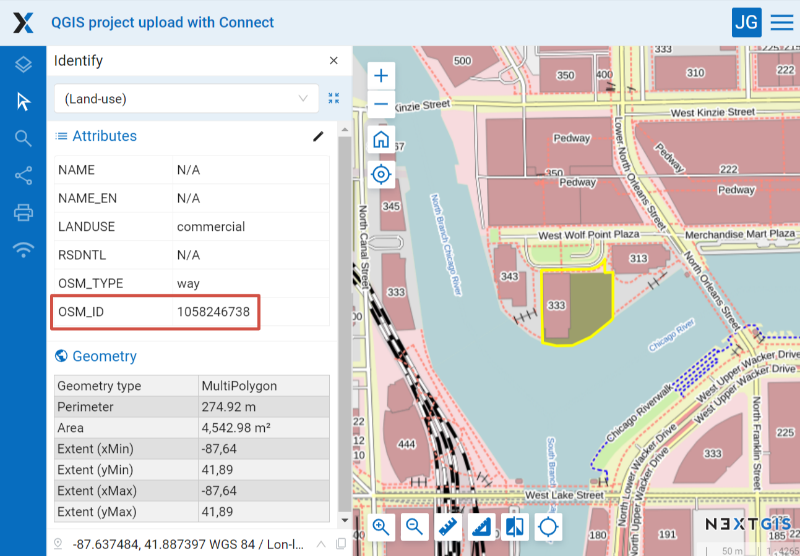

   Web Map opened via the link. The link contains the ID of the layer and the ID field name and value for the selected feature
